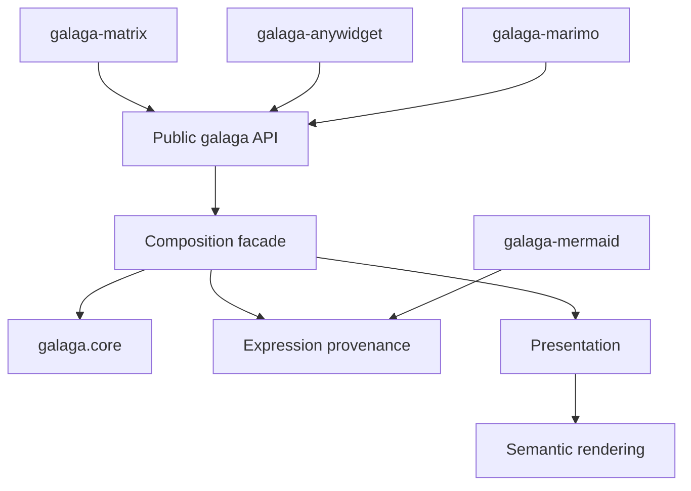

# Galaga 2 Design Principles

This document summarizes the current design posture. The
[ADR index](adrs/README.md) records individual decisions and their chronology;
superseded Galaga 1 decisions remain there as history.

## Project posture

Galaga is primarily a pedagogical geometric-algebra library. Correctness,
clarity, inspectability, and explicit mathematical choices take precedence
over minimizing the API or selecting one convention silently.

The library is numeric rather than a general computer-algebra system.
Multivector coefficients and Gram matrices are real numeric values. Optional
expression provenance records how an eager result was obtained; it does not
defer evaluation or introduce symbolic coefficients.

## 1. Long operation names are the contract

Canonical names describe the operation directly:

```python
geometric_product(a, b)
outer_product(a, b)
grade_involution(a)
doran_lasenby_inner(a, b)
```

Operators and concise aliases are conveniences:

```python
a * b   # geometric_product
a ^ b   # outer_product
a | b   # doran_lasenby_inner
~a      # reverse
```

Permanent aliases such as `gp`, `op`, `rev`, and `sw` are the same function
objects as their canonical operations. A short spelling does not own another
implementation or another expression identity.

## 2. Competing mathematical conventions stay explicit

Galaga does not collapse operations merely because they agree on vectors or
other restricted inputs. It exposes Doran–Lasenby and Hestenes inner products,
metric and scalar products, left and right contractions, RGA interiors, and
the antidot product under distinct names.

There is no unqualified public `inner_product` or `ip`. Users may choose local
notation with an ordinary import alias:

```python
from galaga import doran_lasenby_inner as ip
```

Bracket scaling is equally explicit. `commutator`, `lie_bracket`,
`anticommutator`, and `jordan_product` are unscaled. Only
`half_commutator` and `half_anticommutator` divide by two.

## 3. The Gram matrix is numeric truth

Every algebra normalizes to an immutable real symmetric Gram matrix. Diagonal
signatures are convenient constructor forms, not a different engine. Oblique
and native-null bases remain in the basis supplied by the user; Galaga does
not silently diagonalize them.

Multivectors store dense immutable coefficients in an exterior bitmask basis.
A mask identifies an exterior blade independently of the metric. Product
backends derive Clifford multiplication from the Gram matrix, while the outer
product and complements remain metric-independent.

## 4. Dependencies point inward



- `galaga.core` owns numeric algebras, multivectors, metric metadata, product
  backends, and numeric operations. It imports no outer layer.
- The facade owns public values, operation dispatch, optional provenance,
  presentation selection, and model metadata.
- `galaga` re-exports the facade as the ordinary public API.
- Companion packages consume public protocols and never inspect product tables
  or private expression state.

`galaga.facade` remains useful when discussing architecture.
`galaga.core` is a supported lower-level numeric API. Ordinary application code
should generally import from `galaga`.

## 5. Values are eager and immutable

Every public multivector contains a concrete core value. Names and expression
provenance are independent immutable metadata:

| Name | Expression | Meaning |
|---|---|---|
| absent | absent | plain eager value |
| present | absent | named value without operation history |
| absent | present | tracked anonymous value |
| present | present | named and tracked value |

`named()`, `without_name()`, `with_expr()`, and `without_expr()` return new
wrappers. Factories use `expr=True` to opt into provenance. They do not mutate
shared basis values and do not change when arithmetic is evaluated.

## 6. Presentation concerns are independent

Blade vocabulary, local Python names, display order, operation notation, and
display policy are separate immutable components. A preset configures a
coherent group, while a constructor or algebra view may replace one component
without changing the others.

Generated blade conventions support compact, juxtaposed, and wedge styles.
Changing style affects labels only; it cannot change coefficient order, signed
blade orientation, semantic model roles, or the Gram matrix.

Persistent changes create cheap algebra views. Temporary changes use
`ContextVar`, so nested, threaded, and asynchronous teaching scopes restore
correctly without process-global mutation.

## 7. One semantic rendering pipeline serves every target

Concrete values and expression provenance translate into a shared,
format-neutral render tree. ASCII, Unicode, and LaTeX emitters serialize that
tree. Precedence, grouping, content selection, zero elision, and coefficient
precision are defined before target emission.

Rendering never performs geometric-algebra arithmetic. Notation changes layout
and spelling, not operation identity or numeric meaning.

## 8. Models add semantics, not duplicate arithmetic

`ConformalModel` and `RigidModel` validate model-specific roles and provide
operations whose meaning depends on those roles. Direct geometric objects
remain ordinary multivectors. Generic helpers are not added merely to shorten
a composition already expressed clearly with `outer_product`, `exp`,
`inverse`, or `sandwich`.

A model helper is justified when it contributes a domain contract, validation,
coordinate convention, or useful semantic expression node.

## 9. Conversions are checked and unsurprising

`float(value)` succeeds only when the whole multivector is scalar. Extracting
grade zero from a mixed-grade value is explicit through `grade(value, 0)` or
the optional `scalar_part(value)` helper.

`value.data` exposes the read-only NumPy coefficient array. Multivectors do not
pretend to be NumPy arrays and do not implement the array or ufunc protocols.
Numeric equality is exact; approximate comparison is an explicit operation.

## 10. Migration machinery does not become permanent architecture

The Galaga 2 migration used `galaga.legacy` as an isolated comparison oracle.
That engine is now removed. The post-a4 API cleanup also removed the bridge
and six temporary function spellings; permanent aliases remain explicit.

Source and artifact gates reject the return of those retired modules.
Historical tests, reports, specifications, and ADRs remain as evidence without
keeping obsolete production implementations alive. Stable release approval
still requires the local candidate gate in the [release process](RELEASE_PROCESS.md).
