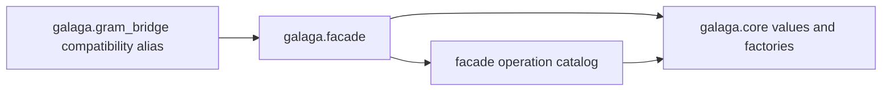

# ADR-075: Promote the Core-Backed Facade Namespace

## Context and problem statement

ADR-073 moved the Gram-native numeric engine into `galaga.core` while leaving
the first composition facade under the deliberately transitional
`galaga.gram_bridge` name. The bridge has now passed direct-core parity and the
migrated Galaga numeric contract. Continuing to develop it under a name tied
to its migration history would make the temporary boundary look permanent and
would invite a second implementation when the top-level API is cut over.

The facade still cannot replace `galaga.Algebra` immediately. Presentation,
expression provenance, rendering, and companion packages have later migration
phases and the v1 API must remain usable while those phases execute.

## Decision drivers

- Give the Galaga 2 composition layer a name based on architectural purpose.
- Preserve one implementation while old and new import paths coexist.
- Keep `galaga.core` independent of all outer layers.
- Avoid changing the top-level v1 API before its presentation and expression
  contracts are ready.
- Make import identity and dependency direction executable test contracts.

## Decision outcome

`galaga.facade` is the implementation namespace for the Galaga 2 composition
layer. It owns:

- the facade `Algebra` and `Multivector` wrappers;
- the operation catalog and public call policies;
- eager numeric delegation, coercion, ownership checks, and result wrapping;
  and
- same-object functional aliases over canonical long operation names.

`galaga.gram_bridge` is reduced to a compatibility re-export. Its package,
`catalog`, and `facade` modules contain no parallel implementation and return
the exact objects owned by `galaga.facade`. The alias remains available during
the staged migration and is removed according to Phase 9 of the cutover plan.
It does not emit a warning while it is still used by migration-era downstream
code; the checked-in API matrix reserves its eventual warning text.

Top-level `galaga.Algebra` and `galaga.Multivector` remain the v1 classes until
Phase 8. Namespace promotion identifies the implementation owner; it is not
the final top-level cutover.

The dependency direction is:

`galaga.core` must not import the facade, bridge, legacy algebra, expression,
presentation, notation, or rendering layers. The facade must not import an
outer layer until its planned composition point is implemented. ADR-076 now
records the presentation composition point; expression and rendering remain
outside the facade until their later phases.

## Consequences

- Good, because the replacement implementation now has its intended durable
  namespace.
- Good, because bridge and facade imports cannot drift into separate numeric
  implementations.
- Good, because direct `galaga.core` users retain a presentation-free path.
- Good, because future presentation and expression work has one composition
  boundary to extend.
- Cost, because two import paths temporarily expose the same objects.
- Cost, because documentation and downstream migration code must stop treating
  `gram_bridge` as the primary name.
- Risk, because users may mistake `galaga.facade` for the completed top-level
  Galaga 2 API; documentation must state that Phases 5 through 8 are still
  required.
