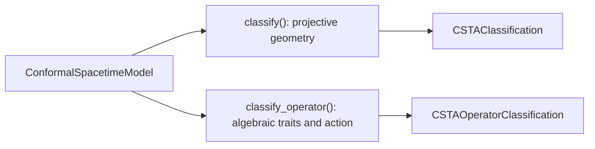

# ADR-176: CSTA Object and Operator Classification

## Context

CSTA geometric objects are homogeneous blades interpreted projectively.
Operators such as projectors and rotors need different checks: idempotency
depends on the supplied scale, and a unit reverse norm does not alone prove
that an even element in six dimensions preserves the vector space.

ADR-174's classifier identifies curves and full hypersurfaces, but gives
generic names to surfaces and singular-carrier sections. It also calls a
null-separated grade-2 pair an event pair even though its incidence locus
contains an entire lightlike line.

## Decision

Keep `ConformalSpacetimeModel.classify()` for geometric objects. Add
`classify_operator()` and export its immutable `CSTAOperatorClassification`
result alongside `CSTAClassification` under `galaga.models`. Store shared
result types separately from model construction and put the geometry and
operator algorithms in focused internal modules.

### Geometric sections

For a simple direct blade $B$ of grade $k$, obtain its vector span from the
kernel of $v\mapsto v\wedge B$. In ordered model-role coordinates, choose a
weight-one anchor $W_0$ and weight-zero direction columns $U$. With the actual
Gram matrix $G$, null events in this span satisfy

$$
F(z)=z^TMz+2\ell^Tz+c=0,\qquad
M=U^TGU,\quad \ell=U^TGW_0,\quad c=W_0^TGW_0.
$$

For nonsingular $M$, completing the quadratic gives the unique stationary
anchor $W=W_0-UM^{-1}\ell$ and signed radius $\rho^2=-W^TGW$.
This generalizes ADR-174 from curves to grade-4 surfaces. Negative-definite
carriers give circles/spheres and their point or imaginary degeneracies.
Lorentzian carriers give hyperbolas, one-sheet or two-sheet hyperboloids,
and null line pairs or cone sections.

For singular $M$, inspect the linear term along its radical:

- Nonzero radical component gives a parabola or paraboloid. No
  stationary centre exists.
- A vanishing radical component permits completing only the regular
  directions. The centre is not unique; use the invariant constant to
  distinguish parallel/double/imaginary null lines and null cylinders.

The regular-direction inverse is computed from the nonzero eigenvalues.
It is used to derive the invariant quadratic constant, never to present an
arbitrarily chosen centre. Unsupported or unresolved cases retain a structural
label.

Flats contain infinity. Project their weight-zero directions into spacetime,
remove the infinity direction, and measure the resulting carrier using the
actual base Gram matrix. Return its inertia and causal signature for lines,
2-planes and hyperplanes, including grade-1 dual hyperplanes. No weight-one
anchor means an ideal flat rather than a finite object.

For curves, causal labels describe tangents; for flats they describe the
carrier; for full signed rounds they describe radial intervals. Surface
tangent inertias are explicit because a one-sheet hyperboloid has mixed
signature and a cone has a degenerate tangent plane. At singular vertices
there is no unique smooth tangent plane; reported inertias describe regular
points, not the singular vertex. No single causal label is forced in mixed
cases.

Rename a null-separated pair `lightlike line`. If $A$ and $B$ are normalized
null events and $A\cdot B=0$, every $X=(1-s)A+sB$ is null and has unit weight,
so the pair's conformal span contains an entire affine null line. Both its
direct and dual representations receive that geometric name.

### Algebraic traits

Operator results expose overlapping `traits`, optional `transformation`,
optional `nilpotency_index`, and immutable properties. Check idempotency
$P^2\approx P$ and involution $K^2\approx1$ without normalizing the input.
Zero and identity retain all their applicable traits.

Search nilpotency by geometric products through `max_power` (default 8,
allowed 1..64). Nonzero scalar rescaling of intermediate powers preserves
the vanishing-power question and avoids underflow decay falsely identifying
ordinary small scalars as nilpotent. `None` means no index was found within
the bound, not a proof of nonnilpotency.

For a homogeneous-parity candidate, verify a nonzero scalar reverse norm,
its inverse, and the twisted adjoint on all six basis vectors:

$$
\Phi_V(v)=\alpha(V)vV^{-1},\qquad A^TGA=G.
$$

All images must remain vectors. The rotor trait additionally requires even
parity and unit reverse norm at the input scale. Scaled versors retain the
same transformation but can lose the rotor, involution or idempotency trait.

### Naming verified actions

Recognize actions using the actual transformed origin, infinity and base
vectors, rather than expression provenance. Preserved infinity gives an
affine conformal map. Recover its natural-coordinate translation, positive
dilation factor and Lorentz action. Identify pure spatial rotations,
single-plane spatial reflections and pure boosts; retain general Lorentz
or composed affine labels otherwise. Recognize pure special conformal maps
from their fixed origin and identity derivative there. Origin/infinity
exchange with unchanged base action identifies an origin-centred inversion.
Other verified actions retain the general conformal label.

Transformation names are relative to this frame and origin. Classification
does not select a logarithm, factor a general versor into unique elementary
motions, interpret an idempotent as a spacetime region, or classify physical
fields. Numeric action properties remain natural regardless of input units.

## Consequences

The classifier distinguishes useful geometric sections and operator traits
without conflating their scale rules. The zoo notebook presents direct and
dual objects, null-carrier degeneracies, boost/dilation projectors and their
four commuting joint projectors, bounded nilpotency, verified transformations,
and the difference between an algebraic projector and geometric projection.

Both APIs are numerical. Eigenvalue rank decisions, products and inverse
checks can become unresolved under poor conditioning; `atol` and operator
`rtol` express those limits. Traits are approximate checks, not symbolic proofs.
Tests derive incidence, metric signs, powers and actions first, then compare
classification, including scaled inputs and false-versor counterexamples.

## References

1. [Double Conformal Space-Time Algebra, §6](https://vixra.org/pdf/1602.0114v5.pdf): CSTA direct and dual flat/round constructions, including grade-2 lightlike lines and spacetime pseudocircles.
2. [Clifford conformal transformation tutorial](https://clifford.readthedocs.io/en/latest/tutorials/cga/index.html):
   conformal embeddings, null-plane dilations, translations and inversions.
   Null-plane orientation conventions must be checked against the stored
   metric and products.
