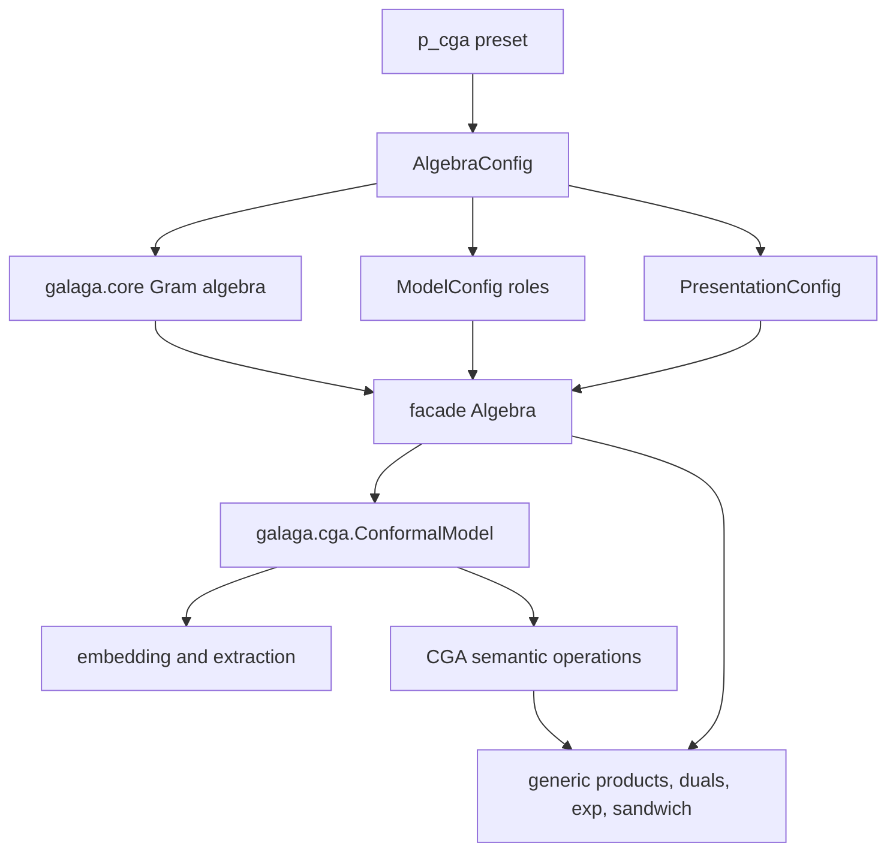

# Native-Null Conformal Geometric Algebra

Galaga's conformal model is a semantic layer over the same general Gram-matrix
engine used by every other algebra. It does not diagonalize the metric and it
does not disguise an orthogonal pair as null vectors. With
`p_cga(spatial_dim=3)`, the stored basis is exactly

$$
(e_1,e_2,e_3,e_o,e_\infty)
$$

and the Gram matrix is

$$
G=
\begin{bmatrix}
1&0&0&0&0\\
0&1&0&0&0\\
0&0&1&0&0\\
0&0&0&0&-1\\
0&0&0&-1&0
\end{bmatrix}.
$$

Thus $e_o^2=e_\infty^2=0$ and
$e_o\mathbin{\cdot}e_\infty=-1$ are direct multiplication-table facts.
This is the native frame used by the
[CGA wiki](https://conformalgeometricalgebra.org/wiki/index.php?title=Main_Page),
where its $e_4$ is Galaga's $e_o$ and its $e_5$ is Galaga's
$e_\infty$. The stored matrix is exactly its
[metric](https://conformalgeometricalgebra.org/wiki/index.php?title=Metrics),
not a presentation-time relabeling.

## Architecture



The responsibilities are deliberately separate:

- `galaga.core` evaluates the Clifford and exterior algebra from the Gram
  matrix. It knows nothing about conformal geometry.
- `p_cga` supplies the numeric definition, native basis roles, and default
  presentation as independently replaceable configuration components.
- the facade owns eager multivectors, optional expression provenance, and
  rendering.
- `ConformalModel` validates the declared roles against the actual metric and
  supplies operations whose meaning depends on the conformal model.
- generic joins, meets, products, exponentials, and sandwich actions remain
  generic Galaga operations. The CGA layer does not implement copies of them.

An arbitrary `Algebra(4, 1)` is not accepted. Neither inertia nor basis names
identify which directions mean origin, infinity, and Euclidean space. The
orthogonal `p_cga(frame="orthogonal")` model is also rejected because its last
two basis vectors really are $e_+$ and $e_-$, not $e_o$ and
$e_\infty$.

## Constructing the model

```python
from galaga import Algebra, p_cga
from galaga.cga import ConformalModel

algebra = Algebra(config=p_cga(spatial_dim=3))
cga = ConformalModel(algebra)

e1, e2, e3 = cga.euclidean_basis_vectors(expr=True)
eo = cga.origin
einf = cga.infinity
```

Presentation is still independent. Passing `display=`, `notation=`, or a
custom presentation to `Algebra` changes how the values appear without
changing the conformal model.

## Round points and ordinary points

The wiki's
[round point](https://conformalgeometricalgebra.org/wiki/index.php?title=Round_point)
stores a Euclidean center and a signed squared radius in one conformal vector.
For

$$
\kappa=e_o\mathbin{\cdot}e_\infty\ne0,
$$

Galaga uses

$$
A(x,r^2)=e_o+x-\frac{x^2+r^2}{2\kappa}e_\infty.
$$

Consequently, $A(x,r^2)^2=-r^2$. For the standard $\kappa=-1$,

$$
A(x,r^2)=e_o+x+\frac12(x^2+r^2)e_\infty.
$$

An ordinary conformal point is the zero-radius case:

```python
p = cga.round_point((1, 2, 3))
a = cga.round_point((1, 2, 3), radius_squared=4)

assert float(p * p) == 0
assert float(cga.radius_squared(a)) == 4
```

The signed `radius_squared` parameter represents real, zero-radius, and
imaginary round geometry without introducing complex coefficients. It may be a
real number or a scalar multivector carrying a name and expression provenance.

For a conformal vector $X$, `weight(X)` returns its $e_o$ coefficient:

$$
w(X)=\frac{X\mathbin{\cdot}e_\infty}{\kappa}.
$$

`homogenize(X)` divides by that weight, `down(X)` returns its Euclidean center
as a Galaga vector, and `coordinates(X)` returns an immutable NumPy array.
These operations reject an infinite vector whose weight is zero.
The conventional `up` and `homo` spellings are exact aliases of `round_point`
and `homogenize`; the descriptive names remain primary.

For ordinary points $P(x)$ and $P(y)$, the
[dot-product identity](https://conformalgeometricalgebra.org/wiki/index.php?title=Dot_products)
is executable directly:

$$
P(x)\mathbin{\cdot}P(y)=-\frac12\lVert x-y\rVert^2.
$$

## Direct object representations

The model does not add wrapper classes for point, line, circle, or sphere.
Those objects are ordinary homogeneous multivectors, and their direct
representations use `outer_product`:

| Wiki object | Direct representation | Grade |
|---|---:|---:|
| [round point](https://conformalgeometricalgebra.org/wiki/index.php?title=Round_point) | $A$ | 1 |
| [flat point](https://conformalgeometricalgebra.org/wiki/index.php?title=Flat_point) | $A\wedge e_\infty$ | 2 |
| [dipole](https://conformalgeometricalgebra.org/wiki/index.php?title=Dipole) | $A\wedge B$ | 2 |
| [line](https://conformalgeometricalgebra.org/wiki/index.php?title=Line) | $A\wedge B\wedge e_\infty$ | 3 |
| [circle](https://conformalgeometricalgebra.org/wiki/index.php?title=Circle) | $A\wedge B\wedge C$ | 3 |
| [plane](https://conformalgeometricalgebra.org/wiki/index.php?title=Plane) | $A\wedge B\wedge C\wedge e_\infty$ | 4 |
| [sphere](https://conformalgeometricalgebra.org/wiki/index.php?title=Sphere) | $A\wedge B\wedge C\wedge D$ | 4 |

For example:

```python
from galaga import outer_product

a = cga.round_point((0, 0, 0))
b = cga.round_point((1, 0, 0))
c = cga.round_point((0, 1, 0))

line = outer_product(a, b, cga.infinity)
circle = outer_product(a, b, c)
plane = outer_product(a, b, c, cga.infinity)
```

Variadic outer products are lowered to the same associative binary operation,
so these spellings do not create special constructors or new expression-node
types.

## CGA semantic operations

The wiki defines a compact vocabulary built from join, meet, complement, and
the metric maps. Galaga provides descriptive names on `ConformalModel`, with
the wiki abbreviations as exact aliases:

| Primary name | Short form | Definition |
|---|---|---|
| `dual(u)` | — | `right_hodge_dual(u)` $=\overline{Gu}$ |
| `antidual(u)` | — | `right_weight_dual(u)` $=\overline{\mathbb G u}$ |
| `attitude(u)` | `att(u)` | $u\vee\overline{e_o}$ |
| `carrier(u)` | `car(u)` | $u\wedge e_\infty$ |
| `cocarrier(u)` | `ccr(u)` | $u^\star\wedge e_\infty$, using the antidual |
| `center(u)` | `cen(u)` | $\operatorname{ccr}(u)\vee u$ |
| `flat_center(u)` | — | $\operatorname{ccr}(u)\vee\operatorname{car}(u)$ |
| `container(u)` | `con(u)` | $u\wedge\operatorname{car}(u)^\star$ |
| `partner(u)` | `par(u)` | $(-1)^{\operatorname{gr}(u)+1}\operatorname{con}(u^\star)\vee\operatorname{car}(u)$, for $\kappa=-1$ |
| `expansion(a, b)` | — | $a\wedge b^\star$, where $\operatorname{gr}(a)<\operatorname{gr}(b)$ |
| `projection(a, b)` | `project(a, b)` | $b\vee(a\wedge b^\star)$ |

These correspond to the wiki pages for
[duals](https://conformalgeometricalgebra.org/wiki/index.php?title=Duals),
[attitude](https://conformalgeometricalgebra.org/wiki/index.php?title=Attitude),
[carriers](https://conformalgeometricalgebra.org/wiki/index.php?title=Carriers),
[centers](https://conformalgeometricalgebra.org/wiki/index.php?title=Centers),
[containers](https://conformalgeometricalgebra.org/wiki/index.php?title=Containers),
[partners](https://conformalgeometricalgebra.org/wiki/index.php?title=Partners),
[expansion](https://conformalgeometricalgebra.org/wiki/index.php?title=Expansion),
and [projection](https://conformalgeometricalgebra.org/wiki/index.php?title=Projections).

The methods check algebra ownership and homogeneous-grade preconditions. They
do not try to prove that arbitrary coefficients satisfy every Plücker-like
constraint for a valid line, circle, or sphere. A later typed geometry layer
could add that stronger invariant without changing the representation.

### Which dual is this?

The wiki's `dual` is specifically the right complement after the metric
exomorphism. That is `right_hodge_dual`, not an invitation to choose a dual
convention globally. The model methods make the intended CGA convention
explicit. Under the standard CGA normalization, the metric antiexomorphism is
the negative of the metric exomorphism, so the wiki dual and antidual differ
by a sign.

Embedding, center, container, expansion, and projection are valid for every
nonzero null-pair scale accepted by `p_cga`. The wiki's polynomial `partner`
identity is specifically normalized to $e_o\mathbin{\cdot}e_\infty=-1$;
`partner` rejects other scales rather than returning a plausible but incorrect
signed radius.

## Generic products remain generic

The wiki's
[exterior products](https://conformalgeometricalgebra.org/wiki/index.php?title=Exterior_products),
[geometric products](https://conformalgeometricalgebra.org/wiki/index.php?title=Geometric_products),
and [join and meet](https://conformalgeometricalgebra.org/wiki/index.php?title=Join_and_meet)
map directly to existing Galaga operations:

| CGA term | Galaga operation |
|---|---|
| join | `outer_product` (`join`, `wedge`, and `op` are aliases) |
| meet | `regressive_product` (`meet` is an alias) |
| geometric product | `geometric_product` or `*` |
| geometric antiproduct | `geometric_antiproduct` |
| sandwich product | `sandwich` |
| sandwich antiproduct | two `geometric_antiproduct` calls with `antireverse` |

Keeping these operations generic preserves one numeric implementation and one
expression operation ID.

## Transformations

No translator, rotor, dilator, or transversor constructor is added. They are
exponentials of existing generators. For the standard
$e_o\mathbin{\cdot}e_\infty=-1$ normalization:

```python
import math

from galaga import exp, sandwich

t = cga.euclidean_vector((2, -1, 0.5))
T = exp(-0.5 * t * cga.infinity)

B = e1 ^ e2
R = exp(-0.5 * theta * B)

D = exp(0.5 * math.log(scale) * (cga.origin ^ cga.infinity))

a = cga.euclidean_vector((0.2, 0, 0))
K = exp(0.5 * a * cga.origin)

moved = sandwich(T, point)
rotated = sandwich(R, point)
scaled = sandwich(D, point)
transverted = sandwich(K, point)
```

These cover the wiki's
[translation](https://conformalgeometricalgebra.org/wiki/index.php?title=Translation),
[rotation](https://conformalgeometricalgebra.org/wiki/index.php?title=Rotation),
[dilation](https://conformalgeometricalgebra.org/wiki/index.php?title=Dilation),
and [transversion](https://conformalgeometricalgebra.org/wiki/index.php?title=Transversion)
without duplicating `exp` or `sandwich`.

The wiki often writes the complementary antiproduct representation. For a
unit translation in the $e_1$ direction in 3D:

```python
from galaga import antireverse, geometric_antiproduct

anti_T = algebra.I + 0.5 * (e2 ^ e3 ^ cga.infinity)
translated = geometric_antiproduct(
    geometric_antiproduct(anti_T, point),
    antireverse(anti_T),
)
```

This is tested alongside the geometric-product versor form. It needs no CGA
special case in the numeric core.

## What is deliberately not present

- No diagonalization or hidden change of basis.
- No `CGAAlgebra` subclass with a second product implementation.
- No object wrappers that compete with `Multivector`.
- No `line()`, `circle()`, or `sphere()` function that only spells a wedge.
- No transform constructors that only call `exp`.
- No inference of conformal roles from dimension, inertia, or display names.

The implementation boundary follows
[ADR-086](../adrs/086-native-null-cga-is-a-validated-model-layer.md).
