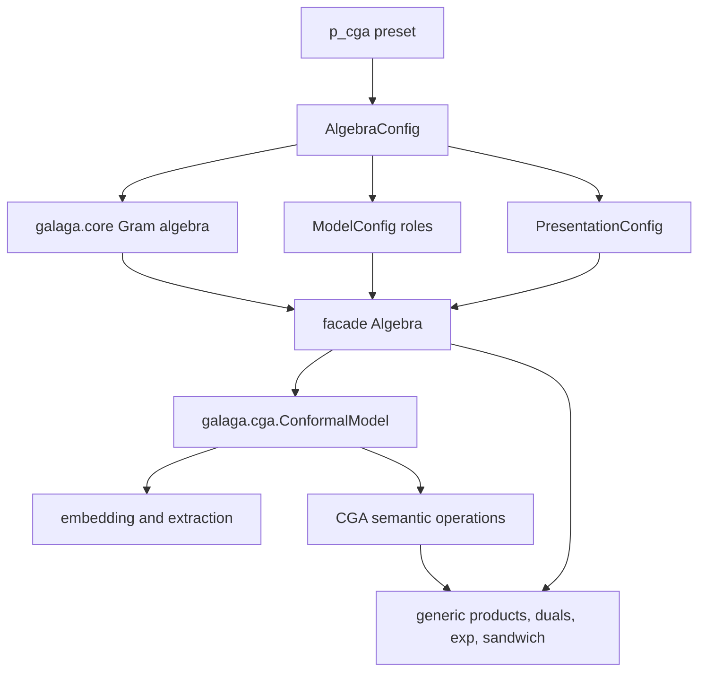

# Native-Null Conformal Geometric Algebra

Galaga's conformal model is a semantic layer over the same general Gram-matrix
engine used by every other algebra. It does not diagonalize the metric and it
does not disguise an orthogonal pair as null vectors. With
`p_cga(spatial_dim=3)`, the stored basis is exactly

$$
(e_1,e_2,e_3,e_o,e_\infty)
$$

and the Gram matrix is

$$
G=
\begin{bmatrix}
1&0&0&0&0\\
0&1&0&0&0\\
0&0&1&0&0\\
0&0&0&0&-1\\
0&0&0&-1&0
\end{bmatrix}.
$$

Thus $e_o^2=e_\infty^2=0$ and
$e_o\mathbin{\cdot}e_\infty=-1$ are direct multiplication-table facts.
This is the native frame used by the
[CGA wiki](https://conformalgeometricalgebra.org/wiki/index.php?title=Main_Page),
where its $e_4$ is Galaga's $e_o$ and its $e_5$ is Galaga's
$e_\infty$. The stored matrix is exactly its
[metric](https://conformalgeometricalgebra.org/wiki/index.php?title=Metrics),
not a presentation-time relabeling.

## Architecture



The responsibilities are deliberately separate:

- `galaga.core` evaluates the Clifford and exterior algebra from the Gram
  matrix. It knows nothing about conformal geometry.
- `p_cga` supplies the numeric definition, native basis roles, and default
  presentation as independently replaceable configuration components.
- the facade owns eager multivectors, optional expression provenance, and
  rendering.
- `ConformalModel` validates the declared roles against the actual metric and
  supplies operations whose meaning depends on the conformal model.
- generic joins, meets, products, exponentials, and sandwich actions remain
  generic Galaga operations. The CGA layer does not implement copies of them.

An arbitrary `Algebra(4, 1)` is not accepted. Neither inertia nor basis names
identify which directions mean origin, infinity, and Euclidean space. The
orthogonal `p_cga(frame="orthogonal")` model is also rejected because its last
two basis vectors really are $e_+$ and $e_-$, not $e_o$ and
$e_\infty$.

## Constructing the model

```python
from galaga import Algebra, p_cga
from galaga.cga import ConformalModel

algebra = Algebra(config=p_cga(spatial_dim=3))
cga = ConformalModel(algebra, expr=True)

e1, e2, e3 = cga.euclidean_basis_vectors()
eo = cga.origin
einf = cga.infinity
```

### Eric Lengyel's complete CGA presentation

`p_lengyel_cga()` composes the same standard native-null Gram matrix and CGA
model roles with `Notation.lengyel()`, compact bold blade labels, and Eric's
five-dimensional basis-table order:

```python
from galaga import Algebra, p_lengyel_cga
from galaga.cga import ConformalModel

algebra = Algebra(config=p_lengyel_cga())
cga = ConformalModel(algebra, expr=True)
```

The role called `origin` renders as $\mathbf e_4$ and `infinity` renders as
$\mathbf e_5$. Signed non-ascending labels such as $\mathbf e_{31}$,
$\mathbf e_{423}$, and $\mathbf e_{4315}$ retain their displayed orientation.
The top blade satisfies

$$
\mathbf e_{12345}=\text{𝟙},
$$

and renders canonically as Lengyel's unit antiscalar $\text{𝟙}$; `e12345`
remains an accepted blade alias. This preset is intentionally separate from
ordinary `p_cga()`: blade convention, display order, and operation notation
can still be overridden independently on `Algebra`.

Presentation is still independent. Passing `display=`, `notation=`, or a
custom presentation to `Algebra` changes how the values appear without
changing the conformal model.

`expr=True` is the model-wide default for values created by `ConformalModel`,
including `origin`, `infinity`, Euclidean basis vectors, Euclidean vectors,
round points, and extracted Euclidean centers. Factory methods accept
`expr=True` or `expr=False` to override that default for one call. Omitting the
constructor option retains the lightweight numeric default with no expression
provenance.

Expression tracking and expression shape are separate policies. CGA helpers
default to compact operator provenance because it usually communicates the
geometric intent most directly:

```python
cga = ConformalModel(algebra, expr=True)  # expression_form="operator"
p = cga.up((1, 2, 3))                    # up(e1 + 2 e2 + 3 e3)
carrier = cga.carrier(circle)             # car(C) in Lengyel notation
```

An immutable model view can instead expose each helper's defining generic GA
operations:

```python
expanded_cga = cga.with_expression_form("expanded")
p_formula = expanded_cga.up((1, 2, 3))
carrier_formula = expanded_cga.carrier(circle)  # C ^ einf
```

Both views share the exact same `Algebra`; only newly attached provenance
changes. Any expression-aware helper also accepts a per-call override without
mutating the model:

```python
p_formula = cga.up((1, 2, 3), expression_form="expanded")
carrier_name = expanded_cga.carrier(circle, expression_form="operator")
```

Expanded provenance stops at an atomic model operation when there is no honest
generic-algebra formula. For example, `down()` selects Euclidean coefficients,
and the ●/○/■/□ component helpers select terms by native-null basis roles; they
remain executable semantic calls in either form. See the
[`expression_forms.py`](../../examples/cga/expression_forms.py) notebook for a
side-by-side rendering tour.

## Round points and ordinary points

The wiki's
[round point](https://conformalgeometricalgebra.org/wiki/index.php?title=Round_point)
stores a Euclidean center and a signed squared radius in one conformal vector.
For

$$
\kappa=e_o\mathbin{\cdot}e_\infty\ne0,
$$

Galaga uses

$$
A(x,r^2)=e_o+x-\frac{x^2+r^2}{2\kappa}e_\infty.
$$

Consequently, $A(x,r^2)^2=-r^2$. For the standard $\kappa=-1$,

$$
A(x,r^2)=e_o+x+\frac12(x^2+r^2)e_\infty.
$$

An ordinary conformal point is the zero-radius case:

```python
p = cga.round_point((1, 2, 3))
a = cga.round_point((1, 2, 3), radius_squared=4)

assert float(p * p) == 0
assert float(cga.radius_squared(a)) == 4
```

The signed `radius_squared` parameter represents real, zero-radius, and
imaginary round geometry without introducing complex coefficients. It may be a
real number or a scalar multivector carrying a name and expression provenance.

For a conformal vector $X$, `weight(X)` returns its $e_o$ coefficient:

$$
w(X)=\frac{X\mathbin{\cdot}e_\infty}{\kappa}.
$$

`homogenize(X)` divides by that weight, `down(X)` returns its Euclidean center
as a Galaga vector, and `coordinates(X)` returns an immutable NumPy array.
These operations reject an infinite vector whose weight is zero.
`up(x)` is the distinct zero-radius operation, so its compact provenance can
render as `up(x)` instead of `round_point(x, 0)`. It returns the same numeric
multivector as `round_point(x)`. The conventional `homo` spelling remains an
exact alias of `homogenize`; the descriptive name is primary.

For ordinary points $P(x)$ and $P(y)$, the
[dot-product identity](https://conformalgeometricalgebra.org/wiki/index.php?title=Dot_products)
is executable directly:

$$
P(x)\mathbin{\cdot}P(y)=-\frac12\lVert x-y\rVert^2.
$$

## Direct object representations

The model does not add wrapper classes for point, line, circle, or sphere.
Those objects are ordinary homogeneous multivectors, and their direct
representations use `outer_product`:

| Wiki object | Direct representation | Grade |
|---|---:|---:|
| [round point](https://conformalgeometricalgebra.org/wiki/index.php?title=Round_point) | $A$ | 1 |
| [flat point](https://conformalgeometricalgebra.org/wiki/index.php?title=Flat_point) | $A\wedge e_\infty$ | 2 |
| [dipole](https://conformalgeometricalgebra.org/wiki/index.php?title=Dipole) | $A\wedge B$ | 2 |
| [line](https://conformalgeometricalgebra.org/wiki/index.php?title=Line) | $A\wedge B\wedge e_\infty$ | 3 |
| [circle](https://conformalgeometricalgebra.org/wiki/index.php?title=Circle) | $A\wedge B\wedge C$ | 3 |
| [plane](https://conformalgeometricalgebra.org/wiki/index.php?title=Plane) | $A\wedge B\wedge C\wedge e_\infty$ | 4 |
| [sphere](https://conformalgeometricalgebra.org/wiki/index.php?title=Sphere) | $A\wedge B\wedge C\wedge D$ | 4 |

For example:

```python
from galaga import outer_product

a = cga.round_point((0, 0, 0))
b = cga.round_point((1, 0, 0))
c = cga.round_point((0, 1, 0))

line = outer_product(a, b, cga.infinity)
circle = outer_product(a, b, c)
plane = outer_product(a, b, c, cga.infinity)
```

Variadic outer products are lowered to the same associative binary operation,
so these spellings do not create special constructors or new expression-node
types.

## CGA semantic operations

The wiki defines a compact vocabulary built from join, meet, complement, and
the metric maps. Galaga provides descriptive names on `ConformalModel`, with
the wiki abbreviations as exact aliases:

| Primary name | Short form | Definition |
|---|---|---|
| `dual(u)` | — | `right_hodge_dual(u)` $=\overline{Gu}$ |
| `antidual(u)` | — | `right_weight_dual(u)` $=\overline{\mathbb G u}$ |
| `attitude(u)` | `att(u)` | $u\vee\overline{e_o}$ |
| `carrier(u)` | `car(u)` | $u\wedge e_\infty$ |
| `cocarrier(u)` | `ccr(u)` | $u^\star\wedge e_\infty$, using the antidual |
| `center(u)` | `cen(u)` | $\operatorname{ccr}(u)\vee u$ |
| `flat_center(u)` | — | $\operatorname{ccr}(u)\vee\operatorname{car}(u)$ |
| `container(u)` | `con(u)` | $u\wedge\operatorname{car}(u)^\star$ |
| `partner(u)` | `par(u)` | $(-1)^{\operatorname{gr}(u)+1}\operatorname{con}(u^\star)\vee\operatorname{car}(u)$, for $\kappa=-1$ |
| `expansion(a, b)` | — | $a\wedge b^\star$, where $\operatorname{gr}(a)<\operatorname{gr}(b)$ |
| `projection(a, b)` | `project(a, b)` | $b\vee(a\wedge b^\star)$ |

These correspond to the wiki pages for
[duals](https://conformalgeometricalgebra.org/wiki/index.php?title=Duals),
[attitude](https://conformalgeometricalgebra.org/wiki/index.php?title=Attitude),
[carriers](https://conformalgeometricalgebra.org/wiki/index.php?title=Carriers),
[centers](https://conformalgeometricalgebra.org/wiki/index.php?title=Centers),
[containers](https://conformalgeometricalgebra.org/wiki/index.php?title=Containers),
[partners](https://conformalgeometricalgebra.org/wiki/index.php?title=Partners),
[expansion](https://conformalgeometricalgebra.org/wiki/index.php?title=Expansion),
and [projection](https://conformalgeometricalgebra.org/wiki/index.php?title=Projections).

In the default `expression_form="operator"`, the model methods retain those
semantic identities in expression provenance. With `Notation.lengyel()`, they
render exactly as Eric's
`att(u)`, `car(u)`, `ccr(u)`, `cen(u)`, `con(u)`, and `par(u)` functional
notation. Conventional notation uses the descriptive long names instead.
The origin and infinity role references needed to re-evaluate these nodes are
stored as non-rendered expression parameters, so compact display does not
sacrifice executable provenance.

With `expression_form="expanded"`, the same methods expose their
wedge/antidual/meet definitions. This includes expansion and projection, while
operator form deliberately gives them explicit `expansion(a, b)` and
`projection(a, b)` identities. Likewise, `radius_squared` is not rendered as
`rad`: Eric's `rad(u)` denotes a radius, whereas Galaga's method returns a
signed squared radius.

## Eric Lengyel's CGA component families

Eric's conformal Mathematica package decomposes every homogeneous geometry
according to whether each basis term contains $e_o$, $e_\infty$, both, or
neither. `ConformalModel` exposes the same four projections:

| Primary name | Lengyel notation | Contains $e_o$ | Contains $e_\infty$ |
|---|---:|:---:|:---:|
| `round_bulk_part(u)` | $u_{\text{●}}$ | no | no |
| `round_weight_part(u)` | $u_{\text{○}}$ | yes | no |
| `flat_bulk_part(u)` | $u_{\text{■}}$ | no | yes |
| `flat_weight_part(u)` | $u_{\text{□}}$ | yes | yes |

These four disjoint values sum exactly to the input. The overlapping
two-family views follow directly:

$$
\begin{aligned}
\operatorname{round\_part}(u) &= u_{\text{●}}+u_{\text{○}}, &
\operatorname{flat\_part}(u) &= u_{\text{■}}+u_{\text{□}}, \\
\operatorname{bulk\_part}_{\mathrm{CGA}}(u) &= u_{\text{●}}+u_{\text{■}}, &
\operatorname{weight\_part}_{\mathrm{CGA}}(u) &= u_{\text{○}}+u_{\text{□}}.
\end{aligned}
$$

They are available as `round_part`, `flat_part`, `bulk_part`, and
`weight_part` methods on the model. The method namespace matters:
`cga.bulk_part(u)` is Eric's CGA component projection, whereas the free
`galaga.bulk_part(u)` is the general RGA metric exomorphism. In degenerate RGA
the latter is a projection; in native-null, nondegenerate CGA it is not this
component filter.

Eric's conformal conjugate preserves the round part and negates the flat part:

$$
\operatorname{conformal\_conjugate}(u)
=\operatorname{round\_part}(u)-\operatorname{flat\_part}(u).
$$

These definitions follow the public `RoundBulkPart`, `RoundWeightPart`,
`FlatBulkPart`, `FlatWeightPart`, `RoundPart`, `FlatPart`, `BulkPart`,
`WeightPart`, and `ConformalConjugate` operations in Eric's
[component-part definitions](https://github.com/EricLengyel/Geometric-Algebra/blob/main/Packages/ConformalAlgebra3D.wl#L432-L453)
and
[conformal conjugate definition](https://github.com/EricLengyel/Geometric-Algebra/blob/main/Packages/ConformalAlgebra3D.wl#L539-L576).

## Weighted component, center, and radius norms

The corresponding model methods implement the Mathematica package's six
weighted norms:

| Method | Lengyel notation | Result subspace |
|---|---:|---|
| `weighted_center_norm(u)` | $\lVert u\rVert_{\text{ⓒ}}$ | scalar |
| `weighted_radius_norm(u)` | $\lVert u\rVert_{\text{ⓡ}}$ | antiscalar |
| `round_bulk_norm(u)` | $\lVert u\rVert_{\text{●}}$ | scalar |
| `round_weight_norm(u)` | $\lVert u\rVert_{\text{○}}$ | complement of $e_\infty$ |
| `flat_bulk_norm(u)` | $\lVert u\rVert_{\text{■}}$ | span of $e_\infty$ |
| `flat_weight_norm(u)` | $\lVert u\rVert_{\text{□}}$ | antiscalar |

In particular, Eric defines

$$
\lVert u\rVert_{\text{ⓒ}}
=\sqrt{u\mathbin{\bullet}\operatorname{conformal\_conjugate}(u)}
$$

and

$$
\lVert u\rVert_{\text{ⓡ}}
=\sqrt[\text{antiscalar}]{u\mathbin{\circ}u}.
$$

The second square root is not a geometric-product square root. It takes the
non-negative coefficient of the antidot's pseudoscalar result and returns its
square root on the same pseudoscalar blade, exactly as Eric's Mathematica
package specializes `Power` for antiscalars. The real numeric core rejects a
negative coefficient; `radius_squared` remains the signed operation for real,
zero-radius, and imaginary round points.

Eric's poster calls the projectively normalized ratios the center norm and
radius norm. Galaga returns both as scalar multivectors:

```python
center_norm = cga.center_norm(circle)
radius_norm = cga.radius_norm(circle)
```

They divide the positive coefficients of the weighted numerator values by
round weight:

$$
\operatorname{center\_norm}(u)
=\frac{\lVert u\rVert_{\text{ⓒ}}}{\lVert u\rVert_{\text{○}}},
\qquad
\operatorname{radius\_norm}(u)
=\frac{\lVert u\rVert_{\text{ⓡ}}}{\lVert u\rVert_{\text{○}}}.
$$

With `Notation.lengyel()`, those operation nodes render directly as the two
fractions above. `center_distance(u)` is an explicit geometric alias for
`center_norm(u)`, while `radius(u)` is the conventional alias for
`radius_norm(u)` and renders as $\operatorname{rad}(u)$.

Both ratios reject flat objects having zero round weight. `center_norm` is
valid for every nonzero null-pair scale accepted by `p_cga`. Eric's antidot
radius formula assumes the package metric $e_o\mathbin{\cdot}e_\infty=-1$, so
`weighted_radius_norm`, `radius_norm`, and `radius` explicitly require that
standard normalization.
The implementation and formulas are checked against Eric's
[norm definitions](https://github.com/EricLengyel/Geometric-Algebra/blob/main/Packages/ConformalAlgebra3D.wl#L685-L718).

The methods check algebra ownership and homogeneous-grade preconditions. They
do not try to prove that arbitrary coefficients satisfy every Plücker-like
constraint for a valid line, circle, or sphere. A later typed geometry layer
could add that stronger invariant without changing the representation.

### Which dual is this?

The wiki's `dual` is specifically the right complement after the metric
exomorphism. That is `right_hodge_dual`, not an invitation to choose a dual
convention globally. The model methods make the intended CGA convention
explicit. Under the standard CGA normalization, the metric antiexomorphism is
the negative of the metric exomorphism, so the wiki dual and antidual differ
by a sign.

Embedding, center, container, expansion, and projection are valid for every
nonzero null-pair scale accepted by `p_cga`. The wiki's polynomial `partner`
identity is specifically normalized to $e_o\mathbin{\cdot}e_\infty=-1$;
`partner` rejects other scales rather than returning a plausible but incorrect
signed radius.

## Generic products remain generic

The wiki's
[exterior products](https://conformalgeometricalgebra.org/wiki/index.php?title=Exterior_products),
[geometric products](https://conformalgeometricalgebra.org/wiki/index.php?title=Geometric_products),
and [join and meet](https://conformalgeometricalgebra.org/wiki/index.php?title=Join_and_meet)
map directly to existing Galaga operations:

| CGA term | Galaga operation |
|---|---|
| join | `outer_product` (`join`, `wedge`, and `op` are aliases) |
| meet | `regressive_product` (`meet` is an alias) |
| geometric product | `geometric_product` or `*` |
| geometric antiproduct | `geometric_antiproduct` |
| sandwich product | `sandwich` |
| sandwich antiproduct | two `geometric_antiproduct` calls with `antireverse` |

Keeping these operations generic preserves one numeric implementation and one
expression operation ID.

## Transformations

No translator, rotor, dilator, or transversor constructor is added. They are
exponentials of existing generators. For the standard
$e_o\mathbin{\cdot}e_\infty=-1$ normalization:

```python
import math

from galaga import exp, sandwich

t = cga.euclidean_vector((2, -1, 0.5))
T = exp(-0.5 * t * cga.infinity)

B = e1 ^ e2
R = exp(-0.5 * theta * B)

D = exp(0.5 * math.log(scale) * (cga.origin ^ cga.infinity))

a = cga.euclidean_vector((0.2, 0, 0))
K = exp(0.5 * a * cga.origin)

moved = sandwich(T, point)
rotated = sandwich(R, point)
scaled = sandwich(D, point)
transverted = sandwich(K, point)
```

These cover the wiki's
[translation](https://conformalgeometricalgebra.org/wiki/index.php?title=Translation),
[rotation](https://conformalgeometricalgebra.org/wiki/index.php?title=Rotation),
[dilation](https://conformalgeometricalgebra.org/wiki/index.php?title=Dilation),
and [transversion](https://conformalgeometricalgebra.org/wiki/index.php?title=Transversion)
without duplicating `exp` or `sandwich`.

Plane reflection and sphere inversion are the same odd-versor action. An IPNS
plane vector $\pi$ or non-null sphere vector $s$ acts on a conformal point by

$$
P'=-aPa^{-1}.
$$

For the standard null-pair normalization, the plane
$\pi=e_1+d e_\infty$ represents $x=d$, and the real sphere with center $c$
and radius $r$ is $s=P(c)-\tfrac12r^2e_\infty$:

```python
from galaga import inverse

plane = e1 + cga.infinity             # x = 1
reflected = -plane * point * inverse(plane)

sphere = cga.round_point((1, 0, 0), radius_squared=-4)
inverted = -sphere * point * inverse(sphere)
```

The negative `radius_squared` is deliberate: `round_point` accepts a signed
round-point radius and satisfies $A(x,r^2)^2=-r^2$; a real inversion sphere
has positive square. Acting on a direct line not through the inversion center
produces a direct circle through that center. These identities use the generic
geometric product and inverse rather than redundant reflection or inversion
helpers.

The wiki often writes the complementary antiproduct representation. For a
unit translation in the $e_1$ direction in 3D:

```python
from galaga import antireverse, geometric_antiproduct

anti_T = algebra.I + 0.5 * (e2 ^ e3 ^ cga.infinity)
translated = geometric_antiproduct(
    geometric_antiproduct(anti_T, point),
    antireverse(anti_T),
)
```

This is tested alongside the geometric-product versor form. It needs no CGA
special case in the numeric core.

## Executable notebooks

The maintained Marimo gallery includes four native-null CGA notebooks:

- [`native_null_foundations.py`](../../examples/cga/native_null_foundations.py)
  derives the Gram matrix facts, point embedding, distance identity, and
  homogeneous `up`/`down` round trip.
- [`direct_objects_and_semantics.py`](../../examples/cga/direct_objects_and_semantics.py)
  constructs direct points, flat points, dipoles, lines, circles, planes, and
  spheres, then exercises `att`, `car`, `ccr`, `cen`, `con`, `par`, expansion,
  and projection.
- [`lengyel_cga_transformations.py`](../../examples/cga/lengyel_cga_transformations.py)
  selects Eric Lengyel's notation, displays the pseudoscalar as the antiunit
  $\text{𝟙}$, and compares his sandwich-antiproduct translation with the
  equivalent geometric-product versor before demonstrating rotation,
  dilation, and transversion.
- [`reflections_and_inversions.py`](../../examples/cga/reflections_and_inversions.py)
  derives plane reflection and sphere inversion from the same odd-versor
  action, verifies inversion is involutive, and shows a line becoming a circle
  through the inversion center.

These files are entries in the executable notebook migration ledger. CI
checks their Python syntax, Marimo dependency graphs, Galaga 2 import policy,
and headless execution.

## What is deliberately not present

- No diagonalization or hidden change of basis.
- No `CGAAlgebra` subclass with a second product implementation.
- No object wrappers that compete with `Multivector`.
- No `line()`, `circle()`, or `sphere()` function that only spells a wedge.
- No transform constructors that only call `exp`.
- No inference of conformal roles from dimension, inertia, or display names.

The implementation boundary follows
[ADR-086](../adrs/086-native-null-cga-is-a-validated-model-layer.md).
