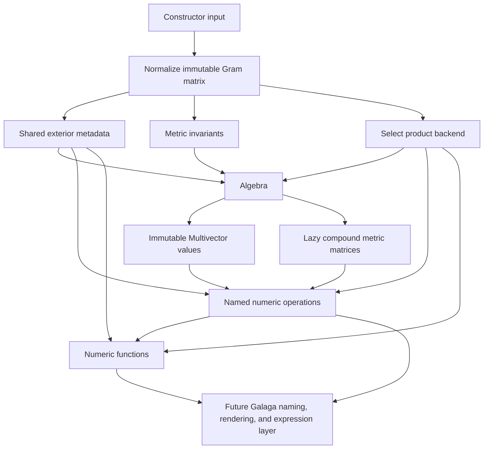

# Architecture

## Overview

`galaga.core` separates metric semantics, exterior coordinates, product
execution, and derived operations. The public API is intentionally small
enough that the Galaga facade can add naming and expression tracking without reaching into a
particular multiplication table.

## Module map

| Module | Responsibility |
|---|---|
| `galaga.core` | Public `Algebra`, `Multivector`, operators, and named numeric operations |
| `galaga.core._metadata` | Metric-independent bitmask, grade, involution, wedge, and complement arrays shared by vector dimension |
| `galaga.core._backends` | Diagonal, packed, lazy, and dense-reference geometric-product implementations |
| `galaga.core._metric` | Exterior metric and antimetric matrices built from ordinary and complementary minors |

The private modules are implementation details. Their interfaces exist to keep
the public algebra independent of storage strategy, not as extension APIs.

## Algebra construction

Construction proceeds in four stages.

### 1. Normalize the metric

`Algebra(p, q, r)`, `Algebra(signature=...)`, `Algebra(sig=...)`, and
`Algebra(gram=...)` all produce a copied, symmetric, read-only `float64` Gram
matrix. Small accepted asymmetry is canonicalized with `(G + G.T) / 2`.
No product coefficient is thresholded or rounded after that step.

The stored diagonal becomes `basis_squares`. Exact equality with the diagonal
matrix determines whether the current basis is orthogonal. A nonzero cross term
is never ignored merely because it is small.

### 2. Attach dimension metadata

`dimension_metadata(n)` is cached by vector dimension. It contains:

- grade and parity masks;
- reverse, grade-involution, conjugation, and antireverse signs;
- the complete metric-independent wedge sign table;
- complement indices and left/right complement signs.

All arrays are immutable and shared across algebras of the same dimension.
The wedge table currently occupies quadratic space in the algebra dimension,
which is one reason dense coefficient storage remains aimed at modest vector
dimensions.

### 3. Classify the metric

The eigenvalues of the symmetric Gram matrix determine inertia
`(positive, negative, null)` with a scale-aware tolerance. Rank is derived from
the same classification. The determinant remains the unthresholded numerical
determinant.

Classification tolerances do not alter the Gram matrix or product semantics.

### 4. Select a product backend

Exactly diagonal metrics use the monomial diagonal backend. General metrics
use either packed sparse expansions or bounded on-demand left actions. The
selection policy is specified in
[SPEC-004](specs/SPEC-004-product-backends.md).

## Multivector representation

For `n` basis vectors, a multivector owns a read-only coefficient array of
length `dim = 2**n`. Index zero is the scalar. Index `1 << i` is basis vector
`e_i`. A multi-bit index is the corresponding exterior blade in ascending
basis order.

This representation is intentionally metric-independent. In a nonorthogonal
basis,

$$
e_i e_j = G_{ij} + e_i\wedge e_j
$$

can contain several coefficient slots even though both inputs are one-hot.
The backend, not the value representation, accounts for those contractions.

### Scalar extraction and conversion

`grade(value, 0)` projects any value onto its scalar component while remaining
inside the algebra. `float(grade(value, 0))` therefore extracts coefficient
zero even when the original value has other grades. `float(value)` is the
checked conversion: it returns that coefficient only when all nonscalar
coefficients are within the scalar-classification tolerance and otherwise
raises `TypeError`. `abs(value)` delegates to this conversion.

A standalone `scalar_part(value)` may be provided as optional shorthand for
`float(grade(value, 0))`; it is not a required multivector member. The current
implementation still has a `.scalar_part` compatibility property, which is to
be migrated separately from this documentation decision.

`np.float64(value)` currently succeeds through Python's `__float__` fallback.
`galaga.core` does not implement NumPy's `__array__`, `__array_ufunc__`, or
`__array_function__` protocols. A multivector therefore does not silently
become its dense coefficient array, and NumPy transcendental ufuncs are not a
second route to core operations. Call the named core function, or explicitly
convert a scalar with `float`, instead.

## Product construction

### Vector action

Left geometric multiplication by a basis vector is the Chevalley action

$$
C_i(B)=e_i\wedge B+e_i\mathbin{\lrcorner}B.
$$

On a basis blade, the contraction removes each selected vector in turn and
weights it by the corresponding Gram entry and alternating exterior sign.

### Higher exterior blades

For a blade `A = e_i wedge C`, where `i` is the lowest selected basis index,
the implementation builds its left action by the recurrence

$$
L_A=C_iL_C-L_{e_i\mathbin{\lrcorner}C}.
$$

Every dependency on the right has lower grade. The packed backend evaluates
this recurrence eagerly for all left blades. The lazy backend applies the same
builder only when a left blade is used.

Exact duplicate output masks are combined. Coefficients equal to exactly zero
after combination are removed; small nonzero coefficients are retained.

### Grade-selected products

Contractions and the Hestenes and Doran–Lasenby products do not own separate
multiplication tables. They iterate through the geometric-product expansion
and retain outputs whose grades satisfy a selector. This keeps every convention
on the same product kernel.

The exterior product is different: it uses the metric-independent wedge table
directly because computing a geometric product and discarding contractions
would obscure the separation between exterior and metric structure.

## Product backends

| Backend | Metric | Storage | Intended role |
|---|---|---|---|
| `diagonal` | Exactly diagonal | One output and factor for every input pair | Production fast path |
| `packed` | Any | CSR-like expansion of every blade pair | Production general-metric path for moderate dimensions |
| `lazy` | Any | Fixed scalar/vector actions plus bounded LRU cache of higher left actions | Production fallback before large eager allocations |
| `reference` | Any | Dense cube of left-action matrices | Correctness oracle for small dimensions |

The lazy cache is protected by a reentrant lock. `product_cache_info` reports
only retained higher-grade actions as `(entries, bytes, budget)`; fixed vector
actions and shared exterior metadata are not part of that counter.

## Metric and antimetric extensions

The vector Gram matrix extends grade by grade to the exterior algebra. The
grade-`k` block of `extended_metric_matrix()` is the `k`th compound matrix:
each entry is the determinant of the corresponding `k` by `k` minor.

`metric_antiexomorphism_matrix()` uses signed complementary minors instead of
forming an inverse. Consequently it remains defined when the metric is
singular and satisfies the complementary relationship with the exterior
metric. Diagonal metrics use direct products of present or absent basis
squares as a fast path.

Both matrices are constructed lazily, cached on the algebra, and returned
read-only. They currently require dense `dim` by `dim` storage; future work
should add an allocation policy before targeting larger dimensions.

## Left-regular action, inverse, and exponential scaling

Every backend can materialize the matrix for left multiplication by one basis
blade. `Algebra.left_action(value)` combines those matrices linearly to obtain
the full left-regular representation of a multivector.

`inverse(value)` currently solves

$$
L_{value}x=1
$$

and then verifies both `value*x` and `x*value`. This is basis-neutral and gives
a useful correctness baseline, but materializing a dense left action is not the
eventual high-dimension inverse strategy.

The general path in `exp(value)` also uses `left_action(value)`, but only to
measure an infinity-norm bound. It scales the generator until the Taylor
series is safely conditioned, evaluates the series with ordinary geometric
products, and then repeatedly squares the result. Scalar and scalar-square
generators bypass this matrix construction through closed forms.

This reuse keeps exponential convergence independent of the selected product
backend. It also makes the dense norm calculation a visible performance
tradeoff to replace with a cheaper certified bound before targeting large
dimensions.

## Numeric-function execution

Numeric functions sit above the product and exterior kernels. They never own
a second multiplication convention.

### Real square-root branches

`scalar_sqrt` handles real scalar numbers and scalar multivectors.
Study-number `sqrt` decomposes a value into scalar and nonscalar parts,
requires the nonscalar part to square to a scalar, selects the principal real
branch, and verifies that the result squares back to the input. It therefore
supports ordinary simple rotors and null PGA translators without claiming a
general multivector square-root algorithm.

### Geometric exponential and Study-rotor logarithm

`exp` uses trigonometric, null, or hyperbolic closed forms whenever the
generator square is scalar. Every other input follows the scaling-and-squaring
path described above.

`log` first validates a normalized rotor and then requires its nonscalar part
to square to a scalar. Elliptic, hyperbolic, and null branches are explicit.
In particular, a translator `1 + N` with `N*N == 0` maps back to `N`; it is not
mistaken for the identity. A general non-Study rotor and scalar `-1` fail
clearly because this implementation cannot choose a correct principal
bivector from those inputs.

### Outer functions

The outer functions split `x` into scalar part `a` and positive-grade part
`X`. Wedge powers of `X` terminate by dimension, while the scalar power series
is evaluated analytically with `exp`, `sinh`, and `cosh`. This prevents a
nonzero scalar component from being incorrectly truncated as though it were
nilpotent. Only the exterior kernel is used, so the series is independent of
the Gram matrix.

The exact public behavior and branch failures are specified in
[SPEC-005](specs/SPEC-005-numeric-functions.md). The algorithm and helper
boundary are recorded in
[ADR-010](adrs/010-separate-numeric-functions-from-geometry-helpers.md) and
[ADR-011](adrs/011-evaluate-numeric-functions-with-explicit-real-branches.md).

## Extension boundaries

Galaga's facade and companion packages should depend on public numeric concepts:

- construct `Algebra` from a Gram matrix;
- construct `Multivector` from coefficients;
- call named operations;
- call numeric functions without inspecting their product backend;
- use `left_action` for regular matrix representations;
- use `inertia`, `gram`, and `basis_squares` for the metric property actually
  needed.

It should not assume monomial products, access backend arrays, or infer a
general metric from `signature`. Rendering and expression tracking belong
above this boundary. Geometry helpers such as rotor constructors, projection,
rejection, and reflection also compose naturally above the core instead of
requiring new kernel primitives.

The integration uses composition: a Galaga facade algebra wraps a core algebra
plus an immutable presentation context, and a facade multivector wraps a core
value plus optional name and expression provenance. Operation dispatch passes
through a facade-owned catalog to public named core functions. Blade
conventions, notation, expression nodes, and renderers never become product
backend concerns. See the
[Galaga v2 plan](../../V2-PLANNING.md),
[ADR-072](../adrs/072-build-galaga-v2-over-gram.md), and
[ADR-073](../adrs/073-move-the-numeric-core-into-galaga.md).
The implemented outer presentation boundary is documented by
[ADR-076](../adrs/076-immutable-presentation-configuration.md) and the
[presentation configuration overview](../v2/presentation-configuration.md).
