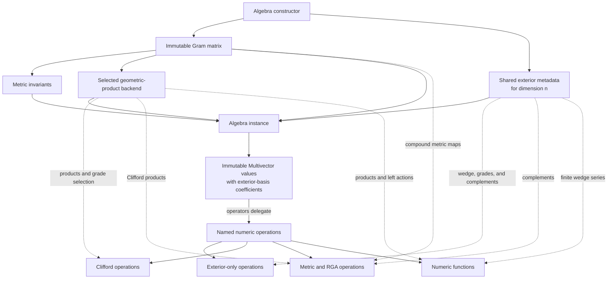

# Implementation Overview

## What this project is building

`galaga.core` is the replacement numeric engine for Galaga's `Algebra` and
`Multivector`. The central change is that a basis is no longer assumed to be
orthogonal. The user supplies scalar products among basis vectors as a Gram
matrix, and the engine computes directly in that basis.

The implementation keeps the parts of the old design that remain useful:
dense multivector coefficients, exterior blades indexed by bitmasks, named
numeric operations, and fast tables for diagonal metrics. It replaces the
assumption that every basis-blade product has only one output.

This document decomposes the implementation into its components and explains
why each boundary exists.

## The whole system at a glance



There are four implementation modules and one test suite:

| Component | File | Owns |
|---|---|---|
| Public numeric core | [`galaga/core/__init__.py`](../../packages/galaga/galaga/core/__init__.py) | `Algebra`, `Multivector`, and named operations |
| Exterior metadata | [`galaga/core/_metadata.py`](../../packages/galaga/galaga/core/_metadata.py) | Grades, wedge signs, involution signs, complements |
| Product engine | [`galaga/core/_backends.py`](../../packages/galaga/galaga/core/_backends.py) | All geometric-product execution strategies |
| Metric extensions | [`galaga/core/_metric.py`](../../packages/galaga/galaga/core/_metric.py) | Compound metric and complementary antimetric matrices |
| Correctness suite | [`tests/core/`](../../packages/galaga/tests/core/) | Construction, algebra laws, backend oracles, RGA, and model regressions |

## Component 1: `Algebra` owns meaning

### What it does

`Algebra` turns one of four constructor forms into a complete numeric algebra:

```python
Algebra(3)
Algebra(1, 3)
Algebra(signature=[1, 1, 1, 0])
Algebra(gram=matrix)
```

It stores:

- the immutable Gram matrix;
- basis-vector squares;
- vector and algebra dimensions;
- orthogonality and legacy-signature classification;
- inertia, rank, determinant, and degeneracy;
- references to shared exterior metadata;
- the selected product backend;
- lazy metric and antimetric caches;
- canonical basis-vector values.

### Why it exists as one owner

Every operation must agree about the metric and coefficient basis. Allowing
individual multivectors to carry separate metric fragments would make it
possible to combine values whose products have different meanings. Instead,
every multivector holds an identity reference to exactly one `Algebra`.

Binary operations reject values from different algebra instances even if the
matrices happen to be numerically equal. This keeps later convention and cache
state from being mixed accidentally.

### The invariant it protects

After construction, the metric cannot change. A backend built for one matrix
will therefore remain valid for the lifetime of the algebra.

## Component 2: `Multivector` owns coordinates

### What it does

A `Multivector` contains only:

- a reference to its algebra; and
- a read-only dense `float64` coefficient array of length `2**n`.

The array uses exterior bitmask order:

```text
data[0]       scalar
data[1 << i]  basis vector e_i
data[mask]    wedge of the selected basis vectors
```

It provides Python arithmetic, integer powers, grade indexing, scalar/vector
inspection, and small method conveniences that delegate to named operations.

`float(value)` verifies that all nonscalar coefficients are numerically zero
before returning coefficient zero. To extract that coefficient from an
arbitrary mixed-grade value, the canonical composition is
`float(grade(value, 0))`. An optional standalone `scalar_part(value)` helper
may abbreviate that expression without becoming a required method on every
multivector. The current implementation still exposes `.scalar_part` as a
property; migrating it to the optional helper surface is planned API cleanup.
Python conversion is implemented by `__float__`, not by NumPy's array or ufunc
protocols.

### Why storage is metric-independent

The same exterior coordinates work in orthogonal, oblique, and degenerate
bases. For example, native CGA origin and infinity vectors are both one-hot
vectors even though their scalar product is nonzero. Their relationship lives
in the Gram matrix and product backend, not in a special value type.

This is the most important representation rule in the project:

> A bitmask identifies an exterior blade, never an unexpanded geometric word.

### Why values are immutable

Immutability makes cached basis vectors safe and prevents a coefficient edit
from invalidating hashes or silently changing a value used elsewhere. Numeric
operations return new multivectors.

## Component 3: shared exterior metadata owns metric-free structure

### What it does

`dimension_metadata(n)` builds and caches everything determined solely by the
number and order of basis vectors:

- the grade of every blade mask;
- masks for selecting each grade;
- signs for reverse, grade involution, conjugation, and antireverse;
- the exterior product sign for every pair of masks;
- complementary mask indices;
- left and right complement signs.

### Why this is separate from `Algebra`

Two algebras with the same vector dimension but different metrics have the
same exterior algebra. Rebuilding these arrays per metric would duplicate
memory and blur the distinction between metric-free and metric-dependent
operations.

This separation also makes implementation mistakes easier to see. If changing
a Gram entry changes a wedge or complement result, the operation has crossed
the wrong architectural boundary.

### Which operations use it directly

- `outer_product`
- grade projections and parity projections
- reverse, involute, and conjugate
- complements and antireverse
- predicates based on grade or blade support

None of these needs a geometric-product table.

## Component 4: the product backend owns Clifford multiplication

### The problem it solves

In an orthogonal basis, a basis-blade product is monomial: one input pair gives
one output mask and factor. In a nonorthogonal basis,

$$
e_i e_j=G_{ij}+e_i\wedge e_j,
$$

so a single pair may produce several components. Galaga's old
`_mul_index`/`_mul_sign` representation cannot express that result.

The backend contract provides three operations:

1. multiply two coefficient arrays;
2. multiply while selecting output grades;
3. materialize left multiplication by a basis blade.

The public core depends only on this contract.

### Why there are four backends

#### Diagonal backend

For an exactly diagonal Gram matrix, XOR still determines the one output mask.
This backend preserves the small and fast representation appropriate for VGA,
PGA, STA, and orthogonal CGA.

#### Packed backend

For a moderate general metric, all basis-blade pair expansions are generated
once and packed into CSR-like arrays. Products then reuse that complete sparse
table.

#### Lazy backend

A dense general product table has a dimension-cubed worst-case term count.
Before its conservative estimate exceeds 64 MiB, automatic selection switches
to a lazy backend. It keeps scalar and vector actions and builds higher left
actions on demand, retaining them in a bounded thread-safe LRU cache.

#### Reference backend

The reference implementation stores dense left-action matrices. It is too
large for production at higher dimensions, but its different construction is
valuable as a correctness oracle.

### How general products are built

The engine starts with the Chevalley action of a vector: wedge plus
contraction. It then constructs higher exterior-blade actions by a grade-ordered
recurrence. The packed and lazy backends deliberately share this builder so
their only semantic difference is when and how long an action is stored.

### Why backend selection is private in meaning

The backend name and cache counters are exposed for diagnosis, but user
mathematics must not branch on them. Cross-backend tests enforce identical
coefficient results.

## Component 5: metric extensions own full exterior pairings

### What they do

Some operations need the vector metric extended to every exterior grade,
rather than ordinary Clifford multiplication alone.

`extended_metric_matrix()` builds the exterior extension `Lambda G`. Each
grade block consists of minors of the vector Gram matrix. This is Eric
Lengyel's metric exomorphism and produces the metric pairing of exterior
blades.

`metric_antiexomorphism_matrix()` builds the signed complementary-minor map.
It is defined directly rather than through a matrix inverse, so it remains
meaningful for a singular PGA metric.

### Why this is a separate module

Compound matrices are derived objects, not part of basic coefficient storage
or the hot geometric-product loop. They can be large, so the algebra creates
them only when an operation asks for them.

### Which operations use them

- `metric_apply`
- `antimetric_apply` and `antidot_product`
- bulk and weight parts
- Hodge and weight duals
- the RGA convention layer built from those primitives

`metric_inner_product` is mathematically the pairing induced by the compound
metric, but its implementation uses the equivalent identity
`scalar_product(A, reverse(B))`. It therefore avoids materializing the full
matrix when only one scalar pairing is required.

## Component 6: named operations compose the primitives

The public operations fall into families according to the component they use.

| Family | Primitive dependency | Examples |
|---|---|---|
| Exterior | Shared metadata | `outer_product`, `complement`, `grade` |
| Clifford | Product backend | `geometric_product`, contractions, Hestenes inner |
| Metric pairing | Scalar product with reverse, or compound metric map | `metric_inner_product`, `metric_apply`, Hodge duals |
| Antimetric/RGA | Complementary metric map plus complements | `antidot_product`, weight duals, interiors |
| Algebraic combinations | Existing named operations | commutators, regressive products, sandwich, norm |
| Matrix-derived | Backend-neutral left action | general `inverse` |
| Numeric functions | Closed forms, finite outer series, or left action | square roots, `exp`, Study-rotor `log`, outer transcendental functions |

This composition is deliberate. There is one geometric-product kernel, one
exterior-product kernel, and one definition for each metric map. Higher-level
operations should be visibly reducible to them.

### How the numeric functions use the components

- `scalar_sqrt` uses the host real square root after enforcing a scalar input.
- Study-number `sqrt` uses Clifford squaring to validate its two-dimensional
  subalgebra and verifies the result by squaring it again.
- `exp` uses closed forms for scalar-square generators. Its general path uses
  the left-action norm to select a scale, a geometric-product Taylor series,
  and repeated squaring.
- Study-rotor `log` validates rotor normalization, then selects elliptic,
  hyperbolic, or null formulas from the nonscalar square.
- `outerexp`, `outercos`, and `outersin` factor out the non-nilpotent scalar
  part and use the exterior-product kernel for the terminating positive-grade
  series. Their results are therefore independent of the metric.

These functions add analytic or convergence machinery. Rotor construction,
projection, rejection, and reflection do not: each is a short geometric
composition and remains in the future helper/facade layer. See
[SPEC-005](specs/SPEC-005-numeric-functions.md),
[ADR-010](adrs/010-separate-numeric-functions-from-geometry-helpers.md), and
[ADR-011](adrs/011-evaluate-numeric-functions-with-explicit-real-branches.md).

The public functions currently live beside `Algebra` and `Multivector` in
`galaga.core`. That keeps the numeric surface easy to audit. They can be
split into internal modules later without changing public imports.

## Component 7: the tests act as executable architecture

The test suite is divided by responsibility:

| Test file | Architectural responsibility |
|---|---|
| `test_algebra.py` | Constructor normalization, metric metadata, and invalid input |
| `test_multivector.py` | Representation, algebra laws, familiar models, native CGA equivalence |
| `test_backends.py` | Backend selection, backend agreement, and grade-selected products |
| `test_numeric_api.py` | Arithmetic, involutions, brackets, norms, inverse, and predicates |
| `test_numeric_functions.py` | Square roots, exponentials, logarithms, and outer transcendental functions |
| `test_metric_rga.py` | Compound metrics, complements, duals, RGA products, and transwedge |

The dense reference backend and exhaustive basis-change tests are retained
even though they are not production strategies. They make the architecture
testable from independent directions.

## A complete walkthrough: native null CGA

Consider construction with basis order `(e1, e2, e3, eo, einf)` and
`G[eo, einf] = -1`.

1. `Algebra` validates, copies, symmetrizes, and freezes the 5 by 5 matrix.
2. It obtains the cached 32-blade exterior metadata for `n = 5`.
3. Inertia classifies the abstract algebra as `Cl(4,1)` while preserving the
   supplied nonorthogonal coordinates.
4. Exact off-diagonal entries prevent selection of the diagonal backend.
5. The packed estimate fits the budget, so all sparse left actions are built.
6. `basis_vectors()` returns five one-hot immutable multivectors.
7. Multiplying `eo * einf` asks the packed backend for one blade-pair
   expansion. The Chevalley construction returns a scalar `-1` and exterior
   bivector `eo ^ einf`.
8. Calling `metric_inner_product(eo, einf)` returns the Gram pairing `-1`.
9. Calling a complement or wedge uses shared exterior metadata and never
   consults the metric.
10. The exhaustive test outermorphism maps the result into orthogonal
    `Cl(4,1)` and verifies that the products intertwine.

The same components handle an ordinary Euclidean algebra. Only the Gram
matrix, metric classification, and selected product backend differ.

## Where new work belongs

Use this routing rule when extending the implementation:

- If behavior depends only on selected basis indices and their order, it
  belongs with exterior metadata or an exterior operation.
- If it needs Clifford contractions, it belongs on the product-backend
  contract or composes `geometric_product`.
- If it extends the bilinear metric across grades, it belongs with compound
  metric operations.
- If it requires transcendental evaluation, convergence control, or explicit
  real branch selection, it belongs with numeric functions above the existing
  kernels.
- If it is a short application-level composition such as a rotor constructor
  or projection helper, it belongs in a helper or facade layer.
- If it is naming, rendering, expression tracking, or notebook presentation,
  it belongs in the Galaga facade or presentation layer, not this core.
- If it changes a convention or architectural boundary, update a specification
  and add or supersede an ADR.

For the detailed construction and recurrence, continue with
[Architecture](architecture.md). For the reasons behind the boundaries, see
[Design principles](design-principles.md) and the [ADR index](adrs/README.md).
