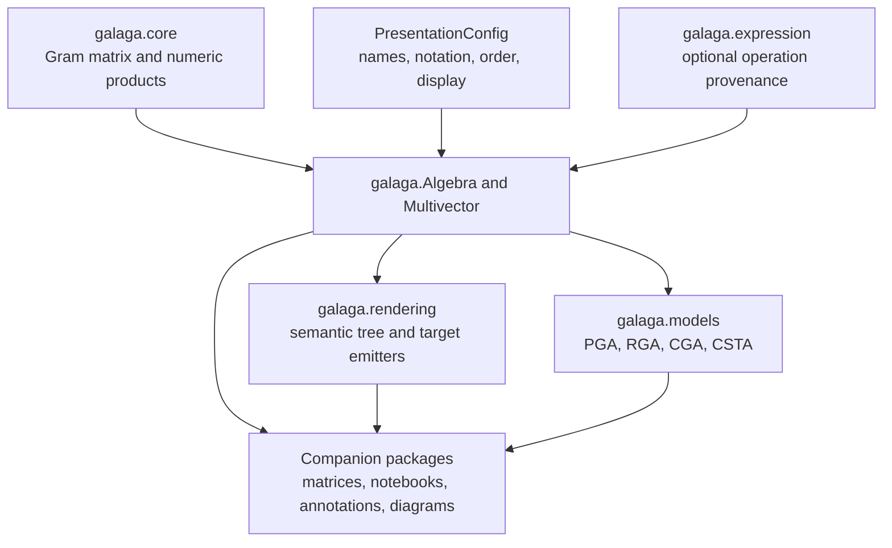

# Galaga 2 Architecture

Galaga separates numeric geometric algebra, expression provenance,
presentation, and geometric interpretation. This guide maps those layers to
their public APIs and implementation documentation.

For installation and first calculations, start with the
[package guide](../../packages/galaga/README.md) or the
[notebook lessons](../../examples/galaga_v2/README.md).

## Library layers

| Layer | Responsibility | Guide |
|---|---|---|
| Numeric core | Immutable real Gram matrix, exterior-basis coefficients, products, metric metadata, numeric functions | [Numeric core](../core/README.md) |
| Public algebra and values | Construction, eager arithmetic, names, tracking, and presentation views | [Package API](../../packages/galaga/README.md) |
| Configuration | Complete algebra definitions and composable presentation overrides | [Presentation configuration](presentation-configuration.md) |
| User preferences | Layered TOML defaults and named configurations | [User configuration](user-configuration-spec.md) |
| Expressions | Immutable operation history, evaluation, and structural simplification | [Expression provenance](expression-provenance.md) |
| Rendering | Shared layout tree, precedence, ASCII, Unicode, LaTeX, and semantic anchors | [Semantic rendering](rendering-implementation.md) |
| Geometry models | Role validation, coordinates, model operations, and classifiers | [Runtime geometry models](runtime-geometry-models.md) |
| Matrices | Representations, checked reconstruction, matrix operations, and provenance | [Matrix integration](matrix-migration.md) |
| Optional integrations | Public display and expression protocols for notebook and visualization consumers | [Integration guide](integration-migration.md) |

## Numeric and geometric meaning

Every algebra stores its actual symmetric Gram matrix. A signature or
`(p, q, r)` constructor is a convenient way to specify a normalized diagonal
metric. Products remain in the stored exterior basis for oblique and native
null metrics.

Application code imports `Algebra`, `Multivector`, and operations from
`galaga`. Those objects are owned by `galaga.facade`, which composes the
numeric core with optional names, expressions, and presentation.
`galaga.core` also provides a lower-level numeric API.

Geometric models validate semantic basis roles in addition to the metric.
Use the concrete models from `galaga.models`:

| Model | Interpretation | Dimensions |
|---|---|---|
| `PGAModel` | Plane-based projective geometry | 2D or 3D |
| `RigidModel` | Point-based rigid geometry | 3D |
| `ConformalModel` | Euclidean conformal geometry | Positive spatial dimensions; object classification in 2D or 3D |
| `ConformalSpacetimeModel` | Conformal spacetime geometry | Four-dimensional spacetime with base signature $(+---)$ |

The [CGA guide](../cga/README.md) and
[RGA guide](../rga-convention-layer.md) provide detailed construction,
measurements, and transformation examples. The shared model guide covers PGA,
CSTA, classifiers, and physical-unit conversion.

## Presentation and provenance

A presentation controls blade names, local variable names, display order,
operation notation, and display policy. Components compose with `|` using
right-hand precedence. `Algebra` accepts these choices at construction and
through persistent views or temporary scopes. A `Presenter` applies a
presentation to an existing value.

Expression tracking records how an eager value was obtained. Evaluation uses
explicit symbol bindings and an algebra. Changing presentation preserves the
value, expression identity, equality, and hash. See the
[configuration object map](presentation-configuration.md#configuration-and-rendering-object-map)
for the classes and their relationships.

## Validation and releases

- [Numeric correctness strategy](../core/correctness-strategy.md) explains
  independent algebraic, coordinate, and backend oracles.
- [Rendering snapshots](rendering-parity.md) and
  [configured rendering contracts](exact-rendering-contracts.md) document
  exact output and coefficient checks.
- [Release process](../RELEASE_PROCESS.md) defines candidate validation,
  packaging, publication, and stage-specific metadata.
- [Type-checking guide](../PYREFLY_STATUS.md) describes the local production
  typing gate.

Validation results belong to a specific checkout and environment. Run the
release checklist for the candidate being published.

## Migration and design history

Existing Galaga 1 users should use the
[migration guide](migration-guide.md) and
[alias and removal reference](compatibility-shims.md).

Completed plans, migration inventories, performance measurements, and review
reports are indexed in [Development history](history.md). Design rationale is
recorded in the [ADR index](../adrs/README.md). Proposed extensions are listed
in the [capability roadmap](galaga-replacement-roadmap.md).
