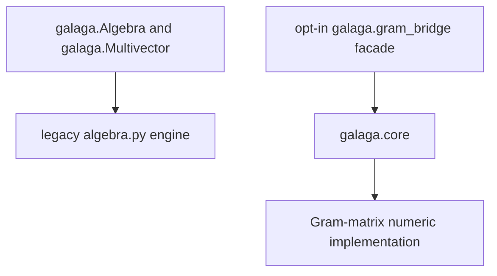
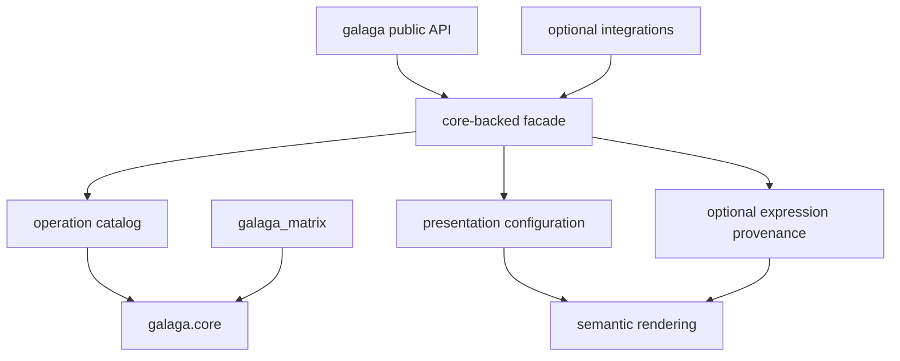

# Galaga 2 Core Cutover Plan

## Status and authority

This is the normative execution plan for replacing Galaga's legacy numeric
`Algebra` and `Multivector` with the composition facade over `galaga.core`, and
for completing the Galaga 2.0 changes above that numeric boundary.

The companion [presentation and expression layer plan](presentation-symbolic-layer-plan.md)
explains the target architecture. The
[numeric-algebra replacement roadmap](galaga-replacement-roadmap.md) records
remaining numeric capabilities. This document turns both into ordered,
testable work units with explicit exit gates.

The initial core-consolidation phase is complete on the `galaga_v2` branch.
Later phases are not complete merely because the legacy Galaga test suite still
passes against the legacy implementation.

## Current position

The repository currently has three relevant layers:



- `galaga.core` contains the proven Gram-matrix numeric engine and its tests.
- `galaga.gram_bridge` is the first composition facade and operation catalog.
- top-level `galaga.Algebra` and `galaga.Multivector` still resolve to the
  legacy implementation.
- the existing Galaga tests therefore remain regression evidence for Galaga
  v1 unless a test explicitly constructs the core-backed facade.
- the external `gram` distribution is no longer required by Galaga.

The intended end state is:



The legacy multiplication tables and legacy numeric `Multivector` storage are
absent from the public execution path and can then be removed.

## Definition of done

Galaga 2.0 is ready when all of the following are true:

1. `galaga.Algebra` constructs a facade over exactly one `galaga.core.Algebra`.
2. `galaga.Multivector` wraps an immutable `galaga.core.Multivector`; no second
   coefficient array or multiplication table is maintained by the facade.
3. every public operation has one stable operation identifier and one numeric
   implementation path into the core or into an explicitly documented facade
   composition.
4. all applicable legacy numeric tests have been rerun against the facade,
   rather than merely passing against `galaga.algebra.Algebra`.
5. every deliberate v2 incompatibility has a specification, migration note,
   and direct regression test.
6. presentation, blade convention, notation, naming, and expression tracking
   can change independently without changing the numeric algebra.
7. expression tracking is optional provenance over eager numeric results and
   imposes no expression allocation on the numeric-only path.
8. companion packages consume public core or facade APIs rather than private
   legacy product tables.
9. the Python 3.11 wheel installs without a standalone `gram` package and
   contains no reachable legacy numeric engine. Only `galaga_marimo` requires
   Python 3.14.
10. the full test, documentation, coverage, package-build, and clean-install
    gates in this document pass.

## Delivery rules

These rules apply to every work unit:

- Keep migration additive until the shadow-cutover gate. Do not silently
  replace top-level exports while the facade suite is incomplete.
- Add tests to the layer that owns the behavior. Core mathematics belongs in
  `tests/core`; wrapping and propagation belong in facade tests; spelling and
  layout belong in presentation or rendering tests.
- A passing legacy test is not facade evidence unless the test is visibly
  parameterized over, or directly imports, the facade implementation.
- Prefer differential assertions against `galaga.core` to copied expected
  coefficient arrays. Use hand-computed values where they prove a convention.
- Do not preserve an accidental v1 behavior without classifying it. Each
  difference is either a compatibility requirement, a deliberate v2
  correction, a deprecated shim, or removed behavior.
- Do not add core primitives for operations that are clear compositions of
  existing primitives. Such conveniences belong in a helper or compatibility
  layer and are tested against their defining formula.
- Update the relevant specification and ADR with any decision that changes an
  architectural boundary or mathematical convention.
- Complete a work unit only when its implementation, required tests, and
  documentation evidence are all present.

## Required test matrix

Each phase selects the relevant rows and columns from this common matrix. A
phase may add cases; it must not silently narrow this baseline.

### Algebras

1. Euclidean orthogonal: `Cl(3, 0)`.
2. Indefinite orthogonal: `Cl(1, 3)`.
3. Degenerate orthogonal: `Cl(3, 0, 1)`.
4. Oblique positive-definite basis, for example
   `[[2.0, 0.5], [0.5, 1.0]]`.
5. Native-null conformal basis with a nonzero off-diagonal null pairing.

The oblique and native-null cases are mandatory wherever an operation claims
general Gram-matrix support. They prevent a facade that accidentally falls
back to diagonal-only assumptions.

### Numeric values

For each relevant algebra, cover:

- zero and nonzero scalars;
- basis and general vectors;
- simple and nonsimple bivectors;
- pseudoscalars;
- homogeneous higher-grade blades; and
- mixed-grade multivectors.

### Product backends

Exercise diagonal, packed general-Gram, lazy general-Gram, and dense-reference
backends wherever their documented dimension limits permit. Backend parity is
a core concern; facade tests should sample it without duplicating the entire
core suite.

### Execution modes

The replacement suite must visibly distinguish:

- direct `galaga.core` execution;
- facade execution without expression tracking;
- facade execution with expression tracking; and
- the legacy implementation, only while it remains a differential oracle.

### Python versions

- Python 3.11 is the required Galaga and `galaga_matrix` release target.
- Newer supported Python versions should run in CI as available.
- Python 3.14 is additionally required for `galaga_marimo` and its t-string
  tests; it must not raise the base Galaga requirement.

## Phase and gate summary

| Phase | Outcome | Status | Exit gate |
|---|---|---|---|
| 0 | Core lives inside Galaga | Complete | Core, bridge, full regression, and wheel checks pass |
| 1 | Replacement contract is exhaustive | Next | Every legacy public behavior is classified |
| 2 | Numeric facade is complete | Planned | Facade results match direct core results |
| 3 | Legacy numeric suite runs on facade | Planned | All applicable numeric tests pass the facade |
| 4 | Presentation and presets are independent | Planned | Configuration and scope isolation tests pass |
| 5 | Expression provenance is rebuilt | Planned | Evaluation round trips and numeric-only isolation pass |
| 6 | Rendering and notation are rebuilt | Planned | Semantic and golden rendering tests pass |
| 7 | Companion packages and shims migrate | Planned | Integration and deprecation suites pass |
| 8 | Top-level API shadows the facade | Planned | Full suite reaches no legacy numeric path |
| 9 | Legacy engine is removed | Planned | Clean wheel and release gates pass |

## Phase 0: internalize the numeric core

This phase establishes the code ownership boundary. It does not replace the
top-level Galaga API.

### W0.1 Move the proven implementation

Deliverables:

- move the numeric implementation to `packages/galaga/galaga/core` without
  changing its mathematical behavior;
- migrate its unit tests to `packages/galaga/tests/core`; and
- retain the Gram matrix as the canonical metric representation.

Required tests:

- the complete migrated core suite passes under Python 3.11;
- core tests include diagonal, degenerate, oblique, and native-null metrics;
- backend differential tests still compare optimized products with the dense
  reference implementation.

### W0.2 Remove the external package dependency

Deliverables:

- the facade imports `galaga.core`;
- the package metadata and lock file do not require external `gram`; and
- the built wheel includes `galaga/core`.

Required tests:

- build the Galaga wheel;
- inspect wheel contents for all core modules;
- inspect wheel metadata and assert that no `gram` requirement remains; and
- install or import the wheel in a clean environment containing only declared
  dependencies.

### W0.3 Preserve the migration boundary

Deliverables:

- keep top-level `galaga.Algebra` on the legacy implementation;
- expose the first facade only through the opt-in bridge namespace; and
- record the consolidation and dependency direction in ADR-073.

Required tests:

- assert that top-level `Algebra` is still the legacy class during this phase;
- assert that bridge values wrap `galaga.core` values; and
- run the entire current Galaga suite to detect unintended regressions.

Phase 0 exit evidence recorded on 2026-07-18:

- 261 core tests passed, including migration-boundary tests;
- 18 bridge tests passed;
- the full Python 3.11 Galaga run passed with 2,657 tests and 17 skips; and
- the built wheel included `galaga.core` and no external `gram` dependency.

These numbers are a checkpoint, not permanent acceptance thresholds. Later
phases must increase the facade-specific evidence.

## Phase 1: define the replacement contract

The purpose of this phase is to make the migration finite and auditable.

### W1.1 Inventory the public v1 surface

Deliverables:

- capture public exports from `galaga.__init__` and supported submodules;
- enumerate `Algebra` construction forms, properties, factories, formatting
  hooks, and configuration methods;
- enumerate `Multivector` properties, operators, methods, conversions, and
  formatting hooks;
- enumerate free operations, short aliases, deprecated spellings, expression
  node constructors, presets, and companion-package touch points; and
- identify public behavior currently supplied accidentally through private
  attributes.

Required tests:

- an export-contract test records the intentionally supported public names;
- constructor and operation signature tests cover positional, keyword, and
  invalid call shapes; and
- import smoke tests cover documented package entry points.

The inventory should be checked in as a migration matrix, not left in an issue
or in reviewer memory.

### W1.2 Classify every item

Assign every inventory row exactly one v2 owner and disposition:

- core primitive;
- facade primitive;
- presentation, blade, notation, expression, or rendering concern;
- helper expressed through other operations;
- temporary compatibility shim with a removal milestone;
- deliberate v2 correction; or
- removed API with migration guidance.

Required tests:

- a completeness test compares the live export set with the checked-in
  migration matrix;
- every temporary alias has a deprecation-warning assertion; and
- every removed or corrected behavior has a direct negative or replacement
  test.

### W1.3 Freeze the deliberate v2 corrections

At minimum, the correction ledger must include:

- `commutator` and `lie_bracket` are unscaled `ab - ba`;
- `anticommutator` and `jordan_product` are unscaled `ab + ba`;
- `half_commutator` and `half_anticommutator` are the explicitly scaled forms;
- competing inner products remain explicitly named; no permanent ambiguous
  `inner_product` or `ip` convention is selected;
- exact mathematical equality is separate from `almost_equal`;
- `float(value)` succeeds only when the original value is scalar;
- `float(grade(value, 0))` extracts the scalar coefficient of any value;
- `scalar_part(value)` is, at most, an optional standalone helper and not a
  required member function;
- numeric coefficients are immutable from the public API;
- value naming and expression tracking do not mutate existing values;
- `lazy` and `symbolic` vocabulary is replaced with expression provenance;
- long, explicit operation names are primary, while short spellings are
  optional compatibility or user-selected import aliases; and
- product functions may accept variadic public calls only by immediate,
  deterministic lowering to tested binary operations.

Required tests:

- hand-computed bracket identities;
- scalar-conversion success and rejection cases;
- exact-equality, hashing, and approximate-comparison cases;
- data write-protection tests; and
- call-policy tests for zero, one, two, and several operands.

### W1.4 Characterize relied-upon legacy behavior

Add characterization tests only for undocumented behavior that real Galaga
code, examples, or companion packages rely on. Do not mechanically freeze
every implementation detail of `algebra.py`.

Required tests:

- tests cite the dependent public example, package, or migration-matrix row;
- exception types are asserted where callers use them as control flow; and
- formatting characterizations distinguish semantic content from incidental
  whitespace that the new renderer is expected to change.

### W1.5 Canonicalize operation names before test migration

Deliverables:

- make long, explicit functions the implementations and stable catalog IDs;
- retain selected short spellings only as same-object compatibility aliases;
- maintain one executable alias-to-canonical manifest;
- keep mathematical convention remaps out of the lexical rename process; and
- migrate source-derived tests in two stages so the original legacy file
  remains an unchanged oracle.

Required tests:

- every manifest alias is the same function object as its canonical target;
- every catalog entry uses a canonical identifier and no alias has a second
  entry;
- migrated core tests contain canonical names except in dedicated alias
  compatibility assertions; and
- original and migrated source suites pass together after each file moves.

ADR-074 defines the initial mappings: `gp` to `geometric_product`, `op` to
`outer_product`, and `involute` to `grade_involution`. Chisholm's half-scaled
bracket is a semantic mapping to `half_commutator`, not a rename.

Phase 1 exit gate:

- every v1 public item has an owner and disposition;
- every intentional incompatibility is listed in the correction ledger; and
- no later phase depends on an unrecorded private legacy structure.

## Phase 2: complete the numeric facade

This phase produces a full eager numeric replacement before names,
expressions, or rendering are attached.

### W2.1 Stabilize facade ownership and naming

Deliverables:

- promote the bridge code to its intended internal facade modules;
- keep `galaga.gram_bridge` as a temporary import alias if it is useful during
  migration; and
- make the dependency direction facade to operation catalog to core explicit.

Required tests:

- import-cycle tests import core, facade, and the temporary bridge in both
  orders;
- `galaga.core` imports no facade, expression, presentation, or rendering
  module; and
- the temporary namespace re-exports the same implementation objects rather
  than maintaining a fork.

### W2.2 Complete `Algebra` construction and metadata

Deliverables:

- support the accepted signature, `p, q, r`, diagonal, and full-Gram
  construction forms;
- forward immutable Gram and metric metadata;
- define algebra compatibility and identity rules;
- provide scalar, vector, blade, basis-vector, basis-blade, pseudoscalar, and
  arbitrary-coefficient factories; and
- expose supported public linear-action facilities without leaking backend
  tables.

Required tests:

- constructor parity and validation across the algebra test matrix;
- symmetry, shape, finiteness, and dimension errors;
- read-only metadata and defensive-copy behavior;
- factory coefficient and algebra-identity assertions; and
- equivalent-versus-distinct algebra compatibility cases.

### W2.3 Complete the eager `Multivector` contract

Deliverables:

- immutable numeric wrapping with `.numeric`, `.algebra`, `.data`, grade, and
  coefficient access;
- scalar coercion for valid arithmetic positions;
- checked `float`, `abs`, exact equality, hashing, `almost_equal`, and useful
  eager `repr`; and
- all supported Python operators mapped to named operations.

Required tests:

- constructor length, dtype, finiteness, and algebra mismatch errors;
- scalar, vector, blade, pseudoscalar, and mixed-grade access tests;
- left- and right-hand scalar operator tests;
- `NotImplemented` and resulting `TypeError` behavior for unsupported types;
- equality and hash consistency, including presentation-free wrappers around
  equal core values; and
- proof that `.data` cannot mutate the wrapped value.

### W2.4 Complete the operation catalog

Deliverables:

- declare every facade primitive once with a stable long-form identifier;
- include structural arithmetic, products, contractions, explicit inner
  products, involutions, dualities, RGA operations, grade selection,
  predicates, inverse, norm operations, sandwich, and numeric functions;
- distinguish evaluator arity from public call policy; and
- keep aliases outside the canonical catalog entry.

Required tests:

- catalog identifiers are unique and immutable;
- every exported primitive resolves to exactly one catalog entry;
- every catalog entry has a callable evaluator with tested arity;
- operator bindings agree with named operations; and
- every wrapped result belongs to the expected facade algebra.

### W2.5 Define and test variadic lowering

Deliverables:

- make `geometric_product` and `outer_product` accept one or more operands;
- lower calls immediately to a binary left fold;
- leave contractions, inner products, brackets, and nonassociative operations
  binary; and
- document whether any later associative operation gains the same policy.

Required tests:

- zero arguments raise a clear `TypeError`;
- one argument returns the original value without numeric work;
- two arguments invoke the core primitive once;
- `f(a, b, c)` equals `f(f(a, b), c)` and invokes the core twice; and
- algebra mismatch is detected at the first incompatible fold edge.

### W2.6 Validate direct-core parity

For every numeric facade operation, compare the unwrapped facade result with
the direct core result using the same inputs.

Required tests:

- table-driven parity over all catalog operations and relevant value grades;
- every general-metric operation includes an oblique or native-null case;
- domain errors from inverse, logarithm, square root, and normalization are
  preserved or deliberately translated and documented; and
- the untracked path allocates no expression or rendering object.

Phase 2 exit gate:

- every numeric inventory row is implemented or explicitly classified out;
- catalog coverage is complete;
- unwrapped facade results match direct core results over the required matrix;
  and
- no facade operation reads a private core product table.

## Phase 3: run the legacy numeric contract against the facade

This is the phase that turns the historical Galaga suite into evidence for the
new implementation. It is distinct from running all tests while top-level
Galaga still points at the old implementation.

### W3.1 Partition the existing tests by concern

Classify existing tests as:

- numeric algebra and multivector contracts;
- expression provenance;
- notation, blade convention, or rendering;
- compatibility behavior; or
- companion-package integration.

The checked, file-and-class-level starting inventory is in
[Numeric test migration inventory](numeric-test-migration-inventory.md). It
identifies the Chisholm, Cohoe, Terathon, low-dimensional, quaternion,
general numeric, and RGA cases that should move or merge into `tests/core`, as
well as the mixed files that must be split rather than copied wholesale.

Required tests:

- collection markers or directory structure make the classification visible;
- no numeric test is excluded merely because it currently imports the legacy
  class; and
- mixed tests are split when that gives each layer a clear oracle; and
- collected legacy test IDs are reconciled against the migration inventory so
  every existing test has a recorded destination or an explicit retirement
  reason.

### W3.2 Parameterize numeric contract tests

Extract implementation-neutral contract tests that can construct both the
legacy implementation and the facade during migration. Prefer public factory
fixtures or protocol adapters to monkeypatching module globals.

Required tests:

- algebra construction, factories, operators, grade operations, products,
  involutions, dualities, inverse, predicates, norms, and numeric functions run
  against the facade;
- the test report or test IDs visibly identify the implementation under test;
  and
- tests do not reach through `.numeric` except where direct-core parity is the
  purpose of the test.

### W3.3 Reconcile differences explicitly

For each failure, choose one of three outcomes:

1. fix a facade parity defect;
2. add a deliberate v2 correction test and migration note; or
3. classify the behavior as a presentation or expression concern for a later
   phase.

Required tests:

- no unexplained `xfail` or broad skip hides a facade difference;
- every correction-ledger item has separate legacy and v2 expectations where
  the behaviors differ; and
- every fixed defect gains the smallest regression test that reproduces it.

### W3.4 Add differential property coverage

Use deterministic generated examples to compare legacy diagonal behavior and
direct-core versus facade behavior. Generated tests complement, but do not
replace, convention examples.

Required tests:

- seeded mixed-grade operands over several dimensions;
- product, linearity, involution, duality, and grade identities within their
  documented domains;
- diagonal facade results match retained v1 behavior except for ledgered
  corrections; and
- general-Gram facade results match direct core because the legacy engine is
  not an oracle there.

Phase 3 exit gate:

- every applicable legacy numeric test runs against and passes the facade;
- the suite reports facade cases distinctly;
- remaining legacy-only tests are mapped to later presentation, expression,
  compatibility, or integration work; and
- the correction ledger explains every intended numeric difference.

## Phase 4: rebuild presentation configuration and presets

This phase adds human-facing algebra configuration without contaminating
numeric identity.

### W4.1 Define immutable configuration models

Deliverables:

- separate blade convention, notation, local-name policy, display order, and
  display policy types;
- define an immutable presentation grouping those components; and
- allow every component to be overridden independently.

Required tests:

- replacing notation leaves blades, locals, display order, and numeric algebra
  unchanged;
- replacing blades leaves notation and the numeric algebra unchanged;
- configuration objects are immutable, comparable, and reusable; and
- incompatible dimensions or incomplete conventions fail at construction.

### W4.2 Implement signed blade references and conventions

Deliverables:

- map numeric bitmasks to display labels, signed lookup aliases, semantic role
  aliases, local Python names, and display order;
- distinguish a signed alias from a basis change; and
- validate collisions and completeness.

Required tests:

- lookup round trips for positive and negative aliases;
- aliases never alter the wrapped core coefficients except for their declared
  sign;
- duplicate local names, invalid masks, missing labels, and ambiguous aliases
  are rejected; and
- conventions cover Euclidean, spacetime, conformal orthogonal, conformal
  native-null, and RGA examples.

### W4.3 Implement preset configuration classes

Deliverables:

- presets can define the numeric algebra as well as presentation, for example
  a 3D conformal preset defining five basis vectors and its Gram matrix;
- presets are classes or immutable objects, not magic string branches;
- explicit constructor arguments override individual preset components; and
- users can still build every component without a preset.

Required tests:

- preset expansion equals the corresponding explicit algebra and presentation
  construction;
- `spatial_dim` and other preset parameters validate dimensions;
- each component override changes only that component;
- conflicting numeric overrides fail clearly; and
- two algebras created from the same preset do not share mutable state.

### W4.4 Add numeric value factories and lookup

Deliverables:

- facade factories apply blade and local-name policies while constructing core
  values;
- `blade`, `basis_vectors`, `basis_blades`, `pseudoscalar`, and `locals` have
  documented naming and expression defaults; and
- the numeric identity of each produced value remains independently testable.

Required tests:

- factory outputs unwrap to the expected bitmask coefficients;
- display and local names match the selected convention;
- returned mappings do not expose mutable shared state; and
- invalid lookup names report available or expected forms clearly.

### W4.5 Make temporary presentation overrides context-safe

Deliverables:

- `alg.use_presentation(teaching_presentation)` provides a scoped override;
- nested scopes restore the previous value;
- implementation uses context-local state, such as `contextvars`, rather than
  a mutable process global; and
- an explicit presentation argument on a render call has highest precedence.

Required tests:

- normal and exceptional context-manager exits restore state;
- nested contexts restore in last-in, first-out order;
- two OS threads can render the same algebra with different presentations;
- two interleaved async tasks retain independent presentations; and
- changing presentation never changes equality, hashing, or numeric results.

Phase 4 exit gate:

- presets and fine-grained overrides coexist;
- presentation can change temporarily in thread- and async-safe scopes; and
- all blade and preset examples unwrap to independently verified core values.

## Phase 5: rebuild optional expression provenance

Expressions describe how an eager result was obtained. They do not replace
numeric evaluation.

### W5.1 Define the immutable expression model

Deliverables:

- immutable symbol, scalar literal, blade literal, multivector literal, and
  generic call nodes;
- call nodes store the stable operation identifier, operands, and normalized
  parameters; and
- compatibility node classes, if retained, are constructors for generic calls
  rather than a second operation registry.

Required tests:

- structural equality and hashing for every node kind;
- invalid operation identifiers, operand counts, or parameters are rejected;
- node construction imports no numeric implementation directly; and
- expression nodes remain independent of output format.

### W5.2 Make name and expression state independent

Deliverables:

- facade values expose optional read-only `.name` and `.expr` state;
- `named`, `unnamed`, `with_expr`, and `without_expr` return new values; and
- the four named/unnamed and tracked/untracked states are supported.

Required tests:

- every transition returns a new wrapper and preserves the core value;
- naming alone does not enable tracking;
- removing a name does not remove an expression;
- removing an expression does not remove a name; and
- mathematical equality and hashing ignore both fields.

### W5.3 Route facade operations through one dispatch path

Deliverables:

- every operation evaluates its numeric result exactly once;
- a call node is added only when tracking propagates from the operands or is
  explicitly requested; and
- named operands become useful leaves when they participate in a tracked call.

Required tests:

- spies prove one numeric evaluator call per binary edge;
- the untracked path constructs no expression node;
- tracked and untracked results have identical core values;
- unary, binary, parameterized, scalar, and predicate operations propagate
  according to their declared rules; and
- a tracked later operand in a variadic product retains the earlier untracked
  operands in the lowered expression tree.

### W5.4 Evaluate expressions through the catalog

Deliverables:

- expression evaluation resolves stable identifiers through the catalog;
- leaves resolve through an explicit environment; and
- evaluation does not depend on renderer classes or legacy expression methods.

Required tests:

- evaluating every operation-node family reproduces the stored eager value;
- round trips cover orthogonal, degenerate, oblique, and native-null algebras;
- missing symbols and algebra mismatches fail clearly; and
- variadic source calls evaluate with the same left association as the numeric
  path.

### W5.5 Limit simplification to proven structural rules

Deliverables:

- implement only identity removal, literal folding, or associative visual
  flattening that preserves operation semantics; and
- defer general geometric-algebra simplification.

Required tests:

- every simplification preserves expression evaluation;
- noncommutative operand order is never changed;
- nonassociative operations are never flattened; and
- simplification is deterministic and idempotent.

Phase 5 exit gate:

- every catalog operation has expression-propagation coverage;
- stored eager results equal evaluated expressions across the required matrix;
  and
- expression support has a measured zero-allocation path when disabled.

## Phase 6: rebuild notation and rendering

Rendering consumes values or expression trees and a presentation. It never
performs geometric-algebra computation.

### W6.1 Define a semantic render tree

Deliverables:

- format-neutral nodes for identifiers, literals, sums, products, fractions,
  powers, calls, postfix operations, grouping, and teaching equalities;
- one precedence and associativity model; and
- translations from numeric values and expression nodes into that tree.

Required tests:

- each expression node produces the expected semantic tree;
- renderer construction makes no numeric operation call;
- precedence metadata is complete for every notation rule; and
- unknown operation identifiers fail before emitter selection.

### W6.2 Implement notation as presentation data

Deliverables:

- notation rules are keyed by stable operation identifier;
- functional long names are the canonical fallback;
- optional short functional forms and infix or postfix teaching forms are
  presentation choices; and
- Hestenes, Doran–Lasenby, Lengyel/RGA, and other presets can spell the same
  operation differently without changing it.

Required tests:

- changing notation leaves expression identity and numeric value unchanged;
- every catalog operation has a fallback rendering;
- competing inner products remain distinguishable in every preset; and
- primary long-form and optional short functional output are both covered.

### W6.3 Implement ASCII, Unicode, and LaTeX emitters

Deliverables:

- all emitters consume the same semantic tree;
- format-specific escaping and glyph selection stay in the emitter; and
- rich display hooks delegate to the same public rendering pipeline.

Required tests:

- a compact operation-by-format-by-preset matrix covers every semantic node;
- carefully chosen golden tests cover public examples and ambiguous
  parenthesization;
- Unicode and LaTeX escaping cover names, subscripts, signs, and fractions;
- `repr`, `str`, `format`, `latex`, and rich hooks agree on content policy; and
- no emitter imports the legacy numeric implementation.

### W6.4 Separate content policy from target format

Deliverables:

- independently select value, name, expression, or teaching equality content;
- independently select ASCII, Unicode, or LaTeX output; and
- define precedence among explicit call overrides, scoped presentation, and
  algebra defaults.

Required tests:

- every meaningful content/format combination;
- explicit override precedence;
- scoped teaching-presentation examples;
- sensible fallback when a name or expression is absent; and
- thread and async isolation inherited from Phase 4.

Phase 6 exit gate:

- all public rendering routes pass through the semantic tree;
- the precedence suite proves unambiguous output; and
- changing notation or target cannot change expression evaluation or numeric
  coefficients.

## Phase 7: migrate compatibility and companion packages

### W7.1 Add audited compatibility aliases

Deliverables:

- preserve only migration-critical short operation names and old import paths;
- emit actionable deprecations for names scheduled for removal; and
- recommend ordinary user import aliases for personal concise notation.

Required tests:

- an alias invokes the same catalog operation as its long form;
- warning category, message, and stack level are asserted;
- documentation contains a replacement for every deprecated public name; and
- removed ambiguous products fail with guidance toward explicit variants.

### W7.2 Reimplement helpers by composition

Candidates include projection, rejection, reflection, rotor conveniences, and
domain-specific geometry constructors. Add only helpers that materially improve
clarity or validate domain metadata.

Required tests:

- each helper equals its documented composition of primitives;
- helpers work for all advertised metric classes;
- degenerate or noninvertible domains fail clearly; and
- no duplicate numeric algorithm or multiplication table appears in a helper.

### W7.3 Migrate `galaga_matrix`

Deliverables:

- use public left-action or representation APIs;
- classify algebras using inertia and Gram metadata;
- support general-Gram left-regular representations;
- reject unsupported compact general-Gram representations explicitly until a
  validated basis transform is implemented; and
- remove access to `_mul_index`, `_mul_sign`, or equivalent legacy tables.

Required tests:

- diagonal compact behavior remains compatible;
- left-regular matrices reproduce facade geometric products;
- oblique and native-null matrices satisfy generator anticommutators matching
  the supplied Gram matrix;
- round trips preserve coefficients where supported; and
- repository searches and import tests find no private-table dependency.

### W7.4 Migrate examples and optional integrations

Deliverables:

- update documented examples to the core-backed public API;
- migrate Marimo integration without raising Galaga's base Python version;
- keep Mermaid or other experimental rendering integrations optional; and
- document direct `galaga.core` use versus full facade use.

Required tests:

- executable documentation and example smoke tests;
- base Galaga imports without optional extras;
- `galaga_marimo` passes under Python 3.14;
- optional integrations fail gracefully when their dependencies are absent;
  and
- installed-wheel imports, rather than source-tree accidents, are exercised.

Phase 7 exit gate:

- no supported companion package reads legacy numeric internals;
- every compatibility shim is tested and has a removal policy; and
- all maintained examples execute against the facade.

## Phase 8: shadow and perform the top-level cutover

This phase changes what ordinary `import galaga` users receive.

### W8.1 Make the legacy engine explicitly private

Deliverables:

- move or alias the old implementation behind a clearly private migration
  namespace;
- remove internal imports that accidentally select it; and
- keep it available only as a temporary test oracle until the shadow gate is
  complete.

Required tests:

- import-identity tests distinguish private legacy and public facade classes;
- internal modules import the intended public or core layer explicitly; and
- static searches enumerate every remaining legacy reference.

### W8.2 Run a facade-only shadow suite

Before changing exports, run the entire applicable suite with a guard that
fails if legacy `Algebra` or `Multivector` is constructed.

Required tests:

- all numeric, presentation, expression, rendering, compatibility, and
  integration tests execute with the guard enabled;
- no monkeypatch merely changes the class name while leaving legacy helpers in
  the execution path; and
- coverage demonstrates facade and core execution, not legacy table execution.

### W8.3 Switch top-level exports

Deliverables:

- `galaga.Algebra` and `galaga.Multivector` become the facade classes;
- long-form operations are the primary top-level functions;
- accepted compatibility aliases point to catalog-backed adapters; and
- package documentation describes the new construction and configuration API.

Required tests:

- public import-contract tests assert facade object identity;
- the full suite runs without an alternate import fixture;
- old documented import forms either work with tested warnings or fail with
  migration guidance; and
- objects constructed through all public paths interoperate under the defined
  algebra compatibility rule.

### W8.4 Validate packaging and performance

Required tests:

- build and install a wheel in a clean Python 3.11 environment;
- run package smoke tests against the installed wheel;
- verify no undeclared source-tree or external `gram` import is required;
- compare representative diagonal operations with recorded v1 baselines;
- record facade overhead separately from core product performance; and
- investigate regressions beyond the accepted budget before release.

Phase 8 exit gate:

- top-level Galaga exclusively constructs the facade;
- the full suite passes with a hard failure on legacy numeric execution;
- clean-wheel and companion-package tests pass; and
- any accepted performance tradeoff is measured and documented.

## Phase 9: remove the legacy engine and harden the release

### W9.1 Delete legacy numeric storage and tables

Remove the private legacy oracle only after Phase 8 has passed on the branch
and in CI. Preserve historical behavior in tests, specifications, and migration
documentation rather than in unreachable production code.

Required tests:

- the full suite still passes after deletion;
- repository searches find no import of removed modules or private product
  tables;
- wheel-content tests find no legacy engine files; and
- coverage does not contain exclusions added merely to hide abandoned paths.

### W9.2 Retire migration-only names

Deliverables:

- remove or reduce `galaga.gram_bridge` to the documented compatibility policy;
- rename internal facade modules only once, avoiding parallel implementations;
- finalize the public export list; and
- defer serialization promises until the final data boundary is stable.

Required tests:

- imports follow the published deprecation schedule;
- no duplicate class or operation implementation survives under the bridge
  name; and
- public object pickling or serialization is tested only if it is declared a
  supported 2.0 feature.

### W9.3 Run the release gate

Required checks:

- Python 3.11 full tests with branch coverage;
- supported newer-Python Galaga tests;
- Python 3.11 `galaga_matrix` tests;
- Python 3.14 `galaga_marimo` tests;
- formatting, lint, type, and Markdown checks;
- documentation link and executable-example checks;
- wheel and source-distribution build checks;
- clean-environment installation and import checks; and
- benchmark comparison with the accepted baseline.

Phase 9 exit gate:

- no legacy numeric implementation ships;
- all 2.0 corrections and removals appear in the migration guide and
  changelog;
- the package version and metadata declare the agreed Python targets; and
- the release candidate passes the complete gate from clean artifacts.

## Test-suite organization

The exact filenames may evolve, but ownership should remain obvious:

```text
packages/galaga/tests/
├── core/                    # Gram-matrix numeric implementation
├── facade/                  # wrapping, coercion, catalog, propagation
│   ├── test_algebra.py
│   ├── test_multivector.py
│   ├── test_operations.py
│   ├── test_contract.py
│   └── test_core_parity.py
├── presentation/            # blade, preset, notation, and context policy
├── expression/              # provenance, propagation, and evaluation
├── rendering/               # semantic tree and emitters
├── compatibility/           # aliases, warnings, and migration behavior
└── integration/             # installed package and companion boundaries
```

The current bridge tests should be split by responsibility as the facade
grows. A single large bridge test file is acceptable only for the initial
slice, not for the final replacement contract.

## Standard validation commands

Commands may be wrapped by `make` targets later, but each gate should remain
independently runnable. From the repository root, the intended checks are of
this form:

```bash
uv run --python 3.11 pytest packages/galaga/tests/core -q
uv run --python 3.11 pytest packages/galaga/tests/facade -q
uv run --python 3.11 pytest packages/galaga/tests -q
uv run --python 3.11 pytest packages/galaga/tests --cov=galaga --cov-branch
uv build --package galaga
```

Integration commands must arrange the relevant workspace package paths or use
installed wheels explicitly:

```bash
PYTHONPATH=.:packages/galaga_matrix uv run --python 3.11 pytest packages/galaga_matrix/tests -q
PYTHONPATH=.:packages/galaga_marimo uv run --python 3.14 pytest packages/galaga_marimo/tests -q
```

Until `tests/facade` exists, the opt-in facade command is:

```bash
uv run --python 3.11 pytest packages/galaga/tests/test_gram_bridge.py -q
```

The release gate must run from clean built artifacts as well as from the source
tree. Source-tree success alone does not prove that package data, dependencies,
or import boundaries are correct.

## Progress reporting

Each pull request or commit series implementing a work unit should report:

- the work-unit identifier;
- behavior added or deliberately changed;
- tests added and the exact relevant test command;
- affected specifications or ADRs;
- remaining inventory rows; and
- whether the change is additive, shadowing, cutover, or removal.

The phase summary in this document should be updated only when its exit gate
has actually passed. Raw total test counts are useful regression signals, but
the decisive evidence is which implementation and layer those tests exercised.
