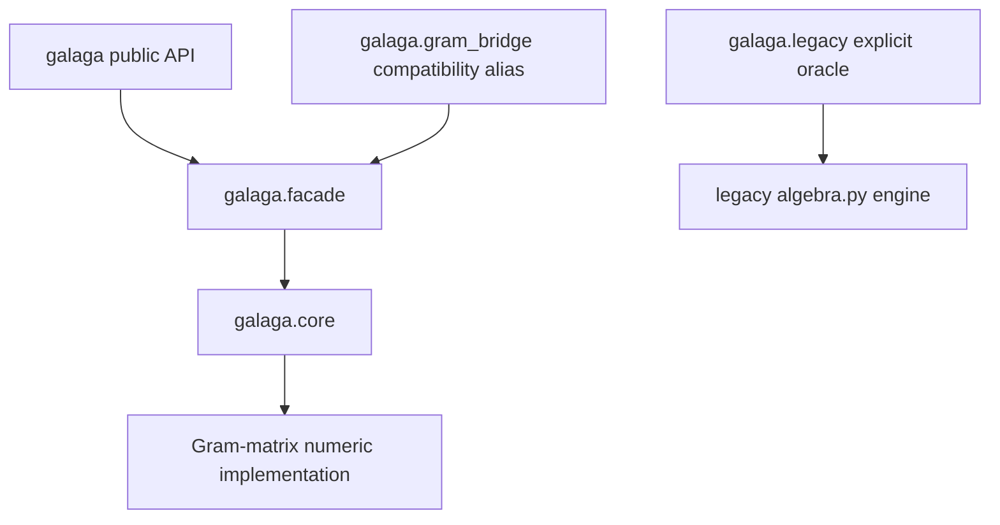
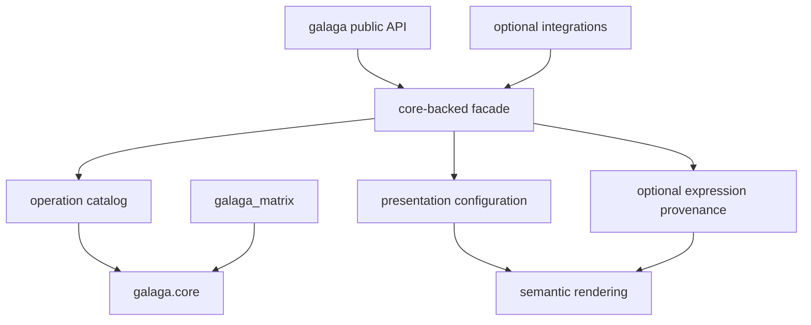

# Galaga 2 Core Cutover Plan

## Status and authority

This is the normative execution plan for replacing Galaga's legacy numeric
`Algebra` and `Multivector` with the composition facade over `galaga.core`, and
for completing the Galaga 2.0 changes above that numeric boundary.

The companion [presentation and expression layer plan](presentation-symbolic-layer-plan.md)
explains the target architecture. The
[numeric-algebra replacement roadmap](galaga-replacement-roadmap.md) records
remaining numeric capabilities. This document turns both into ordered,
testable work units with explicit exit gates.

The [migration engineering techniques](migration-engineering-techniques.md)
guide explains how the executable surface ledger, LibCST codemods,
architectural fitness tests, guarded facade contracts, and oracle-retirement
process make those gates enforceable.

Phases 0 through 7 are complete on the `galaga_v2` branch: the core,
replacement contract, facade, presentation, provenance, rendering,
compatibility, companion packages, and maintained examples all have their
replacement evidence. Phase 8 is complete: top-level Galaga exposes the
facade, the old engine remains an explicit guarded `galaga.legacy` oracle,
the full supported-version suites pass, and clean-wheel and performance
evidence are recorded. Phase 9 legacy removal is the next implementation
phase.

## Current position

The repository currently has four relevant numeric paths:


```mermaid
flowchart TD
    T[galaga public API] --> F[galaga.facade]
    B[galaga.gram_bridge compatibility alias] --> F
    O[galaga.legacy explicit oracle] --> L[legacy algebra.py engine]
    F --> C[galaga.core]
    C --> G[Gram-matrix numeric implementation]
```

- `galaga.core` contains the proven Gram-matrix numeric engine and its tests.
- `galaga.facade` owns the complete eager numeric composition facade and
  operation catalog.
- `galaga.gram_bridge` re-exports those exact objects as a temporary migration
  alias; it contains no implementation fork.
- top-level `galaga.Algebra` and `galaga.Multivector` are the exact facade
  classes, and the whole top-level manifest is identity-checked against
  `galaga.facade.__all__`;
- `galaga.legacy` preserves the coherent v1 surface only for ledgered oracle
  tests and deliberate migration work; plain `import galaga` does not load it;
- unledgered Galaga tests poison both legacy numeric constructors;
- the external `gram` distribution is no longer required by Galaga.

The intended end state is:


```mermaid
flowchart TD
    U[galaga public API] --> F[core-backed facade]
    F --> O[operation catalog]
    F --> P[presentation configuration]
    F --> E[optional expression provenance]
    O --> C[galaga.core]
    P --> R[semantic rendering]
    E --> R
    M[galaga_matrix] --> C
    A[optional integrations] --> F
```

The legacy multiplication tables and legacy numeric `Multivector` storage are
absent from the public execution path and can then be removed.

## Definition of done

Galaga 2.0 is ready when all of the following are true:

1. `galaga.Algebra` constructs a facade over exactly one `galaga.core.Algebra`.
2. `galaga.Multivector` wraps an immutable `galaga.core.Multivector`; no second
   coefficient array or multiplication table is maintained by the facade.
3. every public operation has one stable operation identifier and one numeric
   implementation path into the core or into an explicitly documented facade
   composition.
4. all applicable legacy numeric tests have been rerun against the facade,
   rather than merely passing against `galaga.algebra.Algebra`.
5. every deliberate v2 incompatibility has a specification, migration note,
   and direct regression test.
6. presentation, blade convention, notation, naming, and expression tracking
   can change independently without changing the numeric algebra.
7. expression tracking is optional provenance over eager numeric results and
   imposes no expression allocation on the numeric-only path.
8. companion packages consume public core or facade APIs rather than private
   legacy product tables.
9. the Python 3.11 wheel installs without a standalone `gram` package and
   contains no reachable legacy numeric engine. Only `galaga_marimo` requires
   Python 3.14.
10. the full test, documentation, coverage, package-build, and clean-install
    gates in this document pass.

## Delivery rules

These rules apply to every work unit:

- Keep migration additive until the shadow-cutover gate. Do not silently
  replace top-level exports while the facade suite is incomplete.
- Add tests to the layer that owns the behavior. Core mathematics belongs in
  `tests/core`; wrapping and propagation belong in facade tests; spelling and
  layout belong in presentation or rendering tests.
- A passing legacy test is not facade evidence unless the test is visibly
  parameterized over, or directly imports, the facade implementation.
- Prefer differential assertions against `galaga.core` to copied expected
  coefficient arrays. Use hand-computed values where they prove a convention.
- Do not preserve an accidental v1 behavior without classifying it. Each
  difference is either a compatibility requirement, a deliberate v2
  correction, a deprecated shim, or removed behavior.
- Do not add core primitives for operations that are clear compositions of
  existing primitives. Such conveniences belong in a helper or compatibility
  layer and are tested against their defining formula.
- Update the relevant specification and ADR with any decision that changes an
  architectural boundary or mathematical convention.
- Complete a work unit only when its implementation, required tests, and
  documentation evidence are all present.

## Required test matrix

Each phase selects the relevant rows and columns from this common matrix. A
phase may add cases; it must not silently narrow this baseline.

### Algebras

1. Euclidean orthogonal: `Cl(3, 0)`.
2. Indefinite orthogonal: `Cl(1, 3)`.
3. Degenerate orthogonal: `Cl(3, 0, 1)`.
4. Oblique positive-definite basis, for example
   `[[2.0, 0.5], [0.5, 1.0]]`.
5. Native-null conformal basis with a nonzero off-diagonal null pairing.

The oblique and native-null cases are mandatory wherever an operation claims
general Gram-matrix support. They prevent a facade that accidentally falls
back to diagonal-only assumptions.

### Numeric values

For each relevant algebra, cover:

- zero and nonzero scalars;
- basis and general vectors;
- simple and nonsimple bivectors;
- pseudoscalars;
- homogeneous higher-grade blades; and
- mixed-grade multivectors.

### Product backends

Exercise diagonal, packed general-Gram, lazy general-Gram, and dense-reference
backends wherever their documented dimension limits permit. Backend parity is
a core concern; facade tests should sample it without duplicating the entire
core suite.

### Execution modes

The replacement suite must visibly distinguish:

- direct `galaga.core` execution;
- facade execution without expression tracking;
- facade execution with expression tracking; and
- the legacy implementation, only while it remains a differential oracle.

### Python versions

- Python 3.11 is the required Galaga, `galaga_anywidget`, and `galaga_matrix`
  release target.
- Newer supported Python versions should run in CI as available.
- Python 3.14 is additionally required for `galaga_marimo` and its t-string
  tests; it must not raise the base Galaga requirement.

## Phase and gate summary

| Phase | Outcome | Status | Exit gate |
|---|---|---|---|
| 0 | Core lives inside Galaga | Complete | Core, bridge, full regression, and wheel checks pass |
| 1 | Replacement contract is exhaustive | Complete | Every legacy public behavior is classified |
| 2 | Numeric facade is complete | Complete | Facade results match direct core results |
| 3 | Legacy numeric suite runs on facade | Complete | All applicable numeric tests pass the facade |
| 4 | Presentation and presets are independent | Complete | Configuration and scope isolation tests pass |
| 5 | Expression provenance is rebuilt | Complete | Evaluation round trips and numeric-only isolation pass |
| 6 | Rendering and notation are rebuilt | Complete | Semantic, golden, and legacy/facade differential rendering tests pass |
| 7 | Companion packages and shims migrate | Complete | Integration and deprecation suites pass |
| 8 | Top-level API shadows the facade | Complete | Full suite reaches no legacy numeric path |
| 9 | Legacy engine is removed | Planned | Clean wheel and release gates pass |

## Phase 0: internalize the numeric core

This phase establishes the code ownership boundary. It does not replace the
top-level Galaga API.

### W0.1 Move the proven implementation

Deliverables:

- move the numeric implementation to `packages/galaga/galaga/core` without
  changing its mathematical behavior;
- migrate its unit tests to `packages/galaga/tests/core`; and
- retain the Gram matrix as the canonical metric representation.

Required tests:

- the complete migrated core suite passes under Python 3.11;
- core tests include diagonal, degenerate, oblique, and native-null metrics;
- backend differential tests still compare optimized products with the dense
  reference implementation.

### W0.2 Remove the external package dependency

Deliverables:

- the facade imports `galaga.core`;
- the package metadata and lock file do not require external `gram`; and
- the built wheel includes `galaga/core`.

Required tests:

- build the Galaga wheel;
- inspect wheel contents for all core modules;
- inspect wheel metadata and assert that no `gram` requirement remains; and
- install or import the wheel in a clean environment containing only declared
  dependencies.

### W0.3 Preserve the migration boundary

Deliverables:

- keep top-level `galaga.Algebra` on the legacy implementation;
- expose the first facade only through the opt-in bridge namespace; and
- record the consolidation and dependency direction in ADR-073.

Required tests:

- assert that top-level `Algebra` is still the legacy class during this phase;
- assert that bridge values wrap `galaga.core` values; and
- run the entire current Galaga suite to detect unintended regressions.

Phase 0 exit evidence recorded on 2026-07-18:

- 261 core tests passed, including migration-boundary tests;
- 18 bridge tests passed;
- the full Python 3.11 Galaga run passed with 2,657 tests and 17 skips; and
- the built wheel included `galaga.core` and no external `gram` dependency.

These numbers are a checkpoint, not permanent acceptance thresholds. Later
phases must increase the facade-specific evidence.

## Phase 1: define the replacement contract

Status: **complete (2026-07-19)**.

The purpose of this phase is to make the migration finite and auditable.

### W1.1 Inventory the public v1 surface

Deliverables:

- capture public exports from `galaga.__init__` and supported submodules;
- enumerate `Algebra` construction forms, properties, factories, formatting
  hooks, and configuration methods;
- enumerate `Multivector` properties, operators, methods, conversions, and
  formatting hooks;
- enumerate free operations, short aliases, deprecated spellings, expression
  node constructors, presets, and companion-package touch points; and
- identify public behavior currently supplied accidentally through private
  attributes.

Required tests:

- an export-contract test records the intentionally supported public names;
- constructor and operation signature tests cover positional, keyword, and
  invalid call shapes; and
- import smoke tests cover documented package entry points.

The inventory should be checked in as a migration matrix, not left in an issue
or in reviewer memory.

### W1.2 Classify every item

Assign every inventory row exactly one v2 owner and disposition:

- core primitive;
- facade primitive;
- presentation, blade, notation, expression, or rendering concern;
- helper expressed through other operations;
- temporary compatibility shim with a removal milestone;
- deliberate v2 correction; or
- removed API with migration guidance.

Required tests:

- a completeness test compares the live export set with the checked-in
  migration matrix;
- every temporary alias has reserved deprecation-warning text and an
  activation/removal milestone; the phase that installs each runtime shim adds
  the corresponding warning assertion; and
- every removed or corrected behavior has a direct negative or replacement
  test.

### W1.3 Freeze the deliberate v2 corrections

At minimum, the correction ledger must include:

- `commutator` and `lie_bracket` are unscaled `ab - ba`;
- `anticommutator` and `jordan_product` are unscaled `ab + ba`;
- `half_commutator` and `half_anticommutator` are the explicitly scaled forms;
- competing inner products remain explicitly named; no permanent ambiguous
  `inner_product` or `ip` convention is selected;
- exact mathematical equality is separate from `almost_equal`;
- `float(value)` succeeds only when the original value is scalar;
- `float(grade(value, 0))` extracts the scalar coefficient of any value;
- `scalar_part(value)` is, at most, an optional standalone helper and not a
  required member function;
- numeric coefficients are immutable from the public API;
- value naming and expression tracking do not mutate existing values;
- `lazy` and `symbolic` vocabulary is replaced with expression provenance;
- long, explicit operation names are primary, while short spellings are
  optional compatibility or user-selected import aliases; and
- product functions may accept variadic public calls only by immediate,
  deterministic lowering to tested binary operations.

Required tests:

- hand-computed bracket identities;
- scalar-conversion success and rejection cases;
- exact-equality, hashing, and approximate-comparison cases;
- data write-protection tests; and
- call-policy tests for zero, one, two, and several operands.

### W1.4 Characterize relied-upon legacy behavior

Add characterization tests only for undocumented behavior that real Galaga
code, examples, or companion packages rely on. Do not mechanically freeze
every implementation detail of `algebra.py`.

Required tests:

- tests cite the dependent public example, package, or migration-matrix row;
- exception types are asserted where callers use them as control flow; and
- formatting characterizations distinguish semantic content from incidental
  whitespace that the new renderer is expected to change.

### W1.5 Canonicalize operation names before test migration

Deliverables:

- make long, explicit functions the implementations and stable catalog IDs;
- retain selected short spellings only as same-object compatibility aliases;
- maintain one executable alias-to-canonical manifest;
- keep mathematical convention remaps out of the lexical rename process; and
- migrate source-derived tests in two stages so the original legacy file
  remains an unchanged oracle.

Required tests:

- every manifest alias is the same function object as its canonical target;
- every catalog entry uses a canonical identifier and no alias has a second
  entry;
- migrated core tests contain canonical names except in dedicated alias
  compatibility assertions; and
- original and migrated source suites pass together after each file moves.

ADR-074 defines the initial mappings: `gp` to `geometric_product`, `op` to
`outer_product`, and `involute` to `grade_involution`. Chisholm's half-scaled
bracket is a semantic mapping to `half_commutator`, not a rename.

Phase 1 exit gate:

- every v1 public item has an owner and disposition;
- every intentional incompatibility is listed in the correction ledger; and
- no later phase depends on an unrecorded private legacy structure.

Phase 1 exit evidence recorded on 2026-07-19:

- the checked-in
  [public API migration matrix](public-api-migration-matrix.md) and its
  executable manifest classify all 99 top-level exports, 28 `Algebra`
  members, 20 `Multivector` members, 22 declared multivector special methods,
  59 public expression classes, supported modules, companion touch points, and
  known private dependencies;
- completeness tests compare the manifest with the live v1 objects and fail
  on an unclassified addition or removal;
- constructor and operation-call manifests cover retained positional forms,
  new explicit metric forms, invalid conflicts, variadic products, and binary
  explicit inner products;
- the correction ledger has direct core, facade, and compatibility tests for
  bracket scaling, strict scalar conversion, exact equality and hashing,
  immutable data, standalone scalar extraction, and deterministic folds; and
- `galaga_matrix`, `galaga_mermaid`, and example dependencies on private v1
  state have explicit Phase 7 replacement targets.

## Phase 2: complete the numeric facade

Status: **complete (2026-07-19)**.

This phase produces a full eager numeric replacement before names,
expressions, or rendering are attached.

### W2.1 Stabilize facade ownership and naming

Deliverables:

- promote the bridge code to its intended internal facade modules;
- keep `galaga.gram_bridge` as a temporary import alias if it is useful during
  migration; and
- make the dependency direction facade to operation catalog to core explicit.

Required tests:

- import-cycle tests import core, facade, and the temporary bridge in both
  orders;
- `galaga.core` imports no facade, expression, presentation, or rendering
  module; and
- the temporary namespace re-exports the same implementation objects rather
  than maintaining a fork.

### W2.2 Complete `Algebra` construction and metadata

Deliverables:

- support the accepted signature, `p, q, r`, diagonal, and full-Gram
  construction forms;
- forward immutable Gram and metric metadata;
- define algebra compatibility and identity rules;
- provide scalar, vector, blade, basis-vector, basis-blade, pseudoscalar, and
  arbitrary-coefficient factories; and
- expose supported public linear-action facilities without leaking backend
  tables.

Required tests:

- constructor parity and validation across the algebra test matrix;
- symmetry, shape, finiteness, and dimension errors;
- read-only metadata and defensive-copy behavior;
- factory coefficient and algebra-identity assertions; and
- equivalent-versus-distinct algebra compatibility cases.

### W2.3 Complete the eager `Multivector` contract

Deliverables:

- immutable numeric wrapping with `.numeric`, `.algebra`, `.data`, grade, and
  coefficient access;
- scalar coercion for valid arithmetic positions;
- checked `float`, `abs`, exact equality, hashing, `almost_equal`, and useful
  eager `repr`; and
- all supported Python operators mapped to named operations.

Required tests:

- constructor length, dtype, finiteness, and algebra mismatch errors;
- scalar, vector, blade, pseudoscalar, and mixed-grade access tests;
- left- and right-hand scalar operator tests;
- `NotImplemented` and resulting `TypeError` behavior for unsupported types;
- equality and hash consistency, including presentation-free wrappers around
  equal core values; and
- proof that `.data` cannot mutate the wrapped value.

### W2.4 Complete the operation catalog

Deliverables:

- declare every facade primitive once with a stable long-form identifier;
- include structural arithmetic, products, contractions, explicit inner
  products, involutions, dualities, RGA operations, grade selection,
  predicates, inverse, norm operations, sandwich, and numeric functions;
- distinguish evaluator arity from public call policy; and
- keep aliases outside the canonical catalog entry.

Required tests:

- catalog identifiers are unique and immutable;
- every exported primitive resolves to exactly one catalog entry;
- every catalog entry has a callable evaluator with tested arity;
- operator bindings agree with named operations; and
- every wrapped result belongs to the expected facade algebra.

### W2.5 Define and test variadic lowering

Deliverables:

- make `geometric_product` and `outer_product` accept one or more operands;
- lower calls immediately to a binary left fold;
- leave contractions, inner products, brackets, and nonassociative operations
  binary; and
- document whether any later associative operation gains the same policy.

Required tests:

- zero arguments raise a clear `TypeError`;
- one argument returns the original value without numeric work;
- two arguments invoke the core primitive once;
- `f(a, b, c)` equals `f(f(a, b), c)` and invokes the core twice; and
- algebra mismatch is detected at the first incompatible fold edge.

### W2.6 Validate direct-core parity

For every numeric facade operation, compare the unwrapped facade result with
the direct core result using the same inputs.

Required tests:

- table-driven parity over all catalog operations and relevant value grades;
- every general-metric operation includes an oblique or native-null case;
- domain errors from inverse, logarithm, square root, and normalization are
  preserved or deliberately translated and documented; and
- the untracked path allocates no expression or rendering object.

Phase 2 exit gate:

- every numeric inventory row is implemented or explicitly classified out;
- catalog coverage is complete;
- unwrapped facade results match direct core results over the required matrix;
  and
- no facade operation reads a private core product table.

Phase 2 exit evidence recorded on 2026-07-19:

- `galaga.facade` owns the eager wrappers and immutable operation catalog;
  ADR-075 records the boundary and `galaga.gram_bridge` is an exact-object
  compatibility re-export;
- import-order and source-boundary tests enforce bridge-to-facade-to-core
  dependency direction and prevent core dependencies on outer Galaga layers;
- construction covers the v1 positional signature and `p, q, r` forms plus
  `signature=`, `sig=`, and `gram=`, with immutable metric metadata and public
  linear actions;
- the facade catalog classifies every public core name, exposes every canonical
  numeric operation once, and keeps its same-object aliases outside the
  catalog;
- direct-core parity covers binary, unary, parameterized, scalar, and domain
  operations on oblique metrics, with native-null construction and metadata
  coverage;
- geometric and outer products are tested as one-or-more-operand deterministic
  left folds, including evaluator call counts and mismatch behavior; and
- the Phase 1, facade, and namespace compatibility suites pass 152 focused
  tests at 98% facade branch coverage, while the broader Phase 3 evidence
  remains independently guarded against legacy construction;
- the full Galaga suite passes 2,359 tests with 19 skips, and the Python 3.11
  Galaga, matrix, and Mermaid run passes 2,733 tests with 19 skips; and
- the built Galaga 2.0 wheel contains `galaga.facade`, `galaga.core`, and the
  thin bridge shims, and imports them with the required object identity.

## Phase 3: run the legacy numeric contract against the facade

Status: **complete (2026-07-18)**.

This is the phase that turns the historical Galaga suite into evidence for the
new implementation. It is distinct from running all tests while top-level
Galaga still points at the old implementation.

### W3.1 Partition the existing tests by concern

Classify existing tests as:

- numeric algebra and multivector contracts;
- expression provenance;
- notation, blade convention, or rendering;
- compatibility behavior; or
- companion-package integration.

The checked, file-and-class-level starting inventory is in
[Numeric test migration inventory](numeric-test-migration-inventory.md). It
identifies the Chisholm, Cohoe, Terathon, low-dimensional, quaternion,
general numeric, and RGA cases that should move or merge into `tests/core`, as
well as the mixed files that must be split rather than copied wholesale.

Required tests:

- collection markers or directory structure make the classification visible;
- no numeric test is excluded merely because it currently imports the legacy
  class; and
- mixed tests are split when that gives each layer a clear oracle; and
- collected legacy test IDs are reconciled against the migration inventory so
  every existing test has a recorded destination or an explicit retirement
  reason.

### W3.2 Parameterize numeric contract tests

Extract implementation-neutral contract tests that can construct both the
legacy implementation and the facade during migration. Prefer public factory
fixtures or protocol adapters to monkeypatching module globals.

Required tests:

- algebra construction, factories, operators, grade operations, products,
  involutions, dualities, inverse, predicates, norms, and numeric functions run
  against the facade;
- the test report or test IDs visibly identify the implementation under test;
  and
- tests do not reach through `.numeric` except where direct-core parity is the
  purpose of the test.

### W3.3 Reconcile differences explicitly

For each failure, choose one of three outcomes:

1. fix a facade parity defect;
2. add a deliberate v2 correction test and migration note; or
3. classify the behavior as a presentation or expression concern for a later
   phase.

Required tests:

- no unexplained `xfail` or broad skip hides a facade difference;
- every correction-ledger item has separate legacy and v2 expectations where
  the behaviors differ; and
- every fixed defect gains the smallest regression test that reproduces it.

### W3.4 Add differential property coverage

Use deterministic generated examples to compare legacy diagonal behavior and
direct-core versus facade behavior. Generated tests complement, but do not
replace, convention examples.

Required tests:

- seeded mixed-grade operands over several dimensions;
- product, linearity, involution, duality, and grade identities within their
  documented domains;
- diagonal facade results match retained v1 behavior except for ledgered
  corrections; and
- general-Gram facade results match direct core because the legacy engine is
  not an oracle there.

Phase 3 exit gate:

- every applicable legacy numeric test runs against and passes the facade;
- the suite reports facade cases distinctly;
- remaining legacy-only tests are mapped to later presentation, expression,
  compatibility, or integration work; and
- the correction ledger explains every intended numeric difference.

Completion evidence is recorded in
[Numeric test migration inventory](numeric-test-migration-inventory.md#t5-remove-legacy-only-numeric-tests).
The shared contract reports separate `legacy-v1` and `core-facade-v2` cases,
the direct facade suite and every facade-only shared case install a constructor
guard against `galaga.algebra.Algebra`, and the redundant v1 numeric suites
have been deleted or split by ownership. The remaining legacy tests specify
presentation, expression provenance, compatibility, or integration behavior;
they are not being used as hidden numeric-core oracles.

## Phase 4: rebuild presentation configuration and presets

This phase adds human-facing algebra configuration without contaminating
numeric identity.

### W4.1 Define immutable configuration models

Deliverables:

- separate blade convention, notation, local-name policy, display order, and
  display policy types;
- define an immutable presentation grouping those components; and
- allow every component to be overridden independently.

Required tests:

- replacing notation leaves blades, locals, display order, and numeric algebra
  unchanged;
- replacing blades leaves notation and the numeric algebra unchanged;
- configuration objects are immutable, comparable, and reusable; and
- incompatible dimensions or incomplete conventions fail at construction.

### W4.2 Implement signed blade references and conventions

Deliverables:

- map numeric bitmasks to display labels, signed lookup aliases, semantic role
  aliases, local Python names, and display order;
- distinguish a signed alias from a basis change; and
- validate collisions and completeness.

Required tests:

- lookup round trips for positive and negative aliases;
- aliases never alter the wrapped core coefficients except for their declared
  sign;
- duplicate local names, invalid masks, missing labels, and ambiguous aliases
  are rejected; and
- conventions cover Euclidean, spacetime, conformal orthogonal, conformal
  native-null, and RGA examples.

### W4.3 Implement preset configuration classes

Deliverables:

- presets can define the numeric algebra as well as presentation, for example
  a 3D conformal preset defining five basis vectors and its Gram matrix;
- presets are classes or immutable objects, not magic string branches;
- explicit constructor arguments override individual preset components; and
- users can still build every component without a preset.

Required tests:

- preset expansion equals the corresponding explicit algebra and presentation
  construction;
- `spatial_dim` and other preset parameters validate dimensions;
- each component override changes only that component;
- conflicting numeric overrides fail clearly; and
- two algebras created from the same preset do not share mutable state.

### W4.4 Add numeric value factories and lookup

Deliverables:

- facade factories apply blade and local-name policies while constructing core
  values;
- `blade`, `basis_vectors`, `basis_blades`, `pseudoscalar`, and `locals` have
  documented naming and expression defaults; and
- the numeric identity of each produced value remains independently testable.

Required tests:

- factory outputs unwrap to the expected bitmask coefficients;
- display and local names match the selected convention;
- returned mappings do not expose mutable shared state; and
- invalid lookup names report available or expected forms clearly.

### W4.5 Make temporary presentation overrides context-safe

Deliverables:

- `alg.use_presentation(teaching_presentation)` provides a scoped override;
- nested scopes restore the previous value;
- implementation uses context-local state, such as `contextvars`, rather than
  a mutable process global; and
- an explicit presentation argument on a render call has highest precedence.

Required tests:

- normal and exceptional context-manager exits restore state;
- nested contexts restore in last-in, first-out order;
- two OS threads can render the same algebra with different presentations;
- two interleaved async tasks retain independent presentations; and
- changing presentation never changes equality, hashing, or numeric results.

Phase 4 exit gate:

- presets and fine-grained overrides coexist;
- presentation can change temporarily in thread- and async-safe scopes; and
- all blade and preset examples unwrap to independently verified core values.

Status: **complete (2026-07-19)**.

Implementation is decomposed in the
[presentation configuration overview](presentation-configuration.md), and
ADR-076 records the immutable-component, signed-reference, preset-expansion,
and context-local decisions. The dedicated presentation suite contains 62
behavior and validation tests. The combined presentation, facade, and
compatibility run passes 214 tests; measured branch coverage is 100% for
`galaga.names`, 97% for `galaga.blades`, 100% for `galaga.presentation`, 97%
for `galaga.presets`, and 98% for `galaga.facade._numeric`.

## Phase 5: rebuild optional expression provenance

Expressions describe how an eager result was obtained. They do not replace
numeric evaluation.

Status: complete on `galaga_v2`. The implementation is decomposed in the
[expression provenance overview](expression-provenance.md), and ADR-077 records
the optional eager-provenance, catalog-schema, generic-node, left-fold, and
structural-simplification decisions. The dedicated expression suite covers
every catalog operation and the orthogonal, degenerate, oblique, and
native-null round-trip matrix. The untracked-path test replaces every
expression constructor with a failing spy, making zero expression-node
construction an executable contract. The dedicated suite contains 154 tests;
the combined expression, facade, presentation, and namespace run contains 354
tests. Branch coverage is 100% for every `galaga.expression` implementation
module and 95% for both `galaga.facade._numeric` and
`galaga.facade.catalog` in that focused run.

### W5.1 Define the immutable expression model

Deliverables:

- immutable symbol, scalar literal, blade literal, multivector literal, and
  generic call nodes;
- call nodes store the stable operation identifier, operands, and normalized
  parameters; and
- compatibility node classes, if retained, are constructors for generic calls
  rather than a second operation registry.

Required tests:

- structural equality and hashing for every node kind;
- invalid operation identifiers, operand counts, or parameters are rejected;
- node construction imports no numeric implementation directly; and
- expression nodes remain independent of output format.

### W5.2 Make name and expression state independent

Deliverables:

- facade values expose optional read-only `.name` and `.expr` state;
- `named`, `unnamed`, `with_expr`, and `without_expr` return new values; and
- the four named/unnamed and tracked/untracked states are supported.

Required tests:

- every transition returns a new wrapper and preserves the core value;
- naming does not attach an expression to the named value;
- removing a name does not remove an expression;
- removing an expression does not remove a name; and
- mathematical equality and hashing ignore both fields.

### W5.3 Route facade operations through one dispatch path

Deliverables:

- every operation evaluates its numeric result exactly once;
- a call node is added when an operand is named, tracking propagates from an
  operand, or tracking is explicitly requested; and
- named operands start provenance as symbol leaves when they participate in
  a call.

Required tests:

- spies prove one numeric evaluator call per binary edge;
- the untracked path constructs no expression node;
- tracked and untracked results have identical core values;
- unary, binary, parameterized, scalar, and predicate operations propagate
  according to their declared rules; and
- a tracked later operand in a variadic product retains the earlier untracked
  operands in the lowered expression tree.

### W5.4 Evaluate expressions through the catalog

Deliverables:

- expression evaluation resolves stable identifiers through the catalog;
- leaves resolve through an explicit environment; and
- evaluation does not depend on renderer classes or legacy expression methods.

Required tests:

- evaluating every operation-node family reproduces the stored eager value;
- round trips cover orthogonal, degenerate, oblique, and native-null algebras;
- missing symbols and algebra mismatches fail clearly; and
- variadic source calls evaluate with the same left association as the numeric
  path.

### W5.5 Limit simplification to proven structural rules

Deliverables:

- implement only identity removal, literal folding, or associative visual
  flattening that preserves operation semantics; and
- defer general geometric-algebra simplification.

Required tests:

- every simplification preserves expression evaluation;
- noncommutative operand order is never changed;
- nonassociative operations are never flattened; and
- simplification is deterministic and idempotent.

Phase 5 exit gate:

- every catalog operation has expression-propagation coverage;
- stored eager results equal evaluated expressions across the required matrix;
  and
- expression support has a measured zero-allocation path when disabled.

## Phase 6: rebuild notation and rendering

Status: **complete (2026-07-19)**.

Rendering consumes values or expression trees and a presentation. It never
performs geometric-algebra computation.

### W6.1 Define a semantic render tree

Deliverables:

- format-neutral nodes for identifiers, literals, sums, products, fractions,
  powers, calls, postfix operations, grouping, and teaching equalities;
- one precedence and associativity model; and
- translations from numeric values and expression nodes into that tree.

Required tests:

- each expression node produces the expected semantic tree;
- renderer construction makes no numeric operation call;
- precedence metadata is complete for every notation rule; and
- unknown operation identifiers fail before emitter selection.

### W6.2 Implement notation as presentation data

Deliverables:

- notation rules are keyed by stable operation identifier;
- functional long names are the canonical fallback;
- optional short functional forms and infix or postfix teaching forms are
  presentation choices; and
- Hestenes, Doran–Lasenby, Lengyel/RGA, and other presets can spell the same
  operation differently without changing it.

Required tests:

- changing notation leaves expression identity and numeric value unchanged;
- every catalog operation has a fallback rendering;
- competing inner-product identities remain distinct, and explicit teaching
  presets render them distinguishably; and
- primary long-form and optional short functional output are both covered.

### W6.3 Implement ASCII, Unicode, and LaTeX emitters

Deliverables:

- all emitters consume the same semantic tree;
- format-specific escaping and glyph selection stay in the emitter; and
- rich display hooks delegate to the same public rendering pipeline.

Required tests:

- a compact operation-by-format-by-preset matrix covers every semantic node;
- carefully chosen golden tests cover public examples and ambiguous
  parenthesization;
- Unicode and LaTeX escaping cover names, subscripts, signs, and fractions;
- `repr`, `str`, `format`, `latex`, and rich hooks agree on content policy; and
- no emitter imports the legacy numeric implementation.

### W6.4 Separate content policy from target format

Deliverables:

- independently select value, name, expression, or teaching equality content;
- independently select ASCII, Unicode, or LaTeX output; and
- define precedence among explicit call overrides, scoped presentation, and
  algebra defaults.

Required tests:

- every meaningful content/format combination;
- explicit override precedence;
- scoped teaching-presentation examples;
- sensible fallback when a name or expression is absent; and
- thread and async isolation inherited from Phase 4.

Phase 6 exit gate:

- all public rendering routes pass through the semantic tree;
- the precedence suite proves unambiguous output; and
- changing notation or target cannot change expression evaluation or numeric
  coefficients.

Phase 6 exit evidence recorded on 2026-07-19:

- `galaga.rendering.tree` owns one immutable semantic model and one
  precedence/associativity algorithm for values and expressions;
- expression calls validate stable catalog IDs without invoking numeric
  evaluators, while concrete values honor signed blade labels and display
  order;
- immutable generic and target-specific `RenderRule` values provide complete
  long functional fallback, optional short functions, and conventional,
  Doran-Lasenby, Hestenes, and Lengyel/RGA presets;
- competing inner products are distinct in explicit teaching presets and in
  functional output; default LaTeX deliberately retains Galaga 1's shared dot
  glyph for its Hestenes and Doran-Lasenby operations while their stable IDs
  remain distinct;
- ASCII, Unicode, and LaTeX emitters cover every node family and import no
  legacy numeric or rendering implementation;
- `galaga.display` independently resolves content and target with explicit,
  scoped, and persistent precedence, and every facade display hook delegates
  to it;
- signed RGA blades, ambiguous precedence cases, compact/scalable delimiters,
  default-parameter elision, source-order provenance, target escaping, and
  async presentation isolation have dedicated structural and golden tests;
- the live-algebra differential audit compares expression, value, full,
  rich-display, and coefficient channels; its first checked report covers 73
  expressions and all 45 operation IDs shared by the legacy and facade
  catalogs; reviewer-guided remediation increased exact matches from 16 to 65,
  with eight accepted differences classified in the executable ledger; and
- focused Ruff and Pyrefly validation passes. The architecture and ownership
  are recorded in
  [Semantic rendering implementation](rendering-implementation.md) and
  [ADR-078](../adrs/078-shared-semantic-rendering-pipeline.md). The
  [rendering parity guide](rendering-parity.md) records the differential
  command, report format, and review workflow.

## Phase 7: migrate compatibility and companion packages

### W7.1 Add audited compatibility aliases

Status: **complete (2026-07-19)**.

Deliverables:

- preserve only migration-critical short operation names and old import paths;
- emit actionable deprecations for names scheduled for removal; and
- recommend ordinary user import aliases for personal concise notation.

Required tests:

- an alias invokes the same catalog operation as its long form;
- warning category, message, and stack level are asserted;
- documentation contains a replacement for every deprecated public name; and
- removed ambiguous products fail with guidance toward explicit variants.

Completion evidence:

- the eight permanent concise aliases are exact canonical function objects and
  remain outside the operation catalog;
- six temporary v1 spellings are warning adapters recorded by the immutable
  `DEPRECATED_OPERATION_ALIASES` manifest;
- warning category, ledgered message, and user-callsite stack level are tested,
  and tracked calls retain the canonical operation ID;
- `ip` and `inner_product` remain absent and raise guidance listing the
  explicit inner-product and contraction families;
- all three `galaga.gram_bridge` import paths warn with their ledgered
  replacements while preserving imports; and
- [Compatibility shims](compatibility-shims.md) is executable documentation:
  tests require it to name every temporary alias and bridge replacement.

### W7.2 Reimplement helpers by composition

Status: **complete by classification (2026-07-19); no new helpers added**.

The user-directed Galaga 2 constraint is stronger than the original candidate
list: do not add a helper merely because it is a short expression of existing
operations. An explicit rotor constructor duplicates `exp`; generic project,
reject, and reflect functions likewise add no numeric capability without a
model-specific domain contract. They remain legacy compatibility inputs rather
than being copied into the facade. A future helper is justified only when it
materially clarifies a geometry model or validates metadata.

Candidates include projection, rejection, reflection, rotor conveniences, and
domain-specific geometry constructors. Add only helpers that materially improve
clarity or validate domain metadata.

Required tests:

- each helper equals its documented composition of primitives;
- helpers work for all advertised metric classes;
- degenerate or noninvertible domains fail clearly; and
- no duplicate numeric algorithm or multiplication table appears in a helper.

No facade helper was introduced, so the applicable gate is the executable
surface ledger plus a repository check that no duplicate implementation was
added. Phase 8 removal guidance will point users to explicit compositions or a
future model-specific API rather than a generic numeric-core primitive.

### W7.3 Migrate `galaga_matrix`

Status: **complete (2026-07-19)**.

Deliverables:

- use public left-action or representation APIs;
- classify algebras using inertia and Gram metadata;
- support general-Gram left-regular representations;
- reject unsupported compact general-Gram representations explicitly until a
  validated basis transform is implemented; and
- remove access to `_mul_index`, `_mul_sign`, or equivalent legacy tables.

Required tests:

- diagonal compact behavior remains compatible;
- left-regular matrices reproduce facade geometric products;
- oblique and native-null matrices satisfy generator anticommutators matching
  the supplied Gram matrix;
- round trips preserve coefficients where supported; and
- repository searches and import tests find no private-table dependency.

Completion evidence:

- `galaga_matrix` imports the Galaga 2 facade types and materializes native
  left-regular matrices through public `Algebra.left_action`;
- a temporary v1 path builds representation columns through public geometric
  products and contains no multiplication-table access;
- mode selection uses inertia and the stored Gram matrix, so general and
  degenerate metrics select left-regular mode without asking for a lossy
  signature tuple;
- oblique and native-null generator matrices satisfy
  `L(e_i)L(e_j) + L(e_j)L(e_i) = 2 G_ij I`;
- general-Gram facade values round-trip their coefficients and normalized
  diagonal compact products retain existing behavior;
- compact mode rejects nonorthogonal and scaled metrics with a direct
  `left-regular` replacement; and
- source-level architecture tests forbid `_mul_index`, `_mul_sign`, and legacy
  numeric type imports;
- all 347 matrix tests pass, and the combined Python 3.11 Galaga, matrix, and
  Mermaid gate passes 3,147 tests with 19 skips; and
- the `galaga-matrix` 2.0 wheel and sdist build with a `galaga>=2.0.0`
  dependency. See [Matrix migration](matrix-migration.md) and
  [ADR-080](../adrs/080-matrix-representations-use-public-linear-actions.md).

### W7.4 Migrate examples and optional integrations

Status: **complete (2026-07-19)**.

Deliverables:

- update documented examples to the core-backed public API;
- migrate Marimo integration without raising Galaga's base Python version;
- keep Mermaid or other experimental rendering integrations optional; and
- document direct `galaga.core` use versus full facade use.

Required tests:

- executable documentation and example smoke tests;
- base Galaga imports without optional extras;
- `galaga_anywidget` passes under Python 3.11;
- `galaga_marimo` passes under Python 3.14;
- optional integrations fail gracefully when their dependencies are absent;
  and
- installed-wheel imports, rather than source-tree accidents, are exercised.

Completed so far:

- `galaga_mermaid` 0.2 traverses only public immutable expression nodes,
  requires an explicit presentation for standalone provenance, and makes
  numeric node annotations explicitly algebra/environment-driven;
- `galaga_marimo` 2.0 continues to require Python 3.14 without raising the
  base package requirement, renders through public `.latex()`/`.display()`
  hooks, and recognizes values through immutable public names;
- `galaga_anywidget` 2.0 owns AnyWidget dependencies and browser assets,
  consumes public `ConformalModel` semantics, and supports Python 3.11;
- Marimo content format specifications select `name`, `expr`, `value`, or
  `full` independently of inline/block markdown layout;
- four maintained Python 3.11 examples execute direct-core, facade,
  context-local presentation, and native general-Gram workflows; and
- architecture tests prohibit the retired Mermaid expression hierarchy and
  private multivector name/expression access; and
- locally built adapter wheels install beside the Galaga 2 wheel in isolated
  Python 3.11 and 3.14 environments and pass import/protocol smoke checks
  without repository `PYTHONPATH`;
- `MatrixRepr` now records matrix-domain operations in frozen,
  `galaga_matrix`-owned expression nodes, adapts public Galaga expressions with
  an explicit presentation, snapshots leaf matrices as read-only arrays, and
  reads no private multivector name or expression state;
- all 392 `galaga_matrix` tests pass under Python 3.11, including expression
  immutability, evaluation, public facade conversion, and source-architecture
  gates; and
- the final combined Python 3.11 Galaga, matrix, and Mermaid gate passes 3,174
  tests with 21 skips, while the Python 3.14 Marimo and maintained-notebook
  gate passes 110 tests;
- the 68 maintained Marimo notebooks are an executable allowlist in
  `tools.migrate_v2_notebooks`, and the codemod refuses to write any other
  example path;
- those notebooks now import the promoted `galaga` API, use eager values with optional
  `expr=True` provenance, use immutable `.named()`, and select `:expr` or
  `:value` at the display site rather than calling `.reveal()` or `.eval()`;
- matrix and quaternion render objects retain their package-owned `.name()`
  protocol, covered by codemod negative-space tests;
- removed `project`, `reject`, and `reflect` helpers are written as explicit
  contraction, inverse, subtraction, and sandwich compositions in teaching
  notebooks rather than being reintroduced into the facade;
- Python 3.14 compiles every ledgered notebook without LaTeX escape warnings,
  Marimo validates every cell dependency graph, and all 68 notebooks execute
  headlessly with zero failed cells; and
- Python 3.11 runs the ledger and codemod architecture tests while explicitly
  skipping only the t-string compile and runtime gates.

See [Integration migration](integration-migration.md) and
[ADR-081](../adrs/081-optional-integrations-consume-public-protocols.md). The
matrix provenance boundary is recorded separately in
[ADR-082](../adrs/082-matrix-provenance-is-package-owned.md), and the notebook
gallery gate in
[ADR-083](../adrs/083-maintained-notebooks-are-executable-integration-contracts.md).

Phase 7 exit gate:

- no supported companion package reads legacy numeric internals;
- every compatibility shim is tested and has a removal policy; and
- all maintained examples execute against the facade.

All three conditions are satisfied. Phase 8 is complete; its individual work
units and validation evidence follow.

## Phase 8: shadow and perform the top-level cutover

This phase changes what ordinary `import galaga` users receive.

### W8.1 Make the legacy engine explicitly private

Status: complete. `galaga.legacy` is the explicit temporary v1 domain, with
its conflicting renderer and simplifier under that namespace.

Deliverables:

- move or alias the old implementation behind a clearly private migration
  namespace;
- remove internal imports that accidentally select it; and
- keep it available only as a temporary test oracle until the shadow gate is
  complete.

Required tests:

- import-identity tests distinguish private legacy and public facade classes;
- internal modules import the intended public or core layer explicitly; and
- static searches enumerate every remaining legacy reference.

### W8.2 Run a facade-only shadow suite

Status: complete. An executable ledger opts oracle tests in; every other
Galaga test poisons legacy `Algebra` and `Multivector` construction.

Before changing exports, run the entire applicable suite with a guard that
fails if legacy `Algebra` or `Multivector` is constructed.

Required tests:

- all numeric, presentation, expression, rendering, compatibility, and
  integration tests execute with the guard enabled;
- no monkeypatch merely changes the class name while leaving legacy helpers in
  the execution path; and
- coverage demonstrates facade and core execution, not legacy table execution.

### W8.3 Switch top-level exports

Status: complete. `galaga.__all__` follows `galaga.facade.__all__`, every
object has identity with its facade owner, and maintained notebooks use the
promoted namespace.

Deliverables:

- `galaga.Algebra` and `galaga.Multivector` become the facade classes;
- long-form operations are the primary top-level functions;
- accepted compatibility aliases point to catalog-backed adapters; and
- package documentation describes the new construction and configuration API.

Required tests:

- public import-contract tests assert facade object identity;
- the full suite runs without an alternate import fixture;
- old documented import forms either work with tested warnings or fail with
  migration guidance; and
- objects constructed through all public paths interoperate under the defined
  algebra compatibility rule.

### W8.4 Validate packaging and performance

Status: complete. A wheel built from the source distribution installs into an
isolated Python 3.11 environment and passes API and numeric smoke tests under
isolated Python, with neither the checkout nor an external `gram` package
available. The [performance baseline](phase8-performance.md) separates direct
core, untracked facade, tracked facade, and retained-v1 costs. Investigation
of the original diagonal-product regression identified non-native NumPy index
storage; native `intp` storage reduced direct-core Cl(1,3) geometric product
from about 1.98× to 1.08× the retained engine on the recorded machine.

Required tests:

- build and install a wheel in a clean Python 3.11 environment;
- run package smoke tests against the installed wheel;
- verify no undeclared source-tree or external `gram` import is required;
- compare representative diagonal operations with recorded v1 baselines;
- record facade overhead separately from core product performance; and
- investigate regressions beyond the accepted budget before release.

Phase 8 exit gate:

- top-level Galaga exclusively constructs the facade;
- the full suite passes with a hard failure on legacy numeric execution;
- clean-wheel and companion-package tests pass; and
- any accepted performance tradeoff is measured and documented.

All four conditions are satisfied. The Python 3.11 Galaga, matrix, and Mermaid
suite passes with the legacy-construction guard active; the Python 3.14 full
package suite additionally executes the Marimo/t-string integrations.

## Phase 9: remove the legacy engine and harden the release

### W9.1 Delete legacy numeric storage and tables

Status: **in progress**. Nineteen legacy-dependency prerequisites are complete:

- the 73-case rendering parity audit uses captured v1 observations instead of
  importing the legacy engine, and independently pins reviewed v2 outputs
  ([ADR-092](../adrs/092-frozen-historical-rendering-oracles.md));
- the live benchmark measures only v2 layers, validates them against untimed
  core-reference and exterior-grade oracles, and preserves the historical
  Phase 8 measurements
  ([ADR-093](../adrs/093-benchmarks-use-core-reference-oracles.md));
- matrix conversion requires public v2 metric metadata, linear actions,
  factories, and immutable naming without v1 compatibility fallbacks
  ([ADR-080](../adrs/080-matrix-representations-use-public-linear-actions.md));
- the exact compound, STA, and RGA rendering suites execute only the facade.
  Their 32 historical compound observations and 26 RGA notation entries are
  archived, all 34 v2 full-LaTeX cases remain live, and numeric samples are
  checked after algebraically deriving any semantic basis transport
  ([ADR-084](../adrs/084-exact-configured-rendering-contracts.md));
- the seven shared numeric protocol tests now construct the facade directly.
  All 146 seeded v1 operation observations remain as captured data, checked
  against both current facade and forced core-reference results. Independent
  left-action and grade-law checks preserve the intentional v2 corrections
  ([ADR-094](../adrs/094-numeric-contracts-outlive-the-legacy-engine.md));
- compatibility-manifest completeness uses captured v1 API observations
  instead of importing the old classes or expression module. The full module
  disposition ledger distinguishes 15 live v2 entry points from 21 legacy-only
  paths, while current facade behavior and package-file classification remain
  live checks
  ([ADR-096](../adrs/096-compatibility-manifests-use-historical-api-evidence.md));
- concrete display-order and numeric-formatting contracts now run against the
  public facade. Eleven archived samples preserve v1 coefficients and output;
  current tests distinguish native basis enumeration and significant-digit
  display policies from legacy-only behavior without changing production code
  ([ADR-097](../adrs/097-concrete-display-contracts-outlive-legacy-rendering.md));
- numeric-function provenance and parenthesization contracts now use the
  public facade. All 29 original scenarios retain archived v1 observations;
  exact three-target grouping, explicit replay, and Gram-derived rotor roots
  are tested without changing production behavior
  ([ADR-098](../adrs/098-expression-contracts-outlive-legacy-provenance.md));
- the remaining symbolic suite uses facade values, explicit replay, and
  structural simplification. Its representative v1 observations remain as
  data; nonzero probes distinguish old half-scaled Lie/Jordan products from
  v2. The four ledgered unary properties are now implemented and tested
  ([ADR-099](../adrs/099-symbolic-contracts-and-curated-unary-properties.md));
- the symbol-conversion suite retains all 108 original tests using the public
  `galaga.names` converter and an explicit `Name.from_latex` factory.
  Exhaustive Unicode checks correct font offsets and reject unsupported
  input; naming is checked against Gram-derived products and explicit replay
  ([ADR-100](../adrs/100-explicit-bounded-latex-name-conversion.md));
- notation contracts now exercise immutable public rules and actual facade
  rendering. The original 239 cases retain captured ownership and evidence;
  unit-fraction teaching layout is restored, and the Hestenes preset's
  LaTeX dagger override is fixed
  ([ADR-101](../adrs/101-immutable-notation-contracts-and-unit-fraction-layout.md));
- the LaTeX pipeline suite now uses public expressions and semantic nodes.
  All 112 original tests retain source evidence and live class ownership;
  command separation, nested scripts, and compound label scope are fixed in
  the emitter without changing values or provenance
  ([ADR-102](../adrs/102-latex-contracts-and-script-safe-spelling.md));
- all 141 mixed-precedence rendering test identities now use public
  expressions. Their archived bindings and numeric results remain live replay
  contracts; nonzero mixed-grade compositions check all three targets with
  reference-backend and grade-law oracles, without production changes
  ([ADR-103](../adrs/103-mixed-rendering-contracts-with-numeric-ownership.md));
- all 107 blade-convention cases now use the public facade, retaining every
  historical method identity and complete STA name/sign tables. Optional sigma
  and pseudovector vocabulary derives signs from ordered unit-diagonal metrics;
  signed lookup, native aliases, locals, replay, and the general-Gram boundary
  are tested and taught in the construction notebook
  ([ADR-104](../adrs/104-metric-derived-sta-names-and-public-blade-contracts.md));
- all eleven RGA convention cases now use the public facade, retaining their
  source identities, oriented basis data, and observed outputs. Nonzero
  coefficient oracles check three metrics, dual sides, transwedge orders, and
  replay; custom LaTeX under-accent fallback is fixed and taught in the RGA demo
  ([ADR-105](../adrs/105-public-rga-contracts-and-underaccent-fallback.md));
- all twelve locals cases use independent public policies, retaining complete
  archived bindings and explicit v2 migration boundaries. Coefficient-first
  tests check signed filtering, symbol environments versus literals, snapshots,
  and native enumeration; the presentation notebook teaches these distinctions
  ([ADR-106](../adrs/106-independent-public-local-name-contracts.md));
- all fifteen complex/quaternion convention cases now use public presets
  and immutable labels. Archived values and tables preserve their history;
  independent Hamilton and Python complex arithmetic check nonzero products,
  right division and replay. The notebook teaches native order and the
  even-subalgebra, conjugation and Gram-metric boundaries
  ([ADR-107](../adrs/107-public-complex-and-quaternion-convention-contracts.md));
- all twenty-six low-dimensional/transformation cases now use explicit public
  compositions. Forty seeded observations retain their history; coordinate
  matrices check projection, normal reflection and bivector exponentials
  across general metrics. The two teaching notebooks now plot their computed
  geometry, with multi-angle regression tests. No helper API is restored
  ([ADR-108](../adrs/108-public-transformation-compositions-and-geometric-notebook-plots.md)); and
- all 51 scalar-helper identities use public compositions and semantic
  rendering, retaining complete source evidence and observed values. Strict
  tiny-value regressions cover subnormals, display thresholds and named replay;
  the eager-values notebook teaches fraction and precision boundaries
  ([ADR-109](../adrs/109-public-scalar-compositions-and-small-value-contracts.md)).

Fresh-process regression gates exercise the audit, benchmark, matrix
conversions, all three exact rendering suites, the complete numeric contract,
the surface/deprecation contracts, both concrete-display suites, and both
expression-function/grouping suites, the symbolic/unary-property suites, and
the symbol-conversion, notation/unit-fraction, LaTeX pipeline/safety, and
mixed-rendering/numeric, blade-convention/STA, RGA/under-accent, locals, and
complex/quaternion, low-dimensional/transformation, and scalar suites with
legacy imports blocked. Matrix plans
continue to share core algebras across facade presentation views; that is
intentional v2 behavior.

Remaining before this work unit is complete:

- preserve or retire the remaining legacy-only and dual-implementation tests
  against the numeric migration inventory;
- delete the obsolete engine and its exclusively legacy dependencies; and
- prove source, wheel-content, coverage, and full-suite deletion gates below.

The next dependency groups are the remaining mixed legacy contracts, followed
by namespace/construction guards. Compatibility-manifest
introspection is retired, and the independently discovered equality/hash
release blocker below is
resolved. Preserve permanent v2 assertions and source-derived algebraic
coverage rather than deleting mixed test files wholesale. The legacy test
ledger now contains 3 files, down from 4 after removing `test_scalar_helpers.py`.
The remaining entries are `test_coverage.py`, `test_coverage_gaps.py`, and
`test_redesign.py`.
The compatibility manifest was never in this construction-only list; its
earlier import retirement did not change that count. The migration inventory
remains the authority for ownership.

The concrete-display migration documents existing compatibility limitations:
numeric multivector format specs such as `.3f` remain unsupported, and
significant-digit precision is not fixed-decimal formatting or padding.
`basis_blades()` stays native-mask ordered, multivector repr is ASCII, and
algebra repr is diagnostic rather than the v1 `Cl(p,q,r)` summary. Restoring
legacy formatting conveniences would be separate production work; retiring
the import dependency does not claim those capabilities are implemented.

The notebook-test baseline prerequisite is also complete. Portability checks
preserve each notebook's generator metadata and validate the actual launcher
arguments, including `--watch`. Marimo tests use native template objects
instead of replacing `string.templatelib` in `sys.modules`; fresh-process
regressions verify that collecting tests preserves real t-string rendering in
both import orders. No notebook content or production rendering code changed.
See [ADR-090](../adrs/090-portable-notebooks-use-a-local-editable-launcher.md)
and [ADR-081](../adrs/081-optional-integrations-consume-public-protocols.md).

The combined package and release-workflow suite passes on Python 3.14
(6,828 passed, 20 skipped), including the maintained gallery's headless exports,
and on Python 3.11 (6,695 passed, 61 skipped), with Python 3.14-only integrations
skipped on the older runtime. The existing complex-to-real matrix conversion
warning remains. These runs use the updated dependency lockfile in isolated
environments; the checkout's Python 3.13 environment is unchanged. The Python
3.11 run measures branch coverage without new exclusions: the core public
module remains at 97%, its backend/metric/metadata modules at 100%, and the
facade numeric module remains at 97%, including coverage of every new unary
property. A focused Python 3.11 run passes all 322 symbolic, unary-property,
and boundary cases with 100% line and branch coverage in those three files.
All 305 tests in the two public suites also pass against the built wheel,
with legacy imports prohibited and package origins verified. The preceding
expression-function/grouping suites passed 131 cases at 100%, and the
concrete-display suites passed 101 cases at 100%; the compatibility manifest,
surface contract, deprecation contract, and boundary regressions also
measured 100%.
The symbol-conversion checkpoint passes 556 focused tests, including existing
`Name` configuration tests, with 100% line and branch coverage for `Name`,
the converter, and all three symbol/conversion/boundary test files.
Its two public suites also pass all 540 tests directly from the built wheel,
with legacy imports prohibited and package origins verified.
The notation checkpoint passes 338 focused cases at 100% line and branch
coverage in its three test files; both public suites pass 324 cases directly
from the wheel with legacy imports prohibited. New production paths are
covered, with the semantic builder's broader coverage at 89% and emitters at
92%. The custom-notation notebook now demonstrates the unit-fraction teaching
equality and Hestenes reverse in LaTeX, with executable algebraic assertions.
The LaTeX pipeline checkpoint passes 161 focused cases at 100% line and
branch coverage in its three test files, and all 154 public cases pass
directly from the wheel with legacy imports prohibited and origins verified.
Every new emitter path is covered; its full-suite coverage rises to 94%.
Gram-derived rotor/logarithm, complement, naming, and replay checks preserve
numeric correctness independently of display assertions.
The mixed-rendering checkpoint passes 394 focused cases at 100% line and
branch coverage in its three test files. All 378 public cases also pass
directly from the wheel with legacy imports prohibited and origins verified.
Every original method keeps an archived numeric contract, with explicit
Lie/Jordan scaling corrections; nonzero composition probes and corruption
tests check numeric scope independently of rendered spelling.
No production or notebook content changes in this checkpoint.
The blade-convention checkpoint passes all 739 presentation/blade cases.
Its four blade test files measure 100% line and branch coverage; new production
paths are fully covered, with both blade/preset modules at 98%. All 224 public
blade cases pass directly from the wheel with legacy imports prohibited and
origins verified. Every original method remains, with archived STA tables,
actual-product sign checks across sixteen metrics, and corruption guards.
The construction notebook demonstrates both time-first metric choices and
the difference between signed product names and positive canonical masks.
The RGA convention checkpoint passes 300 focused cases at 100% line and
branch coverage in its four test files. All 288 public cases pass from the
wheel with legacy imports prohibited and origins verified. Gram minors,
exterior permutations, and a forced reference product backend supply nonzero
numeric oracles; transwedge order and dual-side corruption probes prevent the
old zero examples from hiding regressions. The LaTeX under-accent fallback is
fixed, with all new paths covered and overall emitter coverage rising to 95%.
The RGA notebook teaches that fallback, signed storage, and numeric-zero grades.
The locals checkpoint passes 73 focused cases at 100% line and branch coverage
in its three test files. All 63 public cases pass from the wheel with package
origins verified and legacy imports prohibited. Eleven archived binding tables
replay in both expression modes; nonzero compositions cover three Gram matrices,
both orientations, and all display styles/targets. Corruption probes reject
changed keys, coefficients, output, and dropped signs. Production code is
unchanged. The presentation notebook teaches independent keys and labels,
sign-preserving grade filtering, and explicit symbol environments.
The complex/quaternion checkpoint passes 155 focused cases at 100% line and
branch coverage in its three test files. All 143 public cases pass directly
from the built wheel with origins verified and legacy imports blocked.
Nineteen archived observations and three complete basis tables remain live,
with independent arithmetic and mutation guards for wrong-side division,
conjugation and native enumeration. The notebook executes the defining
products before naming and demonstrates odd-grade and Gram-metric boundaries.
Runtime behavior is unchanged; two docstrings now correctly say “even
subalgebra” instead of “bivector subalgebra.”
The transformation checkpoint passes 386 focused cases at 100% line and branch
coverage in its four test files. All nineteen historical method identities
remain, and forty seeded observations replay against archived values and
coordinate oracles. Three public suites pass 376 cases from the built wheel
with origins verified and legacy imports blocked. Fifteen Python 3.14 notebook
execution cases verify actual plot geometry and reject both original defects.
Projection/rejection/reflection and rotor constructors remain retired helpers;
the migration guide documents explicit compositions and their domains.
The scalar checkpoint passes 273 focused cases on Python 3.14 with 100% line
and branch coverage in its three files. All 260 public cases pass directly
from the wheel with origins verified and legacy imports blocked. The 51
historical identities remain live; archived values and renderings preserve
intentional compatibility boundaries. Zero-absolute-tolerance checks reject
erased tiny values, and subnormal/threshold tests separate storage, exact
equality and display filtering. The eager-values notebook teaches small
coefficients, literal versus named fractions and explicit replay. No
production package behavior changes. The negative-unit scientific regression
raises the full-suite emitter coverage to 96%.
Earlier checkpoints measured 100% for both
configured-rendering helpers, 95% for the benchmark, and 91% for matrix
conversion. The additional equality/hash regressions now cover the defect
below. These checks do not complete engine deletion or the final release
gates. Repository-wide type checking now has 295 errors after the LaTeX suite
migration, down from 296 at the notation checkpoint and unchanged by the
mixed-rendering, blade-convention, RGA, locals, quaternion, transformation,
and scalar work. The converter's
consolidated tuple lookup removes one of the previous 297 errors. The preceding
equality/hash correction had reduced the earlier count from 298.

#### Immediate release blocker: equality/hash consistency

Status: **resolved**, 2026-09-07; see
[ADR-095](../adrs/095-exact-numeric-equality-and-compatible-hashes.md).

Numeric-boundary review reproduced a core defect exposed through the facade:
equal values could have different hashes. The old hash included raw coefficient
bytes and algebra identity, while equality treated signed zeros as equal and
also permitted equality with Python real numbers. Dictionary lookup by an
equal key could fail. Numeric-contract retirement did not change this behavior;
the separate corrective unit now fixes it.

The original reproducer now produces successful lookups without invoking v1:

```python
from galaga import Algebra

algebra = Algebra(2)
positive = algebra.identity
negative_data = positive.data.copy()
negative_data[1] = -0.0
negative = algebra.multivector(negative_data)

print(positive == negative, hash(positive) == hash(negative))  # True True
print(positive == 1, hash(positive) == hash(1))  # True True
print({positive: "hit"}.get(negative), {1: "hit"}.get(positive))  # hit hit
```

Exactly scalar values now hash like their Python float coefficient; nonscalars
hash numeric coefficient tuples with algebra identity. Signed zeros hash alike
without changing storage. Comparison no longer rounds large integers or exact
fractions through `float64`, and nonfinite comparisons return `False` without
raising. NumPy integer, floating-point, and boolean operands have explicit
exact-value handling.

The new core and facade suites pass 101 regressions, with one additional
extended-precision test skipped where `longdouble` is no wider than `float64`.
They exercise both dictionary insertion directions, sets, signed zeros across
four metric classes, tiny and subnormal coefficients, numeric precision
boundaries, and presentation independence. No equality/hash tolerance was
introduced. Algebra identity still scopes multivector equality; the resulting
nontransitive mixed domain of cross-algebra scalars and native numbers is
explicitly documented rather than silently changing compatibility policy.

The same 101 regressions also pass against a newly built wheel installed into
a clean Python 3.14 environment (NumPy 2.5.3), with isolated imports confirmed
to come from site-packages rather than the checkout. This is a targeted
artifact check, not a claim that the legacy-free wheel deletion gate is done.

#### Legacy engine deletion gate

Remove the private legacy oracle only after Phase 8 has passed on the branch
and in CI. Preserve historical behavior in tests, specifications, and migration
documentation rather than in unreachable production code.

Required tests:

- the full suite still passes after deletion;
- repository searches find no import of removed modules or private product
  tables;
- wheel-content tests find no legacy engine files; and
- coverage does not contain exclusions added merely to hide abandoned paths.

### W9.2 Retire migration-only names

Deliverables:

- remove or reduce `galaga.gram_bridge` to the documented compatibility policy;
- rename internal facade modules only once, avoiding parallel implementations;
- finalize the public export list; and
- defer serialization promises until the final data boundary is stable.

Required tests:

- imports follow the published deprecation schedule;
- no duplicate class or operation implementation survives under the bridge
  name; and
- public object pickling or serialization is tested only if it is declared a
  supported 2.0 feature.

### W9.3 Run the release gate

Required checks:

- Python 3.11 full tests with branch coverage;
- supported newer-Python Galaga tests;
- Python 3.11 `galaga_anywidget` tests;
- Python 3.11 `galaga_matrix` tests;
- Python 3.14 `galaga_marimo` tests;
- formatting, lint, type, and Markdown checks;
- documentation link and executable-example checks;
- wheel and source-distribution build checks;
- clean-environment installation and import checks; and
- benchmark comparison with the accepted baseline.

Phase 9 exit gate:

- no legacy numeric implementation ships;
- all 2.0 corrections and removals appear in the migration guide and
  changelog;
- the package version and metadata declare the agreed Python targets; and
- the release candidate passes the complete gate from clean artifacts.

### Galaga 2 publication train

Publication follows the normative [release process](../RELEASE_PROCESS.md) and
[ADR-088](../adrs/088-explicit-versions-for-prereleases.md):

```bash
make release VERSION=2.0.0a1
make release VERSION=2.0.0a2
make release VERSION=2.0.0b1
make release VERSION=2.0.0rc1
make release VERSION=2.0.0
```

These are complete releases with validation and feedback between them, not five
version mutations performed in one session. Alpha releases can precede Phase 9
completion so the retained oracle can support external comparison. The beta
should represent the feature-complete surface; the release candidate and final
release require the Phase 9 source and artifact gates.

Further prerelease iterations may be inserted. The final exact command is
required: `2.0.0rc1` remains a prerelease and does not become the stable
`2.0.0` release automatically.

## Test-suite organization

The exact filenames may evolve, but ownership should remain obvious:

```text
packages/galaga/tests/
├── core/                    # Gram-matrix numeric implementation
├── facade/                  # wrapping, coercion, catalog, propagation
│   ├── test_algebra.py
│   ├── test_multivector.py
│   ├── test_operations.py
│   ├── test_contract.py
│   └── test_core_parity.py
├── presentation/            # blade, preset, notation, and context policy
├── expression/              # provenance, propagation, and evaluation
├── rendering/               # semantic tree and emitters
├── compatibility/           # aliases, warnings, and migration behavior
└── integration/             # installed package and companion boundaries
```

The promoted facade currently has focused numeric-contract and direct-core
parity files. Split those further by algebra, multivector, operation, and
parity responsibility when Phase 4 growth would otherwise recreate a
monolithic facade suite.

## Standard validation commands

Commands may be wrapped by `make` targets later, but each gate should remain
independently runnable. From the repository root, the intended checks are of
this form:

```bash
uv run --python 3.11 pytest packages/galaga/tests/core -q
uv run --python 3.11 pytest packages/galaga/tests/facade -q
uv run --python 3.11 pytest packages/galaga/tests -q
uv run --python 3.11 pytest packages/galaga/tests --cov=galaga --cov-branch
uv build --package galaga
```

Integration commands must arrange the relevant workspace package paths or use
installed wheels explicitly:

```bash
PYTHONPATH=.:packages/galaga_matrix uv run --python 3.11 pytest packages/galaga_matrix/tests -q
PYTHONPATH=.:packages/galaga_anywidget uv run --python 3.11 pytest packages/galaga_anywidget/tests -q
PYTHONPATH=.:packages/galaga_marimo uv run --python 3.14 pytest packages/galaga_marimo/tests -q
```

The release gate must run from clean built artifacts as well as from the source
tree. Source-tree success alone does not prove that package data, dependencies,
or import boundaries are correct.

## Progress reporting

Each pull request or commit series implementing a work unit should report:

- the work-unit identifier;
- behavior added or deliberately changed;
- tests added and the exact relevant test command;
- affected specifications or ADRs;
- remaining inventory rows; and
- whether the change is additive, shadowing, cutover, or removal.

The phase summary in this document should be updated only when its exit gate
has actually passed. Raw total test counts are useful regression signals, but
the decisive evidence is which implementation and layer those tests exercised.
