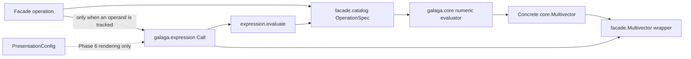

# Expression Provenance Implementation

Galaga 2 expression support records how an eagerly computed facade value was
obtained. It is not a second arithmetic engine, and it does not make
`galaga.core` symbolic. Every facade operation still computes a concrete core
multivector immediately. Provenance is immutable, optional metadata on the
facade wrapper.

This document describes the Phase 5 implementation. Rendering is deliberately
absent: Phase 6 will translate the same expression nodes through the selected
presentation without changing their identity or evaluation.

## Component decomposition



The implementation has five deliberately separate parts:

| Component | Responsibility |
|---|---|
| `galaga.expression._nodes` | Immutable, format-neutral leaves and calls |
| `galaga.facade.catalog` | Stable operation IDs, numeric evaluators, call policies, expression arity, normalized parameter schemas, and result kinds |
| `galaga.facade._numeric` | Eager numeric dispatch and optional propagation onto facade values |
| `galaga.expression._evaluation` | Leaf resolution and catalog-driven replay against an explicit algebra |
| `galaga.expression._simplify` | A small fixed-point set of proven structural identities |

The dependency direction matters. Node definitions import neither
`galaga.core` nor a renderer. The numeric core imports no expression,
presentation, or facade code. Evaluation is the consumer that deliberately
knows both the format-neutral tree and the numeric catalog.

## Expression model

The public node model is a small immutable tree:

```python
from galaga.expression import (
    BladeLiteral,
    Call,
    MultivectorLiteral,
    ScalarLiteral,
    Symbol,
)
```

- `Symbol` contains a `Name`, preserving ASCII, Unicode, and LaTeX spellings
  without selecting an output target.
- `ScalarLiteral` contains one finite real coefficient.
- `BladeLiteral` contains a native exterior-basis bitmask and orientation.
- `MultivectorLiteral` contains an immutable native-mask coefficient tuple.
- `Call` contains a stable operation ID, expression operands, and normalized,
  immutable parameters.

`Call` validates its identifier, expression arity, parameter names, required
parameters, and parameter values against the operation catalog. There is no
operation-specific expression-class hierarchy and no second operation
registry. Future compatibility constructors such as an old `Gp` spelling can
construct `Call("geometric_product", ...)` without gaining separate semantics.

The package is named `galaga.expression`, rather than taking over
`galaga.expr` immediately, because `galaga.expr` remains a public legacy module
until the Phase 9 compatibility cutover.

## Independent name and tracking state

A facade multivector has four possible metadata states:

| Name | Expression | Meaning |
|---|---|---|
| absent | absent | Plain eager numeric value |
| present | absent | Named value with no operation history |
| absent | present | Tracked value rendered from literals and calls |
| present | present | Named and tracked value |

The transitions always return a new lightweight wrapper over the same core
value:

```python
from galaga.facade import Algebra

algebra = Algebra(2)
x = algebra.blade(1)
named = x.named("x")
tracked = x.with_expr()
named_tracked = named.with_expr()

assert named.numeric is x.numeric
assert named.expr is None       # naming alone never enables tracking
assert tracked.name is None
assert named_tracked.name.ascii == "x"

unnamed = named_tracked.unnamed()         # expression remains
untracked = named_tracked.without_expr()  # name remains
```

Factories accept `name=` and `expr=`. `expr=True` infers a symbol for a named
value and a scalar, signed-blade, or full-multivector literal otherwise. An
explicit `Expr` may be supplied instead. `basis_vectors(expr=True)` and the
corresponding blade factories opt in explicitly. `locals()` returns named but
untracked values by default.

Names and expressions are excluded from mathematical equality and hashing.
Use `same_expression()` when structural provenance equality is the question.

## One eager dispatch path

`OperationSpec` separates numeric evaluator arity from expression operand
arity. That distinction is necessary for calls such as:

```python
grade(x, 2)                 # one expression operand, parameter target=2
scalar_multiply(x, 3)       # one expression operand, parameter scalar=3.0
transwedge(x, y, 1)         # two expression operands, parameter order=1
```

`ParameterSpec` validates and freezes these values. Iterable parameters such
as `grades(x, targets)` are normalized before tracked evaluation, so a
one-shot generator is consumed once and both the eager result and provenance
use the same tuple.

The dispatch sequence is:

1. resolve one `OperationSpec`;
2. reject mixed numeric algebras;
3. normalize tracked parameters;
4. invoke the numeric evaluator exactly once per binary edge; and
5. construct a `Call` only if at least one multivector operand was already
   tracked.

A named, untracked operand becomes a `Symbol` leaf only when another operand
has already made the operation tracked. Otherwise no expression node is
constructed. Tests replace every expression constructor with a failing spy on
the untracked path, giving an executable zero-expression-allocation contract.

Operations returning a facade multivector retain a generated call. Scalar and
predicate operations return their normal Python result types and therefore
terminate attached provenance; their catalog schemas still allow explicit
`Call` construction and evaluation. `result_kind` records this distinction,
including the few operations whose return kind is dynamic.

## Variadic products

The public geometric and outer products accept one or more operands. Their
catalog operations remain binary and lower immediately to a left fold. A
single operand returns the identical wrapper and creates no node.

When any operand is tracked, the fold creates leaves for all operands before
lowering. This retains an earlier untracked prefix when tracking begins later:

```python
geometric_product(a, b, tracked_c)

# Call("geometric_product", (
#     Call("geometric_product", (Symbol("a"), Symbol("b"))),
#     Symbol("c"),
# ))
```

The stored tree therefore has exactly the same left association as eager
numeric evaluation. Renderers may visually flatten known associative products
later, but simplification does not discard the canonical evaluation order.

## Catalog-driven evaluation

Evaluation requires an algebra and requires explicit values for symbols:

```python
from galaga.expression import evaluate
from galaga.facade import geometric_product

x, y = algebra.basis_vectors()
x = x.named("x").with_expr()
y = y.named("y")
result = geometric_product(x + y, y)

replayed = evaluate(
    result.expr,
    algebra=algebra,
    environment={"x": x, "y": y},
)
assert replayed.almost_equal(result)
```

Environment keys may be a `Name` or its stable ASCII string. Values may be
facade multivectors, core multivectors, or real scalars. A multivector from a
different algebra is rejected. Literal dimensions and blade masks are checked
against the selected algebra. Passing a core algebra returns core values;
passing a facade algebra returns facade values.

Generated expressions are round-trip tested over orthogonal, degenerate,
oblique, and native-null Gram matrices. Every catalog operation has a schema,
propagation, and evaluation case.

## Deliberately small simplification

`simplify()` is a deterministic fixed-point structural pass. It currently
performs only rules whose meaning does not depend on a metric or a geometric
algebra theorem:

- double-negation removal;
- scalar-literal folding for addition, subtraction, negation, scalar scaling,
  scalar division, and non-negative integer powers;
- additive-zero removal; and
- identity scalar scaling, scalar division, and powers zero or one.

It never reorders operands. It does not flatten subtraction or any other
nonassociative operation. It deliberately does not attempt general
geometric-algebra simplification. Every rule is tested for evaluation
preservation and idempotence.

## Validation ownership

Phase 5 tests live under `packages/galaga/tests/expression`:

- `test_nodes.py` owns node validation, structural equality, hashing, and
  format/numeric independence;
- `test_state.py` owns immutable name/expression transitions;
- `test_propagation.py` owns every catalog operation, one-call dispatch,
  parameter normalization, variadic lowering, and the disabled path;
- `test_evaluation.py` owns leaves, environments, algebra boundaries, and the
  metric-family round trip; and
- `test_simplify.py` owns the conservative structural rules.

Rendering, precedence, notation selection, and final ASCII, Unicode, and LaTeX
strings remain Phase 6 work. They must consume this tree without changing its
numeric evaluation or stable operation identity.

The dedicated Phase 5 suite contains 154 tests. In the combined expression,
facade, presentation, and namespace coverage run, every implementation module
under `galaga.expression` has 100% branch coverage; `galaga.facade._numeric`
and `galaga.facade.catalog` each have 95% branch coverage.
