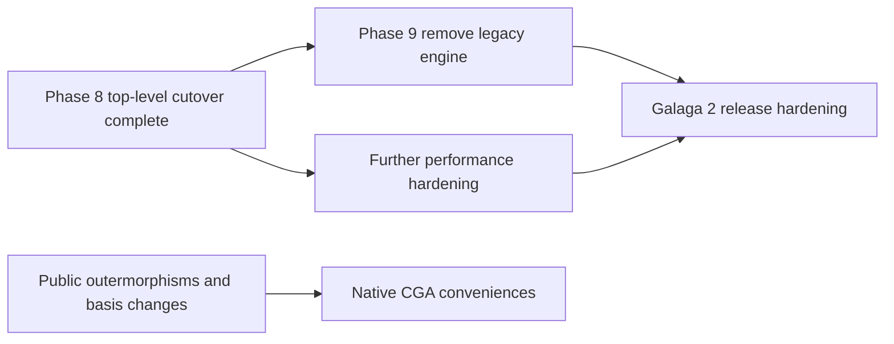

# Galaga Numeric-Algebra Replacement Roadmap

> **Planning role:** This is a capability roadmap. The normative replacement
> sequence, work units, required tests, and exit gates are in the
> [Galaga 2 core cutover plan](core-cutover-plan.md). Existing numeric tests are
> classified in the
> [numeric test migration inventory](numeric-test-migration-inventory.md).

## Goal

Replace Galaga's diagonal-only numeric `Algebra` with `galaga.core`
while leaving naming, notation, rendering, and expression trees as consumers
above the numeric boundary.

The goal is not merely API resemblance. A replacement must preserve diagonal
behavior, add native nonorthogonal metrics, keep degenerate algebras useful,
and give companion packages a public integration surface that does not expose
product-table internals.

## What is complete

| Area | Current state |
|---|---|
| Metric model | Immutable real symmetric Gram matrix; `p,q,r` and signature constructors normalize to it |
| Exterior representation | Dense immutable `float64` coefficients in bitmask exterior order |
| Metric metadata | Basis squares, inertia, rank, determinant, degeneracy, orthogonality |
| Geometric product | Diagonal, packed general-Gram, bounded lazy, and dense-reference backends |
| Exterior product | Direct metric-independent bitmask implementation |
| Grade-selected products | Left/right contractions, Hestenes, Doran–Lasenby, scalar product |
| Metric pairing | Compound-matrix metric inner product and antimetric pairing |
| Duality | Complements, metric duals, Hodge and weight duals, regressive products |
| RGA layer | Antiproduct, antidot, bulk/weight, interiors, transwedge families |
| Core numeric API | Arithmetic, checked scalar conversion, involutions, grades, powers, norm, unit, inverse, predicates, sandwich |
| Numeric functions | Scalar and Study square roots, general exponential, Study-rotor logarithm, and outer transcendental functions |
| Native CGA proof | Exhaustive product equivalence with orthogonal `Cl(4,1)` |
| Eager Galaga facade | Complete construction, immutable wrapping, operator and catalog delegation, variadic product lowering, and direct-core parity in `galaga.facade` |
| Numeric test migration | Applicable v1 mathematics moved to core and the shared public contract rerun against the facade with a legacy-construction guard |
| Presentation configuration | Immutable independent components, signed conventions, complete presets, facade lookup/factories, and context-local overrides |
| Outer layers | Optional expression provenance, semantic rendering, compatibility policy, and companion-package integration |
| Top-level cutover | `galaga` exactly re-exports the facade; Galaga 1 is isolated under the temporary `galaga.legacy` oracle |
| Release evidence | Guarded full suites, clean Python 3.11 wheel install, Python 3.14 Marimo execution, and a layer-separated performance baseline |

## Remaining work

### 1. Linear maps and basis changes

Promote the test-only outermorphism helper into a validated public facility:

- extend a vector map to every exterior grade;
- support source and target algebras with different native bases;
- materialize exterior-map matrices when requested;
- validate metric-preserving maps;
- provide inverse basis changes and, later, adjoints and reciprocal frames.

This removes duplicated change-of-basis code and gives native Gram metrics a
first-class interoperability story.

### 2. Matrix-package migration: complete

`galaga_matrix` now uses `Algebra.left_action()` rather than `_mul_index` and
`_mul_sign`, classifies algebras through basis-independent inertia, and
round-trips general-Gram values in the native exterior basis. Auto mode chooses
the left-regular representation for degenerate, nonorthogonal, and scaled
metrics. Compact mode retains normalized diagonal behavior and clearly rejects
general Gram matrices until a validated basis transform exists.

`MatrixRepr` also now owns frozen matrix-domain expression nodes and immutable
leaf snapshots. Public Galaga names and expressions enter through an explicit
adapter carrying the active presentation; conversion reads no private
multivector symbolic state. Numeric representation and matrix provenance are no
longer companion-package blockers.

### 3. Galaga outer-layer cutover: complete

The architecture and phased implementation are specified in the
[presentation and expression layer plan](presentation-symbolic-layer-plan.md).
`galaga.facade` values wrap core values, expression provenance remains an
optional outer-layer concern, and presentation, semantic rendering,
compatibility helpers, and companion integrations use public protocols.
Top-level `galaga` now exactly re-exports the facade. The retained v1 engine is
an explicit guarded `galaga.legacy` oracle scheduled for Phase 9 removal.

The completed Phase 1 matrix records the policy for API elements that are
numeric-adjacent but not part of the core metric engine:

- positional signature tuples and explicit `signature=`, `sig=`, and `gram=`;
- string blade lookup and `locals()`;
- blade conventions and display order;
- scalar constants and named fractions;
- exact equality plus explicit `almost_equal` rather than legacy approximate
  `__eq__`;
- checked `__float__` compatibility versus any future NumPy array/ufunc
  protocol surface;
- migration of the current `.scalar_part` member to, at most, an optional
  standalone helper equivalent to `float(grade(value, 0))`;
- same-object aliases and their deprecation milestones.

The corrected bracket family must also migrate into Galaga. In the current
core, `lie_bracket` and `commutator` are unscaled, `jordan_product` and
`anticommutator` are unscaled, and only the two `half_...` functions divide by
two.

Thin geometry conveniences are not recreated merely because they are short
compositions. `Algebra.rotor` is `exp` applied to a normalized plane-angle
generator; `project`, `reject`, and `reflect` compose contractions, products,
and `inverse`. They belong only in a future model-specific API that supplies
useful domain meaning or validation. Compatibility aliases such as `wedge`,
`rev`, and `normalize` likewise add vocabulary rather than numeric capability.
They are audited rather than recreated mechanically: users can select concise
local names with ordinary import aliases, and only migration-critical spellings
receive temporary facade shims. The numeric core does not duplicate them.

An unqualified `ip` or `inner_product` should not become a permanent facade
choice. If needed for migration, it should be a deprecated adapter. Users who
want a short local spelling can write, for example,
`from galaga import doran_lasenby_inner as ip`. The library contract should
keep competing conventions explicit.

### 4. Native CGA surface

After work item 1 promotes linear maps, the existing facade metadata can
support model-specific additions:

- metric-aware origin/infinity conventions;
- `up`, `down`, and `homo`;
- point, line, plane, circle, sphere, and point-pair constructors;
- examples comparing orthogonal and native-null frames.

These functions should consume explicit null-pair and Euclidean-subspace
metadata rather than guessing from display names.

### 5. Production hardening

- Add a versor fast path and Hitzer/Shirokov paths to `inverse`, retaining the
  left-regular solve as a verification fallback.
- Replace the dense left-action norm used to scale general exponentials with a
  cheaper certified bound before targeting large dimensions.
- Add a general non-Study rotor logarithm or multivector square-root algorithm
  only with a documented real branch and an independent oracle; the current
  functions deliberately reject those domains.
- Add memory guards or operator forms for dense compound metric matrices.
- Measure dense-multivector workloads on the lazy backend and tune caching or
  packed selection from evidence.
- Preserve and extend the recorded diagonal-backend performance baseline.
- Add serialization only after the final facade boundary is settled.

## Recommended sequence

Numeric function and facade parity, presentation configuration, expression
provenance, semantic rendering, public linear actions, companion migration,
and the top-level cutover are complete. The next cutover phase removes the
retained legacy engine and migration-only names. Linear-map promotion, native
CGA conveniences, and further performance hardening remain independent
numeric/model work rather than blockers for the public facade.

## Explicit non-goals for the numeric core

- Expression-tree construction or simplification
- Notation and LaTeX rendering
- Symbolic Gram entries or coefficients
- Complexified Clifford algebras
- Nonsymmetric bilinear forms
- Hidden diagonalization of the user's native basis
- Implicit NumPy array or ufunc reinterpretation of a multivector
- Sparse multivector coefficient storage in the initial replacement
