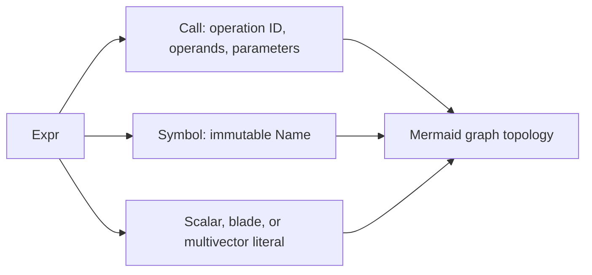

# Galaga 2 Integration Migration

## Outcome so far

Optional integrations now consume narrow public protocols rather than Galaga
1 implementation fields. Mermaid owns graph layout but not expression
semantics. Marimo owns t-string-to-markdown layout but not mathematical
rendering. Small executable examples show when to import the numeric core and
when to use the full facade.

W7.4 is complete. `MatrixRepr` owns a v2-native immutable expression boundary,
and the maintained Marimo gallery executes entirely against the Galaga 2
facade.

## Mermaid expression consumer

`galaga_mermaid` traverses the public immutable node families:

Expression provenance contains no hidden algebra and captures no mutable
operand values. A standalone `expr_to_mermaid` call therefore requires a
`PresentationConfig`. Numeric annotations additionally require `algebra=` and
an explicit symbol `environment=`. If a symbol cannot be evaluated, the graph
still renders its structure without inventing a value.

`mv_to_mermaid` is the convenience boundary. It derives presentation and
algebra through public facade properties and uses `with_expr()` to obtain
literal provenance without mutating an untracked value.

## Marimo display consumer

`galaga_marimo` remains a Python 3.14-only package because its API consumes
t-string `Template` values. This does not change Galaga's Python 3.11 minimum.

The renderer uses two public object protocols:

- `.latex()` or the standard `_repr_latex_()` hook supplies mathematical
  output; and
- a facade `.display(content=..., target="latex")` hook supports explicit
  `:name`, `:expr`, `:value`, and `:full` t-string specifications.

Inline versus block markdown remains Marimo policy. Expression versus value
content remains facade policy. Recognition compares public coefficient arrays
and reads labels from immutable `Name` values; it never reads `_name` or
`_name_latex`.

## Maintained v2 examples

The executable examples under `examples/v2` make the architectural choice
visible:

| Example | Layer | Purpose |
|---|---|---|
| `numeric_core.py` | `galaga.core` | Presentation-free Gram arithmetic |
| `facade_quickstart.py` | `galaga.facade` | Names, provenance, and rendering |
| `presentation_scope.py` | `galaga.facade` | Context-local notation override |
| `general_gram_left_action.py` | `galaga.facade` | Native-null public linear action |

A smoke test executes every file in that directory and rejects ambiguous
top-level imports or private attribute access.

## Maintained notebook gallery

The 61 maintained topic notebooks are listed once in
`tools.migrate_v2_notebooks.MIGRATED_NOTEBOOKS`. That tuple is both the
migration ledger and the codemod write allowlist. Files outside it are neither
silently claimed as maintained nor eligible for automated mutation.

The LibCST transformation owns only structural changes:

- v1 `galaga` and transitional `galaga.facade` imports move to the promoted
  top-level `galaga` API;
- symbolic or lazy factory flags become `expr=True` provenance;
- multivector `.name()` becomes immutable `.named()`, including an explicit
  semantic spelling for legacy latex-only names;
- `.eval()` disappears because facade values are already eager, while Marimo
  interpolation uses `:value`;
- `.reveal()` becomes `:expr` at the display site;
- legacy member scalar extraction becomes either the Python scalar already
  returned by `norm` or an explicit coefficient query; and
- Markdown t-strings use raw `rt` literals so LaTeX backslashes survive Python
  3.14 parsing.

The codemod deliberately preserves `MatrixRepr.name()`,
`QuatMatrixRepr.name()`, and `to_matrix(...).name()`. Tests cover that negative
space and require a second codemod pass to be clean.

Semantic review then chooses presets, rewrites removed geometry helpers as
their defining compositions, replaces mutable notation changes with immutable
presentation configuration, and makes cross-cell data public where Marimo
needs a dependency edge.

The permanent gate has four levels:

1. Python 3.11 checks the ledger, write guard, architecture, and codemod.
2. Python 3.14 compiles every notebook and rejects stale v1 vocabulary.
3. `marimo check` validates the complete cell dependency graph.
4. Headless Marimo export executes all 61 notebooks and fails if any cell
   raises.

This makes the gallery an integration contract, not a collection that merely
parses. See
[ADR-083](../adrs/083-maintained-notebooks-are-executable-integration-contracts.md).

## Matrix provenance consumer

`galaga_matrix` owns matrix-domain expression nodes rather than extending the
geometric-algebra operation catalog. Frozen nodes capture matrix arithmetic,
linear-algebra transforms, representation maps, and spinor columns. A public
adapter accepts `galaga.expression.Expr`, `Name`, and `PresentationConfig`
objects; conversion code does not inspect private multivector fields.

Matrix leaves snapshot read-only NumPy arrays, expression evaluation reproduces
the eager result, and source architecture tests prohibit both
`galaga.symbolic_core` and private facade state. See
[ADR-082](../adrs/082-matrix-provenance-is-package-owned.md).

## Installed-wheel gate

The local `galaga-mermaid` 0.2 and `galaga-marimo` 2.0 wheels are installed
with the Galaga 2 wheel into isolated Python 3.11 and Python 3.14 environments,
respectively. Import and facade-protocol smoke checks run with `python -I` and
no repository `PYTHONPATH`, preventing a source checkout from hiding missing
wheel files or incorrect dependency metadata.
