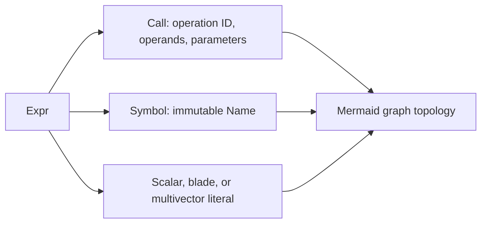

# Optional Package Integration

## Public boundaries

Optional packages consume public numeric, expression, presentation, and
model APIs. Mermaid builds expression diagrams, Marimo lays out interpolated
Markdown, AnyWidget synchronizes interactive geometry, and the matrix package
owns matrix representations and their provenance.

## Mermaid expression consumer

`galaga_mermaid` traverses the public immutable node families:

```mermaid
flowchart LR
    E[Expr] --> C[Call: operation ID, operands, parameters]
    E --> S[Symbol: immutable Name]
    E --> L[Scalar, blade, or multivector literal]
    C --> T[Mermaid graph topology]
    S --> T
    L --> T
```

Expression provenance contains no hidden algebra and captures no mutable
operand values. A standalone `expr_to_mermaid` call therefore requires a
`PresentationConfig`. Numeric annotations additionally require `algebra=` and
an explicit symbol `environment=`. If a symbol cannot be evaluated, the graph
still renders its structure without inventing a value.

`mv_to_mermaid` is the convenience boundary. It derives presentation and
algebra through public facade properties and uses `with_expr()` to obtain
literal provenance without mutating an untracked value.

## Marimo display consumer

`galaga_marimo` remains a Python 3.14-only package because its API consumes
t-string `Template` values. This does not change Galaga's Python 3.11 minimum.

The renderer uses two public object protocols:

- `.latex()` or the standard `_repr_latex_()` hook supplies mathematical
  output; and
- a facade `.display(content=..., target="latex")` hook supports explicit
  `:name`, `:expr`, `:value`, and `:full` t-string specifications.

Inline versus block markdown remains Marimo policy. Expression versus value
content remains facade policy. Recognition compares public coefficient arrays
and reads labels from immutable `Name` values; it never reads `_name` or
`_name_latex`.

## AnyWidget visualization consumer

`galaga_anywidget` owns interactive browser assets and synchronized geometry
state independently of the t-string renderer. Its 2D CGA view classifies and
extracts geometry through public `ConformalModel` operations. The browser owns
semantic point coordinates; ordinary notebook cells construct `up(x, y)` and
all derived multivectors.

This package supports Python 3.11 and depends on AnyWidget, Marimo, and
Traitlets. `galaga_marimo` does not depend on or re-export it.

## Maintained v2 examples

The executable examples under `examples/v2` make the architectural choice
visible:

| Example | Layer | Purpose |
|---|---|---|
| `numeric_core.py` | `galaga.core` | Presentation-free Gram arithmetic |
| `facade_quickstart.py` | `galaga.facade` | Names, provenance, and rendering |
| `presentation_scope.py` | `galaga.facade` | Context-local notation override |
| `general_gram_left_action.py` | `galaga.facade` | Native-null public linear action |

A smoke test executes every file in that directory.

## Editable notebook gallery

The Marimo notebooks under `examples` are human-editable demonstrations.
The local `make run-marimo` launcher installs the companion packages in
editable mode and opens the gallery for ad-hoc exploration.

The repository discovers notebooks from their Marimo app declarations.
Python 3.14 compilation, `marimo check`,
and headless HTML export catch syntax, cell-dependency, and execution errors.
Tests do not freeze lesson text or implementation choices inside cells. See
[ADR-170](../adrs/170-retire-migration-scaffolding-before-stable-2.md).

## Matrix provenance consumer

`galaga_matrix` owns matrix-domain expression nodes rather than extending the
geometric-algebra operation catalog. Frozen nodes capture matrix arithmetic,
linear-algebra transforms, representation maps, and spinor columns. A public
adapter accepts `galaga.expression.Expr`, `Name`, and `PresentationConfig`
objects; conversion code does not inspect private multivector fields.

Matrix leaves snapshot read-only NumPy arrays, and expression evaluation
reproduces the eager result. The adapter uses public facade state. See
[ADR-082](../adrs/082-matrix-provenance-is-package-owned.md).

## Installed-package validation

Release validation installs built wheels in clean Python environments and
checks their import origins and public protocols. The environment must resolve
installed packages rather than editable sources or a repository `PYTHONPATH`.
Use Python 3.14 for the Marimo adapter and t-string notebooks; the other
libraries support Python 3.11+. Follow the
[release checklist](../RELEASE_PROCESS.md#quality-gates).
