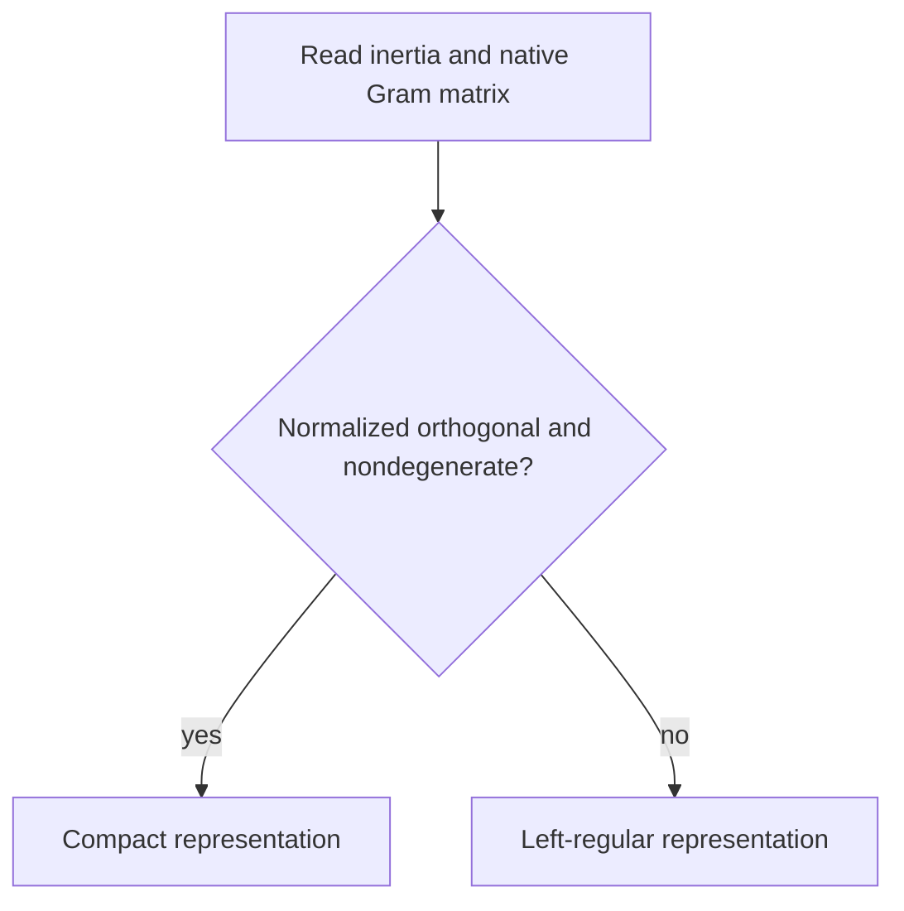

# Galaga Matrix Migration

## Outcome

`galaga_matrix` now consumes the Galaga 2 numeric facade without inspecting a
multiplication table. Left-regular matrices work in the algebra's stored basis
for diagonal, degenerate, oblique, and native-null Gram matrices. Existing
compact representations remain available for normalized orthogonal metrics.

## Components

### Metric classification

The matrix package reads `Algebra.inertia` for the abstract `(p, q, r)` class
and `Algebra.gram` for properties of the stored basis. These answer different
questions: inertia is invariant under a basis change, while compact blade
construction must know whether the current exterior basis is normalized and
orthogonal.

Automatic mode selection is therefore:

A nonorthogonal null pair can have nondegenerate inertia even though individual
basis vectors square to zero. Checking only a signature tuple or only the Gram
diagonal would misclassify that basis.

### Public left action

`Algebra.left_action(value)` returns the matrix of the linear map
`x -> value * x` in native exterior-basis coefficient order. It delegates to
the algebra's selected product backend and is valid for a general symmetric
Gram matrix. `to_matrix(value, mode="left-regular")` now uses this method
directly.

The first column remains the coefficient vector because the first exterior
basis element is the scalar identity. `from_matrix` therefore recovers a value
without solving a system. It constructs through the public algebra factory, so
the returned value is a facade `Multivector` over the same algebra.

While top-level Galaga 1 tests remain active, a compatibility path constructs
each matrix column with the public geometric-product operator. It is slower but
has the same mathematical boundary and contains no legacy multiplication-table
access. Phase 8 removes that path with the legacy engine.

### Compact boundary

The current compact implementation builds canonical gamma matrices and then
multiplies them to represent exterior basis blades. That construction is
correct in a normalized orthogonal basis. For a general Gram matrix,
`e_i e_j` includes contraction terms and is not the same coefficient-basis
element as `e_i wedge e_j`. Silently reusing the compact construction would
therefore represent the wrong basis.

Until a validated basis transform is implemented, explicit compact mode raises
with guidance to use `left-regular`. This includes nonorthogonal metrics and
orthogonal but non-normalized metrics. Degenerate metrics retain their specific
unsupported error.

### Presentation compatibility

Facade values carry immutable public names. Matrix conversion reads that public
name and applies the representation label without calling legacy multivector
expression internals. `from_matrix` returns a newly named facade value. The
matrix wrapper's own expression implementation is still a Galaga 1 component;
moving it to the shared Galaga 2 expression and rendering protocols belongs to
the remaining optional-integration work.

## Verification

The facade matrix contract verifies:

- multiplication through an oblique and a native-null Gram matrix;
- coefficient-preserving left-regular round trips;
- generator anticommutators equal to twice every supplied Gram entry;
- public basis-blade actions match the materialized representation stack;
- compact rejection for nonorthogonal and scaled metrics;
- compact product compatibility for a normalized diagonal metric;
- immutable facade naming round trips; and
- absence of private multiplication-table and legacy numeric imports.

The pre-existing matrix suite remains an independent compatibility gate for
Pauli, Dirac, quaternion, spinor, basis-change, NumPy, symbolic, and rendering
behavior.
