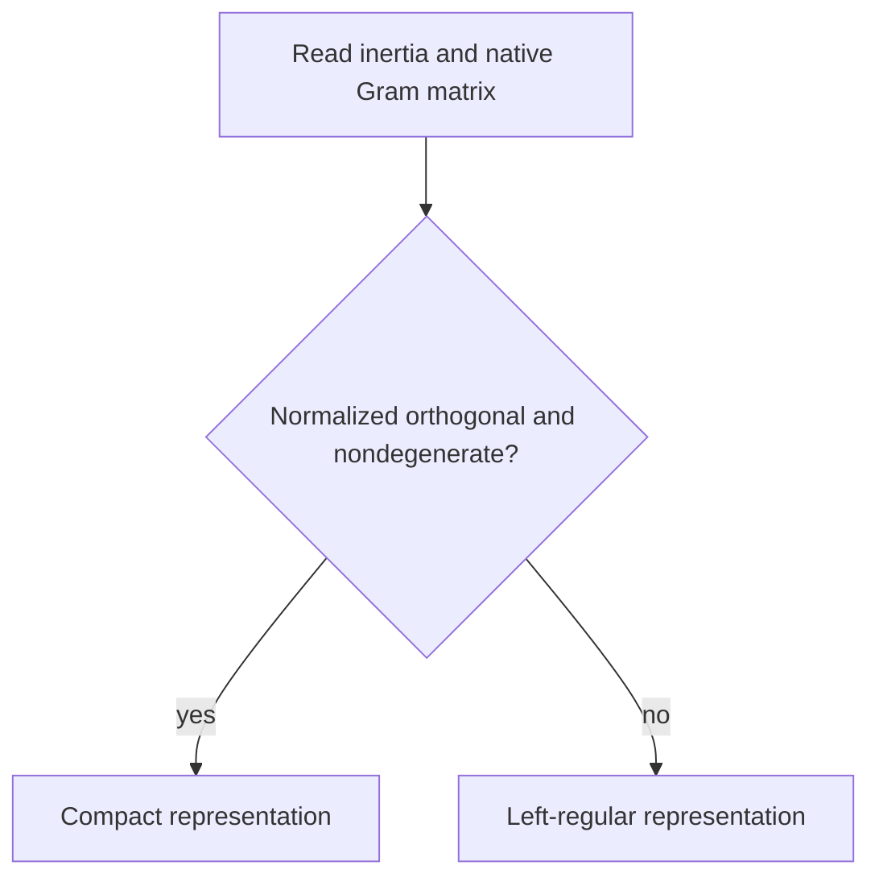
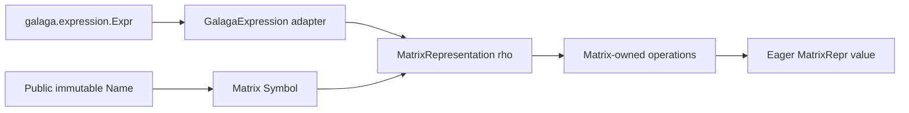

# Galaga Matrix Migration

## Outcome

`galaga_matrix` now consumes the Galaga 2 numeric facade without inspecting a
multiplication table. Left-regular matrices work in the algebra's stored basis
for diagonal, degenerate, oblique, and native-null Gram matrices. Existing
compact representations remain available for normalized orthogonal metrics,
and explicit compact mode now supports numerically suitable nondegenerate
general Gram matrices through an exterior-lifted congruence.

## Components

### Metric classification

The matrix package reads `Algebra.inertia` for the abstract `(p, q, r)` class
and `Algebra.gram` for properties of the stored basis. These answer different
questions: inertia is invariant under a basis change, while compact blade
construction must know whether the current exterior basis is normalized and
orthogonal.

Automatic mode selection is therefore:

```mermaid
flowchart TD
    A[Read inertia and native Gram matrix] --> B{Normalized orthogonal and nondegenerate?}
    B -->|yes| C[Compact representation]
    B -->|no| D[Left-regular representation]
```

A nonorthogonal null pair can have nondegenerate inertia even though individual
basis vectors square to zero. Checking only a signature tuple or only the Gram
diagonal would misclassify that basis.

### Public left action

`Algebra.left_action(value)` returns the matrix of the linear map
`x -> value * x` in native exterior-basis coefficient order. It delegates to
the algebra's selected product backend and is valid for a general symmetric
Gram matrix. `to_matrix(value, mode="left-regular")` now uses this method
directly.

The first column remains the coefficient vector because the first exterior
basis element is the scalar identity. `from_matrix` therefore recovers a value
without solving a system. It constructs through the public algebra factory, so
the returned value is a facade `Multivector` over the same algebra.

For the explicit Phase 8 `galaga.legacy` oracle only, a temporary compatibility
path constructs each matrix column with the public geometric-product operator.
It is slower but has the same mathematical boundary and contains no legacy
multiplication-table access. Phase 9 removes that path with the legacy engine;
ordinary top-level and companion-package tests use only facade values.

### Compact exterior lift

The normalized compact implementation builds canonical gamma matrices and
multiplies them to represent exterior basis blades. That construction is
correct in its orthogonal basis. For a general Gram matrix,
`e_i e_j` includes contraction terms and is not the same coefficient-basis
element as `e_i wedge e_j`, so ordered products of transformed generators
would represent the wrong native basis.

Explicit compact mode now computes and validates `G = S eta S.T`, transforms
the vector generators linearly, and maps every grade-$k$ native blade through
the $k\times k$ minors of $S$. This exterior-power lift preserves native
coefficients and the product homomorphism for both scaled diagonal and dense
nonorthogonal metrics. The complete real blade-system rank remains the strict
inverse criterion. Rank and least-squares checks normalize represented-blade
columns so a uniform metric scale cannot masquerade as loss of injectivity.

Automatic mode intentionally remains unchanged: normalized orthogonal metrics
select compact mode, while scaled and dense metrics select left-regular. Named
Pauli, Dirac, and quaternion modes retain their normalized-orthogonal
conventions. Genuinely degenerate metrics retain their specific unsupported
compact error.

### Presentation compatibility

Facade values carry immutable public names. Matrix conversion reads that public
name and applies the representation label without calling legacy multivector
expression internals. `from_matrix` returns a newly named facade value. The
matrix wrapper now exposes its immutable `symbolic_name`, `is_symbolic`, and
`expr` state without exposing or inspecting multivector implementation fields.

### Package-owned matrix provenance

Matrix operations are not geometric-algebra catalog operations. The companion
package therefore owns frozen nodes for matrix multiplication, elementwise
multiplication, transpose, adjoint, conjugation, inverse, basis change,
Kronecker product, representation maps, and spinor columns. Named leaves store
an immutable `Name` and a read-only copy of the eager NumPy value.

A single adapter brings a public `galaga.expression.Expr` into this tree along
with the facade's explicit `PresentationConfig` and eager value. Rendering
resolves the value's current context-local presentation and uses the stored
configuration only as a fallback, so teaching notation can still change in a
thread- and async-safe scope. This preserves the distinction between GA
provenance and matrix provenance:

```mermaid
flowchart LR
    G[galaga.expression.Expr] --> A[GalagaExpression adapter]
    N[Public immutable Name] --> S[Matrix Symbol]
    A --> R[MatrixRepresentation rho]
    S --> R
    R --> M[Matrix-owned operations]
    M --> E[Eager MatrixRepr value]
```

`MatrixRepr.as_expression()` is the matrix operand boundary. The conversion
implementation reads public facade `name`, `expr`, `algebra.presentation`, and
`data` only; source tests reject the retired private-field vocabulary and any
`galaga.symbolic_core` import.

## Verification

The facade matrix contract verifies:

- multiplication through an oblique and a native-null Gram matrix;
- coefficient-preserving left-regular round trips;
- generator anticommutators equal to twice every supplied Gram entry;
- public basis-blade actions match the materialized representation stack;
- explicit compact conversion for nonorthogonal and scaled metrics while
  automatic dispatch remains left-regular;
- all native exterior blades against a fully antisymmetrized product oracle;
- random-product homomorphism and an independent orthogonal-basis
  outermorphism check;
- injective general-Gram round trips and strict rank-deficient inverse failure;
- compact product compatibility for a normalized diagonal metric;
- immutable facade naming round trips;
- frozen matrix expression nodes and read-only leaf snapshots;
- evaluation parity between matrix provenance and eager results; and
- absence of private multiplication-table, multivector expression, legacy
  numeric, and `galaga.symbolic_core` imports.

The matrix package suite remains an independent gate for Pauli, Dirac,
quaternion, spinor, basis-change, NumPy, provenance, rendering, and immutable
representation-plan behavior.
