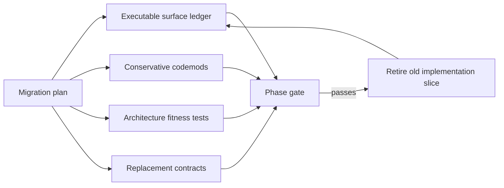

# Migration Engineering Techniques

The Galaga 2 work is a replacement of a live implementation, not a greenfield
rewrite. The old and new systems coexist for several phases, public names move
at different times, some behavior must remain compatible, and some behavior is
deliberately corrected. A passing test suite alone cannot show that a test used
the intended implementation or that every public surface has a destination.

This document records the techniques used to make that migration observable
and reviewable. They are useful beyond Galaga: most apply whenever a library is
being replaced behind a stable public API.

## The governing idea: make migration claims executable

A migration plan contains statements such as:

- every legacy export has a destination;
- the new core does not depend on an outer layer;
- facade tests do not silently fall back to the old engine;
- a codemod changes only the intended names;
- a compatibility alias does not create a second implementation; and
- duplicate legacy tests are removed only after their oracle has a new owner.

Where practical, each statement is represented by a test, immutable manifest,
or guarded command. The prose explains why; executable checks show whether the
claim remains true.



The loop is intentionally incremental. A phase retires only the slice for
which replacement ownership and execution have been proved.

## Programming the migration itself

The migration is safer when more of the migration process becomes a program:
structured data, queries, assertions, transformations, and repeatable gates.
This is not “code instead of thinking.” It is code that preserves a piece of
reasoning and reruns it whenever the repository changes.

An executable migration rule has a useful shape:

```text
claim → representation → observation → comparison → actionable failure
```

For example:

```text
"Every public export has a destination"
    → SurfaceDisposition rows
    → inspect galaga.__all__
    → compare exact sets
    → report missing or stale rows
```

This converts repeated human review into a durable feedback loop. It wins in
several ways:

- ambiguity is exposed when a prose claim must become a predicate;
- the same check runs on every change, not only when someone remembers;
- drift is detected at the commit that introduces it;
- results are reproducible across contributors and CI;
- structured outputs can feed later phases or generate tests; and
- the repository contains auditable evidence for its migration status.

In that sense, code is a compression of repeated reasoning. The first decision
still requires judgment; the program prevents the team from having to remake
or remember that decision on every subsequent edit.

### What is a good candidate for execution?

A migration claim is especially suitable when it is:

- **decidable**: a program can say pass or fail without pretending to resolve
  a subjective tradeoff;
- **observable**: there is an authoritative source such as runtime reflection,
  an AST, package metadata, a built wheel, or a numeric result;
- **stable enough**: the rule represents architecture or policy rather than a
  temporary incidental layout;
- **repeated**: humans would otherwise perform the same review many times;
- **high consequence**: silent drift would make the eventual cutover risky;
  and
- **actionable**: failure can identify what changed and how to resolve it.

Good examples include finite inventories, forbidden dependency edges, API
signatures, compatibility aliases, warning policy, value round trips, absence
of old private references, artifact contents, and whether an optional path was
executed.

Some material should remain prose:

- why an architectural direction was selected;
- alternatives and tradeoffs;
- mathematical interpretation that still requires expert judgment;
- user-experience or aesthetic choices without a settled rule; and
- future intent that does not yet have a meaningful observable state.

Often the best result is a pair: prose states the rationale and executable
code enforces the settled consequence. ADR-077 explains why expression
provenance is optional; a failing-spy test enforces zero expression-node
construction when it is disabled.

### A tool-selection ladder

Start with the smallest mechanism that can independently falsify the claim.
The mechanism does not have to be production code. A frozen data structure, a
pytest fixture, a ten-line AST query, a command-line check, or a build smoke
test is already programming the migration.

| Kind of claim | Representation or technique | Useful tools |
|---|---|---|
| Finite public surface | Structured manifest plus live reflection | `dataclasses`, `inspect`, `dir`, signatures, [Griffe API checks](https://mkdocstrings.github.io/griffe/guide/users/checking/) |
| Dependency direction | Import graph or AST predicate | Python `ast`, [Import Linter](https://import-linter.readthedocs.io/en/v2.3/), repository searches |
| Syntax-preserving source rewrite | Concrete syntax tree transformation | [LibCST](https://libcst.readthedocs.io/) and its metadata providers |
| Forbidden runtime fallback | Poison old path, spy on calls | pytest fixtures and [monkeypatch](https://docs.pytest.org/en/stable/how-to/monkeypatch.html) |
| Algebraic or behavioral invariant | Examples, round trips, generated domains | pytest parametrization, NumPy oracles, [Hypothesis](https://hypothesis.readthedocs.io/) |
| Old/new compatibility | Shared contract and differential execution | pytest fixtures, deterministic seeds, explicit correction rows |
| Repository debt reaches zero | Search result as an exit condition | `rg`, AST queries, custom allowlists |
| Package independence | Metadata and artifact inspection | `importlib.metadata`, `uv build`, wheel-content and clean-environment smoke tests |
| Documentation remains executable | Parsed examples and link checks | `doctest`, pytest examples, Markdown and link checkers |
| Policy is complete | Schema plus generated assertions | frozen dataclasses, enums, JSON Schema, or a small domain-specific manifest |

This ladder avoids two opposite mistakes:

- writing a large framework when Python reflection and one test would suffice;
  and
- using a lexical tool such as search-and-replace when semantic name
  resolution is required.

Established tools are valuable when the problem is general. Import Linter can
enforce layered or forbidden import contracts; Griffe can compare API
snapshots for breaking changes; Hypothesis can search an input domain and
shrink counterexamples; LibCST can transform Python without discarding its
concrete syntax. Galaga's current checks are deliberately smaller where its
rule is narrow, but those tools are available if the scope grows.

### When to write a purpose-built tool

A custom checker or codemod is appropriate when:

- the rule contains project vocabulary, such as facade ownership or a
  `SurfaceDisposition` milestone;
- an off-the-shelf tool exposes the needed primitives but not the final rule;
- the custom implementation is small enough to review as part of the proof;
- its inputs and outputs can be deterministic;
- its own negative cases can be tested; and
- maintaining it is cheaper than repeatedly performing manual audits.

The Galaga surface ledger is custom because generic API-diff tools do not know
whether an item is retained, redesigned, removed, or assigned to Phase 7. The
operation codemod is custom because LibCST supplies parsing and qualified-name
metadata, while Galaga supplies the narrow mathematical allowlist.

A purpose-built migration tool should usually have:

- a dry-run or `--check` mode;
- an explicit scope or filesystem boundary;
- an allowlist rather than a broad default;
- deterministic, reviewable output;
- idempotence when it rewrites source;
- tests for both intended changes and protected negative cases; and
- an obvious retirement or permanent-ownership decision.

The custom tool itself is code and therefore can be wrong. It should be
smaller and conceptually simpler than the system it checks, and its oracle
should be as independent as practical. A manifest copied from `__all__` at
runtime would prove nothing; a separately reviewed disposition manifest
compared with the live `__all__` can detect drift.

### Do not automate into false confidence

Turning more policy into programs is a strong default, not an instruction to
make every sentence executable. Common hazards are:

- **false precision**: encoding an unsettled design choice makes it look
  resolved;
- **shared bugs**: deriving expected and actual values from the same faulty
  implementation creates a tautological test;
- **brittleness**: checking incidental file layout can obstruct harmless
  refactoring;
- **Goodhart's law**: optimizing test counts or coverage can reduce test
  quality;
- **silent incompleteness**: a checker may validate its rows without proving
  the rows cover the live system; and
- **tool permanence**: a migration-only mechanism can become unexplained
  architecture if it lacks a retirement decision.

The remedy is the same layered evidence used throughout this migration:
explain the policy in prose, encode only its decidable consequences, compare
against an independent observation, test the checker, and keep a human review
point for semantic decisions.

## 1. Additive replacement before public cutover

The migration first added the new implementation under distinct namespaces:

```text
galaga.core       new numeric implementation
galaga.facade     new public-value composition layer
galaga.Algebra    legacy public implementation until Phase 8
```

This is a strangler-style migration. It permits direct comparison, lets tests
move by concern, and avoids changing the normal user import before the new
stack has presentation, expression, rendering, and integration support.

The important technique is not merely keeping both implementations. Their
identity is tested. During the additive phases,
`test_top_level_algebra_remains_legacy_during_additive_migration` asserted that
top-level `Algebra` is still the legacy class and that `galaga.core.Algebra` is
distinct. Phase 8 deliberately inverted that assertion.

This makes the cutover a named, reviewable event rather than an accidental
consequence of reorganizing imports.

Phase 8 deliberately inverted that contract. The top-level package now copies
the facade's export manifest and identity tests compare every object, while a
subprocess proves plain import leaves the legacy engine unloaded. The former
top-level v1 surface moved coherently to `galaga.legacy`.

The same executable-ledger technique isolates oracle tests. A LibCST codemod
changes only actual `from galaga import ...` nodes in an allowlisted test set;
comments and source examples remain untouched. Pytest marks those files as
`legacy_oracle` and poisons both old numeric constructors for every unledgered
test. New tests therefore fail closed onto Galaga 2.

### Compatibility bridges preserve identity

`galaga.gram_bridge` became a compatibility re-export of `galaga.facade`, not
a parallel wrapper hierarchy. Import-identity tests ensure the bridge and the
durable namespace expose the same objects. This avoids a subtle failure mode
where values from two nominally compatible namespaces cannot interoperate
because their classes or registries diverge.

General lesson: a temporary bridge should forward to one implementation
owner. It should not become another implementation that must later be
migrated.

## 2. An executable migration ledger

The human-readable
[public API migration matrix](public-api-migration-matrix.md) is backed by
[`v1_surface_manifest.py`](../../packages/galaga/tests/compatibility/v1_surface_manifest.py).
Each legacy surface has a structured disposition:

```python
@dataclass(frozen=True, slots=True)
class SurfaceDisposition:
    owner: str
    action: str
    target: str
    milestone: str
    warning: str | None = None
```

The fields answer five different questions:

| Field | Question |
|---|---|
| `owner` | Which architectural layer is responsible? |
| `action` | Is the item retained, replaced, redesigned, deprecated, or removed? |
| `target` | What is the durable API or implementation destination? |
| `milestone` | When must the disposition be complete? |
| `warning` | What guidance does a retiring public spelling give users? |

This is more useful than a checklist of names. It prevents an item from being
declared “handled” without saying who owns it or what replaces it.

### Completeness is compared with the live system

[`test_v1_surface_manifest.py`](../../packages/galaga/tests/compatibility/test_v1_surface_manifest.py)
introspects the actual legacy package and checks exact set equality for:

- names in `galaga.__all__`;
- public `Algebra` and `Multivector` members;
- declared special methods and formatting hooks;
- public expression node classes;
- non-private package modules and supported nested entry points;
- companion-package touch points; and
- known dependencies on private structures.

If the live surface changes without a ledger decision, the suite fails. The
ledger helpers also reject overlapping classifications, and retiring rows must
contain migration guidance.

This turns “we believe the inventory is complete” into “the inventory equals
what Python can currently observe.”

### Record accidental dependencies, too

The ledger includes private dependencies such as `galaga_matrix` reading old
multiplication tables and `galaga_mermaid` traversing legacy expression
internals. These are not endorsed APIs, but ignoring them would make the
cutover plan incomplete.

Some tests currently assert that these references are still present. That may
look backwards, but it keeps the debt visible. During Phase 7 those tests will
be inverted: the migration is complete only when repository searches prove the
private references are gone.

### What belongs in prose versus the ledger

- The executable ledger owns names, destinations, milestones, and warning
  policy.
- The human document explains intent, examples, and related decisions.
- Behavioral tests own runtime semantics.
- ADRs own architectural decisions and rejected alternatives.

Duplicating the complete name list independently in several prose documents
would create competing sources of truth.

## 3. LibCST for conservative source transformation

The numeric test migration required changing concise legacy operation aliases
such as `gp`, `op`, and `involute` to the canonical Galaga 2 names. A textual
replacement would be unsafe:

- `gp` may be a local function or variable;
- names occur in comments, strings, and theorem prose;
- an alias may come from a different module; and
- superficially similar operations can have different mathematical scaling.

The migration therefore uses the LibCST codemod in
[`canonicalize_core_test_operations.py`](../../packages/galaga/tools/canonicalize_core_test_operations.py).
LibCST preserves the concrete syntax while qualified-name metadata identifies
what a reference resolves to. LibCST is a repository development dependency,
not a Galaga runtime dependency.

### Allowlist the transformation

The codemod has a small explicit allowlist:

```python
APPROVED_IMPORT_ALIASES = {
    ("geometric_product", "gp"),
    ("grade_involution", "involute"),
    ("outer_product", "op"),
}
```

It rewrites a use only when `QualifiedNameProvider` says it is an imported
reference to the approved `galaga.core` operation. `ParentNodeProvider` keeps
the reference rewrite separate from import-alias rewriting. The transformer
then removes the matching `as` clause from the import.

Consequently:

- comments and string literals remain byte-for-byte content;
- a local function named `gp` is untouched;
- an alias imported from another module is untouched; and
- unapproved aliases are untouched.

### Scope the filesystem mutation

`canonicalize_path()` refuses to write outside
`packages/galaga/tests/core`. It also supports `--check`, which reports files
that would change without writing them. The transformation is idempotent, so a
second run produces no diff.

These controls matter as much as the tree transformation. A correct codemod
run over the wrong directory is still destructive.

### Test the negative space

[`test_operation_name_codemod.py`](../../packages/galaga/tests/test_operation_name_codemod.py)
checks not only the intended rewrite but also what must remain unchanged:

- comments;
- strings;
- local shadowing;
- unapproved import aliases; and
- a second application of the codemod.

Negative-space tests are especially valuable for automated refactoring. The
main risk is usually an extra rewrite, not a missed happy-path rewrite.

### Some changes must remain manual

The codemod deliberately did not rewrite convention-sensitive mathematics.
Examples include:

- deciding whether a source theorem means `commutator` or
  `half_commutator`;
- choosing `scalar_product`, checked `float(value)`, or
  `float(grade(value, 0))`;
- separating helper construction from core mathematics; and
- translating diagonal-metric formulas to a general Gram-matrix oracle.

Those transformations require mathematical judgment. The safe workflow is:

1. use LibCST for the mechanically provable subset;
2. review the resulting diff;
3. make semantic changes explicitly;
4. run the source-oriented tests; and
5. verify that a second codemod run is clean.

General lesson: use the most semantic automation available, but keep its
allowlist narrower than the set of changes a human intends to make.

### Notebook migration adds an execution ledger

The notebook migration applies the same method to a more semantic surface.
`MIGRATED_NOTEBOOKS` is simultaneously the maintained-gallery ledger and the
filesystem write guard. The LibCST transformer understands Python 3.14
templated strings, rewrites display content structurally, and uses the
round-trippable raw `rt` spelling so LaTeX is not interpreted as Python escape
sequences.

Negative-space tests preserve the independent `.name()` protocols owned by
`MatrixRepr`, `QuatMatrixRepr`, and `to_matrix`. Idempotence proves that
latex-only semantic names, eager values, and explicit `:expr`/`:value` content
have reached a stable form.

Compilation was not accepted as completion. Marimo's own checker found
cross-cell multiple definitions and private names that Python compilation
could not see. Headless export then found runtime-only v1 assumptions such as
mutable notation, `.reveal()`, and latex-only names. The final test executes
every ledgered notebook, so the migration claim and the runtime evidence cover
the same set.

General lesson: for generated or reactive programs, the executable ledger
should drive the framework's structural validator and its real runtime, not
only the host language compiler.

## 4. Architectural tests as fitness functions

Unit tests check results. Architectural tests check that results are produced
through the intended dependency structure.

### The core cannot import outward

[`test_migration_boundary.py`](../../packages/galaga/tests/core/test_migration_boundary.py)
parses every `galaga.core` source file with Python's AST and rejects imports
that escape the core package. It also inspects installed distribution metadata
to prove Galaga no longer depends on an external `gram` package.

This is stronger than a code-review convention. A future accidental import of
presentation, facade, or legacy code fails immediately.

AST inspection is appropriate here because the rule concerns static import
edges, not runtime behavior. It is small, fast, and does not require a full
dependency-analysis framework.

### Facade tests poison legacy construction

The facade suite monkeypatches the legacy `Algebra` constructor to raise. The
guard is installed automatically for direct facade tests and for the facade
variant of the implementation-neutral contract. A self-test explicitly calls
the old constructor and proves the poison is active.

Without this guard, a facade test could pass while a helper, fixture, or import
quietly constructed the legacy implementation. The test result would be true,
but the migration claim would be false.

This pattern is broadly reusable:

> When replacing implementation A with B, make B's validation environment
> actively fail if A executes.

Importing A for comparison is still permitted in explicitly differential
tests. Constructing A inside a test that claims to validate B is not.

### Catalog completeness is a set equation

The numeric catalog tests compare core public operations with cataloged or
explicitly excluded names:

```text
core public operations
    == catalog operations union documented exclusions
```

Structural facade operations are separately enumerated. This prevents a new
core operation from existing without a facade decision.

Aliases are also tested as object identity, not merely equal behavior. An
alias must be the same callable as its canonical operation and must not gain a
second catalog entry. That preserves one implementation and one stable
operation identity.

### Optional behavior gets a disabled-path test

Expression tracking is opt-in. The untracked-path test replaces every
expression-node constructor with a function that raises, then performs normal
facade arithmetic. Passing proves that disabled tracking does not merely
discard an allocated tree later; it never constructs expression nodes.

Other expression tests spy on the numeric evaluator to prove one invocation
per binary edge. These tests protect performance and architecture rather than
only coefficient results.

The same technique will apply to rendering: constructing a semantic render
tree must not call numeric operations, and emitter selection must not change
expression evaluation.

## 5. Move tests by oracle ownership, not by filename

The migration did not copy the old test directory wholesale and change its
imports. Existing files mixed several concerns:

- mathematical identities;
- naming and blade conventions;
- rendering snapshots;
- helper conveniences;
- legacy implementation details; and
- genuine regressions.

The
[numeric test migration inventory](numeric-test-migration-inventory.md)
classifies tests at file, class, and behavior level. A test moves to the layer
that owns its oracle:

| Oracle                        | Destination                            |
| ----------------------------- | -------------------------------------- |
| Source theorem or numeric law | Direct `galaga.core` test              |
| Public eager behavior         | Implementation-neutral facade contract |
| General-Gram parity           | Direct core/facade parity test         |
| Blade names or semantic roles | Presentation test                      |
| Operation history             | Expression test                        |
| Legacy spelling or warning    | Compatibility test                     |
| Convenience composition       | Helper test, not a core primitive      |

This prevents presentation machinery from being required merely to construct
numeric operands, and prevents helpers from being added to the core solely to
make an old test fit.

### Retain independent oracles, remove duplicate executions

Source-oriented Chisholm, Cohoe, and Terathon identities were retained with
their citations. Strong regressions—such as compound exponential cases and
two-sided inverses—were retained even when a broad destination suite already
existed. Tests that only repeated coefficients already proved by stronger
oracles were eventually removed.

The deletion order was:

1. identify the old test's actual assertion;
2. assign a new architectural owner;
3. add or locate an equal or stronger oracle;
4. run both during the overlap period;
5. activate the legacy-execution guard; and
6. delete the duplicate old execution.

A falling test count can therefore be correct. What matters is whether oracle
coverage and ownership remain visible.

## 6. Parameterize contracts, then add differential tests

`facade/test_numeric_contract.py` defines a small construction adapter and
runs the same public contract against `legacy-v1` and `core-facade-v2`. The
pytest IDs make the implementation visible in collected results.

This provides stronger evidence than two similar test files because the
assertion body is identical. Where Galaga 2 intentionally differs, separate
correction-ledger tests state both meanings instead of hiding a conditional in
the shared contract.

Deterministic differential tests then compare mixed-grade values across
representative signatures. These are useful transitional oracles, but they do
not define all future behavior: the legacy implementation cannot be the oracle
for new oblique or native-null capabilities it never supported.

The resulting hierarchy is:

1. independent mathematical or source-derived oracle where possible;
2. direct core/facade parity for delegation boundaries;
3. legacy differential comparison for intentionally compatible domains; and
4. explicit correction tests where v2 changes the contract.

## 7. Keep a correction ledger separate from regressions

A replacement can fail by accidentally changing behavior, but it can also
fail by faithfully preserving a known mistake. Galaga 2 records deliberate
corrections explicitly, including:

- unscaled `commutator`, `anticommutator`, `lie_bracket`, and
  `jordan_product`, with separately named half-scaled operations;
- exact equality with explicit approximate comparison;
- strict scalar conversion rather than implicit scalar-part extraction;
- `scalar_part` as an optional standalone composition rather than value state;
- long operation names as canonical identities; and
- deterministic binary lowering for the approved variadic products.

Each correction has tests that contrast the old and new meanings. This makes a
red differential result interpretable: it is either a ledgered correction or
an unplanned regression.

General lesson: compatibility and correctness are separate axes. Record which
one wins for every intentional difference.

## 8. A catalog as the migration choke point

The operation catalog concentrates decisions that would otherwise drift
between numeric wrappers, expressions, notation, and compatibility aliases:

- stable long-form operation ID;
- numeric evaluator;
- evaluator and expression arity;
- normalized parameter schema;
- public call policy, including variadic lowering;
- result kind; and
- operator metadata where relevant.

Completeness tests and table-driven expression tests iterate the catalog. A new
operation therefore creates visible obligations rather than silently working
in only one layer.

The catalog does not own rendering spellings. Notation keys refer to its stable
IDs, allowing functional, symbolic, and teaching presentations to change
without changing operation identity.

This is a useful migration pattern: place cross-layer identity in one narrow
registry, but keep layer-specific policy in its owning layer.

## 9. Stage validation from narrow to release-shaped

Validation expands as confidence grows:

1. run the changed unit or source-oriented file;
2. run its owning package or architectural layer;
3. run guarded facade contracts;
4. run the complete Galaga suite on Python 3.11;
5. run non-Marimo workspace packages together;
6. run `galaga_marimo` and the complete maintained notebook ledger separately
   on Python 3.14;
7. run formatting, lint, type, security, and Markdown checks; and
8. build the wheel and source distribution and inspect their contents.

This sequence gives fast local feedback while ending with the actual package
and interpreter boundaries. In particular, separate Python environments keep
Marimo's t-string requirement from silently raising Galaga's base requirement.

### Coverage is evidence, not the objective

Coverage is measured separately for the core, facade, and optional expression
path. Generic “coverage gap” tests were not copied merely to preserve a
headline number. A retained test needs a behavioral name and an architectural
owner.

Uncovered defensive branches are reviewed and recorded. Tests are added when
they establish a useful contract, not merely because a line is red in a
report.

## 10. Small phase commits preserve the proof trail

The migration is committed in bounded phases: internalize the core, migrate
numeric tests, promote the facade, add presentation, add expression
provenance, and so on. Each commit has a coherent validation story.

This supports:

- review of one architectural claim at a time;
- bisection when a later phase regresses behavior;
- comparison of test counts and coverage at a meaningful boundary; and
- reverting one migration decision without discarding unrelated work.

The commit is not the proof by itself. It is the container for the code,
ledger update, architectural tests, behavior tests, documentation, and ADRs
that form the proof.

## Failure modes these techniques prevent

| Failure mode | Countermeasure |
|---|---|
| Regex changes a local name, comment, or theorem text | Qualified-name LibCST codemod plus negative-space tests |
| A public name is forgotten | Live-surface equality against the executable ledger |
| The new core imports an old outer layer | AST dependency-boundary test |
| A facade test silently uses the legacy engine | Poisoned legacy constructor and guard self-test |
| An alias develops independent semantics | Same-object alias assertion and one catalog entry |
| A deliberate v2 correction looks like a regression | Explicit correction-ledger test |
| A later tracked variadic operand loses earlier inputs | Call-tree association and propagation test |
| Optional expression support allocates when disabled | Constructors replaced with failing spies |
| Old tests are deleted without replacement ownership | File/class behavior inventory and overlap period |
| Source-tree imports hide packaging omissions | Built-artifact inspection now and an installed-wheel gate at cutover |
| A bridge becomes permanent duplicate architecture | Identity-preserving re-export with a retirement milestone |

## Applying the techniques to the remaining phases

The checks should evolve with the migration rather than remain frozen.

### Phase 6: rendering

These checks are now implemented in `tests/rendering` and remain permanent
architecture tests:

- Extend catalog completeness to require a long functional fallback notation
  for every operation.
- Add an architectural test that render-tree construction performs no numeric
  operation.
- Test that emitters import neither the legacy engine nor each other.
- Parameterize semantic-tree tests independently of ASCII, Unicode, and LaTeX
  emission.
- Invert presentation contexts during tests to prove notation changes do not
  change expression identity or coefficients.

### Phase 7: compatibility and companions

- Turn private-dependency ledger entries into repository-search exit tests.
- Migrate one companion at a time using public protocols, then invert the
  corresponding “still present” assertion.
- Generate or table-drive warning tests from the executable disposition rows.
- Keep personal short notation as ordinary import aliases rather than adding
  duplicate operation identities.

### Phase 8: top-level cutover

- Invert the top-level class-identity architectural test.
- Run a full facade-only suite with legacy construction poisoned.
- Compare the live top-level export set with the ledger after compatibility
  adapters are installed.
- Run smoke tests against an installed wheel, not the source checkout.

### Phase 9: removal

- Require repository searches to find no legacy numeric storage or tables.
- Remove or update ledger rows only with their compatibility tests.
- Verify that migration-only namespaces no longer ship in built artifacts.
- Preserve the correction ledger as the permanent Galaga 2 contract.

## Reusable checklist

For another staged library replacement:

1. Give the replacement a distinct namespace before changing public imports.
2. Inventory the live public and accidentally relied-upon private surface.
3. Give every row an owner, action, destination, milestone, and warning policy.
4. Compare that ledger with runtime introspection in tests.
5. Encode dependency direction and forbidden fallbacks as architectural tests.
6. Use semantic codemods with narrow allowlists and filesystem guards.
7. Test both what a codemod changes and what it must preserve.
8. Split old tests by oracle ownership rather than moving whole files blindly.
9. Parameterize shared contracts over old and new implementations.
10. Record intentional differences separately from compatibility assertions.
11. Poison the old implementation when claiming to test the replacement.
12. Retire duplicates only after equal or stronger replacement evidence passes.
13. Validate target interpreters, companion packages, and built artifacts.
14. Invert transitional architectural tests at the planned cutover phase.
15. Commit bounded migration units with their proof and documentation together.

The unifying principle is simple: every important migration assertion should
have one durable owner and, where feasible, one executable way to fail.
