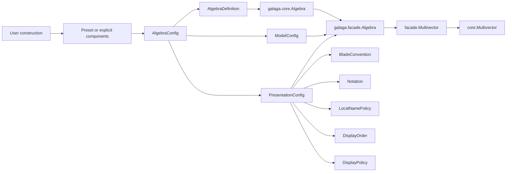
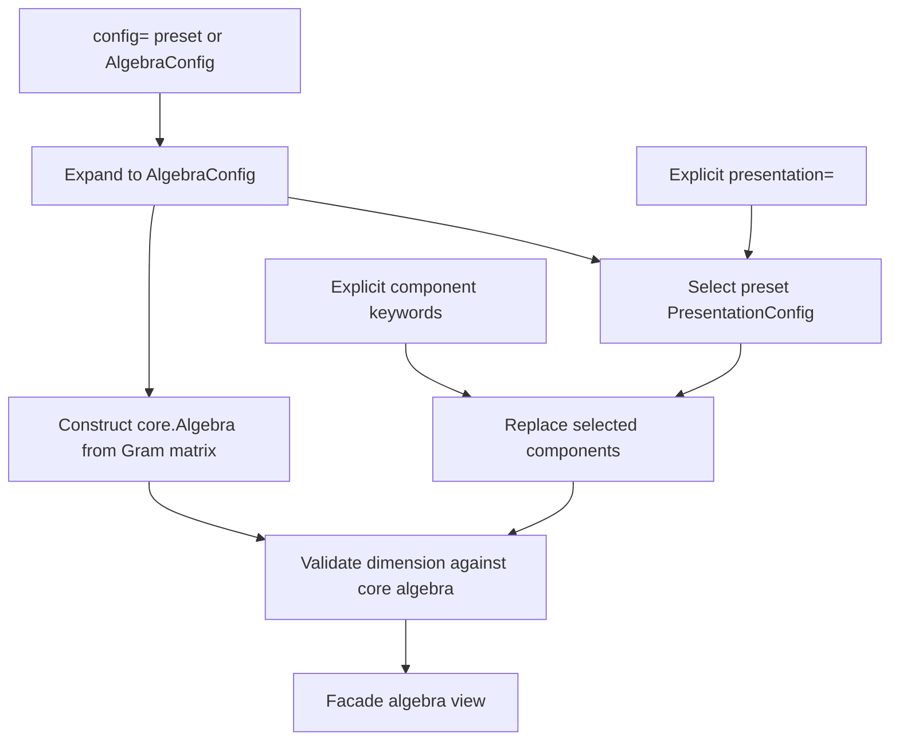

# Presentation Configuration Implementation

## Purpose

Galaga 2 now has a presentation layer over the completed numeric facade. It
answers two different user needs with one architecture:

- “construct the conventional algebra for me”; and
- “let me replace exactly one naming, notation, local, ordering, or display
  choice.”

The implementation does not render expressions yet. It establishes the
immutable objects, signed blade semantics, preset expansion, facade factories,
and context-safe selection that later expression and rendering phases consume.

## System boundary



The dependency rule remains strict: `galaga.core` knows nothing about names,
presets, notation, contexts, or rendering. The facade composes those objects
around one core algebra.

## Component decomposition

| Component | Module | Responsibility |
|---|---|---|
| Target names | `galaga.names` | Immutable ASCII, Unicode, and LaTeX spellings |
| Blade vocabulary | `galaga.blades` | Complete labels, signed references, aliases, semantic roles, locals, and ordering |
| Configuration | `galaga.presentation` | Immutable presentation groups, numeric definitions, and model metadata |
| Conventional setups | `galaga.presets` | Deterministic complete `AlgebraConfig` builders |
| Runtime composition | `galaga.facade` | Core construction, signed lookup, cheap views, and context-local selection |

### `Name`: one concept, three targets

`Name(ascii, unicode, latex)` keeps target spellings together without asking
the blade convention or renderer to infer one from another. Missing Unicode
falls back to ASCII; missing LaTeX falls back to Unicode. `for_target()` is the
single target-selection operation.

This object is deliberately smaller than notation. A blade called `e31` and
an operation rendered with `×` are separate concerns.

### `BladeRef`: signed lookup without a basis change

The numeric core stores exterior blades in ascending bit order. A
`BladeRef(mask, orientation)` refers to that storage with orientation `+1` or
`-1`. It cannot hold another scale and it cannot silently transform the basis.

Lengyel's displayed `e31` demonstrates why the sign belongs here:

```text
native mask 0b0101 = e1 ∧ e3
displayed e31       = e3 ∧ e1 = -(e1 ∧ e3)
```

Therefore `blade("e31")` has coefficient `-1` at mask `0b0101`, while
`blade("e13")` and `blade(0b0101)` have coefficient `+1`. The Gram matrix is
unchanged in all three cases.

### `BladeConvention`: complete and validated vocabulary

A convention must label all `2**n` native masks. It owns three kinds of name:

- canonical target-aware labels used for display;
- lookup aliases, which may be signed; and
- semantic roles such as `origin`, `infinity`, `projective`, or `time`.

Construction rejects missing masks, ambiguous canonical spellings, collisions,
duplicate aliases, and references outside the configured dimension. This
makes lookup deterministic before any multivector exists.

The supplied conventions cover default indexed and Euclidean blades,
spacetime gamma blades, PGA, orthogonal and native-null CGA, Lengyel RGA,
complex and quaternion subalgebra vocabularies, and explicit wedge notation
for exterior algebras.

### Local names and display order remain independent

`LocalNamePolicy` maps valid Python identifiers to signed blades. It is not
derived dynamically every time a display label changes. This permits a
Unicode teaching display while keeping ordinary ASCII notebook variables, or
changing display labels without renaming local bindings.

`DisplayOrder` is a complete permutation of bitmasks. It affects future
rendering order only; coefficient storage and numeric equality remain native
bitmask order.

Both expose immutable tuple storage or read-only mappings.

### `PresentationConfig`: replace one concern at a time

`PresentationConfig` groups:

```text
blades + notation + local_names + display_order + display
```

All dimensioned components must agree. `with_blades`, `with_notation`,
`with_local_names`, `with_display_order`, and `with_display` use dataclass
replacement: the selected component changes and all others retain their object
identity.

### Complete algebra configuration

`AlgebraDefinition` normalizes an immutable real symmetric Gram matrix and
stores the optional algebra id and product-backend request. It can also be
built from an ordered signature or `p, q, r` counts.

`ModelConfig` stores optional semantic model roles. `AlgebraConfig` validates
that numeric definition, model references, and presentation use the same
dimension.

This separation matters because changing a Gram entry creates a different
numeric algebra, whereas changing notation creates only a cheap view.

## Presets are configuration builders

A preset is a frozen object with inspectable parameters and a deterministic
`build()` method. It expands once into public configuration; the resulting
algebra is not permanently in a hidden preset mode.

| Preset | Numeric definition | Presentation highlights |
|---|---|---|
| `EuclideanPreset(n)` | `Cl(n, 0)` | Indexed Euclidean roles |
| `SpacetimePreset(...)` | Mostly-minus or mostly-plus `Cl(1, 3)` ordering | Gamma vocabulary, pseudoscalar `i`, and time/space roles |
| `PGAPreset(n)` | `n` positive vectors plus a final native null vector | Projective role |
| `CGAPreset(n, frame="null")` | Native null pair with configurable nonzero mutual product | Actual origin/infinity roles |
| `CGAPreset(n, frame="orthogonal")` | Positive/negative orthogonal conformal pair | Actual plus/minus roles |
| `LengyelRGAPreset(3)` | Three positive vectors plus a final null vector | Signed RGA vocabulary and Lengyel order |
| `ComplexPreset()` | Euclidean `Cl(2, 0)` | Bivector `i` |
| `QuaternionPreset()` | Euclidean `Cl(3, 0)` | Bivectors `i`, `j`, `k` and conventional order |
| `ExteriorPreset(n)` | All-zero Gram matrix | Explicit wedge labels |

Ergonomic `p_*` functions return these preset objects; they do not construct a
second kind of configuration.

```python
from galaga import Algebra, Notation, p_cga

algebra = Algebra(config=p_cga(3))
teaching = Algebra(config=p_cga(3), notation=Notation("teaching"))
```

Supplying `config=` together with `gram=`, a signature, or positional metric
arguments is an error because it would define the numeric algebra twice.

## Facade construction and factory behavior

The facade expands a config in this order:



`blade()` accepts a native integer bitmask, `BladeRef`, canonical name, alias,
semantic role, or a facade multivector from the same numeric algebra. Integer
masks always preserve native orientation. Named and signed forms apply only
their declared sign. A multivector input must be an exact signed unit basis
blade: the factory preserves its value and orientation but discards its name
and previous provenance. Passing `expr=True` attaches a fresh `BladeLiteral`,
which provides an explicit alternative to
`value.without_expr().with_expr()` when a computed factorization should become
a literal leaf in subsequent expressions.

`blades(*values, expr=False)` is the ordered batch form of `blade()`. It
accepts any mixture supported by the singular factory and applies one shared
expression-provenance choice, so notebook code can use explicit unpacking
without mutating `locals()`:

```python
e23, e31, e41, e42 = rga.blades(
    e2 ^ e3,
    e3 ^ e1,
    e4 ^ e1,
    e4 ^ e2,
    expr=True,
)
```

The result is a tuple in argument order. It intentionally has no batch
`name=` parameter because independent results require independent names;
call `named()` on those values when names are wanted.

`basis_vectors()`, `basis_blades()`, and `pseudoscalar()` remain native numeric
factories. `blade_label()` exposes the active canonical label. `locals()`
builds a read-only mapping using the independent local-name policy.

`with_presentation()` and the component-specific `with_*` methods create a
new facade algebra sharing the exact same `core.Algebra`. Consequently values
from two presentation views have the same core owner and retain equality and
hash behavior.

## Scoped presentation selection

The active presentation is resolved in this order:

```text
explicit render argument
    > current use_presentation(...) scope
    > persistent facade-view presentation
```

`use_presentation()` stores its override in a `ContextVar` owned by the facade
algebra. Tokens restore nested scopes in last-in, first-out order, including
exceptional exits. Python context propagation gives each OS thread and each
interleaved async task an isolated effective value.

```python
with algebra.use_presentation(teaching_presentation):
    # Future display() calls resolve to teaching_presentation here.
    ...
```

There is no process-global display mode and no mutation of a shared config.

## Numeric invariants

Presentation code must preserve all of these rules:

1. A core exterior mask remains the coefficient identity.
2. A signed alias changes only the declared coefficient sign.
3. A display role never changes the Gram matrix.
4. A presentation view shares the same core algebra.
5. Scoped presentation does not affect operations, equality, or hashing.
6. Native-null and orthogonal conformal frames are different numeric configs,
   not two names for one basis.

## Validation and tests

The dedicated `tests/presentation` suite covers immutable replacement,
dimension and collision failures, every convention and preset, signed RGA
round trips, native coefficient identity, read-only locals, direct config
construction, nested and exceptional scope restoration, OS-thread isolation,
async-task isolation, and equality/hash invariance.

With the facade and compatibility contracts included, the Phase 4 validation
run has 214 passing tests. Branch coverage for the implemented boundary is:

| Module | Branch coverage |
|---|---:|
| `galaga.names` | 100% |
| `galaga.blades` | 97% |
| `galaga.presentation` | 100% |
| `galaga.presets` | 97% |
| `galaga.facade._numeric` | 98% |

## Later layers now built on this foundation

Phase 5 added optional expression provenance; see
[Expression provenance implementation](expression-provenance.md). Phase 6 has
now extended `Notation` from stable token metadata to immutable semantic
`RenderRule` values and implemented the shared render tree, ASCII, Unicode,
LaTeX, content policy, format protocol, and rich hooks. See
[Semantic rendering implementation](rendering-implementation.md).

The original presentation invariants remain intact: changing a persistent,
context-local, or per-render presentation does not change expression identity,
evaluation, equality, hashing, or numeric coefficients. `DisplayPolicy` now
also supports `content="auto"`; a name opts into an explanatory equality while
expression tracking alone continues to display the concrete value by default.
Its `zero_tolerance` and `coefficient_precision` fields control visible numeric
noise and significant digits only. Their compatibility defaults are `1e-12`
and six, respectively; setting the tolerance to zero reveals every nonzero
stored coefficient.
