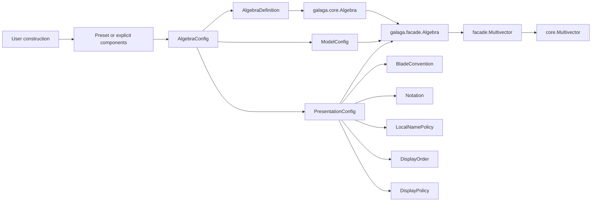
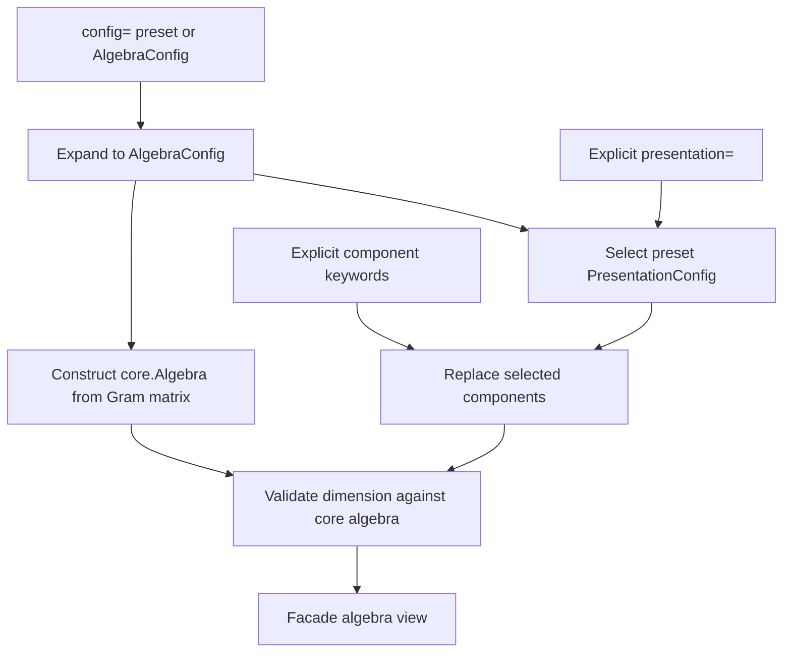

# Presentation Configuration Implementation

## Purpose

Galaga 2 now has a presentation layer over the completed numeric facade. It
answers two different user needs with one architecture:

- “construct the conventional algebra for me”; and
- “let me replace exactly one naming, notation, local, ordering, or display
  choice.”

The completed implementation supplies immutable objects, signed blade
semantics, preset expansion, facade factories, context-safe selection, and the
configuration consumed by the shared expression/value renderer.

## System boundary


```mermaid
flowchart LR
    U[User construction] --> P[Preset or explicit components]
    P --> AC[AlgebraConfig]
    AC --> D[AlgebraDefinition]
    AC --> M[ModelConfig]
    AC --> PC[PresentationConfig]

    D --> C[galaga.core.Algebra]
    PC --> F[galaga.facade.Algebra]
    M --> F
    C --> F

    PC --> B[BladeConvention]
    PC --> N[Notation]
    PC --> L[LocalNamePolicy]
    PC --> O[DisplayOrder]
    PC --> DP[DisplayPolicy]

    F --> V[facade.Multivector]
    V --> CV[core.Multivector]
```

The dependency rule remains strict: `galaga.core` knows nothing about names,
presets, notation, contexts, or rendering. The facade composes those objects
around one core algebra.

## Component decomposition

| Component | Module | Responsibility |
|---|---|---|
| Target names | `galaga.names` | Immutable ASCII, Unicode, and LaTeX spellings |
| Blade vocabulary | `galaga.blades` | Complete labels, signed references, aliases, semantic roles, locals, and ordering |
| Configuration | `galaga.presentation` | Immutable presentation groups, numeric definitions, and model metadata |
| Conventional setups | `galaga.presets` | Deterministic complete `AlgebraConfig` builders |
| Runtime composition | `galaga.facade` | Core construction, signed lookup, cheap views, and context-local selection |

### `Name`: one concept, three targets

`Name(ascii, unicode, latex)` keeps target spellings together without asking
the blade convention or renderer to infer one from another. Missing Unicode
falls back to ASCII; missing LaTeX falls back to Unicode. `for_target()` is the
single target-selection operation.

When the LaTeX spelling is known first, opt into bounded conversion:

```python
from galaga import Name
from galaga.names import LatexSymbols

normal = Name.from_latex(r"\hat{n}")
assert normal.variants == ("hat_n", "n\u0302", r"\hat{n}")
assert LatexSymbols().lookup(r"\mathbb{a}") == ("𝕒", "a")
```

`Name.from_latex` accepts explicit `ascii=` and `unicode=` overrides.
It strips surrounding whitespace and requires `ascii=` for unsupported
LaTeX; the Unicode fallback then uses that ASCII spelling. Plain `Name`
construction and `named(...)` keep their existing non-inferential behavior.
See the [migration guide](migration-guide.md#derive-a-name-from-latex-explicitly)
for supported forms and unsupported-input examples.

This object is deliberately smaller than notation. A blade called `e31` and
an operation rendered with `×` are separate concerns.

LaTeX superscripts and subscripts protect existing scripts and recognized
outer operators in explicit labels; see the
[scripted-label example](migration-guide.md#scripted-and-compound-labels).
This is a bounded emission guard, not name conversion or expression parsing.
Supply explicitly grouped spellings for more complex opaque labels.

### `BladeRef`: signed lookup without a basis change

The numeric core stores exterior blades in ascending bit order. A
`BladeRef(mask, orientation)` refers to that storage with orientation `+1` or
`-1`. It cannot hold another scale and it cannot silently transform the basis.

Lengyel's displayed `e31` demonstrates why the sign belongs here:

```text
native mask 0b0101 = e1 ∧ e3
displayed e31       = e3 ∧ e1 = -(e1 ∧ e3)
```

Therefore `blade("e31")` has coefficient `-1` at mask `0b0101`, while
`blade("e13")` and `blade(0b0101)` have coefficient `+1`. The Gram matrix is
unchanged in all three cases.

### `BladeConvention`: complete and validated vocabulary

A convention must label all `2**n` native masks. It owns three kinds of name:

- canonical target-aware labels used for display;
- lookup aliases, which may be signed; and
- semantic roles such as `origin`, `infinity`, `projective`, or `time`.

Construction rejects missing masks, ambiguous canonical spellings, collisions,
duplicate aliases, and references outside the configured dimension. This
makes lookup deterministic before any multivector exists.

The supplied conventions cover default indexed and Euclidean blades,
spacetime gamma blades, PGA, orthogonal and native-null CGA, Lengyel RGA,
complex and quaternion subalgebra vocabularies, and explicit wedge notation
for exterior algebras.

Indexed conventions support `style="compact"`, `"juxtapose"`, or `"wedge"`.
Model-specific builders expose that choice when the model's semantic basis
roles must be retained. For example, a native-null CGA can juxtapose its basis
vectors while preserving `origin` and `infinity` lookup:

```python
from galaga import Algebra, null_cga_blade_convention, p_cga

cga = Algebra(
    config=p_cga(spatial_dim=3),
    blades=null_cga_blade_convention(3, style="juxtapose"),
)
```

Its pseudoscalar is displayed as
$e_{1} e_{2} e_{3} e_{o} e_{\infty}$. This changes only blade presentation;
the preset's native-null Gram matrix and model roles remain unchanged.

The `3` in both calls is the Euclidean spatial dimension. Each native-null CGA
builder adds $e_o$ and $e_\infty$, so the resulting algebra and convention
both have total dimension five. Passing `5` to the blade builder would create
a seven-dimensional convention and correctly fail the facade's dimension
validation when combined with `p_cga(spatial_dim=3)`.

### STA product names are derived, not unsigned synonyms

`p_sta(sigmas=True, pseudovectors=True)` computes conventional names from
its own ordered metric. Defaults remain plain gamma words and pseudoscalar
`i`. With $I=\gamma_0\gamma_1\gamma_2\gamma_3$, `s1` … `s3` name
$\gamma_k\gamma_0$, `is1` … `is3` name $I\gamma_k\gamma_0$, and
`ig0` … `ig3` name $I\gamma_k$.

`p_sta("mostly-plus", ...)` uses $(-,+,+,+)$; it is not the same ordered
frame as `Algebra(3, 1)`, whose squares are $(+,+,+,-)$.
The standalone `spacetime_blade_convention` accepts these flags only with an
explicit ordered four-entry ±1 `signature`. Its bounded word reduction works
for all sixteen unit-diagonal sign patterns, without assigning physical time
from inertia. This is not a general-Gram product interface.

Pass `algebra.basis_squares` only when the algebra's frame is orthogonal and
unit diagonal. A convention does not carry a metric-binding restriction:
applying labels to a different frame does not re-derive their signs. Prefer
the complete preset when constructing STA. For oblique, scaled, or degenerate
frames, name actual computed multivectors instead of treating products as
signed unit-blade references.

All canonical target spellings resolve to the signed product.
`blade("s1")` is $\gamma_1\gamma_0$, while the retained alias
`blade("g0g1")` is the positive native $\gamma_0\gamma_1$.
Preset locals have the same signed meaning. See
[ADR-104](../adrs/104-metric-derived-sta-names-and-public-blade-contracts.md)
and the [construction notebook](../../examples/galaga_v2/algebra_construction.py).

### Local names and display order remain independent

`LocalNamePolicy` maps valid Python identifiers to signed blades. It is not
derived dynamically every time a display label changes. This permits a
Unicode teaching display while keeping ordinary ASCII notebook variables, or
changing display labels without renaming local bindings.

`locals()` preserves policy insertion order and returns fresh named values
in a read-only mapping. Their semantic name is the Python key; request
`value.display("value/unicode")` to see the blade label instead.
`LocalNamePolicy.from_convention` selects valid canonical ASCII identifiers,
excluding scalars and keywords. It does not include aliases or roles,
sanitize names, or compact products: wedge `v1^v2` is omitted and juxtaposed
`v1v2` remains unchanged. A separate compact convention can provide `v12`
without changing display labels.

`locals(expr=True)` gives those values symbol provenance. Replay uses
`evaluate(expr, algebra=algebra, environment=bindings)`. Without an environment,
use a literal from `algebra.blade(value, expr=True)` instead.
`locals(expr=False)` omits initial expression leaves, but the values still
have names, so subsequent operations record symbolic provenance.
See the [locals migration recipes](migration-guide.md#migrate-local-bindings)
and [presentation notebook](../../examples/galaga_v2/presentation_contexts.py).

`DisplayOrder` is a complete permutation of bitmasks. It affects rendering
order only; coefficient storage, basis enumeration, and numeric equality
remain native. Its default groups by grade, then lexicographically by numeric
basis-index tuples: in four dimensions, bivectors display as
`e12, e13, e14, e23, e24, e34`. It does not sort rendered labels or use bitmask
order within a grade. Existing explicit preset orders (quaternion, RGA and
Lengyel CGA) take precedence. To request native coefficient order explicitly:

```python
from galaga import Algebra, DisplayOrder

algebra = Algebra(3)
native_order = algebra.with_display_order(DisplayOrder(algebra.n, range(algebra.dim)))
```

Any explicit complete permutation is preserved. To select the general
grade-then-lexicographic order even for a preset with its own convention, use
`algebra.with_display_order(DisplayOrder(algebra.n))`. See
[ADR-133](../adrs/133-grade-lexicographic-default-display-order.md).

Quaternion presets select conventional `1, i, j, k` display order, but
`basis_blades(2)` still returns the native masks, labeled `k, j, i`. Obtain
semantic units with `blade("quaternion_i")`, `blade("quaternion_j")`, and
`blade("quaternion_k")`. This differs from v1's presentation-ordered
enumeration; the underlying quaternion values and products are unchanged.

The quaternion coordinates are `i=e23`, `j=e13`, `k=e12` in Euclidean
`Cl(3,0)`. Scalars plus bivectors form its even subalgebra; bivectors alone
are not closed under multiplication. Complex numbers similarly occupy the
even subalgebra of Euclidean `Cl(2,0)`. Reverse and Clifford conjugation agree
there, but not on general ambient values with odd grades.

Complete presets supply those Euclidean metrics. Applying only the blade
convention to a different Gram matrix does not validate or change its numeric
meaning: a blade labeled `i` need not square to `-1`.
For custom vector labels, preserve the complete convention's signed references,
aliases and roles, and explicitly choose any compound names.
See the [migration recipe](migration-guide.md#migrate-complex-and-quaternion-conventions)
and [teaching notebook](../../examples/basics/complex_and_quaternions.py).

Both expose immutable tuple storage or read-only mappings.

### `PresentationConfig`: replace one concern at a time

Operation notation is an immutable `Notation` with `RenderRule` values
keyed by stable IDs. `with_rule` replaces one generic or target-specific
rule without mutating shared presets. Existing target-specific rules still
take priority over a generic replacement; pass `target=` to replace one
explicitly.

`RenderRule("unit_fraction")` is an opt-in `unit` layout for the teaching
step $x/\lVert x\rVert$, with unchanged eager values and provenance.
The [custom-notation notebook](../../examples/galaga_v2/custom_functional_notation.py)
demonstrates it alongside functional overrides and the Hestenes dagger preset.
See the [migration example](migration-guide.md#migrate-custom-notation-with-immutable-rules).

`PresentationConfig` groups:

```text
blades + notation + local_names + display_order + display
```

All dimensioned components must agree. `with_blades`, `with_notation`,
`with_local_names`, `with_display_order`, and `with_display` use dataclass
replacement: the selected component changes and all others retain their object
identity.

### Complete algebra configuration

`AlgebraDefinition` normalizes an immutable real symmetric Gram matrix and
stores the optional algebra id and product-backend request. It can also be
built from an ordered signature or `p, q, r` counts.

`ModelConfig` stores optional semantic model roles. `AlgebraConfig` validates
that numeric definition, model references, and presentation use the same
dimension.

This separation matters because changing a Gram entry creates a different
numeric algebra, whereas changing notation creates only a cheap view.

## Presets are configuration builders

A preset is a frozen object with inspectable parameters and a deterministic
`build()` method. It expands once into public configuration; the resulting
algebra is not permanently in a hidden preset mode.

| Preset | Numeric definition | Presentation highlights |
|---|---|---|
| `EuclideanPreset(n)` | `Cl(n, 0)` | Indexed Euclidean roles |
| `SpacetimePreset(...)` | Mostly-minus or mostly-plus `Cl(1, 3)` ordering | Gamma vocabulary, pseudoscalar `i`, and time/space roles |
| `PGAPreset(n)` | `n` positive vectors plus a final native null vector | Projective role |
| `CGAPreset(n, frame="null")` | Origin-first native null pair with configurable nonzero mutual product | Actual origin/Euclidean/infinity roles |
| `CGAPreset(n, frame="orthogonal")` | Positive/negative orthogonal conformal pair | Actual plus/minus roles |
| `LengyelCGAPreset(3)` | Standard native-null CGA | Bold signed $e_1,\ldots,e_5$ blades, Lengyel order, and unit antiscalar $𝟙$ |
| `LengyelRGAPreset(3)` | Three positive vectors plus a final null vector | Signed RGA vocabulary and Lengyel order |
| `ComplexPreset()` | Euclidean `Cl(2, 0)` | Bivector `i` |
| `QuaternionPreset()` | Euclidean `Cl(3, 0)` | Bivectors `i`, `j`, `k` and conventional order |
| `ExteriorPreset(n)` | All-zero Gram matrix | Explicit wedge labels |

The concise `presets.*` functions are preferred for new code; the ergonomic
`p_*` functions remain compatibility spellings and return the same preset
objects. They do not construct a second kind of configuration.

```python
from galaga import Algebra, Notation, presets

algebra = Algebra(config=presets.cga(3))
teaching = Algebra(config=presets.cga(3), notation=Notation("teaching"))
named_sta = Algebra(1, 3, blades=presets.blades.sta(sigmas=True))
```

Null CGA defaults to the actual native order $(e_o,e_1,\ldots,e_n,e_\infty)$.
`presets.cga(n, basis_order="euclidean-first")` selects the earlier native
coordinate order. This changes Gram rows/columns, role masks and exterior
coordinates, not just display. The same option on `presets.blades.cga`
validates matching Gram coordinates without transforming them. For orthogonal
CGA omit the order option; Euclidean/plus/minus order stays unchanged.
Lengyel CGA, RGA and quaternion conventions retain their intentional orders.
Existing `display_order=` overrides are independent and keep precedence.
See [ADR-134](../adrs/134-origin-first-native-null-cga.md).

Both complete and blade-only CGA recipes display native `I` by default.
`model_pseudoscalars=True` selects paired `IE`/`IC` Python names
(LaTeX $I_E$/$I_C$), and
`pseudoscalar_null=True` names `E = eo ^ einf`. `pss=None` means automatic;
an explicit string or `Name` overrides the native top label without changing
its sign. Expanded blade spellings remain aliases. In 1D, `e1` stays canonical
and `IE` is lookup-only. The LaTeX spellings remain lookup aliases.
Complete preset locals follow canonical names;
explicit local policies and blade-only overrides retain their independence.
See [ADR-135](../adrs/135-cga-pseudoscalar-names-and-exact-orientations.md).

Blade recipes are resolved only after the target algebra's Gram matrix exists.
This lets metric-derived STA names use the actual ordered unit signature and
reject unsupported off-diagonal or scaled metrics. A blade recipe changes the
blade convention only; it does not change the Gram matrix, model, notation,
display order, or local-name policy.

Supplying `config=` together with `gram=`, a signature, or positional metric
arguments is an error because it would define the numeric algebra twice.

## Facade construction and factory behavior

The facade expands a config in this order:


```mermaid
flowchart TD
    A[config= preset or AlgebraConfig] --> E[Expand to AlgebraConfig]
    E --> G[Construct core.Algebra from Gram matrix]
    E --> P[Select preset PresentationConfig]
    X[Explicit presentation=] --> P
    C[Explicit component keywords] --> R[Replace selected components]
    P --> R
    R --> V[Validate dimension against core algebra]
    G --> V
    V --> F[Facade algebra view]
```

`blade()` accepts a native integer bitmask, `BladeRef`, canonical name, alias,
semantic role, or a facade multivector from the same numeric algebra. Integer
masks always preserve native orientation. Named and signed forms apply only
their declared sign. A multivector input must be an exact signed unit basis
blade: the factory preserves its value and orientation but discards its name
and previous provenance. Passing `expr=True` attaches a fresh `BladeLiteral`,
which provides an explicit alternative to
`value.without_expr().with_expr()` when a computed factorization should become
a literal leaf in subsequent expressions.

`blades(*values, expr=None)` is the ordered batch form of `blade()`. Omitted
or `None` inherits `algebra.expr` (false unless enabled at construction);
an explicit boolean overrides that default. It
accepts any mixture supported by the singular factory and applies one shared
expression-provenance choice, so notebook code can use explicit unpacking
without mutating `locals()`:

```python
e23, e31, e41, e42 = rga.blades(
    e2 ^ e3,
    e3 ^ e1,
    e4 ^ e1,
    e4 ^ e2,
    expr=True,
)
```

The result is a tuple in argument order. It intentionally has no batch
`name=` parameter because independent results require independent names;
call `named()` on those values when names are wanted.

`basis_vectors()`, `basis_blades()`, and `pseudoscalar()` remain native numeric
factories. `blade_label()` exposes the active canonical label. `locals()`
builds a read-only mapping using the independent local-name policy.

`with_presentation()` and the component-specific `with_*` methods create a
new facade algebra sharing the exact same `core.Algebra`. Consequently values
from two presentation views have the same core owner and retain equality and
hash behavior.

## Scoped presentation selection

The active presentation is resolved in this order:

```text
explicit render argument
    > current use_presentation(...) scope
    > persistent facade-view presentation
```

`use_presentation()` stores its override in a `ContextVar` owned by the facade
algebra. Tokens restore nested scopes in last-in, first-out order, including
exceptional exits. Python context propagation gives each OS thread and each
interleaved async task an isolated effective value.

```python
with algebra.use_presentation(teaching_presentation):
    # Display calls resolve to teaching_presentation here.
    ...
```

There is no process-global display mode and no mutation of a shared config.

## Labelled bilinear form tables

The public facade provides a rich-display view of the stored Gram matrix:

```python
from galaga import Algebra

algebra = Algebra(gram=[[1, 0.5], [0.5, -1]])
table = algebra.bilinear_form_table()
table.latex()    # Raw LaTeX array, with no math delimiters.
print(table)    # Aligned Unicode table; table.ascii() is also available.
```

Use `table` as a Marimo cell's final expression, or interpolate it with
`gm.md(t"""{table}""")` on Python 3.14. Both rich-display paths supply one
display-math wrapper. The LaTeX array has a bullet corner, basis labels on
both axes, header rules, and exact zeros coloured `#bbbbbb` without global
macros.

The returned immutable `galaga.display.BilinearFormTable` captures the
active (including scoped) vector names, coefficient precision and default
target at creation. Create a new table to use a different presentation;
`.display(target="latex")`, `.unicode()` and `.ascii()` can still select
an output format for an existing snapshot.

Rows and columns always follow native Gram order, ignoring multivector
`DisplayOrder`. If a convention names `u = -e1`, the corresponding heading
is `-u`, so the entry still represents the stored native pairing. Exact
zeros alone are grey: `zero_tolerance` is deliberately ignored because
hiding a small nonzero coupling would misrepresent the defining metric.
Coefficient precision still controls significant digits.

This is a display object, not a basis transformation or a `MatrixRepr`;
raw numeric access remains `algebra.gram`. It adds no dependency on Marimo
or the matrix companion. See
[ADR-127](../adrs/127-renderable-native-bilinear-form-tables.md).

## Wedge product tables

`algebra.wedge_product_table(full=False, *, color=False, colour=False)`
returns an immutable `galaga.display.WedgeProductTable` with the same
snapshot, formatting, exact-zero and rich-display contracts as the Gram
table. The corner is a wedge; each cell contains the row blade's exterior
product with the column blade, in that order.

```python
algebra.wedge_product_table()                       # Vector axes only.
algebra.wedge_product_table(full=True, colour=True)  # Every exterior blade.
```

Vector axes follow native order. Full axes include scalar `1` and every native
exterior blade in the active multivector `DisplayOrder`: grade-then-lexicographic
by default, or the exact preset/user override. Both rows and columns use this
order, captured when the table is created. Scalar `1` occupies its selected
position; it is first by default. Signed headings and results agree with the
configured convention without changing the underlying native products.
Neither the metric nor `zero_tolerance` affects exterior-product entries.

Either `color=True` or `colour=True` enables LaTeX grade colouring of
nonzero result cells. Both spellings may be supplied: their Boolean OR is
used. All flags require Python booleans. Zeros stay `#bbbbbb`, headers
remain uncoloured, and plain-text targets have no colour escapes. Grade
zero is neutral; grades one through seven use blue, vermilion, green,
purple, orange, cyan and yellow. The eight-colour cycle then repeats.

The vector-only default has `n*n` result cells. Full tables have `4**n`
cells, so use small dimensions for an overview. The
[CGA Gram notebook](../../examples/matrix/cga_via_gram_matrix.py) compares
the two products and uses a full 3D Euclidean wedge table to teach the
scalar identity and graded commutation. See
[ADR-128](../adrs/128-wedge-product-tables-and-grade-colours.md).

## Numeric invariants

Presentation code must preserve all of these rules:

1. A core exterior mask remains the coefficient identity.
2. A signed alias changes only the declared coefficient sign.
3. A display role never changes the Gram matrix.
4. A presentation view shares the same core algebra.
5. Scoped presentation does not affect operations, equality, or hashing.
6. Native-null and orthogonal conformal frames are different numeric configs,
   not two names for one basis.

## Validation and tests

The dedicated `tests/presentation` suite covers immutable replacement,
dimension and collision failures, every convention and preset, generated blade
styles, signed RGA round trips, native coefficient identity, read-only locals,
direct config construction, nested and exceptional scope restoration,
OS-thread isolation, async-task isolation, and equality/hash invariance.

Run it from the repository root:

```bash
uv run pytest packages/galaga/tests/presentation -q
```

Exact historic test counts and coverage percentages are intentionally not part
of this living guide; release gates measure them from the current tree.

## Later layers now built on this foundation

Phase 5 added optional expression provenance; see
[Expression provenance implementation](expression-provenance.md). Phase 6 has
now extended `Notation` from stable token metadata to immutable semantic
`RenderRule` values and implemented the shared render tree, ASCII, Unicode,
LaTeX, content policy, format protocol, and rich hooks. See
[Semantic rendering implementation](rendering-implementation.md).

The original presentation invariants remain intact: changing a persistent,
context-local, or per-render presentation does not change expression identity,
evaluation, equality, hashing, or numeric coefficients. `DisplayPolicy` now
also supports `content="auto"`; a name opts into an explanatory equality while
expression tracking alone continues to display the concrete value by default.
Its `zero_tolerance` and `coefficient_precision` fields control visible numeric
noise and significant digits only. Their compatibility defaults are `1e-12`
and six, respectively; setting the tolerance to zero reveals every nonzero
stored coefficient.

Precision counts significant digits, not decimal places, and does not pad
trailing zeros. V2 multivector format specs select content and target, such as
`value/latex`; legacy numeric specs such as `.3f` currently raise `ValueError`.
See the [concrete-display migration notes](migration-guide.md#migrate-concrete-display-controls).
