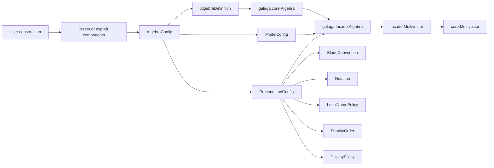
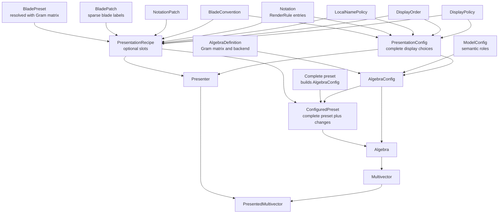
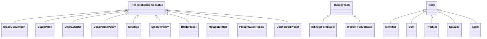
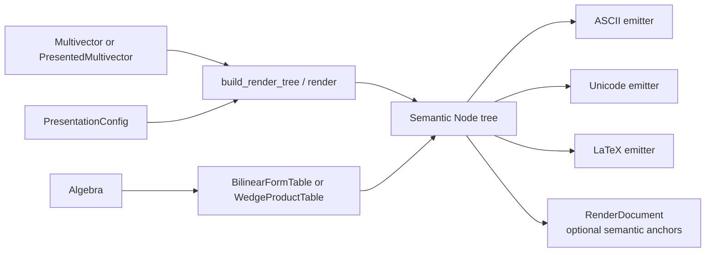
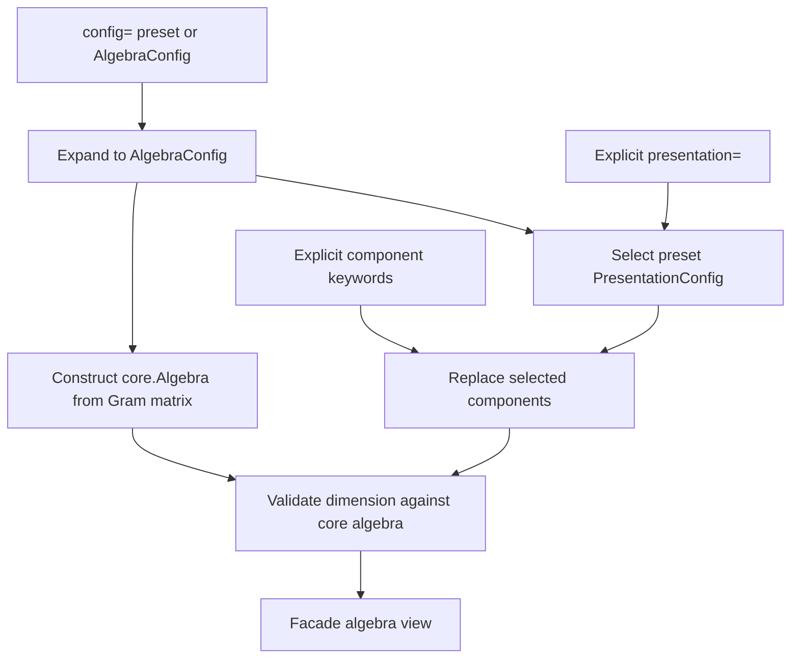

# Presentation Configuration Implementation

## Purpose

Galaga's presentation layer sits over the numeric facade. It supports two
common tasks:

- “construct the conventional algebra for me”; and
- “let me replace exactly one naming, notation, local, ordering, or display
  choice.”

It supplies immutable configuration objects, signed blade semantics, presets,
context-local selection, and a shared expression and value renderer.

## System boundary


```mermaid
flowchart LR
    U[User construction] --> P[Preset or explicit components]
    P --> AC[AlgebraConfig]
    AC --> D[AlgebraDefinition]
    AC --> M[ModelConfig]
    AC --> PC[PresentationConfig]

    D --> C[galaga.core.Algebra]
    PC --> F[galaga.facade.Algebra]
    M --> F
    C --> F

    PC --> B[BladeConvention]
    PC --> N[Notation]
    PC --> L[LocalNamePolicy]
    PC --> O[DisplayOrder]
    PC --> DP[DisplayPolicy]

    F --> V[facade.Multivector]
    V --> CV[core.Multivector]
```

The dependency rule remains strict: `galaga.core` knows nothing about names,
presets, notation, contexts, or rendering. The facade composes those objects
around one core algebra.

## Configuration and rendering object map

`PresentationConfig` holds a complete set of display choices.
`PresentationRecipe` holds optional changes to those choices. `Presenter`
applies them to a value and returns a `PresentedMultivector` with the selected
presentation captured for later display.


```mermaid
flowchart TD
    AD[AlgebraDefinition<br/>Gram matrix and backend] --> AC[AlgebraConfig]
    MC[ModelConfig<br/>semantic roles] --> AC
    PC[PresentationConfig<br/>complete display choices] --> AC
    BC[BladeConvention] --> PC
    N[Notation<br/>RenderRule entries] --> PC
    LN[LocalNamePolicy] --> PC
    DO[DisplayOrder] --> PC
    DP[DisplayPolicy] --> PC
    BP[BladePreset<br/>resolved with Gram matrix] --> PR[PresentationRecipe<br/>optional slots]
    BPatch[BladePatch<br/>sparse blade labels] --> PR
    NP[NotationPatch] --> PR
    BC --> PR
    N --> PR
    LN --> PR
    DO --> PR
    DP --> PR
    PR --> CP[ConfiguredPreset<br/>complete preset plus changes]
    FP[Complete preset<br/>builds AlgebraConfig] --> CP
    AC --> CP
    CP --> A[Algebra]
    AC --> A
    PR --> P[Presenter]
    PC --> P
    P --> PV[PresentedMultivector]
    A --> MV[Multivector]
    MV --> PV
```

The arrows show what each object contains, accepts, or produces; they are not
Python inheritance. A `presets.sta()` style factory supplies a complete preset
with `build()`. `ConfiguredPreset` pairs it with a recipe, and
`Algebra(config=...)` expands the result. `AlgebraDefinition` and `ModelConfig`
are absent from a presenter because displaying a value cannot change its
metric or semantic model.

The smaller Python inheritance hierarchy is separate:


```mermaid
classDiagram
    PresentationComposable <|-- BladeConvention
    PresentationComposable <|-- BladePatch
    PresentationComposable <|-- DisplayOrder
    PresentationComposable <|-- LocalNamePolicy
    PresentationComposable <|-- Notation
    PresentationComposable <|-- DisplayPolicy
    PresentationComposable <|-- BladePreset
    PresentationComposable <|-- NotationPatch
    PresentationComposable <|-- PresentationRecipe
    PresentationComposable <|-- ConfiguredPreset
    _DisplayTable <|-- BilinearFormTable
    _DisplayTable <|-- WedgeProductTable
    Node <|-- Identifier
    Node <|-- Sum
    Node <|-- Product
    Node <|-- Equality
    Node <|-- Table
```

`Presenter` implements `|` directly and is not a subclass of
`PresentationComposable`. `_DisplayTable` is internal; its two concrete table
types are returned by algebra table methods. The listed `Node` types are
representative; the renderer has more node shapes for calls, fractions,
scripts, accents, and delimiters.

| Object | Complete or partial? | Typical use |
| --- | --- | --- |
| `AlgebraDefinition` | Complete numeric definition | Explicit Gram matrix, signature, or `p, q, r` plus backend choice |
| `ModelConfig` | Optional model metadata | Semantic basis roles such as `origin` or `time` |
| `AlgebraConfig` | Complete algebra setup | Pass to `Algebra(config=...)` |
| `PresentationConfig` | Complete presentation snapshot | Pass as `presentation=` or obtain from `algebra.presentation` |
| `PresentationRecipe` | Partial presentation override | Compose independent components with `|` |
| `BladePatch` | Partial blade-label override | Rename the pseudoscalar with `presets.blades.pss(...)` |
| `ConfiguredPreset` | Complete preset plus partial override | Pass `presets.sta() | recipe` to `Algebra(config=...)` |
| `Presenter` | Deferred value display choice | Call on a multivector or compose a presenter factory with `|` |
| `PresentedMultivector` | Value plus captured presentation | Display later; use `.value` for arithmetic |

The five `PresentationConfig` components have separate jobs: `BladeConvention`
names and resolves signed blades; `Notation` maps operation IDs and targets to
`RenderRule` objects; `LocalNamePolicy` chooses names for `locals()`;
`DisplayOrder` chooses blade order; and `DisplayPolicy` chooses content, target,
zero tolerance, and coefficient precision. `BladePreset` is a factory for a
convention that may need the actual Gram matrix. `NotationPatch` changes part
of an existing notation, such as its reverse symbol.

`BladePatch` changes the top-grade label of an existing blade convention,
preserving signed orientation, other labels, aliases, and roles:

```python
from galaga import Algebra, LocalNamePolicy, Presenter, presets

patch = presets.blades.pss("i")
algebra = Algebra(0, 1, blades=patch)
(i,) = algebra.basis_vectors()
assert (2 + 3 * i).display("value/ascii") == "2 + 3i"

# Python bindings are a separate choice.
local_names = LocalNamePolicy.from_convention(algebra.presentation.blades)
assert list(algebra.with_local_names(local_names).locals()) == ["i"]

other = Algebra(3)
view = (presets.presenters.values() | presets.blades.pss("J"))(other.I)
assert view.ascii() == "J"
assert Presenter(blades=presets.blades.pss("J"))(other.I).ascii() == "J"
```

Compose a patch after a full blade selection, such as
`presets.blades.indexed(3, prefix="v") | presets.blades.pss("J")`. The
rightmost patch wins. A later full blade selection replaces the earlier
selection and its patch. A recipe supplied as `blades=` may contain only
blade components; use `presentation=` for recipes containing other choices.

Use `presets.display.override(...)` for composable display changes. A policy
records which fields were supplied, so a precision change does not reset an
earlier content or target choice. Supplying a default value explicitly resets
that choice. `PresentationConfig.display` always contains all four resolved
values for rendering.

```python
from galaga import Algebra, Presenter, presets

recipe = presets.blades.indexed(3, prefix="v") | presets.notation.functional_short()
algebra = Algebra(config=presets.euclidean(3) | recipe, expr=True)
e1, e2, _ = algebra.basis_vectors()

# The same partial recipe can be applied to an existing algebra or value.
alternate = Algebra(3, expr=True).with_presentation(recipe)
presenter = Presenter(config=recipe) | presets.display.override(content="full")
view = presenter(e1 * e2)
assert view.value == e1 * e2
```

At algebra construction, `|` merges component slots with right-hand
precedence. Two `Notation` objects merge token and rule maps; a
`NotationPatch` changes only its specified rules. A complete algebra preset
may be on the left of a recipe, but two complete presets cannot be joined.
`Algebra.with_presentation(recipe)` returns an algebra view, while
`Algebra.use_presentation(recipe)` applies it within a context.

For presenters, `|` creates a `Presenter` whose stages apply left to right
when it sees a value. The value's current presentation supplies unspecified
components. The later stage wins on overlap, including `content`:

```python
named = presets.presenters.short_functional() | presets.blades.indexed(3, prefix="v")
assert isinstance(named, Presenter)
assert named(e1 * e2).ascii() == "gp(v1, v2) = v12"

full = presets.presenters.values() | presets.display.override(content="full")
assert full(e1).presentation.display.content == "full"
```

The `Presenter` constructor also takes `presentation=` for a complete base
snapshot, `config=` for a partial recipe, and direct `blades=`, `notation=`,
`local_names=`, `display_order=`, `display=`, and `content=` overrides. Within
one constructor call, the complete base comes first, then `config=`, then
direct fields, with `content=` last. Within a `|` chain, each entire presenter
or component applies after its left neighbor. A presenter composition cannot
take a complete algebra preset, because the value's metric must stay fixed.

### Rendering classes and flow


```mermaid
flowchart LR
    V[Multivector or PresentedMultivector] --> B[build_render_tree / render]
    PC[PresentationConfig] --> B
    B --> T[Semantic Node tree]
    T --> EA[ASCII emitter]
    T --> EU[Unicode emitter]
    T --> EL[LaTeX emitter]
    T --> RD[RenderDocument<br/>optional semantic anchors]
    A[Algebra] --> BT[BilinearFormTable or WedgeProductTable]
    BT --> T
```

`galaga.render(value, target="latex")` returns a string. `build_render_tree`
returns a format-neutral tree and selected target for advanced consumers.
The tree's `Node` subclasses, such as `Identifier`, `Sum`, `Product`,
`Fraction`, `Equality`, and `Table`, and the `RenderDocument` anchor classes
live in `galaga.rendering`. Most notebook code uses `.latex()`, `.unicode()`,
`.ascii()`, or rich display on a value or presenter view. Use
`view.render_document()` when a consumer needs semantic anchors. Tables from
`algebra.bilinear_form_table()` and `algebra.wedge_product_table()` are
immutable display snapshots; their target can be selected for each render,
while their labels and rows are captured when created.

## Component decomposition

| Component | Module | Responsibility |
|---|---|---|
| Target names | `galaga.names` | Immutable ASCII, Unicode, and LaTeX spellings |
| Blade vocabulary | `galaga.blades` | Complete labels, signed references, aliases, semantic roles, locals, and ordering |
| Configuration | `galaga.presentation` | Immutable presentation groups, numeric definitions, and model metadata |
| Conventional setups | `galaga.presets` | Deterministic complete `AlgebraConfig` builders |
| Runtime composition | `galaga.facade` | Core construction, signed lookup, cheap views, and context-local selection |

### `Name`: one concept, three targets

`Name(ascii, unicode, latex)` keeps target spellings together without asking
the blade convention or renderer to infer one from another. Missing Unicode
falls back to ASCII; missing LaTeX falls back to Unicode. `for_target()` is the
single target-selection operation.

When the LaTeX spelling is known first, opt into bounded conversion:

```python
from galaga import Name
from galaga.names import LatexSymbols

normal = Name.from_latex(r"\hat{n}")
assert normal.variants == ("hat_n", "n\u0302", r"\hat{n}")
assert LatexSymbols().lookup(r"\mathbb{a}") == ("𝕒", "a")
```

`Name.from_latex` accepts explicit `ascii=` and `unicode=` overrides.
It strips surrounding whitespace and requires `ascii=` for unsupported
LaTeX; the Unicode fallback then uses that ASCII spelling. Plain `Name`
construction and `named(...)` keep their existing non-inferential behavior.
See the [migration guide](migration-guide.md#derive-a-name-from-latex-explicitly)
for supported forms and unsupported-input examples.

This object is deliberately smaller than notation. A blade called `e31` and
an operation rendered with `×` are separate concerns.

LaTeX superscripts and subscripts protect existing scripts and recognized
outer operators in explicit labels; see the
[scripted-label example](migration-guide.md#scripted-and-compound-labels).
This is a bounded emission guard, not name conversion or expression parsing.
Supply explicitly grouped spellings for more complex opaque labels.

### `BladeRef`: signed lookup without a basis change

The numeric core stores exterior blades in ascending bit order. A
`BladeRef(mask, orientation)` refers to that storage with orientation `+1` or
`-1`. It cannot hold another scale and it cannot silently transform the basis.

Lengyel's displayed `e31` demonstrates why the sign belongs here:

```text
native mask 0b0101 = e1 ∧ e3
displayed e31       = e3 ∧ e1 = -(e1 ∧ e3)
```

Therefore `blade("e31")` has coefficient `-1` at mask `0b0101`, while
`blade("e13")` and `blade(0b0101)` have coefficient `+1`. The Gram matrix is
unchanged in all three cases.

### `BladeConvention`: complete and validated vocabulary

A convention must label all `2**n` native masks. It owns three kinds of name:

- canonical target-aware labels used for display;
- lookup aliases, which may be signed; and
- semantic roles such as `origin`, `infinity`, `projective`, or `time`.

Construction rejects missing masks, ambiguous canonical spellings, collisions,
duplicate aliases, and references outside the configured dimension. This
makes lookup deterministic before any multivector exists.

The supplied conventions cover default indexed and Euclidean blades,
spacetime gamma blades, PGA, orthogonal and native-null CGA, Lengyel RGA,
complex and quaternion subalgebra vocabularies, and explicit wedge notation
for exterior algebras.

Indexed conventions support `style="compact"`, `"juxtapose"`, or `"wedge"`.
Model-specific builders expose that choice when the model's semantic basis
roles must be retained. For example, a native-null CGA can juxtapose its basis
vectors while preserving `origin` and `infinity` lookup:

```python
from galaga import Algebra, null_cga_blade_convention, presets

cga = Algebra(
    config=presets.cga(spatial_dim=3),
    blades=null_cga_blade_convention(3, style="juxtapose"),
)
```

Its pseudoscalar is displayed as
$e_{1} e_{2} e_{3} e_{o} e_{\infty}$. This changes only blade presentation;
the preset's native-null Gram matrix and model roles remain unchanged.

The `3` in both calls is the Euclidean spatial dimension. Each native-null CGA
builder adds $e_o$ and $e_\infty$, so the resulting algebra and convention
both have total dimension five. Passing `5` to the blade builder would create
a seven-dimensional convention and correctly fail the facade's dimension
validation when combined with `presets.cga(spatial_dim=3)`.

### STA product names are derived, not unsigned synonyms

`presets.sta(sigmas=True, pseudovectors=True)` computes conventional names from
its own ordered metric. Defaults remain plain gamma words and pseudoscalar
`i`. With $I=\gamma_0\gamma_1\gamma_2\gamma_3$, `s1` … `s3` name
$\gamma_k\gamma_0$, `is1` … `is3` name $I\gamma_k\gamma_0$, and
`ig0` … `ig3` name $I\gamma_k$.

`presets.sta("mostly-plus", ...)` uses $(-,+,+,+)$; it is not the same ordered
frame as `Algebra(3, 1)`, whose squares are $(+,+,+,-)$.
The standalone `spacetime_blade_convention` accepts these flags only with an
explicit ordered four-entry ±1 `signature`. Its bounded word reduction works
for all sixteen unit-diagonal sign patterns, without assigning physical time
from inertia. This is not a general-Gram product interface.

Pass `algebra.basis_squares` only when the algebra's frame is orthogonal and
unit diagonal. A convention does not carry a metric-binding restriction:
applying labels to a different frame does not re-derive their signs. Prefer
the complete preset when constructing STA. For oblique, scaled, or degenerate
frames, name actual computed multivectors instead of treating products as
signed unit-blade references.

All canonical target spellings resolve to the signed product.
`blade("s1")` is $\gamma_1\gamma_0$, while the retained alias
`blade("g0g1")` is the positive native $\gamma_0\gamma_1$.
Preset locals have the same signed meaning. See
[ADR-104](../adrs/104-metric-derived-sta-names-and-public-blade-contracts.md)
and the [construction notebook](../../examples/galaga_v2/algebra_construction.py).

### Local names and display order remain independent

`LocalNamePolicy` maps valid Python identifiers to signed blades. It is not
derived dynamically every time a display label changes. This permits a
Unicode teaching display while keeping ordinary ASCII notebook variables, or
changing display labels without renaming local bindings.

`locals()` preserves policy insertion order and returns fresh named values
in a read-only mapping. Their semantic name is the Python key; request
`value.display("value/unicode")` to see the blade label instead.
`LocalNamePolicy.from_convention` selects valid canonical ASCII identifiers,
excluding scalars and keywords. It does not include aliases or roles,
sanitize names, or compact products: wedge `v1^v2` is omitted and juxtaposed
`v1v2` remains unchanged. A separate compact convention can provide `v12`
without changing display labels.

`locals(expr=True)` gives those values symbol provenance. Replay uses
`evaluate(expr, algebra=algebra, environment=bindings)`. Without an environment,
use a literal from `algebra.blade(value, expr=True)` instead.
`locals(expr=False)` omits initial expression leaves, but the values still
have names, so subsequent operations record symbolic provenance.
See the [locals migration recipes](migration-guide.md#migrate-local-bindings)
and [presentation notebook](../../examples/galaga_v2/presentation_contexts.py).

`DisplayOrder` is a complete permutation of bitmasks. It affects rendering
order only; coefficient storage, basis enumeration, and numeric equality
remain native. Its default groups by grade, then lexicographically by numeric
basis-index tuples: in four dimensions, bivectors display as
`e12, e13, e14, e23, e24, e34`. It does not sort rendered labels or use bitmask
order within a grade. Existing explicit preset orders (quaternion, RGA and
Lengyel CGA) take precedence. To request native coefficient order explicitly:

```python
from galaga import Algebra, DisplayOrder

algebra = Algebra(3)
native_order = algebra.with_display_order(DisplayOrder(algebra.n, range(algebra.dim)))
```

Any explicit complete permutation is preserved. To select the general
grade-then-lexicographic order even for a preset with its own convention, use
`algebra.with_display_order(DisplayOrder(algebra.n))`. See
[ADR-133](../adrs/133-grade-lexicographic-default-display-order.md).

Quaternion presets select conventional `1, i, j, k` display order, but
`basis_blades(2)` still returns the native masks, labeled `k, j, i`. Obtain
semantic units with `blade("quaternion_i")`, `blade("quaternion_j")`, and
`blade("quaternion_k")`. This differs from v1's presentation-ordered
enumeration; the underlying quaternion values and products are unchanged.

`basis_vectors()` and `basis_blades(k)` are unpackable, indexable sequences.
In notebooks they render a table of sequence indices and blade values. The
table rows follow `display_order`, while sequence indices retain native mask
order. Only the grade requested by `basis_blades(k)` appears in its table.
Terminal IPython shows the same sequence as a plain-text table in the selected
ASCII or Unicode display target.

The quaternion coordinates are `i=e23`, `j=e13`, `k=e12` in Euclidean
`Cl(3,0)`. Scalars plus bivectors form its even subalgebra; bivectors alone
are not closed under multiplication. Complex numbers similarly occupy the
even subalgebra of Euclidean `Cl(2,0)`. Reverse and Clifford conjugation agree
there, but not on general ambient values with odd grades.

Complete presets supply those Euclidean metrics. Applying only the blade
convention to a different Gram matrix does not validate or change its numeric
meaning: a blade labeled `i` need not square to `-1`.
For custom vector labels, preserve the complete convention's signed references,
aliases and roles, and explicitly choose any compound names.
See the [migration recipe](migration-guide.md#migrate-complex-and-quaternion-conventions)
and [teaching notebook](../../examples/basics/complex_and_quaternions.py).

Both expose immutable tuple storage or read-only mappings.

### `PresentationConfig`: replace one concern at a time

Operation notation is an immutable `Notation` with `RenderRule` values
keyed by stable IDs. `with_rule` replaces one generic or target-specific
rule without mutating shared presets. Existing target-specific rules still
take priority over a generic replacement; pass `target=` to replace one
explicitly.

`RenderRule("unit_fraction")` is an opt-in `unit` layout for the teaching
step $x/\lVert x\rVert$, with unchanged eager values and provenance.
The [custom-notation notebook](../../examples/galaga_v2/custom_functional_notation.py)
demonstrates it alongside functional overrides and the Hestenes dagger preset.
See the [migration example](migration-guide.md#migrate-custom-notation-with-immutable-rules).

`PresentationConfig` groups:

```text
blades + notation + local_names + display_order + display
```

All dimensioned components must agree. `with_blades`, `with_notation`,
`with_local_names`, and `with_display_order` replace one complete component.
`with_display` applies only the display fields supplied in its argument. All
other components retain their object identity.

### Complete algebra configuration

`AlgebraDefinition` normalizes an immutable real symmetric Gram matrix and
stores the optional algebra id and product-backend request. It can also be
built from an ordered signature or `p, q, r` counts.

`ModelConfig` stores optional semantic model roles. `AlgebraConfig` validates
that numeric definition, model references, and presentation use the same
dimension.

This separation matters because changing a Gram entry creates a different
numeric algebra, whereas changing notation creates only a cheap view.

## Presets are configuration builders

A preset is a frozen object with inspectable parameters and a deterministic
`build()` method. It expands once into public configuration; the resulting
algebra is not permanently in a hidden preset mode.

Presentation components can be joined before construction with `|`:

```python
recipe = presets.blades.sta() | presets.notation.hestenes() | presets.display.override(coefficient_precision=4)
algebra = Algebra(config=presets.sta() | recipe)
```

The immutable `PresentationRecipe` stores optional slots until it is applied
to a complete preset or `AlgebraConfig`. On overlap, the right-hand component
replaces the left-hand slot, except that display overrides merge their
explicitly supplied fields. `presets.display.override(coefficient_precision=4)`
therefore preserves an earlier content, target, and zero tolerance. An explicit
default such as `content="auto"` resets that choice. A blade recipe resolves
against the complete config's Gram matrix at build time; the numeric definition
and model stay intact. Joining two complete algebra presets is unsupported.

Joining two `Notation` objects instead merges their token maps and their
rule maps using dictionary-style right-hand precedence. A rule key is the
pair `(operation_id, target)`, including `target=None` for generic rules. A
right-hand generic rule does not erase an existing LaTeX-specific rule, and
missing right-hand keys do not remove left-hand keys. In particular,
`default() | functional()` retains the default rules because `functional()`
has no explicit rules; use `functional()` alone to select it as a complete
notation.

For a single reverse-symbol change, compose a sparse patch with a preset:

```python
sta = Algebra(config=presets.sta() | presets.notation.override(reverse="dagger"))
```

The patch keeps the preset's other notation rules and presentation settings.
`reverse="tilde"` restores the conventional reverse symbol. A later patch
wins when both set `reverse`; a complete notation on the right replaces the
notation slot. `presets.notation.override(latex={"right_hodge_dual":
RenderRule("superscript", symbol=r"\star")})` replaces only one target rule.
The factory also accepts `ascii=`, `unicode=`, and a `rules=` map with generic
operation IDs or `(operation_id, target)` keys. See the
[notation override notebook](../../examples/galaga_v2/notation_overrides.py).
For common layouts, strings such as `left_hodge_dual="prefix:star"` and
`half_commutator="wrapper:1/2[,]"` can be passed as operation keywords.
These replace the operation's rules in all three output targets; put a string
in `latex=`, `unicode=`, or `ascii=` to select only one. Complete `RenderRule`
values remain available for precedence and other detailed options.
The symbol part accepts a curated set of single KaTeX commands, with Unicode
and ASCII spellings derived automatically. For example,
`left_hodge_dual="prefix:bigstar"` gives `\bigstar` in LaTeX, `★` in Unicode,
and `*` in ASCII. Other supported spellings include `star`, `diamond`,
`bullet`, `odot`, `cap`, `cup`, `curlywedge`, `perp`, and `parallel`. Use a
complete `RenderRule` with an explicit `Name` for a symbol outside this set.

An `Algebra` constructor applies a sparse notation patch directly in
`notation=`. Its `presentation=` argument accepts a complete
`PresentationConfig`, a `PresentationRecipe`, or a single presentation
component. A complete config replaces the base presentation; a recipe or
component changes only its selected slots. Individual keywords such as
`notation=` apply last:

```python
star = presets.notation.override(left_hodge_dual=r"prefix:\bigstar")
alg = Algebra(config=presets.euclidean(3), expr=True, notation=star)
same_notation = Algebra(config=presets.euclidean(3), expr=True, presentation=star)
```

| Preset | Numeric definition | Presentation highlights |
|---|---|---|
| `EuclideanPreset(n)` | `Cl(n, 0)` | Indexed Euclidean roles |
| `ObliquePlanePreset(angle=... / degrees=...)` | Unit two-vector Gram matrix with off-diagonal cosine | Indexed Euclidean names in a nonorthogonal frame |
| `SpacetimePreset(...)` | Mostly-minus or mostly-plus `Cl(1, 3)` ordering | Gamma vocabulary, pseudoscalar `i`, and time/space roles |
| `PGAPreset(n)` | `n` positive vectors plus a final native null vector | Projective role |
| `CGAPreset(n, frame="null")` | Origin-first native null pair with configurable nonzero mutual product | Actual origin/Euclidean/infinity roles |
| `CGAPreset(n, frame="orthogonal")` | Positive/negative orthogonal conformal pair | Actual plus/minus roles |
| `CSTAPreset()` | Four spacetime vectors with signature $(+---)$ plus a native null pair | Spacetime, origin, and infinity roles |
| `LengyelCGAPreset(3)` | Standard native-null CGA | Bold signed $e_1,\ldots,e_5$ blades, Lengyel order, and unit antiscalar $𝟙$ |
| `LengyelRGAPreset(3)` | Three positive vectors plus a final null vector | Signed RGA vocabulary and Lengyel order |
| `ComplexPreset()` | Euclidean `Cl(2, 0)` | Bivector `i` |
| `ComplexPreset(representation="vector")` | `Cl(0, 1)` | Vector `i` |
| `QuaternionPreset()` | Euclidean `Cl(3, 0)` | Bivectors `i`, `j`, `k` and conventional order |
| `QuaternionPreset(representation="direct")` | `Cl(0, 2)` | Vectors `i`, `j`, pseudoscalar `k`, and conventional order |
| `ExteriorPreset(n)` | All-zero Gram matrix | Explicit wedge labels |

The `presets.*` functions construct these configurations.

`presets.complex(representation="bivector")` is the default. It constructs
full `Cl(2,0)` with complex values in grades zero and two; the surrounding
plane vectors remain available. `presets.complex(representation="vector")`
constructs full `Cl(0,1)`, where every multivector has the form $a+bi$.
Both presets expose the pseudoscalar through `locals()["i"]`. In the vector
representation it is also the only basis vector:

```python
from galaga import Algebra, presets

algebra = Algebra(config=presets.complex(representation="vector"))
(i,) = algebra.basis_vectors()
assert i == algebra.I == algebra.locals()["i"]
assert i.latex(content="value") == "i"
```

`presets.blades.complex(representation=...)` selects the same vocabulary
without changing the metric. GA reversion and norms retain their definitions:
`norm2(a + b*i)` is $a^2+b^2$ for the bivector representation and $a^2-b^2$
for the vector representation. Use Clifford conjugation for complex
conjugation in either representation.

`presets.quaternion(representation="bivector")` is the default and constructs
full `Cl(3,0)`, with quaternion values in its even subalgebra.
`presets.quaternion(representation="direct")` constructs full `Cl(0,2)`;
every multivector then has the form $a+bi+cj+dk$:

```python
algebra = Algebra(config=presets.quaternion(representation="direct"))
i, j = algebra.basis_vectors()
k = algebra.I
assert algebra.locals()["k"] == k
assert i * j == k
assert j * k == i
assert k * i == j
```

Both presentations name the units `i`, `j`, `k` and retain semantic roles
`quaternion_i`, `quaternion_j`, `quaternion_k`. In the direct representation
the basis-vector table contains `i`, `j`, and the grade-two table contains `k`.
`presets.blades.quaternion(representation=...)` supplies the vocabulary without
changing the metric or order. `quaternion_display_order(representation=...)`
supplies the matching explicit order as an independently composable component.

For $q=a+bi+cj+dk$, `norm2(q)` is $a^2+b^2+c^2+d^2$ in the bivector
representation and $a^2-b^2-c^2+d^2$ in the direct representation. Reversion
follows the blades' grades; Clifford conjugation negates all three imaginary
units in either representation. Preset selection preserves these GA definitions.

`presets.oblique_plane(angle=math.pi / 3)` takes radians, while
`presets.oblique_plane(degrees=60)` takes degrees. Specify exactly one. Both
build the Gram matrix `((1, cos(θ)), (cos(θ), 1))`, where θ is the angle in
radians. Angles must be finite and strictly between zero and pi radians (or
zero and 180 degrees); a right angle gives the ordinary orthogonal Euclidean
plane. The preset changes the basis metric, so `e1 * e2` has scalar part
`cos(θ)`.

```python
from galaga import Algebra, Notation, presets

algebra = Algebra(config=presets.cga(3))
teaching = Algebra(config=presets.cga(3), notation=Notation("teaching"))
named_sta = Algebra(1, 3, blades=presets.blades.sta(sigmas=True))
```

Null CGA defaults to the actual native order $(e_o,e_1,\ldots,e_n,e_\infty)$.
`presets.cga(n, basis_order="euclidean-first")` selects the earlier native
coordinate order. This changes Gram rows/columns, role masks and exterior
coordinates, not just display. The same option on `presets.blades.cga`
validates matching Gram coordinates without transforming them. For orthogonal
CGA omit the order option; Euclidean/plus/minus order stays unchanged.
Lengyel CGA, RGA and quaternion conventions retain their intentional orders.
Existing `display_order=` overrides are independent and keep precedence.
See [ADR-134](../adrs/134-origin-first-native-null-cga.md).

Both complete and blade-only CGA recipes display native `I` by default.
`model_pseudoscalars=True` selects paired `IE`/`IC` Python names
(LaTeX $I_E$/$I_C$), and
`pseudoscalar_null=True` names `E = eo ^ einf`. `pss=None` means automatic;
an explicit string or `Name` overrides the native top label without changing
its sign. Expanded blade spellings remain aliases. In 1D, `e1` stays canonical
and `IE` is lookup-only. The LaTeX spellings remain lookup aliases.
Complete preset locals follow canonical names;
explicit local policies and blade-only overrides retain their independence.
See [ADR-135](../adrs/135-cga-pseudoscalar-names-and-exact-orientations.md).

Blade recipes are resolved only after the target algebra's Gram matrix exists.
This lets metric-derived STA names use the actual ordered unit signature and
reject unsupported off-diagonal or scaled metrics. A blade recipe changes the
blade convention only; it does not change the Gram matrix, model, notation,
display order, or local-name policy.

Supplying `config=` together with `gram=`, a signature, or positional metric
arguments is an error because it would define the numeric algebra twice.

## Facade construction and factory behavior

The facade expands a config in this order:


```mermaid
flowchart TD
    A[config= preset or AlgebraConfig] --> E[Expand to AlgebraConfig]
    E --> G[Construct core.Algebra from Gram matrix]
    E --> P[Select preset PresentationConfig]
    X[Explicit presentation=] --> P
    C[Explicit component keywords] --> R[Replace selected components]
    P --> R
    R --> V[Validate dimension against core algebra]
    G --> V
    V --> F[Facade algebra view]
```

`blade()` accepts a native integer bitmask, `BladeRef`, canonical name, alias,
semantic role, or a facade multivector from the same numeric algebra. Integer
masks always preserve native orientation. Named and signed forms apply only
their declared sign. A multivector input must be an exact signed unit basis
blade: the factory preserves its value and orientation but discards its name
and previous provenance. Passing `expr=True` attaches a fresh `BladeLiteral`,
which provides an explicit alternative to
`value.without_expr().with_expr()` when a computed factorization should become
a literal leaf in subsequent expressions.

`blades(*values, expr=None)` is the ordered batch form of `blade()`. Omitted
or `None` inherits `algebra.expr` (false unless enabled at construction);
an explicit boolean overrides that default. It
accepts any mixture supported by the singular factory and applies one shared
expression-provenance choice, so notebook code can use explicit unpacking
without mutating `locals()`:

```python
e23, e31, e41, e42 = rga.blades(
    e2 ^ e3,
    e3 ^ e1,
    e4 ^ e1,
    e4 ^ e2,
    expr=True,
)
```

The result is a tuple in argument order. It intentionally has no batch
`name=` parameter because independent results require independent names;
call `named()` on those values when names are wanted.

`basis_vectors()`, `basis_blades()`, and `pseudoscalar()` remain native numeric
factories. `blade_label()` exposes the active canonical label. `locals()`
builds a read-only mapping using the independent local-name policy. Its
notebook representation lists each Python name beside the corresponding
rendered basis blade in the captured presentation.

`with_presentation()` and the component-specific `with_*` methods create a
new facade algebra sharing the exact same `core.Algebra`. Consequently values
from two presentation views have the same core owner and retain equality and
hash behavior.

## Scoped presentation selection

The active presentation is resolved in this order:

```text
explicit render argument
    > current use_presentation(...) scope
    > persistent facade-view presentation
```

`use_presentation()` stores its override in a `ContextVar` owned by the facade
algebra. Tokens restore nested scopes in last-in, first-out order, including
exceptional exits. Python context propagation gives each OS thread and each
interleaved async task an isolated effective value.

```python
with algebra.use_presentation(teaching_presentation):
    # Display calls resolve to teaching_presentation here.
    ...
```

There is no process-global display mode and no mutation of a shared config.

### Scoped notation and notebook output

Use `algebra.use_notation(notation)` when only the operation symbols should
change. It preserves the current blade names, local names, display order and
display policy, including overrides from an enclosing presentation scope.
Nested scopes and exceptions restore the previous settings.

`presets.notation.lengyel()` renders `metric_inner_product` with a bullet in
Unicode and LaTeX. In Marimo, explicitly render and display inside the scope:

```python
import marimo as mo
from galaga import Algebra, metric_inner_product as mip, presets

alg = Algebra(config=presets.euclidean(3), expr=True)
e1, e2, e3 = alg.basis_vectors()

with alg.use_notation(presets.notation.lengyel()):
    mo.output.replace(mo.as_html(mip(e1, e1)))
```

An expression nested inside a `with` statement is not an automatic cell output.
Assigning the multivector inside the scope and displaying it afterward also
does not retain the scoped notation: presentation is selected at render time.
`mo.as_html` inside the scope captures the rendering; the resulting HTML can
also be stored and displayed later.

Lengyel's preset changes other operators as well. To change only the LaTeX
spelling of metric inner product, derive a custom notation:

```python
from galaga import RenderRule

_notation = alg.presentation.notation.with_rule(
    "metric_inner_product",
    RenderRule("infix", symbol=r"\bullet", precedence=30),
    target="latex",
)
with alg.use_notation(_notation):
    mo.output.replace(mo.as_html(mip(e1, e1)))
```

For persistent notation instead, pass `notation=` to `Algebra` or construct a
view with `alg.with_notation(...)`. `use_notation` yields the same algebra,
just like `use_presentation`; it does not construct a persistent view.

## Reusable presenters

Use a `Presenter` when a notebook needs to choose a presentation now and
display the result later. A presenter is an immutable recipe; calling it on a
multivector returns a notebook-renderable view that captures the resolved
presentation. The underlying multivector is unchanged and remains the object
to use for further arithmetic.

```python
from galaga import Presenter, presets

lengyel = presets.presenters.lengyel()
values = presets.presenters.values()

_pairing = mip(e1, e1)
bullet_pairing = lengyel(_pairing)
numeric_pairing = values(_pairing)

bullet_pairing      # e₁ • e₁ = 1
numeric_pairing     # 1
assert bullet_pairing.value is _pairing
```

This avoids a scope whose presentation has ended before a later Marimo cell
renders its output. The view intentionally has no arithmetic operators:
calculate with `bullet_pairing.value` (or the original multivector), then apply
another presenter for the next display.

### Recipes and overrides

`presets.presenters` supplies one-line recipes:

| Recipe | Presentation change |
| --- | --- |
| `default()` | Capture the value's currently effective presentation |
| `values()` / `full()` | Select value-only / explanatory full content |
| `functional()` / `short_functional()` / `lengyel()` | Select operation notation |
| `grade_order()` / `bitmap_order()` | Select a display-order recipe per value dimension |

For a custom recipe, pass any independent presentation component. Unspecified
components inherit from the value at application time. `content=` takes
precedence over the content inside `display=`:

```python
from galaga import DisplayPolicy, Name, Presenter, presets

teaching = Presenter(
    notation=presets.notation.functional(short=True),
    blades=presets.blades.indexed(3, prefix=Name.from_latex(r"\mathbf{e}"), style="wedge"),
    display_order="grade-lexicographic",
    display=DisplayPolicy(target="latex", coefficient_precision=4),
    content="full",
)

view = teaching(result)
```

The short forms `Presenter(blades=presets.blades.sta())` and
`Presenter(notation=presets.notation.functional())` work on their own. To
reuse a composed set of components, pass a `PresentationRecipe` as `config=`:

```python
recipe = (
    presets.blades.sta(sigmas=True)
    | presets.notation.override(reverse="dagger")
    | DisplayPolicy(content="value", coefficient_precision=4)
)
teaching = Presenter(config=recipe)
view = teaching(spatial * time)
```

The recipe inherits unspecified settings from the value's current
presentation and resolves blade presets against its Gram matrix when called.
Presenter factories can be composed directly as well:

```python
presenter = presets.presenters.short_functional() | presets.blades.indexed(3, prefix="v")
view = presenter(e1 * e2)
```

Composition returns a `Presenter`, which also works as the base of a
`galaga_annotation.AnnotationPresenter`. Component-first composition and
`Presenter | Presenter` are supported. Each stage is applied in order; a
later display policy can override an earlier `values()` presenter.

Explicit `Presenter(blades=..., notation=..., display=..., content=...)`
keywords override the same slots in `config=`; `content=` remains the last
display override. `config=` accepts presentation recipes, not complete algebra
presets with a numeric metric. See [ADR-166](../adrs/166-composed-presenter-recipes.md).

The same recipe may update a persistent algebra view with
`algebra.with_presentation(recipe)` or a temporary scope with
`with algebra.use_presentation(recipe):`. For a single sparse notation change,
`algebra.with_notation(presets.notation.override(reverse="dagger"))` and
`algebra.use_notation(...)` apply the patch to the current notation.
`Presenter(notation=presets.notation.override(reverse="dagger"))` likewise
applies a sparse patch to the value's notation when called.

Blade presets resolve against the actual Gram matrix when a presenter is
applied. This makes portable notation recipes work for Euclidean, CGA, PGA and
STA values, while rejecting incompatible metric-sensitive vocabulary such as an
orthogonal CGA frame on a native-null CGA value. A signed name such as
`\sigma_1 = \gamma_1\gamma_0` still renders the coefficient implied by the
computed value; a presenter never handwaves an orientation sign.

An explicit `presentation=` argument to `view.display(...)` overrides the
captured snapshot for that one render, following normal render precedence.
Applying another presenter to a view starts from the view's captured
presentation, which makes deliberate comparison pipelines composable.

## Inspecting operation notation

`algebra.show_presentation()` returns a renderable table of operation rules
that differ from the standard notation. `all=True` includes every catalog
operation that can retain an equation expression, with one row per complement
alias pair; boolean predicates such as `is_bivector` are omitted. Lengyel
notation uses `right_complement` and `left_complement` as the row names. Other
presets use `complement` and `uncomplement`, unless only a directional alias has
an explicit notation override. Examples vary by operation: unary rules
usually show a vector and its wedge with another vector, while contractions
use operands of different grades. With `basis=True`, they use the algebra's
active blade labels.
The expressions show notation only; this method does not evaluate the
operations. By default, examples use symbolic variables $A$, $B$, and $C$.
`scalar_sqrt` uses numeric examples to show its scalar-only domain; it shares
the radical with `sqrt` because both give the same result on scalar inputs.
The LaTeX table has separate columns for the operation name and
each example, with a vertical separator after the name.

```python
star = presets.notation.override(left_hodge_dual=r"prefix:\star")
alg = Algebra(config=presets.euclidean(3), presentation=star)
alg.show_presentation()             # changed operation rules
alg.show_presentation(all=True)     # all equation-producing operations
alg.show_presentation(basis=True)   # examples with this algebra's basis blades
```

With `basis=True`, the same example patterns use the algebra's basis labels
instead of symbolic variables.
If the compact view has no changed rules, it explains that `all=False` shows
only overrides and points to `alg.show_presentation(all=True)`.

The compact comparison is a best-effort comparison with `Notation.default()`;
named preset conventions may therefore appear as differences. The returned
`galaga.display.PresentationTable` captures the active presentation when it is
created and provides `.latex()`, `.unicode()`, and `.ascii()` methods.

## Labelled bilinear form tables

The public facade provides a rich-display view of the stored Gram matrix:

```python
from galaga import Algebra

algebra = Algebra(gram=[[1, 0.5], [0.5, -1]])
table = algebra.bilinear_form_table()
table.latex()    # Raw LaTeX array, with no math delimiters.
print(table)    # Aligned Unicode table; table.ascii() is also available.
```

Use `table` as a Marimo cell's final expression, or interpolate it with
`gm.md(t"""{table}""")` on Python 3.14. Both rich-display paths supply one
display-math wrapper. The LaTeX array has a bullet corner, basis labels on
both axes, header rules, and exact zeros coloured `#bbbbbb` without global
macros.

The returned immutable `galaga.display.BilinearFormTable` captures the
active (including scoped) vector names, coefficient precision and default
target at creation. Create a new table to use a different presentation;
`.display(target="latex")`, `.unicode()` and `.ascii()` can still select
an output format for an existing snapshot.

By default, rows and columns follow native Gram order, ignoring multivector
`DisplayOrder`. If a convention names `u = -e1`, the corresponding heading
is `-u`, so the entry still represents the stored native pairing. Exact
zeros alone are grey: `zero_tolerance` is deliberately ignored because
hiding a small nonzero coupling would misrepresent the defining metric.
Coefficient precision still controls significant digits.

With `algebra.bilinear_form_table(full=True)`, include scalar `1` and every
native exterior blade in the active `DisplayOrder`, just as in a full wedge
table. Entries use `metric_inner_product(A, B) = <A * ~B>_0`, not
`scalar_product(A, B)`. Different grades pair to zero; equal-grade pairings
are minors of the vector Gram matrix, and the scalar unit pairs to one.
The full table for an orthonormal Euclidean basis is the identity, even
though bivectors have negative geometric squares. Non-Euclidean and oblique
metrics need not give an identity. Numerical access is
`algebra.extended_metric_matrix()` in native bitmap order; full tables reorder
both axes for display. A full table has `4**n` cells. For `Algebra(0)`, the
default table is empty while the full table contains the scalar pairing `1`.

This is a display object, not a basis transformation or a `MatrixRepr`;
raw numeric access remains `algebra.gram`. It adds no dependency on Marimo
or the matrix companion. See
[ADR-127](../adrs/127-renderable-native-bilinear-form-tables.md).

## Wedge product tables

`algebra.wedge_product_table(full=False, *, color=False, colour=False)`
returns an immutable `galaga.display.WedgeProductTable` with the same
snapshot, formatting, exact-zero and rich-display contracts as the Gram
table. The corner is a wedge; each cell contains the row blade's exterior
product with the column blade, in that order.
In terminal IPython, both tables use the captured `DisplayPolicy.target` for
plain-text output; their LaTeX rich representation remains available.

```python
algebra.wedge_product_table()                       # Vector axes only.
algebra.wedge_product_table(full=True, colour=True)  # Every exterior blade.
```

Vector axes follow native order. Full axes include scalar `1` and every native
exterior blade in the active multivector `DisplayOrder`: grade-then-lexicographic
by default, or the exact preset/user override. Both rows and columns use this
order, captured when the table is created. Scalar `1` occupies its selected
position; it is first by default. Signed headings and results agree with the
configured convention without changing the underlying native products.
Neither the metric nor `zero_tolerance` affects exterior-product entries.

Either `color=True` or `colour=True` enables LaTeX grade colouring of
nonzero result cells. Both spellings may be supplied: their Boolean OR is
used. All flags require Python booleans. Zeros stay `#bbbbbb`, headers
remain uncoloured, and plain-text targets have no colour escapes. Grade
zero is neutral; grades one through seven use blue, vermilion, green,
purple, orange, cyan and yellow. The eight-colour cycle then repeats.

The vector-only default has `n*n` result cells. Full tables have `4**n`
cells, so use small dimensions for an overview. The
[CGA Gram notebook](../../examples/matrix/cga_via_gram_matrix.py) compares
the two products and uses a full 3D Euclidean wedge table to teach the
scalar identity and graded commutation. See
[ADR-128](../adrs/128-wedge-product-tables-and-grade-colours.md).

## Numeric invariants

Presentation code must preserve all of these rules:

1. A core exterior mask remains the coefficient identity.
2. A signed alias changes only the declared coefficient sign.
3. A display role never changes the Gram matrix.
4. A presentation view shares the same core algebra.
5. Scoped presentation does not affect operations, equality, or hashing.
6. Native-null and orthogonal conformal frames are different numeric configs,
   not two names for one basis.

## Validation and tests

The dedicated `tests/presentation` suite covers immutable replacement,
dimension and collision failures, every convention and preset, generated blade
styles, signed RGA round trips, native coefficient identity, read-only locals,
direct config construction, nested and exceptional scope restoration,
OS-thread isolation, async-task isolation, and equality/hash invariance.

Run it from the repository root:

```bash
uv run pytest packages/galaga/tests/presentation -q
```

## Expression provenance and rendering

Expression provenance records how a value was formed when requested; see
[Expression provenance](expression-provenance.md). `Notation` holds immutable
`RenderRule` values, which the shared render tree uses to produce ASCII,
Unicode, and LaTeX output. See [Semantic rendering](rendering-implementation.md)
for the tree, content policy, format protocol, and rich display hooks.

Changing a persistent, context-local, or per-render presentation does not
change expression identity, evaluation, equality, hashing, or numeric
coefficients. With
`DisplayPolicy(content="auto")`, a name or tracked expression produces an
explanatory full equality, with identical rendered parts deduplicated.
Unnamed, untracked values display only their concrete value. Explicit content
choices still take precedence; use `content="value"` to hide provenance without
discarding it.
Its `zero_tolerance` and `coefficient_precision` fields control visible numeric
noise and significant digits only. Their defaults are `1e-12`
and six, respectively; setting the tolerance to zero reveals every nonzero
stored coefficient.

Precision counts significant digits, not decimal places, and does not pad
trailing zeros. Multivector format specs select content and target, such as
`value/latex`; numeric specs such as `.3f` raise `ValueError`.
See the [concrete-display migration notes](migration-guide.md#migrate-concrete-display-controls).
