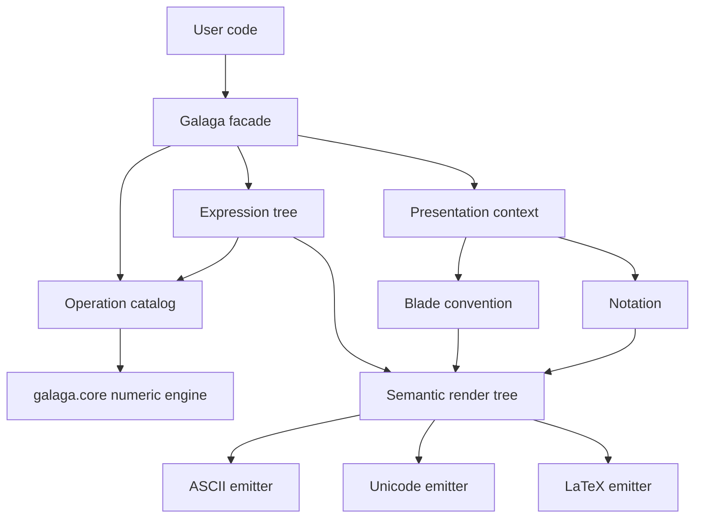
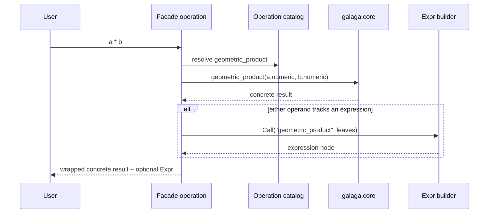

# Presentation and Expression Layer Plan

> **Planning role:** This document defines the target architecture. Numbered
> implementation work units, required tests, phase gates, and cutover criteria
> are tracked in the [Galaga 2 core cutover plan](core-cutover-plan.md). The
> [numeric test migration inventory](numeric-test-migration-inventory.md)
> identifies the existing tests that must move to core or run against the
> facade.

## Outcome

Build the Galaga-facing layer as a **composition facade over `galaga.core`**,
not as a subclass of `galaga.core.Multivector` and not by adding expression fields to the
numeric core.

The public Galaga value will wrap an immutable `galaga.core.Multivector` and may also
carry a display name and an expression tree. The public Galaga algebra will
wrap one `galaga.core.Algebra` and one immutable presentation context. Every numeric
operation will unwrap its operands, call a named core operation, and wrap the
result. Expression construction will run alongside that path only when a value
has explicitly opted into expression tracking.

This gives one convenient Galaga API while preserving a strict dependency
direction:



`galaga.core` never imports any box above it.

The canonical v2 term should be **expression tracking**, not *symbolic* or
*lazy*. Galaga always computes concrete coefficients eagerly. The expression
is optional provenance attached to an already-computed value. Symbolic
coefficients and symbolic metrics are a separate future coefficient-domain
project.

## Implementation status

The numeric foundation was completed and promoted on 2026-07-19.
`galaga.facade` now owns the composition layer over the in-package
`galaga.core`; the historical `galaga.gram_bridge` namespace is only an
exact-object compatibility re-export. The completed foundation provides:

- an immutable operation catalog whose evaluator/node arity is distinct from
  its public call policy;
- fixed and binary-left-fold call policies;
- composition-based numeric `Algebra` and `Multivector` facade values;
- explicit numeric escape through `.numeric`;
- operators and named core products delegated to `galaga.core`;
- variadic facade calls for geometric and exterior products while the core remains
  binary;
- standalone optional `scalar_part(value)` composition rather than facade
  member state; and
- numeric parity tests covering native Gram matrices, operators, products,
  algebra mismatch, scalar conversion, and fold behavior.

The presentation-configuration foundation was also completed on 2026-07-19.
It provides immutable names, signed blade references and conventions,
independent local-name and display-order policies, complete algebra configs,
inspectable presets, presentation-aware facade factories, cheap persistent
views, and context-local temporary overrides. See the
[implementation overview](presentation-configuration.md) and ADR-076.

The new facade types remain deliberately absent from `galaga.__init__` during
migration and do not touch Galaga's existing expression-aware value. The
complete numeric implementation and its tests live in `galaga.core`; Galaga
has no external Gram package dependency. Galaga targets Python 3.11+, while
only the optional `galaga_marimo` package requires Python 3.14 for t-strings.

## Inputs to this plan

This plan builds on `galaga.core`'s architecture and on the lessons recorded in
Galaga's ADRs, symbolic split specifications, blade-convention proposal, and
`V2-PLANNING.md`. In particular, it adopts the v2 direction for:

- non-mutating configuration and value APIs;
- independent `.name` and `.expr` state;
- `.named()` and `.unnamed()` rather than a setter-method/property collision;
- `expr=True` rather than `symbolic=True` or `lazy=True`;
- preset classes that provide complete configurations while leaving blades,
  notation, local naming, and display independently replaceable;
- long, convention-explicit operation names as the primary API;
- display as two axes, content and output format;
- exact equality plus a separate approximate comparison;
- removal of global `display_repr` state and ambiguous unqualified products.

`V2-PLANNING.md` predates much of the numeric-core work and is an issue inventory, not
a normative source for this plan. Newer executable behavior, core
specifications, and accepted ADRs take precedence. Several questions in that
document are already resolved here: `galaga.core` supports native nonorthogonal
metrics; exact equality and `almost_equal` are separate; scalar-coefficient
extraction composes as `float(grade(value, 0))`, while `float(value)` remains a
checked assertion about the original value; the corrected bracket family
makes half-scaling explicit; and the real numeric function layer has been
implemented. Its proposed naming, preset, immutability, and display changes
remain relevant because those outer layers have not yet been rebuilt.

## Goals

- Replace Galaga's legacy numeric `Algebra` and `Multivector` implementation
  with the core-backed facade without losing Galaga's notebook-oriented API.
- Parameterize blade labels, signed blade aliases, lookup names, local Python
  names, and display order without changing numeric basis identity.
- Preserve optional operation history over concrete numeric values.
- Make ASCII, Unicode, and LaTeX rendering consume the same semantic model.
- Allow notation presets for different books and communities, including the
  RGA/Lengyel vocabulary, without changing operation semantics.
- Keep the eager numeric path free of expression-tree construction.
- Give `galaga_matrix`, Marimo, and future teaching tools public integration
  points rather than access to product-table internals.

## Non-goals

- Symbolic coefficients, symbolic Gram-matrix entries, equation solving, and
  general computer algebra.
- Moving rendering, names, conventions, or expressions into `galaga.core`.
- Making a display convention perform a basis transformation. A change from
  an orthogonal conformal frame to a native null frame is a numeric linear map,
  not a renaming operation.
- Reimplementing helpers that are short compositions of existing operations.
  Rotor constructors, projection, rejection, and reflection remain facade or
  helper functions.
- Advertising wrapped multivectors as NumPy arrays. `float(value)` remains a
  checked scalar conversion and `.data` remains explicit.
- Preserving deprecated `lazy=` vocabulary or Galaga's mutating configuration
  methods in the v2 API.

## Lessons to retain and change from Galaga

Galaga already established several useful ideas:

- named functions are the operation contract;
- expression participation propagates through an operation;
- tracked results can retain both concrete coefficients and an expression;
- an operation registry can break the algebra/expression import cycle;
- blade display, local Python names, and blade identity are separate concerns;
- notation should be consulted before a renderer chooses a spelling;
- a structured LaTeX pipeline is more robust than recursive string surgery.

The replacement should correct the architectural costs exposed by that design:

- the numeric value must not own expression or renderer state;
- an operation must be declared once, rather than repeated in numeric,
  expression, and rendering tables;
- naming and expression tracking must remain independent;
- configuration should be immutable rather than mutating every value owned by
  an algebra;
- all output formats should share a semantic render tree, rather than giving
  LaTeX a structurally richer implementation than Unicode;
- an expression node should refer to a stable operation identifier, not import
  or rediscover its numeric implementation.

## Why composition is the right boundary

### Selected: facade wrappers

During migration, `galaga.facade.Algebra` and
`galaga.facade.Multivector` make the boundary explicit. At cutover they are
re-exported as `galaga.Algebra` and `galaga.Multivector`.

```python
class Algebra:
    _numeric: galaga.core.Algebra
    _presentation: PresentationContext

class Multivector:
    _numeric: galaga.core.Multivector
    _algebra: Algebra
    _name: Name | None
    _expr: Expr | None
```

The wrappers expose `.numeric` for deliberate escape to the core and forward
read-only numeric properties such as `.data` and `.grades`. `float(wrapper)`
delegates to the core's checked scalar conversion. Scalar-coefficient extraction
uses `float(grade(value, 0))`; a standalone `scalar_part(value)` may be offered
as optional shorthand without becoming wrapper member API.

### Rejected: subclassing core values

Core operations construct `galaga.core.Multivector` values. A subclass would be lost
unless every constructor and operation became subclass-aware, coupling the
numeric core to a presentation concern. Inheritance would also make private
storage and backend details look like supported extension points.

### Rejected: attach state to core values

Adding `_name`, `_expr`, `_notation`, or expression dispatch to
`galaga.core.Multivector` would reverse ADR-007 and impose presentation state on every
numeric value, including users who never render an expression.

### Rejected: add-in side tables

A global weak map from numeric values to presentation state makes behavior
depend on object identity and lifetime. It is difficult to reason about with
immutable value copies, exact equality, caches, serialization, and multiple
simultaneous presentation contexts.

## Proposed package decomposition

The numeric implementation belongs to `galaga.core` inside the Galaga
distribution. Presentation modules remain outside that namespace so the
dependency direction stays visible even though the code shares one package
and repository.

| Module | Responsibility |
|---|---|
| `galaga.ops` | Stable operation identifiers, arity and parameter schemas, grade rules, Python operator bindings, and adapters to named core functions |
| `galaga.facade` | Composition-based `Algebra` and `Multivector`, numeric delegation, context checks, and expression propagation |
| `galaga.blades` | `BladeConvention`, signed blade references, role aliases, display order, local-name policy, and validated presets |
| `galaga.names` | Immutable ASCII/Unicode/LaTeX names and normalization |
| `galaga.expr` | Immutable expression leaves and calls; evaluation through the operation catalog |
| `galaga.notation` | Immutable notation rules and presets keyed by operation identifier |
| `galaga.rendering.tree` | Format-neutral semantic layout nodes and precedence handling |
| `galaga.rendering.ascii` | Plain-text emitter |
| `galaga.rendering.unicode` | Unicode emitter |
| `galaga.rendering.latex` | LaTeX rewrites and emitter |
| `galaga.display` | Policy for showing a name, expression, value, or teaching equality |
| `galaga.presets` | Validated bundles of blade, notation, local-name, and display-order choices |
| `galaga_marimo` | Optional notebook widgets and rich display integration |

Existing Galaga module names can remain compatibility re-exports. The table is
about ownership and dependency direction, not a requirement to break imports
unnecessarily.

## Core data models

### Operation catalog

An `OperationSpec` is the one declaration of a facade operation:

```python
@dataclass(frozen=True)
class OperationSpec:
    id: str
    arity: int
    evaluate: Callable[..., galaga.core.Multivector]
    parameters: tuple[ParameterSpec, ...] = ()
    grade_rule: GradeRule | None = None
    operator: OperatorBinding | None = None
    call_policy: CallPolicy = FixedCall()
```

The catalog includes core operations and structural facade operations such as
addition, subtraction, negation, scalar multiplication, and scalar division.
Parameterized calls such as `grade(x, k)`, powers, and transwedge products
store their parameters explicitly in the expression node.

`arity` is the evaluator and expression-node arity, not necessarily the public
function's accepted argument count. Geometric and exterior product remain
binary operations with binary grade rules. Their specs use a
`LeftFoldCall(min_args=1)` policy to expose one-or-more-operand facade
functions without declaring separate variadic operations:

```python
OperationSpec(
    id="geometric_product",
    arity=2,
    evaluate=galaga.core.geometric_product,
    call_policy=LeftFoldCall(min_args=1),
)
```

One operand returns that operand unchanged and creates no call node. Zero
operands are an error because no parent algebra can be inferred. Two or more
operands lower immediately to a deterministic left-associated tree of the
binary primitive:

```python
geometric_product(a, b, c) == geometric_product(
    geometric_product(a, b), c
)
```

Python operators remain binary, and the canonical expression tree retains the
left-associated evaluation order. If any argument is expression-tracked, the
facade converts every argument to a leaf before lowering, so a single
variadic call retains all of its supplied operands rather than losing the
untracked prefix. Numeric evaluation still invokes the binary core primitive
once per edge in the tree.

A renderer may visually flatten consecutive nodes with the same associative
operation, producing `gp(a, b, c)` or juxtaposition, while a diagnostic
presentation may show the actual binary grouping. Other products receive a
fold call policy only after their associativity under every supported metric
and convention is specified and tested. Inner products, contractions,
commutators, and anticommutators remain fixed binary calls.

Notation is keyed by `OperationSpec.id` but does not live in the spec. This
keeps mathematical operation identity separate from its spelling. The catalog
belongs to the Galaga facade; only a narrower shared protocol should move into
the core if more than one independent consumer needs it.

### Facade algebra and value

The facade algebra owns exactly one numeric algebra, optional model metadata,
and a default presentation context. Factory methods construct core values and
wrap them. Binary operations require compatible numeric algebras and model
roles; presentation differences do not make mathematically compatible values
incompatible. Operator results inherit the first facade operand's default
presentation, while any render can override it explicitly.

All configuration and value-state changes return new objects. The v2-facing
surface should make the state readable without method/property collisions:

```python
alg2 = alg.with_presentation(Presentations.lengyel_rga())
alg3 = alg2.with_notation(Notation.functional(short=True))

v.name                 # Name | None
v.expr                 # Expr | None
v2 = v.named("v")      # new named value, no mutation
v3 = v2.unnamed()      # new unnamed value
```

Factories use `expr=True` to opt into operation-history tracking. If a
post-construction toggle is required, its canonical name should be
`with_expr()`/`without_expr()`, not `symbolic()`/`numeric()`, because the
numeric value is always present. The old spellings can exist temporarily as
deprecated compatibility aliases.

The four axes are independent:

| Axis | Stored by | Meaning |
|---|---|---|
| Numeric value | core multivector | Metric and coefficients |
| Display name | Facade value | How this result may be referred to |
| Expression | Facade value | Provenance to show and inspect |
| Presentation | Facade algebra/context | Blade labels, notation, ordering, output policy |

`named()` is presentation-only. A named untracked operand does not by itself
make a result tracked, but its name is used as a leaf when it participates in
an already-tracked operation. This realizes the four states identified by the
v2 plan: unnamed/untracked, named/untracked, unnamed/tracked, and
named/tracked.

`__eq__` delegates to exact numeric equality; names and expressions do not
change the mathematical value. Approximate comparison uses `almost_equal()`.
Expression identity is queried separately, for example with
`same_expression()`.

### Expression tree

Use a small immutable tree or DAG rather than one hand-written class per
operation:

```python
Expr = Symbol | ScalarLiteral | BladeLiteral | MultivectorLiteral | Call

@dataclass(frozen=True)
class Call:
    operation_id: str
    operands: tuple[Expr, ...]
    parameters: tuple[tuple[str, object], ...] = ()
```

Compatibility constructors such as `Gp`, `Op`, or `Reverse` may create the
corresponding `Call`; they should not become a second operation declaration.

Every facade operation follows one path:



Expression tracking is contagious, but numeric evaluation is still eager.
Dropping an expression is constant time because the wrapper already contains
the concrete result. Standalone expression evaluation goes back through the
same operation catalog and is tested as an independent round trip.

### Blade convention

Internal blade identity remains the core's exterior bitmask in ascending native
basis order. Presentation uses a signed reference:

```python
@dataclass(frozen=True)
class BladeRef:
    mask: int
    orientation: Literal[-1, 1] = 1
```

The orientation matters for conventional labels such as `e31`, which denotes
`-e13` in the canonical exterior order. If a displayed blade is
`B = orientation * E_mask`, a coefficient `c` stored on `E_mask` is rendered
as `c * orientation` on `B`. Looking up the displayed label returns exactly
`B`. This gives lookup/render round trips rather than treating reordered
subscripts as cosmetic text.

An immutable `BladeConvention` supplies:

- canonical labels in ASCII, Unicode, and LaTeX;
- vector roles and lookup aliases;
- compact, wedge, or juxtaposed generated labels;
- signed per-blade overrides;
- display ordering;
- preferred Python identifier hints for special blades.

Local identifiers are derived by a separate `LocalNamePolicy`. Displaying
`gamma_0` or `sigma_1` must not force users to type a Unicode identifier, and
a display override must not unexpectedly rename a local variable.

Presets should cover at least default indexed blades, PGA, native-null and
orthogonal CGA, STA, RGA/Lengyel, quaternions, complex numbers, and exterior
algebra. Presets validate their dimension and required basis roles. In
particular, a CGA preset may label an actual null pair but may not rename an
orthogonal plus/minus frame as though it were that pair.

### Complete configurations and independent presentation components

There is a real API tension between “construct the conventional algebra for
me” and “let me control every choice.” Resolve it with three layers rather
than choosing one side:

1. Fine-grained immutable components remain the source of truth.
2. A `PresentationConfig` groups components that are commonly changed
   together.
3. Preset classes build a complete `AlgebraConfig` for a conventional model.

```python
@dataclass(frozen=True)
class PresentationConfig:
    blades: BladeConvention
    notation: Notation
    locals: LocalNamePolicy
    display: DisplayPolicy

@dataclass(frozen=True)
class AlgebraConfig:
    definition: AlgebraDefinition
    model: ModelConfig | None
    presentation: PresentationConfig

class Preset(Protocol):
    def build(self) -> AlgebraConfig: ...
```

A preset is a class with inspectable parameters, validation, and a deterministic
`build()` result:

```python
@dataclass(frozen=True)
class CGAPreset:
    spatial_dim: int = 3
    frame: Literal["null", "orthogonal"] = "null"
    null_pair: float = -1.0

    def build(self) -> AlgebraConfig: ...
```

```python
cga = Algebra(config=CGAPreset(spatial_dim=3))
pga = Algebra(config=PGAPreset(spatial_dim=3))
rga = Algebra(config=LengyelRGAPreset(spatial_dim=3))
```

An ergonomic `p_cga(...)` constructor may return a `CGAPreset`, but the preset
class and the expanded configuration remain public and inspectable. The
constructor keyword is `config=` because the object may define the Gram
matrix, basis order, semantic roles, presentation, and model helpers—not just
appearance.

Preset expansion is one-way configuration, not a permanent mode. Once the
algebra exists, notation, blade labels, local naming, display order, and
coefficient formatting are still independent objects:

```python
cga = Algebra(
    config=CGAPreset(3),
    notation=Notation.functional(short=True),  # explicit preset override
)

textbook = cga.with_notation(Notation.doran_lasenby())
renamed = textbook.with_blades(my_blade_convention)
```

Explicit presentation components override the preset-supplied values. A full
structural preset cannot be combined with another metric definition:

```python
Algebra(config=CGAPreset(3))              # valid
Algebra(gram=G, config=CGAPreset(3))      # error: two definitions
Algebra(4, 1, config=CGAPreset(3))        # error: two definitions
```

Changing the Gram matrix, basis order, null-pair normalization, or semantic
roles constructs a new algebra. Changing notation, blade labels, local names,
display order, or coefficient formatting creates a cheap presentation view or
render-time override over the same numeric algebra.

### Notation

`Notation` is an immutable mapping from operation identifier and output target
to a generic `RenderRule`. A rule contains fixity, tokens, precedence,
associativity, grouping behavior, and target-specific glyphs. Rule kinds
include function, prefix, postfix, accent, infix, juxtaposition, wrapper,
fraction, subscript, and superscript.

Notation controls spelling only. It cannot change `|` from Doran-Lasenby inner
to Hestenes inner or insert a hidden factor of one half. Python operator
bindings and operation semantics are declared separately in the operation
catalog.

Presets should include:

- functional notation with either explicit or short operation names;
- current Galaga-compatible notation;
- Doran-Lasenby/Hestenes-style variants;
- Lengyel RGA notation for bulk, weight, antiproduct, antidot, interiors, and
  transwedge operations;
- a conservative plain-ASCII form.

Conflicting symbols, such as an overbar used for both a conjugation and a
complement, must be detected or resolved explicitly by a preset rather than by
renderer special cases.

Short functional rendering is independent of Python's callable aliases. For
example, a presentation may render a node whose stable identifier is
`doran_lasenby_inner` as `ip(a, b)` because that presentation makes the
meaning explicit. The expression node and evaluator remain unchanged.

### Rendering and display

Both a numeric multivector and an expression first become a semantic render
tree. Emitters serialize that tree for a target:

```text
numeric value or Expr
        -> semantic tree
        -> target rewrites
        -> ASCII / Unicode / LaTeX
```

Useful semantic nodes include text, row, operator, group, fraction,
superscript, subscript, accent, and function application. Precedence and
associativity are decided while building the tree. Target rewrites handle
cases such as an inline fraction inside a superscript without reparsing or
replacing emitted strings.

Value rendering uses the blade convention and coefficient formatter.
Expression rendering uses the operation catalog and notation. Display has two
independent dimensions:

| Content | Meaning |
|---|---|
| `name` | Explicit display name only |
| `expr` | Operation history only |
| `value` | Concrete multivector only |
| `full` | Available name, expression, and value joined by equality |

| Target | Meaning |
|---|---|
| `ascii` | Portable plain text |
| `unicode` | Terminal and notebook text |
| `latex` | Mathematical typesetting |

The compound format form proposed by the v2 plan is retained:

```python
format(v, "name/latex")
format(v, "expr/unicode")
format(v, "value/ascii")
format(v, "full/latex")
```

The default content is derived from the information the value carries, not a
global `display_repr` flag:

| Has name | Has expression | Default display |
|---|---|---|
| No | No | value |
| Yes | No | name = value |
| No | Yes | value; expression remains explicitly requestable |
| Yes | Yes | name = expression = value |

The public surface should include `str`, `repr`, `format`, `.ascii()`,
`.unicode()`, `.latex()`, and `_repr_latex_()`. Notebook-specific widgets stay
in `galaga_marimo`.

Presentation selection has three override levels:

```text
explicit per-render component or PresentationConfig
    > explicitly scoped teaching presentation
    > algebra/view default produced by its preset or component overrides
```

All three operate on immutable presentation objects. The scoped form changes
only the current rendering default and should use task-local state; it never
mutates the core algebra, coefficients, or expression:

```python
x.display(notation=Notation.functional(short=True))
x.display(presentation=Presentations.lengyel_rga())

with alg.use_presentation(Presentations.doran_lasenby()):
    display(x)
    display(y)
```

This makes it practical to show the same derivation in functional, Hestenes,
Doran-Lasenby, or Lengyel notation during a lesson without rebuilding the
values. A scoped local-name policy affects only `locals()` calls made inside
the scope; it cannot rename Python variables that already exist.

## Dependency rules

These rules should be enforced by import tests:

1. `galaga.core` imports no outer Galaga module.
2. Expression nodes depend on stable operation identifiers, not core private
   backends.
3. Rendering does not call numeric product implementations.
4. Notation does not choose mathematical operations.
5. Blade conventions do not alter the Gram matrix or coefficient layout.
6. The facade uses only the core's public constructors, properties, and named
   operations.
7. Optional notebook and matrix packages depend inward on the facade; the
   facade does not import them.
8. Presets depend on component interfaces and expand to ordinary immutable
   configurations; components never import or inspect preset classes.

## Implementation phases

### Phase 0: characterize and freeze the boundary

Status: **complete (2026-07-19)**. See the
[public API migration matrix](public-api-migration-matrix.md).

- Inventory Galaga's public algebra methods, named operations, aliases,
  expression nodes, blade presets, notation presets, and display protocols.
- Turn the open items in `V2-PLANNING.md` into accepted, deferred, or rejected
  decisions. Do not let compatibility accidentally decide them during coding.
- Classify each API as a core primitive, facade operation, compatibility alias,
  renderer concern, optional integration, or explicit non-goal.
- Run Galaga's current tests and add characterization tests only for behavior
  that is relied upon but not already specified.
- Decide which old expression-node class identities are compatibility
  requirements and which may become constructor aliases.

Exit condition: a checked migration matrix exists and every public operation
has one destination.

### Phase 1: operation catalog and numeric facade shell

Status: **complete (2026-07-19)**. The implementation owner is
`galaga.facade`; ADR-075 records the promotion.

- Add the facade-side operation catalog and adapters to public core functions.
- Implement wrapper construction, unwrapping, scalar coercion, algebra/context
  validation, operators, `.numeric`, `.data`, and checked `float`.
- Keep `.expr` absent or always `None` in this phase.
- Add a contract test requiring every supported core operation to be cataloged
  or explicitly excluded.
- Test the one-argument and deterministic binary-tree lowering behavior of
  variadic geometric and exterior product calls, including the case where only
  a later argument is expression-tracked.
- Port Galaga's non-expression algebra tests against the facade.

Exit condition: unwrapping any facade result gives the same core value as
calling the named core operation directly.

### Phase 2: blade conventions and presets

Status: **complete (2026-07-19)**.

- Implement `Name`, `BladeRef`, `BladeConvention`, `LocalNamePolicy`,
  `PresentationConfig`, `AlgebraConfig`, preset classes, and immutable
  presentation contexts.
- Implement validated blade lookup, signed aliases, basis factories,
  `basis_blades()`, `locals()`, and display ordering.
- Add preset conventions, including RGA/Lengyel.

Exit condition: every canonical and signed alias round-trips through lookup
to independently checked core coefficients, with collision and dimension
errors reported at construction.

### Phase 3: expression provenance

- Add immutable expression leaves and `Call`.
- Add `.name` and `.expr` properties, `.named()`, `.unnamed()`, `expr=True`,
  and any compatibility spellings as non-mutating facade operations.
- Extend catalog dispatch so expression participation builds one node while
  numeric computation still happens exactly once.
- Implement expression evaluation through the same catalog and structural
  simplifications that are unquestionably semantic, such as eliminating a
  double negation. Keep algebraic simplification a later, separately specified
  feature.

Exit condition: evaluating a generated expression reproduces its stored core
value, and purely numeric facade operations build no nodes.

### Phase 4: numeric, notation, and expression rendering

- Extend immutable notation rules from stable token metadata to semantic
  rendering rules.
- Build the first semantic-tree path for numeric multivectors and the ASCII,
  Unicode, and LaTeX emitters.
- Convert expressions to the shared semantic tree using catalog identifiers.
- Add precedence, associativity, target rewrites, content/target format specs,
  default display selection, per-render overrides, and scoped teaching
  presentations.
- Port Galaga's useful renderer cases as semantic tests; avoid making a large
  collection of brittle complete-string snapshots the only oracle.

Exit condition: all supported operations render in all three targets under
functional and conventional presets, and nested expressions preserve meaning
through parentheses.

### Phase 5: compatibility helpers and integrations

- Add compositional geometry helpers. Audit legacy aliases individually and
  retain them as time-bounded migration shims or as a deliberately curated
  optional short-name namespace. Do not require every operation to have a
  second top-level spelling.
- Port RGA and textbook-specific notation/convention helpers.
- Migrate `galaga_matrix` to public facade and core integration points.
- Keep Marimo and rich display adapters in their optional package.
- Add deprecation messages for APIs whose old semantics are ambiguous, with
  particular attention to `.name()`, mutating configuration, `symbolic`/`lazy`
  vocabulary, physical constants, and unqualified inner products.

Exit condition: Galaga examples and companion packages no longer inspect the
old numeric implementation or core private state.

### Phase 6: cutover and hardening

- Re-export facade types as `galaga.Algebra` and `galaga.Multivector`.
- Remove the old Galaga numeric engine after a release with compatibility
  warnings where appropriate.
- Compare facade overhead with direct core calls and establish budgets for
  numeric-only and expression-tracked paths.
- Complete serialization only after expression and convention schemas are
  stable and versioned.

Exit condition: `galaga.core` remains independently usable, Galaga uses it exclusively
for numeric results, and the old multiplication tables are unreachable from
public consumers.

## Verification strategy

High-value tests should establish relationships, not merely execute lines:

- **Numeric parity:** for each catalog operation, backend, supported Gram
  matrix, and representative multivector grade, unwrap the facade result and
  compare it with direct core evaluation.
- **Expression round trip:** evaluate every generated expression and compare
  it with the concrete result retained by its facade value.
- **Convention round trip:** lookup(render(blade)) returns the same signed
  blade; aliases and local-name collisions are validated.
- **Rendering semantics:** precedence and associativity property tests cover
  nested operations; a small curated golden set covers typography.
- **Configuration isolation:** changing notation or a convention returns a new
  facade and cannot alter existing values or another algebra.
- **Import direction:** automated checks reject outward imports from
  `galaga.core`
  and imports from the facade into optional integrations.
- **No-core-regression:** the core test and coverage suites run independently of
  the facade environment.
- **Performance:** benchmark direct core, numeric facade, and tracked facade
  separately so expression cost is visible and opt-in.

## Migration decisions that must remain explicit

- Preset classes provide coherent complete configurations for the common case,
  but their output is made of independently replaceable components. Explicit
  component overrides win over preset defaults.
- Structural configuration changes create a new algebra. Presentation changes
  may create a cheap view, apply to one render, or be selected within an
  explicit teaching scope without changing numeric semantics.
- Keep `*`, `^`, `|`, and `~` meanings fixed by the facade's operation
  contract; notation presets cannot redefine them.
- Make long names such as `geometric_product`, `outer_product`, and explicit
  inner-product variants the public contract. Short names are optional
  compatibility aliases, not a second API that every operation must provide.
  Python already lets users choose concise local vocabulary without making it
  globally ambiguous:

  ```python
  from galaga import doran_lasenby_inner as ip
  ```

  An alias that is retained must resolve to the same operation identifier; it
  must not get another catalog entry, expression node, or notation rule.
- Keep competing inner products as separate named functions. An unqualified
  `inner_product` or mode-based `ip` should not be a permanent v2 API. It may
  exist temporarily as a deprecated migration adapter.
- Preserve `galaga.core`'s unscaled commutator, anticommutator, Lie bracket, and Jordan
  product. Only `half_commutator` and `half_anticommutator` introduce a half.
- Define scalar-coefficient extraction canonically as
  `float(grade(value, 0))`. `scalar_part(value)` is at most an optional
  standalone convenience helper and is not required as a member method.
- Make facade `geometric_product` and `outer_product` variadic left folds with
  at least one operand. Do not generalize the pattern to nonassociative
  products merely for API symmetry.
- Ignore name and expression metadata for mathematical equality; use exact
  equality and explicit `almost_equal()` for numerical tolerance.
- Use explicit basis maps or outermorphisms for real basis changes.
- Keep physical constants and geometry entities out of the algebra kernel;
  domain packages or presets may offer them as explicit helpers.
- Treat symbolic coefficients as a future coefficient-domain project rather
  than allowing object-dtype arrays to leak into the numeric facade.

## Definition of done

The layer is a full replacement for Galaga's algebra surface when:

1. every supported public operation has one catalog entry and one core-backed
   numeric implementation;
2. all existing diagonal Galaga numeric behavior either passes unchanged or
   has a documented correction;
3. native nonorthogonal and degenerate metrics work without presentation code
   assuming monomial products;
4. blade lookup, locals, naming, notation, expression propagation, and all
   three renderers operate through public facade contracts;
5. companion packages use no core private backend arrays;
6. the direct core path remains free of facade imports and expression
   overhead;
7. the architecture, conventions, migration notes, and public behavior have
   corresponding ADRs and specifications.
