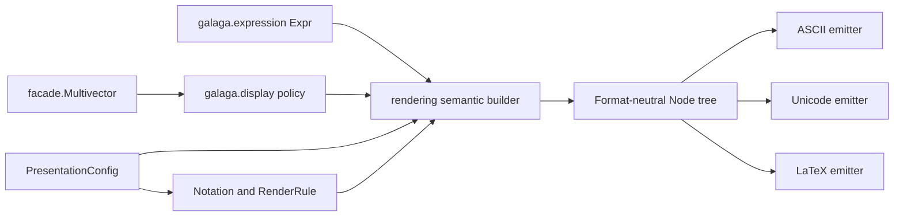
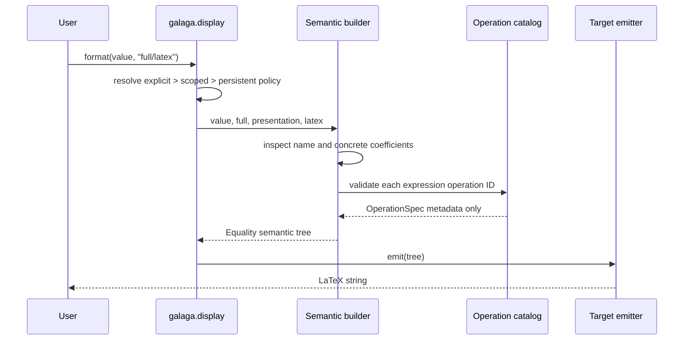

# Semantic Rendering Implementation

Galaga 2 renders concrete values and optional expression provenance through
one immutable semantic tree. ASCII, Unicode, and LaTeX are serializers of that
tree, not three independent interpretations of an expression. Rendering never
performs a geometric-algebra operation and never changes numeric coefficients
or expression identity.

This is the Phase 6 implementation over `galaga.facade`. Phase 7 consumers now
use it. Top-level Galaga deliberately keeps the legacy renderer until the
Phase 8 type cutover.

## Component decomposition



| Component | Responsibility |
|---|---|
| `galaga.rendering.tree` | Immutable layout nodes, precedence, associativity, and grouping |
| `galaga.rendering._build` | Read-only translation from expressions and facade coefficients |
| `galaga.presentation.RenderRule` | One semantic layout choice for a stable operation ID |
| `galaga.presentation.Notation` | Immutable generic and target-specific rule maps and presets |
| `galaga.rendering.ascii` | Portable text emission |
| `galaga.rendering.unicode` | Unicode glyph and script emission |
| `galaga.rendering.latex` | LaTeX structure, escaping, delimiters, and scientific notation |
| `galaga.display` | Content/target policy, format specs, override precedence, and public dispatch |
| `galaga.facade.Multivector` | User-facing display methods and Python rich-display hooks |

The tree module is independently importable. It does not initialize the
facade, expression evaluator, or numeric core. The builder imports the
operation catalog only when it encounters an expression `Call`; this avoids a
package-initialization cycle while retaining catalog validation.

## End-to-end data flow



There is deliberately no call from the builder or emitter to an
`OperationSpec.evaluate` function. Concrete values are already eager, and an
expression tree is provenance rather than an instruction to recompute during
display.

## The semantic tree

The node set represents mathematical layout rather than strings:

| Family | Nodes | Meaning |
|---|---|---|
| Leaves | `Identifier`, `Literal`, `Text` | Target-aware names, finite numbers, and escapable ordinary text |
| Arithmetic | `Sum`, `Product`, `Fraction`, `Power` | Structured mathematical forms |
| Application | `Call`, `Prefix`, `Postfix`, `Infix` | Function and operator layouts |
| Decoration | `Subscript`, `Accent`, `Wrapper` | Scripts, over/under accents, and delimiters |
| Structure | `Group`, `Delimited`, `Equality` | Explicit parentheses, lists, and teaching equalities |

`Name` values carry the intended ASCII, Unicode, and LaTeX spellings for
mathematical identifiers and glyphs. `Text` is different: it is ordinary text
and must be escaped by the target emitter. This avoids corrupting an explicit
blade name such as `\mathbf{e}_{31}` while still escaping a literal underscore
or percent sign.

All nodes are frozen structural values. Emitters do not mutate or annotate
them, and a node can be compared directly in tests without committing to one
final string syntax.

## One precedence model

The shared binding strengths, from weakest to strongest, are:

| Level | Binding strength |
|---|---:|
| Equality | 10 |
| Sum | 20 |
| Product and infix product-like operations | 30 |
| Prefix | 40 |
| Power | 50 |
| Postfix, accents, and subscripts | 60 |
| Function call | 80 |
| Atom and explicit group | 100 |

Every `RenderRule` has a concrete precedence and associativity. The builder
inserts `Group` nodes before emitter selection:

- a lower-precedence child is grouped;
- an equal-precedence child is ungrouped only where the matching operation ID
  and associativity make that safe;
- equal-precedence children belonging to different operations remain grouped;
- a left-associative operation preserves its matching left spine but groups a
  matching right child; and
- associative visual flattening applies only to a rule explicitly marked
  `flatten=True` and only to the same stable operation ID.

For example, the stored expression identities remain binary, but an
associative geometric-product presentation may show a left-folded
`geometric_product(a, b, c)` without changing evaluation order. Conversely,
`a - (b - c)` retains its parentheses, and an outer product nested inside a
geometric product is grouped even though both happen to use product-level
precedence.

## Building values and expressions

### Concrete values

`value_tree()` reads `.data`, the active `DisplayOrder`, and the active
`BladeConvention`. It performs no product or grade calculation. Each native
mask coefficient is converted to the configured displayed coefficient:

```text
displayed coefficient = native coefficient × BladeLabel.ref.orientation
```

That sign is essential for conventions such as Lengyel RGA, where displayed
`e31` denotes `-E13` in canonical exterior-mask order. Zero coefficients are
omitted, unit coefficients on nonscalar blades are suppressed, and a zero
multivector becomes `Literal(0)`.

### Expression provenance

`expression_tree()` translates the five immutable provenance node families:

- `Symbol` becomes `Identifier`;
- `ScalarLiteral` becomes a signed numeric layout;
- `BladeLiteral` and `MultivectorLiteral` use the same signed convention and
  display order as concrete values; and
- `Call` resolves its stable operation ID through `facade.catalog`, translates
  its operands and normalized parameters, then applies the selected
  `RenderRule`.

An unknown or stale operation ID fails in the builder before any output target
is emitted. Parameter values remain visible. If a compact rule cannot honestly
show supplied optional parameters, the builder falls back to the canonical
long function call instead of hiding them.

## Notation is presentation data

`RenderRule` records:

- a layout kind;
- a semantic symbol or function name;
- precedence and associativity;
- an optional operation parameter that decorates an operator;
- an optional complete argument permutation;
- wrapper delimiters; and
- whether repeated matching operations may be visually flattened.

Supported kinds are function, infix, juxtaposition, prefix, postfix, accent,
underaccent, wrapper, fraction, subscript, and superscript.

`Notation` maps a stable catalog operation ID to a generic rule and may add a
target-specific override. Target-specific structure is reserved for honest
fallbacks. Lengyel's geometric product, for example, has compact Unicode and
LaTeX glyphs but uses `gp(a, b)` in ASCII rather than inventing a misleading
plain-text operator.

If no rule exists, the canonical representation is the long operation name:

```text
metric_inner_product(a, b)
left_contraction(a, b)
transwedge(a, b, 1)
```

`Notation.functional(short=True)` is a presentation option. It can show
`gp(a, b)` or `metric_inner(a, b)`, but it neither creates Python aliases nor
changes the operation ID in the expression. Short names for competing inner
products are deliberately distinct.

The implemented presets are:

- conventional default notation;
- long and optional short functional notation;
- Doran-Lasenby notation;
- Hestenes notation; and
- Lengyel/RGA notation, including geometric antiproduct, metric inner and
  antidot products, interiors, transwedge products, complements, Hodge and
  weight duals, metric maps, bulk/weight parts, and antireverse.

The immutable v2 `Notation` lives in `galaga.presentation` and is exported by
`galaga.facade`. The public `galaga.notation` module remains the mutable v1
compatibility implementation only while top-level `galaga.Algebra` remains on
the legacy engine through Phase 8.

## Emitters

All emitters exhaustively consume the same node classes. Their differences are
localized target rewrites:

| Concern | ASCII | Unicode | LaTeX |
|---|---|---|---|
| Scripts | `x[2]`, `x^2` | `x₂`, `x²` when available | `{x}_{2}`, `{x}^{2}` |
| Fraction | `a / b` | `a / b` | `\frac{a}{b}` |
| Function | `metric_inner_product(...)` | same name or configured glyph | escaped `\operatorname{...}` |
| Accent | `~x` or functional fallback | combining mark | accent command with grouped body |
| Scientific literal | `1.25e+20` | `1.25e+20` | `1.25 \times 10^{20}` |
| Ordinary text | unchanged | unchanged | LaTeX escaped |

Final glyph selection and escaping occur here. Emitters import neither the
legacy `Algebra` nor legacy `render`, `latex_build`, or `latex_emit` modules.

## Display policy and public API

Content and target are independent:

| Content | Meaning |
|---|---|
| `name` | Explicit semantic name, falling back to the value |
| `expr` | Provenance, falling back to the value |
| `value` | Concrete coefficients and blade labels |
| `full` | Available name, expression, and value joined by equality |
| `auto` | Value unless a name opts into an explanatory full equality |

| Target | Meaning |
|---|---|
| `ascii` | Portable plain text |
| `unicode` | Terminal and notebook text |
| `latex` | Mathematical typesetting |

The compound format API is executable:

```python
format(value, "name/latex")
format(value, "expr/unicode")
format(value, "value/ascii")
format(value, "full/latex")
```

Facade values expose `display()`, `ascii()`, `unicode()`, and `latex()`.
`str`, `repr`, `format`, and `_repr_latex_` delegate to the same public
pipeline. `repr` uses the selected content policy with an ASCII target; `str`
uses the policy target; and the rich hook wraps the same LaTeX result in inline
math delimiters.

Presentation resolution is:

```text
explicit per-render PresentationConfig or Notation
    > context-local presentation selected by Algebra.use_presentation()
    > persistent algebra/view presentation
```

The existing `ContextVar` implementation makes scoped rendering isolated in
OS threads and interleaved async tasks. A scoped notation can therefore change
the same derivation for a lesson without rebuilding values or mutating an
algebra.

## Architectural invariants

The implementation and tests enforce these relationships:

1. `galaga.core` imports no display, rendering, expression, or facade layer.
2. Semantic-tree construction does not call a numeric evaluator.
3. Expression operation IDs are validated before emitter selection.
4. Emitters import no legacy numeric or rendering implementation.
5. Notation changes spelling and layout, never numeric or expression identity.
6. A target change cannot change coefficients, expression evaluation, or
   display order.
7. Signed blade labels round-trip through the same convention for expression
   literals and concrete values.
8. Direct tree, display, and facade imports work in either order.

## Validation ownership

Phase 6 tests live under `packages/galaga/tests/rendering`:

- `test_tree.py` owns immutability, validation, precedence, and associativity;
- `test_build.py` owns expression/value translations, signed blade
  conventions, no-evaluation construction, and early operation validation;
- `test_render_notation.py` owns catalog fallback completeness, notation
  presets, target overrides, and inner-product disambiguation;
- `test_emitters.py` owns the all-node/all-target matrix, escaping, import
  boundaries, import order, and golden parenthesization; and
- `test_display.py` owns every content/target combination, fallback policy,
  public hooks, explicit/scoped/default precedence, and async isolation.

The Phase 6 full Galaga run passes 2,738 tests with 19 skips on Python 3.11.
Focused branch coverage is 91% for the emitter, 87% for the semantic tree, 80%
for public display policy, and 76% for the builder. Lower builder branches are
primarily defensive handling for malformed custom rules; accepted presets and
every catalog fallback are exercised directly. Focused Pyrefly and Ruff checks
pass for the implementation and tests.

## Deliberate limits and next migration work

- The semantic tree is not an algebraic simplifier or expression evaluator.
- Numeric formatting is display-oriented, not a serialization format.
- Legacy top-level values still use the legacy rendering path until cutover.
- Legacy mutable notation and operation-specific renderer adapters remain only
  on the top-level v1 compatibility path.
- `galaga_matrix`, `galaga_marimo`, `galaga_mermaid`, and the maintained
  notebooks now consume the public facade/expression/display protocols.

Those boundaries make the next phase a top-level type cutover rather than
another rendering redesign.
