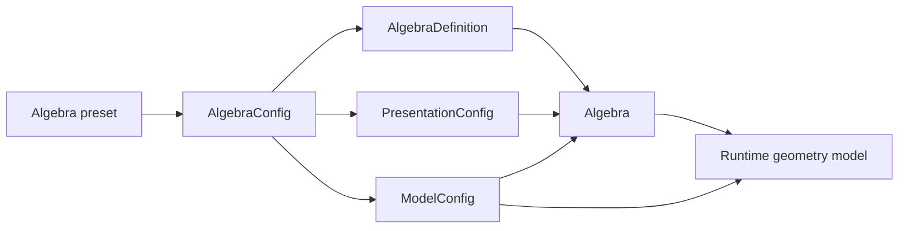
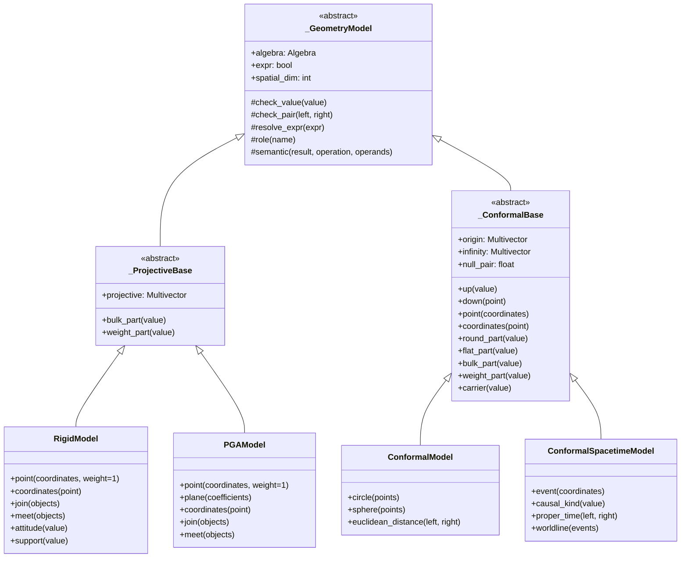

# Runtime Geometry Model Architecture

**Status:** Accepted for implementation. See
[ADR-174](../adrs/174-runtime-geometry-model-hierarchy-and-classifiers.md).

## Purpose

Galaga separates an algebra's numeric rules from the geometric interpretation
assigned to its blades. The Gram matrix determines products, but it does not
determine whether a vector represents a point, a plane, an event, or an
ordinary direction.

Runtime geometry models provide that interpretation. They validate the roles
declared by an algebra preset and expose operations whose meanings depend on
those roles. This document proposes a common architecture for:

- point-based Rigid Geometric Algebra (RGA);
- plane-based Projective Geometric Algebra (PGA);
- Euclidean Conformal Geometric Algebra (CGA); and
- Conformal Spacetime Algebra (CSTA).

The design shares lifecycle and validation code without claiming that all four
models have the same geometry.

## Numeric algebras and geometric models

An `Algebra` owns metric-dependent arithmetic, including geometric products,
exterior products, complements, grade selection, and metric maps. These
operations remain meaningful without a geometric model.

A runtime model owns meanings that require distinguished basis roles. Examples
include:

- interpreting a blade as a homogeneous point or plane;
- embedding coordinates as a conformal null point;
- extracting coordinates from a model point;
- selecting the origin or infinity directions;
- deciding which product constructs a geometric join or meet; and
- validating that a blade satisfies the constraints for a model object.

`ModelConfig` remains immutable metadata attached to an `AlgebraConfig`. It
contains a model identifier and signed basis roles. A runtime model such as
`RigidModel` or `ConformalModel` consumes that metadata, validates it against
the actual Gram matrix, and provides behavior.



The runtime model must not replace or wrap the numeric implementation. It
holds an ordinary facade `Algebra` and delegates algebraic operations to the
public Galaga API.

## Existing model surface

The current runtime model classes establish these patterns:

| Model | Preset | Coordinate object | Selected operations |
|---|---|---|---|
| `RigidModel` | `presets.rga()` | homogeneous point vector | `point`, `coordinates`, `attitude`, paired norms, projections, support, constraints |
| `ConformalModel` | `presets.cga()` or `presets.lengyel_cga()` | conformal null-point vector | `up`, `down`, `coordinates`, round/flat and bulk/weight parts, carrier, center, projection |
| `ConformalSpacetimeModel` | `presets.csta()` | conformal null-event vector | `event`, `up`, `down`, `coordinates`, signed intervals, event pairs, causal flat lines, signed rounds, `classify` |

`presets.pga()` declares model metadata but has no corresponding behavioral
model.

## Design principles

### The metric does not select the model

Point-based RGA and plane-based PGA both use

$$
\operatorname{Cl}(3,0,1)
$$

with Gram matrix

$$
G=\operatorname{diag}(1,1,1,0).
$$

The same coefficient array can consequently represent different geometric
objects under the two models. A runtime model must require matching model
metadata, rather than accepting an algebra merely because its Gram matrix has
the expected signature.

### Share mechanics, preserve semantics

All models can share algebra ownership, role lookup, expression policy, and
input validation. Operations should share an implementation only when their
mathematical definitions agree.

For example, PGA and RGA share a metric-induced bulk/weight split. CGA also
uses the names “bulk” and “weight”, but its split is defined by the conformal
origin role. A common capability can describe the method signatures without
forcing these operations into one base implementation.

### Prefer shallow inheritance and explicit capabilities

Inheritance should express a shared mathematical construction. Structural
typing protocols should express that unrelated models happen to offer the
same user operation.

### Compute model behavior from roles and the metric

Runtime models must not assume native mask positions, basis names, or signs.
They derive those values from `ModelConfig.roles`, the blade convention, and
the Gram matrix. This permits alternate basis orderings and signed blade
conventions.

## Proposed hierarchy



`_GeometryModel`, `_ProjectiveBase`, and `_ConformalBase` are internal
implementation classes. Public code uses the concrete models or capability
protocols rather than inheriting from a public root class.

## Package layout

The canonical runtime model API lives under `galaga.models`:

```text
galaga/models/
    __init__.py
    _base.py
    _classification.py
    _protocols.py
    rga.py
    pga.py
    cga.py
    csta.py
```

`galaga.models` exports `RigidModel`, `PGAModel`, `ConformalModel`,
`ConformalSpacetimeModel`, the public capability protocols, and classification
result types. The underscored base and implementation modules remain private.

Focused submodules keep implementation ownership clear while the package root
provides one discoverable import surface.

## Internal model responsibilities

The root class should remain small. It owns behavior that is independent of a
particular geometry:

- store the facade `Algebra`;
- resolve the default expression-tracking policy;
- require values from the same algebra;
- expose immutable role lookup;
- validate finite numeric arguments and tolerances through shared helpers;
- attach semantic expression nodes without changing numeric values; and
- provide the spatial dimension derived by the concrete model.

It must not define placeholder versions of operations such as `carrier`,
`bulk_part`, or `up`. A missing operation should be absent from the type rather
than raise `NotImplementedError` at runtime.

## Point construction and coordinate recovery

Every proposed geometric model can construct a point, but the embedding is
model-specific. The common semantic spelling should be:

```python
point = model.point((x, y, z))
coordinates = model.coordinates(point)
```

The resulting blade grades differ:

| Model | Point representation |
|---|---|
| RGA | vector |
| plane-based PGA | trivector in three spatial dimensions |
| CGA | conformal null vector |
| CSTA | conformal null vector embedding a spacetime event |

`up()` and `down()` retain their established conformal meaning and belong only
to conformal models. They should not become aliases for homogeneous projective
embedding. `ConformalModel.point()` may delegate to `up()` while preserving a
semantic expression node appropriate to the public operation called.

## Projective models

### Shared algebraic structure

The Euclidean projective presets use one normalized null direction. Extending
the vector metric to the exterior algebra gives the metric map
$\Lambda G$. The complementary-compound construction gives the antimetric map
$\mathbb G$.

For the supported normalized PGA and RGA metric, define

$$
\operatorname{bulk}(A)=(\Lambda G)A
$$

and

$$
\operatorname{weight}(A)=\mathbb G A.
$$

These maps are complementary projections:

$$
\operatorname{bulk}(A)+\operatorname{weight}(A)=A.
$$

The projective base must verify this domain through the configured roles and
metric normalization. It must not offer the decomposition for an arbitrary
degenerate algebra merely because an antimetric matrix can be constructed.

The algebra-level operations remain named `metric_apply()` and
`antimetric_apply()`. The model-level names `bulk_part()` and `weight_part()`
state the geometric interpretation supplied by the validated projective model.

### Point-based RGA

`RigidModel` treats vectors as points, bivectors as lines, and trivectors as
planes. Its geometric joins use the exterior product and its meets use the
antiwedge. Rigid transformations use the geometric antiproduct and
antireverse.

### Plane-based PGA

`PGAModel` treats vectors as planes, bivectors as lines, and trivectors
as points. Its geometric meets use the exterior product and its joins use the
antiwedge. Rigid transformations use the geometric product and reverse.

The two models can share coordinate validation and the projective split. They
must implement `point`, `join`, `meet`, and transformation helpers according
to their dual interpretations.

## Conformal models

### Shared conformal embedding

Let $x$ belong to a base quadratic space, and let $n_o$ and $n_\infty$ be null
vectors with finite nonzero pairing

$$
\kappa=n_o\mathbin{\cdot}n_\infty.
$$

The conformal embedding is

$$
X=n_o+x-\frac{x^2}{2\kappa}n_\infty.
$$

Then

$$
X^2=0.
$$

This formula applies to both a Euclidean base space and a spacetime base
space. The conformal base can share role validation, embedding, normalization,
coordinate recovery, and algebraic round/flat operations.

### Shared conformal boundary

The internal conformal base owns operations whose definitions depend only on
the base quadratic form and the distinguished origin and infinity roles:

- base-vector construction and coordinate validation;
- `origin`, `infinity`, and `null_pair`;
- `up`, `down`, `point`, and `coordinates`;
- `weight` and `homogenize`;
- signed `radius_squared`;
- `dual` and `antidual`;
- round/flat and conformal bulk/weight component splits;
- conformal conjugation; and
- `attitude`, `carrier`, and `cocarrier` incidence constructions.

These operations must be tested over both Euclidean and $(+---)$ base metrics
before the extraction is complete.

The shared base does not initially own norm names, center distance, unsigned
radius, projection, container, partner, or object classification. Their useful
interpretation depends on the base signature. They remain on the concrete CGA
or CSTA model until an identity and return contract have been verified in both
signatures.

### Euclidean CGA

`ConformalModel` supplies interpretations that depend on a positive-definite
Euclidean base space, including Euclidean centers, radii, distances, circles,
and spheres.

### Conformal STA

`ConformalSpacetimeModel` uses an STA base metric. Its embedded value is an
event, and the base quadratic form gives a spacetime interval. It owns causal
classification, proper-time helpers, and CSTA object interpretations.

Euclidean classifications must not be inherited unchanged. For example, the
sign of $x^2$ carries causal information in spacetime, while it represents a
squared Euclidean magnitude in CGA.

## Capability protocols

Public protocols allow generic consumers to request the operations they use
without depending on a concrete hierarchy.

```python
from typing import Protocol


class PointModel(Protocol):
    def point(self, coordinates, *, expr: bool | None = None) -> Multivector: ...
    def coordinates(self, point: Multivector, *, atol: float = 1e-12) -> np.ndarray: ...


class BulkWeightModel(Protocol):
    def bulk_part(self, value: Multivector) -> Multivector: ...
    def weight_part(self, value: Multivector) -> Multivector: ...


class ConformalEmbeddingModel(PointModel, Protocol):
    def up(self, value, *, expr: bool | None = None) -> Multivector: ...
    def down(self, point: Multivector, *, atol: float = 1e-12) -> Multivector: ...
```

Potential consumers include visualization, annotation, classifiers, and
teaching utilities. A renderer that only needs point construction should
accept `PointModel`; it should not require a conformal or projective base
class.

Protocols describe compatible call shapes. They do not imply that operations
with the same name use the same internal formula. In particular, projective
and conformal bulk/weight methods satisfy the same protocol while retaining
their model-specific definitions.

## Model classifiers

Classification belongs to the runtime model because grade and metric alone do
not determine an object's geometric meaning. The same grade-one blade can be
an RGA point, a PGA plane, a CGA dual sphere, or a CSTA signed-round
hypersurface.

Each concrete model exposes:

```python
classification = model.classify(value, atol=1e-9)
```

The result is an immutable data object rather than a display string. Its common
fields are:

```python
@dataclass(frozen=True, slots=True)
class ObjectClassification:
    model: str
    kind: str
    grade: int | None
    representation: str | None
    simple: bool | None
    finite: bool | None
    properties: tuple[tuple[str, object], ...]
```

Model-specific result types may add typed fields such as causal class, signed
radius squared, or carrier dimension. Annotation and visualization packages
consume these results; they do not own the geometric classification.

### Classification process

A classifier proceeds from structural facts to model-specific names:

1. Validate algebra ownership and tolerance.
2. Distinguish zero, homogeneous blades, and general multivectors.
3. Test blade simplicity where the object kind requires it.
4. Determine direct, dual, OPNS, or IPNS representation from explicit
   incidence identities rather than grade alone.
5. Test finiteness and ideal incidence against the model's distinguished null
   role.
6. Compute metric invariants, signed radii, carrier signatures, or model
   constraints.
7. Return a specific kind only when all required tests pass.

Ambiguous or invalid values return `general`, `degenerate`, or `unknown` with
diagnostic properties. The classifier must not choose a geometric name from
the closest numerical match. Zero tests use a scale-aware tolerance so that
classification is projectively invariant under nonzero scalar multiplication.

### Supported dimensions and objects

Classifier scope is intentionally bounded.

| Model | Dimensions | Initial object families |
|---|---:|---|
| PGA | 2D and 3D | finite and ideal points, lines, planes in 3D, hyperplanes, pseudoscalars, and general/degenerate blades |
| RGA | 3D initially; 2D after the RGA model is generalized | finite and ideal points, lines, planes, antiscalars, and constrained rigid objects |
| CGA | 2D and 3D | round points, points at infinity, flat points, point pairs or dipoles, lines, circles, planes, spheres, and their supported dual forms |
| CSTA | fixed 4D spacetime with $(+---)$ base signature | events, event pairs, causal flats, signed rounds, light cones, proper-time and proper-distance hyperboloids, ideal objects, and supported direct/dual forms |

There is no requirement to classify arbitrary higher-dimensional projective or
conformal algebras. `RigidModel` remains three-dimensional for the first
implementation. The classifier architecture reserves the two-dimensional RGA
case, but it is enabled only after the model and preset support it.

### CSTA classification

CSTA classification separates structure from causal interpretation. For
normalized events $X(a)$ and $X(b)$,

$$
(a-b)^2=-2X(a)\mathbin{\cdot}X(b).
$$

The sign under the $(+---)$ convention determines whether the separation is
timelike, null, or spacelike. A flat containing $n_\infty$ is classified by
its carrier signature. A normalized IPNS signed round

$$
S(c,\rho^2)=X(c)-\frac{1}{2}\rho^2n_\infty
$$

satisfies

$$
S^2=\rho^2.
$$

Positive, zero, and negative $\rho^2$ describe a proper-time hyperboloid, a
light cone, and a proper-distance hyperboloid respectively. A null norm alone
does not distinguish an event, light ray, light cone, tangent object, or other
degenerate blade; incidence and representation checks remain mandatory.

The same `classify()` method accepts a direct wedge of five events or its
IPNS dual vector. It returns the same geometric kind for both; pass
`representation="dual"` when the vector is intended as a hypersurface rather
than an event. A scalar interval uses `causal_kind(separation_squared(A, B))`
instead of the object classifier.

Three events can define a round curve. Its carrier metric and restricted
quadratic form distinguish a circle, a hyperbola, or a null line pair.
For example, samples of a uniformly accelerated trajectory produce
`kind="hyperbola"` and `causal="timelike"`. The latter describes the curve's
tangents; the causal field on a signed-round hypersurface describes its
radial interval. A singular carrier retains the structural `round 2-object`
label, without a chosen centre. Classification does not select a trajectory
branch or its proper-time parametrization.

Geometric-object classification is the initial scope. Translators, Lorentz
rotors, dilators, motors, and other transformation multivectors use a separate
versor classifier because they are generally not homogeneous blades.

### Existing annotation classifier

The existing CGA classifier in `galaga_annotation` supplies useful object and
test coverage. Its metric and incidence logic should move into the appropriate
runtime model classifier. `galaga_annotation` then retains highlighting,
labels, and rendering recipes built from the returned classification.

## Construction API

Runtime model construction should remain explicit:

```python
from galaga import Algebra, presets
from galaga.models import ConformalModel, ConformalSpacetimeModel, PGAModel, RigidModel

rga = RigidModel(Algebra(config=presets.rga()))
pga = PGAModel(Algebra(config=presets.pga()))
cga = ConformalModel(Algebra(config=presets.cga()))
csta = ConformalSpacetimeModel(Algebra(config=presets.csta()))
```

Each constructor validates the preset's model identifier, required roles, role
grades and orientations, Gram matrix relationships, and supported dimension.
A bare algebra with a matching signature is insufficient because it does not
declare the intended geometry.

Explicit construction remains the initial API. A later preset factory may
return a configured pair without adding a registry to `Algebra`:

```python
algebra, model = presets.models.cga(spatial_dim=3)
```

This remains deferred until the concrete model APIs are stable.

## Operation placement

The following table establishes the intended ownership boundary.

| Operation | Algebra API | Runtime model API |
|---|---:|---:|
| geometric and exterior products | yes | delegates |
| complement and grade selection | yes | delegates |
| `metric_apply`, `antimetric_apply` | yes | delegates |
| `bulk_part`, `weight_part` | no semantic alias | yes |
| point construction | no | yes |
| coordinate extraction | no | yes |
| `up`, `down` | no | conformal models |
| join and meet selected by object model | no | yes |
| carrier and cocarrier | no | conformal models |
| causal classification and proper time | no | CSTA model |
| model object constraints | no | corresponding model |
| geometric object classification | no | corresponding model |

Retire the free algebra-level `bulk_part()` and `weight_part()` aliases. Their
current numeric definitions are available for every algebra, but their names
imply a decomposition that does not exist generally. Keep `metric_apply()` and
`antimetric_apply()` as the universally named algebra operations.

For example, in the all-null exterior algebra

$$
G=0,
$$

`metric_apply()` preserves only the scalar and `antimetric_apply()` preserves
only the pseudoscalar. Intermediate grades belong to neither result, so their
sum does not reconstruct a general multivector. In an oblique nondegenerate
metric the maps need not be projections at all.

## Expression provenance and presentation

Model methods should continue to compute through public algebra operations and
then attach a semantic expression node. The node records the model operation
and any basis roles needed for replay without changing the numeric result.

Presentation rules remain keyed by stable operation IDs. Model inheritance
must not determine notation. A `PGAModel.bulk_part()` call and a
`ConformalModel.bulk_part()` call may use distinct operation IDs when their
definitions differ, even if both APIs expose the convenient Python method name.

CGA and CSTA select compact construction calls by default. The
`expression_form` constructor argument sets the model default, and
`with_expression_form()` returns a view with a different default while sharing
the same algebra. Individual construction calls can override it:

```python
from galaga import Algebra, presets
from galaga.models import ConformalSpacetimeModel

algebra = Algebra(config=presets.csta(), expr=True)
csta = ConformalSpacetimeModel(algebra)
event = csta.event(2, 1, 0, 0)  # event(2, 1, 0, 0)

expanded = csta.with_expression_form("expanded")
formula = expanded.event(2, 1, 0, 0)  # the conformal embedding equation
compact = expanded.event(2, 1, 0, 0, expression_form="operator")
```

Both forms retain executable provenance when tracking is enabled. `expr=False`
suppresses provenance independently of the selected expression form.

Suggested IDs include:

- `projective_bulk_part` and `projective_weight_part`;
- `conformal_bulk_part` and `conformal_weight_part`;
- `projective_point`, `conformal_point`, and `conformal_event`; and
- explicit RGA/PGA join and meet operations when their provenance should
  preserve the selected geometric interpretation.

## CSTA physical units

The CSTA metric remains normalized with $c=1$, while numeric input and output
can use physical units. Set the model's default coordinate policy, or override
it for a single call:

```python
from galaga import Algebra, presets
from galaga.models import ConformalSpacetimeModel, SpacetimeUnits

algebra = Algebra(config=presets.csta(), expr=True)
csta = ConformalSpacetimeModel(algebra, units="si")

first = csta.event(0, 0, 0, 0)
second = csta.event(60, 2000, 0, 0)  # seconds, metres, metres, metres
same = csta.event(1, 2, 0, 0, units=("min", "km"))
assert second.almost_equal(same)

csta.coordinates(second)                       # [60, 2000, 0, 0], SI
csta.coordinates(second, units=("min", "km"))   # [1, 2, 0, 0]
csta.coordinates(second, units="natural")      # normalized coordinates
csta.speed_between(first, second)              # average speed in m/s
csta.velocity_between(first, second, unit="c") # three components, fractions of c
```

`units="natural"` is the default. `"si"` means seconds/metres, and a two-item
tuple selects a time and distance unit. Speed units such as `"m/s"` are used
for speed conversions, not for event coordinate tuples.

### Physical scale

`time_scale_seconds` specifies the duration of one natural time unit, defaulting
to one second. One natural length unit is then $cT_0$ metres:

$$
t_{\mathrm{SI}}=T_0t,\qquad
\mathbf{x}_{\mathrm{SI}}=cT_0\mathbf{x},\qquad
v_{\mathrm{SI}}=c\beta,\qquad
a_{\mathrm{SI}}=(c/T_0)a.
$$

Reuse a scale through `unit_scale`, or choose it from a proper acceleration:

```python
scale = SpacetimeUnits.for_acceleration(1, unit="g")
ship = ConformalSpacetimeModel(algebra, unit_scale=scale)
ship.format_acceleration(1)  # "1 g"
ship.format_time(1)          # "11.6 month"
ship.format_distance(1)      # "0.969 ly"

# For metre-scale geometry, make one natural length unit one metre.
metre_scale = ConformalSpacetimeModel(
    algebra, units="si", time_scale_seconds=1 / csta.speed_in(1)
)
```

Tolerances operate on natural values. Choose a scale that keeps coordinates and
intervals well resolved; conversion does not remove float64 cancellation.
Multivectors already contain natural coefficients and are never converted again.
`down()`, `separation_squared()`, and classifier invariants remain natural.
`signed_round()` measures its `radius_squared` in the square of the selected
distance unit. Model views preserve the scale and default coordinate policy.

### Numbers or human-readable strings

```python
csta.time_in(90)                  # 90.0 seconds
csta.format_time(90)              # "1.5 min"
csta.speed_in(0.97, "m/s")         # 290798684.26
csta.format_speed(0.97)           # "97% c"
csta.format_speed(0.97, "m/s", precision=6)

one_au = csta.unit_scale.distance_from(1, "AU")
csta.distance_in(one_au, "km")     # 149597870.7
csta.format_distance(one_au)       # "1 AU"
```

The backend's `*_from` methods convert physical numbers to natural values;
`*_in` converts the other way. The model delegates `*_in` and `format_*`.
Automatic time units range from nanoseconds to years; distance units from
nanometres to AU and light-years. Explicit speed units include m/s, km/h,
km/s, c and %c. Acceleration supports m/s² and g. Years are Julian years;
months are one twelfth of a Julian year, not calendar durations.

Compact event expressions preserve their physical coordinates, visible unit
labels and conversion factors, so they replay independently of the model.
The [CSTA notebook](../../examples/spacetime/csta_model_and_classifiers.py) shows
these conversions alongside a 1g rotor trajectory and an AU light signal.
The complete unit policy and constant sources are in
[ADR-175](../adrs/175-csta-physical-units-and-coordinate-scale.md).

## Validation and tests

Every concrete model requires tests at three levels.

### Algebraic ground truth

Tests compute identities from the actual Gram matrix and products. They do not
assert hardcoded signs without comparing them to algebra operations.

Projective tests include:

$$
\operatorname{bulk}(A)+\operatorname{weight}(A)=A,
$$

idempotence of both projections, and disjoint support relative to the declared
null role.

Conformal tests include:

$$
\operatorname{up}(x)^2=0
$$

and coordinate round trips for Euclidean, timelike, spacelike, and null base
vectors where applicable.

### Cross-model correspondence

PGA and RGA tests construct the same Euclidean geometry through their dual
representations and compare recovered coordinates. Motion tests compare a
geometric-product PGA sandwich with the corresponding RGA geometric
antiproduct sandwich.

CGA and CSTA tests share conformal embedding contracts while checking their
different base signatures and classifications.

### Boundary rejection

Each model rejects:

- an algebra with the right metric but no matching model metadata;
- missing, repeated, or incorrectly graded roles;
- an incompatible basis ordering or signed role declaration;
- values from another algebra;
- invalid dimensions; and
- nonfinite coordinates or invalid tolerances.

The exterior algebra is a regression case for ensuring that projective
bulk/weight semantics do not leak into arbitrary degenerate algebras.

## Implementation sequence

1. Extract the shared lifecycle and validation helpers from `RigidModel` and
   `ConformalModel` into `_GeometryModel` without changing their public APIs.
2. Introduce capability protocols and contract tests for existing models.
3. Add projective bulk/weight methods to `RigidModel` and verify them from the
   metric.
4. Implement `PGAModel` for `presets.pga()` with point, plane,
   coordinates, join, meet, and the shared projective split.
5. Extract conformal embedding mechanics into `_ConformalBase` while retaining
   `ConformalModel` behavior.
6. Add a CSTA preset with explicit spacetime, origin, and infinity roles.
7. Implement `ConformalSpacetimeModel` and port the CSTA examples to it.
8. Move geometric classification into the concrete runtime models, beginning
   with the existing 3D CGA classifier contract.
9. Add 2D and 3D PGA/CGA classification, 3D RGA classification, and fixed 4D
   $(+---)$ CSTA classification.
10. Retire the generic bulk/weight aliases and update annotation,
    visualization, examples, and documentation to consume model methods.

Each step should preserve numeric behavior and add model-specific unit tests.
Any accepted public hierarchy, renamed operation, or retired facade alias
requires an ADR before implementation.

## Settled decisions

- The common model base remains internal. Public polymorphism uses capability
  protocols.
- Runtime models live under `galaga.models`.
- The conventional plane-based class is `PGAModel`.
- `RigidModel` remains limited to three spatial dimensions initially.
- No `Algebra.geometry()` registry is added. A later
  `presets.models.<name>(...)` factory may return an algebra and model pair.
- The generic free `bulk_part()` and `weight_part()` aliases are retired;
  model methods own those semantic names.
- The shared conformal base owns signature-independent embedding, role,
  decomposition, dual, and incidence operations listed above. Signature-bound
  measurements and classification remain concrete-model responsibilities.
- Model-owned classifiers cover 2D and 3D PGA/CGA, initially 3D RGA with 2D
  reserved for a later generalization, and fixed 4D $(+---)$ CSTA.

## Deferred decisions

- The exact return type and versioning policy for future
  `presets.models.<name>(...)` factories.
- The point at which two-dimensional RGA support becomes part of
  `RigidModel`.
- Which transformation multivectors receive dedicated model-specific versor
  classifiers after the geometric-object classifiers are complete.
